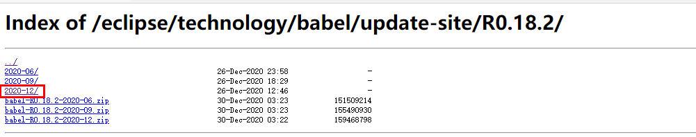
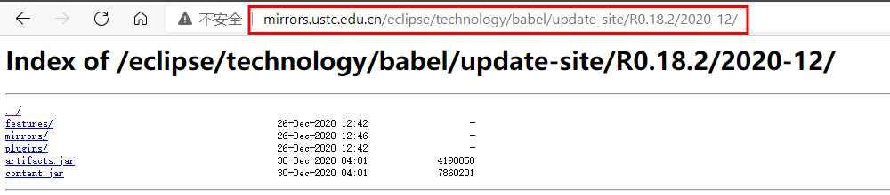
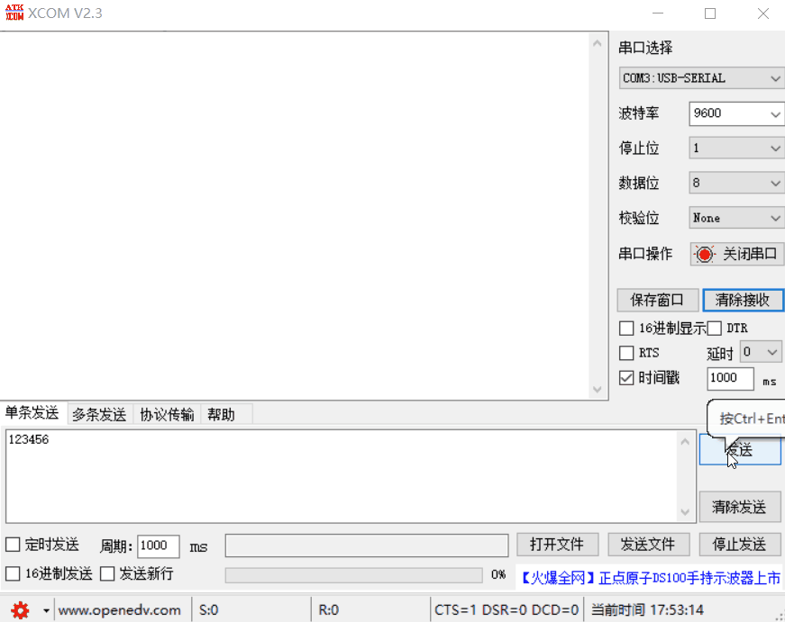

<!--more-->

[HAL库学习 GPIO---1-知乎](https://zhuanlan.zhihu.com/p/231696942)
[【STM32】HAL库 STM32CubeMX系列学习教程-csdn](https://blog.csdn.net/as480133937/article/details/99935090)
[STM32CubeMX学习使用（标准库与Cube,LL,直接写寄存器的效率对比）](https://blog.csdn.net/super828/article/details/79078693?ops_request_misc=%257B%2522request%255Fid%2522%253A%2522161559969216780357212490%2522%252C%2522scm%2522%253A%252220140713.130102334.pc%255Fblog.%2522%257D&request_id=161559969216780357212490&biz_id=0&utm_medium=distribute.pc_search_result.none-task-blog-2~blog~first_rank_v1~rank_blog_v1-2-79078693.pc_v1_rank_blog_v1&utm_term=LL%E5%BA%93)
[STM32 HAL库学习（一）：点亮led](https://blog.csdn.net/qq_42913442/article/details/106938727)
[STM32 HAL库学习系列第3篇 常使用的几种延时方式](https://blog.csdn.net/super828/article/details/79600206?ops_request_misc=%257B%2522request%255Fid%2522%253A%2522161559888716780262516364%2522%252C%2522scm%2522%253A%252220140713.130102334.pc%255Fblog.%2522%257D&request_id=161559888716780262516364&biz_id=0&utm_medium=distribute.pc_search_result.none-task-blog-2~blog~first_rank_v1~rank_blog_v1-3-79600206.pc_v1_rank_blog_v1&utm_term=STM32+HAL)
[【STM32】HAL库 STM32CubeMX系列学习教程](http://openedv.com/thread-309468-1-1.html)


## 如何入门STM32


### 购买开发板


### 编程软件

### 库选择

## 资料下载

学习STM32需要提前准备几份文档资料，在接下来的学习和今后实际运用中都会经常用到。  
资料直接从 [ST官网](https://www.st.com/) 下载即可，有的手册有中文。有的中文手册官网没有，可自行网上搜索下载。但都不推荐使用中文的：版本太老、阅读英文文档是程序员必备技能
1. 进入官网 [ST官网](https://www.st.com/) ，选择进入 `微控制器界面`

2. 在左侧栏找到自己芯片型号，并进入 `Documentation` 界面，选择对应文档下载即可。

3. 下载以下文档：
   - 数据手册：`Arm® Cortex®-M4 32-bit MCU+FPU, 105 DMIPS, 256KB Flash / 64KB RAM, 11 TIMs, 1 ADC, 11 comm. interfacesV11.0` 芯片本身的手册，相当于产品说明书。
   - 参考手册：`STM32F401xB/C and STM32F401xD/E advanced Arm®-based 32-bit MCUs` ，芯片使用参考手册
   - 编程手册：`STM32 Cortex®-M4 MCUs and MPUs programming manual` ，芯片内核的编程手册（高阶）
4. HAL和LL库参考手册我们需要另外在官网搜索才能找到，`Description of STM32F4 HAL and low-layer drivers`，库函数API驱动描述手册：


## STM32CubeIDE简介
>产品链接。建议多看看官网的资料，很多问题都能在这些文档里找到答案。
[STM32CubeIDE官网](https://www.stmicroelectronics.com.cn/en/development-tools/stm32cubeide.html)
[STM32CubeIDE user guide](https://www.st.com/content/ccc/resource/technical/document/user_manual/group1/f8/a2/48/77/68/e6/4b/74/DM00629856/files/DM00629856.pdf/jcr:content/translations/en.DM00629856.pdf)


### 1. 特性

- 集成STM32CubeMX，提供以下服务：
   - STM32微控制器选择 
   - 引脚分配，时钟，IP和中间件配置 
   - 项目创建和初始化代码的生成

- 基于Eclipse™/ CDT，支撑ECLIPSE的™插件，GNU C / C ++中ARM ®工具链和GDB调试器。

- 其他高级调试功能包括：**
  - CPU内核，IP寄存器和内存视图
  - 实时变量观看视图
  - 系统分析和实时跟踪（SWV）
  - CPU故障分析工具
  
- 支持ST-LINK（STMicroelectronics）和J-Link（SEGGER）调试探针
- 从Atollic导入项目® TrueSTUDIO ®和AC6系统工作台的STM32
- 多支持操作系统：Windows ®，Linux的®和MacOS ®

### 2. 概述

[STM32CubeIDE](https://www.stmicroelectronics.com.cn/en/development-tools/stm32cubeide.html)是一款多功能的多操作系统开发工具，集成了TrueSTUDIO和STM32CubeMX，它是[STM32Cube](https://www.st.com/content/st_com/en/stm32cube-ecosystem.html)软件生态系统的一部分。  

简单来说就是：**STM32cubeIDE = true studio for stm32 + STM32cubeMX**


[STM32CubeIDE](https://www.stmicroelectronics.com.cn/en/development-tools/stm32cubeide.html)是一个高级C / C ++开发平台，具有用于STM32微控制器和微处理器的外设配置，代码生成，代码编译和调试功能。它基于ECLIPSE™/ CDT框架和GCCtoolchain用于开发，而GDB用于调试。它允许集成数百个现有插件，这些插件完成ECLIPSE™IDE的功能

[STM32CubeIDE](https://www.stmicroelectronics.com.cn/en/development-tools/stm32cubeide.html)集成了所有[STM32CubeMX](https://www.st.com/en/development-tools/stm32cubemx.html)功能，以提供多合一的工具体验，并节省安装和开发时间。从板上选择空的STM32 MCU、MPU或预配置的微控制器或微处理器后，将创建项目并生成初始化代码。在开发期间的任何时候，用户都可以返回外围设备或中间件的初始化和配置，并重新生成初始化代码，而不会影响用户代码。

[STM32CubeIDE](https://www.stmicroelectronics.com.cn/en/development-tools/stm32cubeide.html)包括构建和堆栈分析器，可为用户提供有关项目状态和内存要求的有用信息。

[STM32CubeIDE](https://www.stmicroelectronics.com.cn/en/development-tools/stm32cubeide.html)还包括标准和高级调试功能，包括CPU内核寄存器，存储器和外设寄存器的视图，以及实时变量监视，串行线查看器（Serial Wire Viewer）接口或故障分析器。

[STM32CubeIDE](https://www.stmicroelectronics.com.cn/en/development-tools/stm32cubeide.html)支持基于Arm®Cortex®处理器的STM32产品

### 3. STM32Cube介绍

[STM32Cube](https://www.st.com/content/st_com/en/stm32cube-ecosystem.html)是意法半导体的一项原始计划，旨在通过减少开发工作量，时间和成本来显着提高设计师的生产率。 [STM32Cube](https://www.st.com/content/st_com/en/stm32cube-ecosystem.html)涵盖了整个STM32产品组合。

**[STM32Cube](https://www.st.com/content/st_com/en/stm32cube-ecosystem.html)是软件工具和嵌入式软件库的结合**：
- 一套完整的PC软件工具，可满足一个完整项目开发周期的所有需求
= 在STM32微控制器和微处理器上运行的嵌入式软件模块，可带来各种功能（从MCU组件驱动程序到更高级的面向应用的特性)

**[STM32Cube](https://www.st.com/content/st_com/en/stm32cube-ecosystem.html)生态系统包括**


- **一套易于使用的软件开发工具，涵盖从概念到实现的项目开发，其中**

  - [STM32CubeMX](https://www.st.com/en/development-tools/stm32cubemx.html), 面向任意STM32设备的配置工具。这款简单易用的图形用户界面为Cortex-M内核生成初始化C代码，并为Cortex-A内核生成Linux设备树源码。
  - [STM32CubeIDE](https://www.st.com/en/development-tools/stm32cubeide.html), 一种集成开发环境。该IDE基于Eclipse或GNU C/C++工具链等开源解决方案，包括编译报告功能和高级调试功能。它还集成了其他工具，如STM32CubeMX（本身包含在STM32CubeIDE中）。
  - STM32CubeProgrammer（[STM32CubeProg](https://www.st.com/en/development-tools/stm32cubeprog.html)
）, 一种编程工具。它通过多种多样可用的通信媒介（JTAG、SWD、UART、USB DFU、I2C、SPI、CAN等）为读取、写入和验证设备和外部存储器等操作提供简单易用且高效的环境。
  - STM32CubeMonitor-Power（[STM32CubeMonPwr](https://www.st.com/en/development-tools/stm32cubemonpwr.html)
）。功能强大的监控工具，可帮助开发人员实时微调其应用程序的行为和性能。

- **[M32Cube MCU和MPU软件包](https://www.st.com/en/embedded-software/stm32cube-mcu-mpu-packages.html)，特定于每个微控制器和微处理器系列的全面嵌入式软件平台（例如STM32F4系列的STM32CubeF4），其中包括**
  - STM32Cube硬件抽象层（HAL），确保在STM32产品组合上实现最大的可移植性
  - STM32Cube低层API，通过对HW的高度用户控制来确保最佳性能和占用空间
  - 一套一致的中间件组件，例如RTOS，USB，TCP / IP和图形
  - 所有嵌入式软件实用程序以及全套外围设备和应用示例

- **[STM32Cube扩展包](https://www.st.com/en/embedded-software/stm32cube-expansion-packages.html)，包含嵌入式软件组件，这些组件通过以下功能补充STM32Cube MCU和MPU包的功能：**
  - 中间件扩展和应用层
  - 在某些特定的STMicroelectronics开发板上运行的示例

## 下载安装

### 1. 下载

可以从[STM32CubeIDE](https://www.st.com/en/development-tools/stm32cubeide.html) 网站上下载最新版本的安装程序。

在页面底部找到下图，根据自己电脑操作系统下载即可，这里以Windows版为例。  右边下拉菜单还可以选择其他版本，推荐下载最新版。
软件是免费的， 但下载时需要填写信息或注册登录。  


### 2. 安装

前面几步较简单，这里跳过。

**选择安装位置**
- 安装路径中不要包含中文字符，不要包含中文字符，不要包含中文字符
- 建议选择短路径以避免工作区路径过长而面临Windows®限制。
  


**“选择组件”对话框**
选择要与STM32CubeIDE一起安装的GDB服务器组件。用于STM32CubeIDE安装调试的每种JTAG探针类型都需要一个服务


### 3. 可选配置

#### 1. 汉化

如下图打开安装软件界面：


进入以下网址：
http://mirrors.ustc.edu.cn/eclipse/technology/babel/update-site/

选择 `R0.18.2`，并单击进入

选择如选择:`2020-12`，并单击进入

复制此时网址链接


将以下内容填入 `Add Repository` 对话框。其中的位置就是上面得到的链接。

``` cpp
language

http://mirrors.ustc.edu.cn/eclipse/technology/babel/update-site/R0.18.2/2020-12/
```


单击 `添加` 按钮。之后会弹出下面对话框，下拉找到图中红框选项，


单击其最左侧的多选 `>` 按钮，在下拉框中选中打勾下图红框部分，之后单击 `下一步`。


>注：   
上图红框选项指软件的界面汉化，其中后面的（85.21%）表示汉化程度，可见还并未完全汉化。
其他选项也是汉化选项，是关于库，编程等的，安装会导致程序BUG，故不推荐安装。这里只对界面进行汉化。

单击 `下一步` 


勾选接受许可协议，点击 `完成`


之后会弹出下面的对话框，单击 install anyway


单击现在重启，汉化完成


#### 2. 更换主题

软件自带了几个主题，具体可以点击菜单栏 `Windows`-> `preference`，搜索 `theme`并尝试。但官方主题不太好用，所以下面讲解如何使用外部主题。  
菜单栏 `Help`，在下拉栏中双击 `Eclipse Marketplace`打开。  

之后按照软件提示，一路默认安装即可。最后重启软件，选择主题。  
如果后面还想更改，点击菜单栏 `Windows`-> `preference`，搜索 `theme`并尝试。


#### 3. 中文注释字体显示问题解决

当我们尝试中文注释和英文注释混编的时候，会出现中文注释突然变小的问题


**解决办法：** 菜单栏 `Windows`-> `preference`


**参考链接**
- [STM32CubeIDE注释字体问题](http://www.openedv.com/thread-300647-1-1.html)
- [STM32的开发环境cubeIDE注释混乱问题解决方法](https://blog.csdn.net/weixin_39754256/article/details/104304634)

## 新建工程模板

这里以控制 GPIO 输出/输出为例说明

### 1.1 新建工程

新建工程有两种途径。如下图示：


1. 第一种：界面左上角 `file` -> `New` -> STM32 Project`


2. 第二种：默认启动界面，在这里直接单击开始新工程。如果看不到下图界面，单击上图中 `红色五角星` 上方的 “感叹号” 图标，就会出现了。


之后会弹出如下的 芯片选择界面。  
这里有很多种查找芯片的方法，我们这里直接在搜索框 （**1** 处）里搜索，在右下结果框里（**2**处）选中我们要查找的芯片即可。注意其最左边的五角星 <i class="far fa-star"></i>，单击收藏，则会变成蓝色。下次我们可以直接单击左上角搜索框上方的大五角星（ **3** 处），就能够快速查看已收藏的芯片，方便快速。  
选好后，我们单击 `下一步`。

	
**1** 处输入工程名称  
**2**处 是工程存储地址，可以自定义 ，但要注意你需要为工程文件再单独新建一个文件夹，不然所有文件都会平铺在当前文件夹中。  
**3** 处是编程语言，这里选择使用C++。之后单击 `下一步`


这里是关于库文件的选项，第一个是将库文件链接到安装目录下，这样工程目录下其实是没有库文件了，如果换电脑目录改变，则需要重新链接，不推荐。第二个是复制库文件到工程目录下。建议选择第二个。


接下来就是熟悉的 CubeMX 初始化配置界面了，操作方法也没有什么难的，就是将我们之前用代码写的初始化变成了图形化操作，按照我们初始化的思路一步步勾选即可了。下面具体操作。

### 1.2 引脚与配置(Pinout  and Configuration)

1. 系统配置。这里是调试工具选择和基准时钟源选择。我们用的是ST-Link的SWD（Serial Wire Debug）调试模式，所以选择 **Serial Wire** 串行线。时钟基准源默认系统滴答时钟 **SysTick**。


2. 时钟源配置。一共有以下选项。
- 外部晶体/陶瓷晶振(Crystal/Ceramic Resonator)：由外部无源晶体与MCU内部时钟驱动电路共同配合形成，有一定的启动时间，精度较高。外部晶振没有时，自动切换为自带的内部晶振。
- 旁路时钟源(Crystal/Ceramic Resonator)：直接从外界导入时钟信号。犹如芯片内部的驱动组件被旁路了
- Disable：无时钟，相关功能不工作。

  这里HSE配置为外部晶振，LSE选Disable(低速时钟是给看门狗和RTC的，目前未用)。时钟输出关闭。


3. 引脚配置。
在图左图形界面单击我们用到的引脚。这里我们使用的LED引脚有 PD2 和 PC8，都是低电平点亮，具体可查看开发板原理图。两个引脚我们都配置为输出模式。


    然后我们到左边的引脚具体配置。配置如图示，两个引脚相同。


### 1.3 时钟配置(Clock Configuration)

选择外部8MHz晶振，配置系统时钟为72MHz。注意APB1总线时钟式36MHz，需二分频。
这里和后面的配置都不需要保存的，也没有保存按钮<i class="fas fa-smile"></i>


### 1.4 项目管理(Project Manager)

这里我们注意勾选上图中红框部分。这样生成的代码每个外设一个文件夹，就不会全堆在main.c文件里了。其他的默认。


### 1.5 工具(Tools)

保持默认即可

### 1.6 编译生成初始化文件

单击上方工具栏的  `设备配置工具代码生成` ，完成工程建立。观察左侧的项目资源管理器，会发现多出了gpio.c文件等等。现在就可以正式编写程序了。


我们可以单击其左边的锤子 🔨 编译 按钮，编译应该是没有错误的。


### 工程复制

开发过程中有时候需要复制一个已有的项目，在该项目之上进行开发，STM32CubeIDE不允许同一个工作空间中出现同名项目，这时候就需要修改项目名称了，方法如下：

#### 方案一
直接在 IDE 左侧的文件浏览框中，右键项目名复制。

1. 右键项目名，选择 `Copy` 复制
2. 右键空白处，选择 `Paste` 粘贴工程，重命名项目名，并选择存放位置
3. 右键新项目的 .ioc 文件，重命名，和新项目名一样。
4. 删除新项目下原来项目命名的 .launch和.cfg 文件。
5. **在资源管理器中，删除新工程下的 .mxproject 文件!删除新工程下的 .mxproject 文件!删除新工程下的 .mxproject 文件!**
6. 现在可以自由编辑新工程了

#### 方案二

在资源管理器中复制粘贴项目

1. 复制已有工程，并重命名
2. **在资源管理器中，删除新工程下的 .mxproject 文件!删除新工程下的 .mxproject 文件!删除新工程下的 .mxproject 文件!**
3. 双击新项目名并重新打开，在IDE中，右键项目名，选择 `Rename` 重命名
4. 删除新项目下原来项目命名的 .launch和.cfg 文件。
5. 现在可以自由编辑新工程了


### 1.7 新建文件夹和文件

由于使用 Stm32CubeIDE 会自动生成配置初始化文件。为了将配置文件和自己的工程文件区分、避免相互影响，我们需要单独建立一个文件夹，存放我们自己的代码。 
>之后所有的参考程序都会存放在我们新建的 `BSP` 文件夹下。

这里有两种方法，一个是使用 STM32CubeIDE 重新建立文件和文件夹（适用从零开始的工程）。另一种是从外部导入文件和文件夹（适用工程迁移）。

#### 新建文件和文件夹

右键工程名，鼠标移至 `NEW`上，在右侧弹窗中单击 `Sorce Folder`新建文件夹。在这上面还有类似的 `Folder`选项，至于两者不同点，还请自行尝试。

随后新建源文件或头文件，和上图类似，不过这次是在刚刚新建的`文件夹名`上右键，选择`NEW`，并在右侧弹窗中单击 `Sorce Files`或者`Header File` 新建源文件和头文件。

头文件包含，新建文件夹后，需要在编译器中另外包含文件夹地址，否则编译会提示找不到文件。


#### 导入外部文件-文件夹

- [stm32CubeIDE 在自己工程中添加.c 和.h文件](https://blog.csdn.net/qq_36300069/article/details/103226568)

### 1.8 使用 C++ 编程

1. 新建 C++ 工程
如下图所示，只需要改动一处即可。

2. 添加个人文件夹（参考上文的`工程中添加文件`）
为了避免软件生成的配置文件和我们自定义文件混淆，建议将自己的文件单独放在一个文件夹中。
另外还需要在G++中包含头文件夹，`Properties`->`C/C++ Build`->`Tool Settings`：
* -> `MCU G++ Compiler` -> `include paths` 和 
* -> `MCU GCC Compiler` -> `include paths`
3. 编写程序，注意.cpp中函数有被.c中函数调用时，需要在.cpp函数的头文中添加 （源文件.cpp中不需要添加）`extern "C" `。
   ```
   #ifndef MY_MAIN_H_
   #define MY_MAIN_H_

   #ifdef __cplusplus
   extern "C" {
   #endif

   void setup();  // 被main.c调用
   void loop();   // 被main.c调用

   #ifdef __cplusplus
   }
   #endif

   #endif /* CPP_TEST_H_ */
  
    ```
4. 之后就可以自由使用 C++ 了。

### 参考链接

1. [STM32CubeIDE资源](https://www.st.com/zh/development-tools/stm32cubeide.html#resource)
2. [STM32CubeIDE属于一站式工具，本文带你体验它的强大](https://blog.csdn.net/ybhuangfugui/article/details/89702356)    
3. [STM32CubeMX系列教程03\_创建并生成代码工程](https://www.strongerhuang.com/STM32Cube/STM32CubeMX/STM32CubeMX%E7%B3%BB%E5%88%97%E6%95%99%E7%A8%8B03_%E5%88%9B%E5%BB%BA%E5%B9%B6%E7%94%9F%E6%88%90%E4%BB%A3%E7%A0%81%E5%B7%A5%E7%A8%8B.html) 
4. [STM32CubeIDE使用笔记（01）：基础说明与开发流程](https://blog.csdn.net/Naisu_kun/article/details/95935283)

## 工程模板文件解读

#### 1.1.7 文件夹结构

CMSIS

存放STM32F1xx芯片硬件与代码桥接的相关定义。

1）include

包含位于CMSIS标准的核内设备函数曾层的Cortex-M核通用的头文件，作用是为那些采用Cortex-M核设计SOC的芯片商设计的芯片外设提供一个进入内核的接口，定义了一些内核相关的寄存器。这些文件在其他公司的Cortex-M系列芯片也是相同的。写STM32F1xx的程序时，必须用到其中的四个文件：core_cm3.h、core_cmFunc.h、corecmlnstr.h、cmsis_armcc.h，其他的文件是属于其他内核的，还有几个文件时DSP函数库使用的头文件。

2）Device

时具体芯片直接相关的文件，将举办韩启动文件、芯片外设 寄存器定义、系统时钟初始化功能的一些文件，有ST公司提供
gpio：外设初始化配置函数

  - stm32f103xe.h  头文件 （Device\ST\STM32F1xx\include\stm32f103xe.h）

是stm32f103xe系列新片片底层相关的文件，包含了STM32中所有的外设寄存器地址和结构体类型定义，比如熟悉的宏定义GPIOA，结构体类型 GPIO_TyoeDef都在该文件定义。

  - systen_stm32f1xx.c文件（Device\ST\STM32F1xx\Source、Templates\systen_stm32f1xx.c）

定义了几个函数：系统初始化函数：SystemInit()、系统内核始终更新函数：SystemCoreClockUpdate()、外部SRAM启动控制函数：SystemInit_ExtMemCtl()。SystemInit函数是在芯片复位后执行的一个函数，用于预初始化内核时钟

  - startup_stm32f103xe.s 启动文件 (文件路径：\Device\ST\STM32F1xx\Source\Templates\arm\startup_stm32f103xe.s)

是一个汇编文件，不同开发环境平台该文件内容不同(虽然文件名称相同，所以使用时注意区分)。该文件内容才真正是芯片上电后运行的内容，在运行了这文件内容后程序才跳转至 main.c 文件中的 main 函数。后面我们会单独分析该文件内容。

STM32F1xx_HAL_Driver 文件夹：有 Inc 跟 Src 两个文件夹，这里的文件属于CMSIS 之外的、芯片片上外设部分。

Src 里面是每个设备外设的驱动源程序，Inc 则是相对应的外设头文件。Src 及 Inc 文件夹是 HAL 库的主要内容。在 Src
和 Inc 文件夹里的就是 HAL 库针对每个外设而编写的库函数文件，每个外设对应一个 stm32f1xx_hal_ppp.c 和 stm32f1xx_hal_ppp.h 文件，部分外设有特殊功能还有一个 stm32f1xx_hal_ppp_ex.c 文件，其中 ppp 为外设名称，比如
gpio、adc、i2c 等等，见下面表格。


main.c：存放main函数和SystemClock_Config函数

stm32f1xx_assert.c：

stm32f1xx_hal_msp.c：其中的 `HAL_MspInit()` 是芯片系统级初始化，一般实现系统的中断配置，比如硬件错误、微处理器故障、总线错误等。其在 HAL_Msplnit函数中被调配，而main函数起始就调用 HAL_Init 函数。

stm32f1xx_it.c：存放中断服务函数

stm32f1xx_hal_conf.h：见上面表格

stm32f1xx_it.h：中断服务函数声明，一般很少改动


## STM32F030_HAL库学习笔记

操作系统：Win10
硬件平台：STM32F401
软件平台：STRM32CubeIDE V1.6.0
下载器：ST-Link V2

### GPIO HAL库 操作与调试

#### 初始化配置

参考上文中的工程模板建立。

#### 程序编写

**主要API：**
1. **HAL_GPIO_WritePin(GPIO_TypeDef\* GPIOx, uint16_t GPIO_Pin, GPIO_PinState PinState)**
控制某个具体引脚的状态
   - GPIO_TypeDef：IO端口编号  GPIOA、 GPIOB、 …、 GPIOG  
   - GPIO_Pin：IO引脚编号 GPIO_PIN_0…GPIO_PIN_15  
   - PinState：IO状态 GPIO_PIN_SET 或者 GPIO_PIN_RESET  
2. **HAL_GPIO_TogglePin(GPIO_TypeDef \*GPIOx, uint16_t GPIO_Pin)**
3. **HAL_GPIO_ReadPin(GPIO_TypeDef \*GPIOx, uint16_t GPIO_Pin)**
读取某个具体引脚的状态(**需要将引脚设置为输入模式 `GPIO_input`**)
4. HAL_Delay(uint32_t Delay)
ms 级延时函数。IDE内置的，但没有内置 us 级延时函数
**主函数：**

``` cpp
int main(void)
{
  HAL_Init();
  /* Configure the system clock */
  SystemClock_Config();

  /* Initialize all configured peripherals */
  MX_GPIO_Init();
  HAL_GPIO_WritePin(LED1_GPIO_Port,LED1_Pin, GPIO_PIN_SET)  /* LED1输出高电平 */ 
  while (1)
  {
	  HAL_GPIO_TogglePin(LED0_GPIO_Port,LED0_Pin); /* 间隔500ms翻转 LED0 引脚 */
	  HAL_Delay(500);
  }
}
```

这里的前两个`LED0_GPIO_Port,LED0_Pin`是引脚的宏定义，初始化时系统根据我们在配置界面设置的 IO 别名自动生成的，方便理解，否则没有。请在 main.h 文件中查看。

#### 调试Debug

点击工具栏的 `甲虫按钮`
  
在弹出对话框，选择 `STM32 CPU`，单击 `确认` 进入配置界面。在 `调试器`下选择 ST-Link 作为调试器，单击 `确认`。
  

在弹出的对话框选择 `Switch`，打开调试窗口。
  

这里就是调试窗口了，红框内的都是和调试有关的工具按钮，这里不多做介绍，自行摸索。
  

### GPIO 寄存器操作

#### 寄存器介绍

**BSRR 和 BRR 关系**

BSRR 和 BRR 都是 STM32 系列 MCU 中 GPIO 的寄存器。 BSRR 称为端口位设置/清除寄存器，BRR称为端口位清除寄存器。
- BSRR 低 16 位用于设置 GPIO 口对应位输出高电平，高 16 位用于设置 GPIO 口对应位输出低电平。
- BRR 低 16 位用于设置 GPIO 口对应位输出低电平。高 16 位为保留地址，读写无效。

所以理论上来讲，BRR 寄存器的功能和 BSRR 寄存器高 16 位的功能是一样的，都可以控制端口输出低电平。也就是说，输出低电平可以有如下两种写法。

```
#define SET_BL_LOW() GPIOA->BRR=GPIO_Pin_0
等价于
#define SET_BL_LOW() GPIOA->BSRR=GPIO_Pin_0 << 16
```
这么来看的话，其实 BRR 寄存器是比较多余的。而实际上，在最新的 STM32F4 系列 MCU 的 GPIO寄存器中，已经找不到 BRR 寄存器了，仅保留了 BSRR 寄存器用于实现端口输出高低电平。

可见，不管是输出高还是输出低，对 BSRR 寄存器的操作最为稳妥。


BSRR常见操作
```
/* 低8位操作 */
GPIOE->BSRR = (Newdata & 0xffff) | ( (~Newdata )<<16 );
/* 16位操作 */
GPIOE->BSRR = (Newdata & 0xff) | ( (~Newdata & 0xff)<<16 );
```
BSRR还有一个特点，就是如果低6位和高16位同时置1，结果以低16位为准。
就是说同一个bit在 BSRR 低16位中为1（输出高电平），但在高16位中也是1（输出低电平），结果该bit引脚输出 1（高电平）。
此时对多位同时操作可以这么写：
```
GPIOx->BSRR = 0xFFFF0000 | PATTEN;
```
不用考虑哪些需要置1，哪些需要清零

**ODR**

ODR 寄存器也是用于输出数据的寄存器，一个 ODR 寄存器控制了一组(16位)的 GPIO 输出。因此，对 ODR 进行修改也可以到达对 IO 口输出进行配置。同时通过读取该寄存器，也能够获取 IO 的当前输出状态。而 BSRR 和 BRR 只可写。

但是，由于对 ODR 寄存器的读写操作必须以 16 位的形式进行。因此，如果使用 ODR 改写数据以控制输出时，须采用“读-改-写”的形式进行。

假设需要对 GPIOA_Pin_6 输出高电平。采用改写 ODR 寄存器的方式时，使用“读-改-写”操作，代码如下：
```
GPIOB->ODR=((GPIOB->ODR | GPIO_Pin_6); 
```

而使用 BSRR 寄存器时，仅需要使用如下语句：
```
GPIOA->BSRR = GPIO_Pin_6;
```
这是因为在修改 ODR 时，为了确保对端口 6 的修改不会影响到其他端口的输出，需要对端口的原始数据进行保存，之后再对端口 6 的值进行修改，最后再写入寄存器。而对 BSRR 的操作，是写 1 有效，写 0 不改变原状态，因此可以对端口 6 置 1，其他位保持为 0。

BSRR 为 1 的话，程序运行时自动会修改相应的 ODR 位。

**BSRR、BRR、 ODR 之间的关系**

* ODR寄存器可读可写：既能控制管脚为高电平，也能控制管脚为低电平。管脚对于位写1 GPIO管脚为高电平，写 0 为低电平（有被中断打断的风险）
* BSRR 只写寄存器：既能控制管脚为高电平，也能控制管脚为低电平。对寄存器高16位 写1 对应管脚为低电平，写0无动作；对寄存器的第16位写1对应管脚为高电平，写 0 无动作。
* BRR 只写寄存器：只能改变管脚状态为低电平，对寄存器 管脚对于位写 1 相应管脚会为低电平。写 0 无动作。

ODR 能控制管脚高低电平为什么还需要BSRR和SRR寄存器的原因是：用BSRR和BRR去改变管脚状态的时候，没有被中断打断的风险。也就不需要关闭中断，关闭中断明显会延迟或丢失一事件的捕获，所以控制GPIO的状态最好还是用SBRR和BRR。

**IDR**

GPIO 端口输入数据寄存器。只用了低 16 位。该寄存器为只读寄存器，并且只能以 16 位的形式读出。  
要想知道某个 IO 口的状态， 你只要读这个寄存器，再看某个位的状态就可以了。

#### 初始化配置
沿用 GPIO HAL 库操作时的配置
#### 程序编写

寄存器的写法可以通过查看 HAL 函数底层实现，来学习官方如何使用寄存器的。
```
void led_blink()
{
#if 0 // ODR 方式
	if(LED_GPIO_Port->ODR & LED_Pin)  // 高电平
		LED_GPIO_Port->ODR=~(~LED_GPIO_Port->ODR | LED_Pin);  // 置0
	else
		LED_GPIO_Port->ODR=(LED_GPIO_Port->ODR | LED_Pin);  // 置1

    HAL_Delay(2000);

#endif
	if(LED_GPIO_Port->IDR & LED_Pin)  // 高电平
	   LED_GPIO_Port->BSRR = LED_Pin  << 16 ;   // 高位置0
	else
	   LED_GPIO_Port->BSRR = LED_Pin; // 低位置1

    HAL_Delay(2000);
}
```
**参考链接**
* [高手带你解析STM32 BSRR BRR ODR寄存器](http://news.moore.ren/industry/64985.htm)
* [STM32duino GPIO Registers and programming](https://gist.github.com/iwalpola/6c36c9573fd322a268ce890a118571ca)
* [GPIO Output Registers on the STM32](https://electronics.stackexchange.com/questions/336021/gpio-output-registers-on-the-stm32)
* [Would my solution work for 8-bit bus addressing using BSRR and BRR?](https://stackoverflow.com/questions/56822789/would-my-solution-work-for-8-bit-bus-addressing-using-bsrr-and-brr)
* [STM32裸机学习笔记（三）—寄存器映射之BSRR与延时的爱恨情仇](https://www.codenong.com/cs106676846/)
* [STM32 GPIO 配置之ODR, BSRR, BRR 详解](https://blog.csdn.net/GDNNNNN/article/details/87904592?spm=1001.2014.3001.5501)

### GPIO 位带操作

#### 位带操作设置
关于位带操作，网上有很多讲解，这里不再详述。可以参考：`参考手册` 的 GPIO 章节，`编程手册` 的 2.2.5 Bit-banding 章节，自行深入学习。只需要将下段代码加入到任意头文件中：

```c 
//位带操作,实现51类似的GPIO控制功能
//IO口操作宏定义
// 把“位带地址+位序号”转换成别名地址的宏
#define BITBAND(addr, bitnum) ((addr & 0xF0000000)+0x2000000+((addr &0xFFFFF)<<5)+(bitnum<<2))
// 把一个地址转换成一个指针
#define MEM_ADDR(addr)  *((volatile unsigned long  *)(addr))
// 把位带别名区地址转换成指针
#define BIT_ADDR(addr, bitnum)   MEM_ADDR(BITBAND(addr, bitnum))
//IO口地址映射
#define GPIOA_ODR_Addr    (GPIOA_BASE+20) //
#define GPIOB_ODR_Addr    (GPIOB_BASE+20) //
#define GPIOC_ODR_Addr    (GPIOC_BASE+20) //
#define GPIOD_ODR_Addr    (GPIOD_BASE+20) //
#define GPIOE_ODR_Addr    (GPIOE_BASE+20) //
#define GPIOF_ODR_Addr    (GPIOF_BASE+20) //
#define GPIOG_ODR_Addr    (GPIOG_BASE+20) //

#define GPIOA_IDR_Addr    (GPIOA_BASE+16) //
#define GPIOB_IDR_Addr    (GPIOB_BASE+16) //
#define GPIOC_IDR_Addr    (GPIOC_BASE+16) //
#define GPIOD_IDR_Addr    (GPIOD_BASE+16) //
#define GPIOE_IDR_Addr    (GPIOE_BASE+16) //
#define GPIOF_IDR_Addr    (GPIOF_BASE+16) //
#define GPIOG_IDR_Addr    (GPIOG_BASE+16) //

//IO口操作,只对单一的IO口!
//确保n的值小于16!
#define PAout(n)   BIT_ADDR(GPIOA_ODR_Addr,n)  //输出
#define PAin(n)    BIT_ADDR(GPIOA_IDR_Addr,n)  //输入

#define PBout(n)   BIT_ADDR(GPIOB_ODR_Addr,n)  //输出
#define PBin(n)    BIT_ADDR(GPIOB_IDR_Addr,n)  //输入

#define PCout(n)   BIT_ADDR(GPIOC_ODR_Addr,n)  //输出
#define PCin(n)    BIT_ADDR(GPIOC_IDR_Addr,n)  //输入

#define PDout(n)   BIT_ADDR(GPIOD_ODR_Addr,n)  //输出
#define PDin(n)    BIT_ADDR(GPIOD_IDR_Addr,n)  //输入

#define PEout(n)   BIT_ADDR(GPIOE_ODR_Addr,n)  //输出
#define PEin(n)    BIT_ADDR(GPIOE_IDR_Addr,n)  //输入

#define PFout(n)   BIT_ADDR(GPIOF_ODR_Addr,n)  //输出
#define PFin(n)    BIT_ADDR(GPIOF_IDR_Addr,n)  //输入

#define PGout(n)   BIT_ADDR(GPIOG_ODR_Addr,n)  //输出
#define PGin(n)    BIT_ADDR(GPIOG_IDR_Addr,n)  //输入
```

上述代码中：
- `#define BITBAND` 后的内容，不同内核可能需要另外修改（M3和M4内核已经验证，可通用）。 
- 数字 `20`和`16`是寄存器  ODR 和 IDR 的地址偏移，不同芯片也需要做出相应修改，具体查看 `参考手册` 的 GPIO 章节的 GPIOx_IDR、GPIOx_ODR寄存器描述

图中红框部分 0x10 、0x14 转换成十进制就是 16 和 20。例如 STM32F103 系列的是  0x08、0x0C，那这里就需要改为 12 和 8。

参考链接：
- [知乎-STM32位带操作全解](https://zhuanlan.zhihu.com/p/142586194)
- [CSDN-快速理解STM32位带操作原理和用途](https://blog.csdn.net/ybhuangfugui/article/details/108067563)
- [cnblogs-第13章 GPIO-位带操作—零死角玩转STM32-F429系列](https://www.cnblogs.com/firege/p/5748713.html)

#### 初始化配置

沿用 GPIO HAL 库操作时的配置

#### 程序编写
```
/* 操作相应I/O前，必须先配置初始化，才能使用位带操作 */
PGout(10)= 1;  // PG10 输出高电平
uint8_t io_status = PGin(9); // 读取PG9的高低电平状态
```


### 自定义延时

#### SysTick介绍
HAL 官方是没有 us 级延时函数的。这里参考正点原子例程，改写了一点。

SysTick定时器是存在于系统内核的一个滴答定时器，只要是ARM Cortex-M0/M3/M4/M7内核的MCU都包含这个定时器，它是一个24位的递减定时器，当计数到 0 时，将从RELOAD 寄存器中自动重装载定时初值，开始新一轮计数。使用内核的SysTick定时器来实现延时，可以不占用系统定时器，由于和MCU外设无关，所以代码的移植，在不同厂家的Cortex-M内核MCU之间，可以很方便的实现。

STM32默认设置 SysTick 定时为1ms，也就是 HAL_Delay 的时钟来源。所以我们无需再初始化,如果是其它芯片，可能需要使用下面语句初始化 SysTick：
```
SysTick_Config(SystemCoreClock / 1000000);  //定时1us
// 或
SysTick_Config(SystemCoreClock / 1000);     //定时1ms
```

下面是具体实现，在新文件中添加以下代码并引用：
```
#define F_CPU SystemCoreClock  // 系统时钟
#define CYCLES_PER_MICROSECOND (F_CPU / 1000000U)   // 1us 的时钟周期
//延时nus
//nus为要延时的us数.	
//nus:0~190887435(最大值即2^32/fac_us@fac_us=22.5)	 
void delay_us(u32 nus)
{		
	u32 ticks;
	u32 told,tnow,tcnt=0;
	u32 reload=SysTick->LOAD;				//LOAD的值	    	 
	ticks=nus*CYCLES_PER_MICROSECOND; 		//nus 需要的节拍数 
	told=SysTick->VAL;        				//计数器值
	while(1)
	{
		tnow=SysTick->VAL;	
		if(tnow!=told)
		{	    
			if(tnow<told)tcnt+=told-tnow;	//这里注意一下SYSTICK是一个递减的计数器就可以了.
			else tcnt+=reload-tnow+told;	    
			told=tnow;
			if(tcnt>=ticks)break;			//时间超过/等于要延迟的时间,则退出.
		}  
	};
}

//延时nms
//nms:要延时的ms数
void delay_ms(u16 nms)
{
	u32 i;
	for(i=0;i<nms;i++) delay_us(1000);
}
```

#### 初始化配置

参考 HAL 库操作时的 SYS 和 RCC 配置，启动 Timebase Source 和 系统时钟。

#### 程序编写

直接引用即可。

### 按键输入

这里提供两种按键输入检测方法：阻塞和非阻塞。

#### 硬件原理图

 

#### 初始化配置

基本沿用GPIO HAL 库操作时的配置，只不过在 IO 功能配置时将按键引脚配置为 **输入模式**（GPIO_Input）,上下拉配置根据硬件选择，这里选择上拉，低电平触发。

#### 阻塞-程序编写

这个就直接参考正点原子的函数即可，利用延时函数消抖延时检测。

``` cpp
// 长按无效，按键必须松开才有效
int Key_Scan(void){
	if(HAL_GPIO_ReadPin(Key0_GPIO_Port,Key0_Pin) == 0){ // 检测到按键为低电平
		HAL_Delay(10);
		if(HAL_GPIO_ReadPin(Key0_GPIO_Port,Key0_Pin) == 0){
			while(HAL_GPIO_ReadPin(Key0_GPIO_Port,Key0_Pin) == 1);
			return 1;
		}
	}
	return 0;
}

// 正点原子写法
//mode:0,不支持连续按;1,支持
//0，没有任何按键按下
//1， WKUP 按下 WK_UP
#define KEY0 HAL_GPIO_ReadPin(Key0_GPIO_Port,Key0_Pin) //KEY0 按键
u8 KEY_Scan(u8 mode)
{
    static u8 key_up=1; //按键松开标志
    if(mode == 1)key_up=1; //支持连按
    if(key_up && (KEY0 == 0){
        delay_ms(10);
        key_up=0;
        if(KEY0 == 0) return KEY0_PRES;
    }
    else if(KEY0 == 1) key_up=1;
    return 0; //无按键按下
}
```

#### 非阻塞-程序编写

在编写非阻塞程序前，我们需要先了解一个函数：`HAL_GetTick()`

如果你仔细研究 `HAL_Delay()` 函数的话，会发现其实它底层是调用了 `HAL_GetTick()`。HAL库中原型如下：
```
/**
  * @brief Provides a tick value in millisecond.
  * @note This function is declared as __weak to be overwritten in case of other 
  *       implementations in user file.
  * @retval tick value
  */
__weak uint32_t HAL_GetTick(void)
{
  return uwTick;
}
```
其中的 `uwTick`又被`HAL_IncTick()`调用，该函数又被系统滴答定时器中断（1ms）调用，每次递增 1, 所以它的值代表了系统上电运行至今的时间（ms），而我们则就可以通过`HAL_GetTick()`:
1. 获取系统运行时间，最大计时 49.7 天。（`uwTick`为32位，2^32/1000/60/60/24 = 49.7）
2. 也可以利用该函数，做一个ms的计数器

非阻塞按键检测程序正是利用第2点，移植了 [OneButtonLibrary](http://www.mathertel.de/Arduino/OneButtonLibrary.aspx) 库，同时实现按键的单击、双击、长按检测。还不会阻塞正常程序执行。

```
/*************** key.h文件 ***************/

#define millis() HAL_GetTick()  /* 获取系统时间，用于按键的计时基准ms */
typedef unsigned long millis_t; /* 专门用于 millis() 型变量声明 */

/* 按键状态 */
enum KEY_STATUS{
    NO_CLICK,        /* 没有动作 */
    SINGLE_CLICK,    /* 单击 */
    DOUBLE_CLICK,    /* 双击 */
    LONGLE_CLICK     /* 长按 */
};

// 按键低电平有效
#define BUTTON_PRESSED  (HAL_GPIO_ReadPin(KEY_GPIO_Port, KEY_Pin)!=1)

/**
 * @brief  按键扫描状态机（FSM）
 * @retval enum key_status
 */
u8 button_tick(void);


/*************** key.c文件 ***************/

#define DEBOUNCETIME  50 // ms 按键去抖时间
#define CLICKTIME  100  // ms 检测到单击之前必须经过的时间（超过这个时间可能是双击或长按）
#define LONGTIME  1500 // ms 检测到长按之前必须经过的时间（超过这个时间是长按）

// 这些变量在按键检测时保存信息。
// 它们在程序启动时初始化一次，并在每次调用key_scan()函数时更新。
static u8 s_state = 0;  // 状态机标志位
static millis_t s_startTime = 0; // will be set in state 1
static millis_t s_stopTime = 0; // will be set in state 2

u8 button_tick(void)
{
    u8 key_status = 0;
    millis_t now = millis(); // 获取当前的时间 ms.

    if (s_state == 0) { // 等待按键按下.
        if (BUTTON_PRESSED) {
            s_state = 1; // 转到状态1
            s_startTime = now; // 记住按键按下的时间（当前时间）
        }
        else
            key_status = NO_CLICK;
    }
    else if (s_state == 1) { // 等待按键被释放

        if ((!BUTTON_PRESSED) && ((unsigned long)(now - s_startTime) < DEBOUNCETIME)) {
            // 按键释放太快，认为是抖动，返回状态0，认为按键没有被按下，再次返回状态0
            s_state = 0;
        }
        else if (!BUTTON_PRESSED) { // 按键释放且有效
            s_state = 2; // // 转到状态2
            s_stopTime = now; // remember stopping time
        }
        else if ((BUTTON_PRESSED) && ((unsigned long)(now - s_startTime) > LONGTIME)) {
            s_state = 6; // 按键已知每释放，且按下的时间超过了长按的时间，则认为是长按，转到状态6
            s_stopTime = now; // // 记住当前时间
        } else {
            // Button was pressed down. wait. Stay in this state.
        } // if
    }
    else if (s_state == 2) {
        // waiting for menu pin being pressed the second time or timeout.
        if ((unsigned long)(now - s_startTime) > CLICKTIME) {
            // this was only a single short click
            key_status = SINGLE_CLICK;
            s_state = 0; // restart.
        } else if ((BUTTON_PRESSED) && ((unsigned long)(now - s_stopTime) > DEBOUNCETIME)) {
            s_state = 3; // step to state 3
            s_startTime = now; // remember starting time
        } // if
    }
    else if (s_state == 3) { // waiting for menu pin being released finally.
        // Stay here for at least _debounceTicks because else we might end up in
        // state 1 if the button bounces for too long.
        if ((!BUTTON_PRESSED) && ((unsigned long)(now - s_startTime) > DEBOUNCETIME)) {
            // this was a 2 click sequence.
            key_status = DOUBLE_CLICK;
            s_state = 0; // restart.
            s_stopTime = now; // remember stopping time
        } // if
    }
    else if (s_state == 6) {  /* 长按状态处理 */
        // waiting for pin being release after long press.
        if (!BUTTON_PRESSED) {
            s_state = 0; // restart.
            s_stopTime = now; // remember stopping time
        } else {
            // button is being long pressed
            key_status =  LONGLE_CLICK;
        } // if
    } // if
    return key_status;
} // OneButton.tick()
```

之后只要在主程序中循环调用函数 `button_tick()`，读取返回值，就能知道按键的状态。

### GPIO 双向 I/O

有时需要IO既要作为输出，还要作为输入读取。如果采用初始化重新配置的话，就会很慢且繁琐。
如果希望某GPIO做双向传输，将其配制为OD输出模式，

#### F401 开漏输出模式介绍
* 开漏模式：输出寄存器中的“0”可激活 N-MOS，而输出寄存器中的“1”会使端
* 口保持高组态 (Hi-Z)（ P-MOS 始终不激活）。
* 施密特触发器输入被打开
* 根据 GPIOx_PUPDR 寄存器中的值决定是否打开弱上拉电阻和下拉电阻
* 输入数据寄存器每隔 1 个 AHB1 时钟周期对 I/O 引脚上的数据进行一次采样
* 对输入数据寄存器的读访问可获取 I/O 状态
* 对输出数据寄存器的读访问可获取最后的写入值

  

另外其实将IO设置为推挽输出模式时，也可以随时读取 IO 引脚状态，但在该模式下，不论输出高、低电平，P-MOS和N-MOS总有一个处于导通状态，轻则影响外部输入信号，重则烧毁芯片（外部拉低或拉高，MOS都相当于短路，导致大电流）。所以并不能作为双向 IO。

#### 初始化配置

* 将该引脚配置为Output-OpenDrain，
* 在引脚上连接一个上拉电阻（从上图可以看出，**F401 能通过软件配置上下拉电阻的；但在 F103 上是没有的，则需要外部硬件上拉**）

上述具体实现：在沿用 GPIO HAL 库操作时的配置基础上，只需修改以下图示部分：
  


#### 程序编写

* 输出时： 
    ```
    GPIOx->BSRR ＝ 输出值;
    ```
* 输入时： 先输出高电平(否则如果之前输出的是低电平，N-MOS则会导通，影响外部输入)，然后通过 GPIOx->IDR 读.
   ```
   LED_GPIO_Port->ODR=(LED_GPIO_Port->ODR | LED_Pin);  // 置1
   LED_Pin_status = LED_GPIO_Port->IDR & LED_Pin;
   ```

#### 参考链接
* [STM32 MCU GPIO双向口使用的话题](http://www.360doc.com/content/17/1208/13/8706683_711243855.shtml)
* [stm32的双向io口](https://blog.csdn.net/weixin_30443813/article/details/96729719)
* [STM32 IO口双向问题](https://my.oschina.net/hoolev/blog/525208)
* [STM32 GPIO八种输入输出模式的功能及区别](https://blog.csdn.net/weixin_41072132/article/details/103264249)
* [STM32的8种GPIO输入输出模式深入详解](https://blog.csdn.net/baidu_37366055/article/details/80060962)

### GPIO 模拟配置

#### 模拟配置介绍
该模式一般用于复用状态下或低功耗要求下。不作为普通输入输出控制下的模式配置。

  

**总结**
1、模拟配置会关闭引脚的一切内部相关联设施，此时普通 I/O 操作失效（不能读也不能输出）。因此引脚功耗为0。因此可以通过将引脚配置为该模式来**降低芯片功耗**。 
2、模拟配置另外好处就是保证了这个引脚是 **“干净”** 的，如果和外部连接，那个该引脚就完全反映了外部引脚状态。因此将该引脚内联到A/D 片上外设，就可以精确测量引脚的模拟值了。实际上在我们将引脚复用为 A/D 功能时，就会默认配置为 Analog 模式。

#### 初始化配置

`Pinout` 界面，引脚单击选择即可
  

或者在 `Project Manager` 界面选中将不用的引脚都配置为模拟模式，降低功耗
  

#### 程序编写

无

**参考资料**
- [1、Question about ADC versus GPIO Analog](https://community.st.com/s/question/0D50X00009XkfqtSAB/question-about-adc-versus-gpio-analog)  
- [2、What pins can I use for Analog Input/Output? STM32CubeMX allows every GPIO to be set to ''GPIO_Analog''?](https://community.st.com/s/question/0D50X00009XkWkeSAF/what-pins-can-i-use-for-analog-inputoutput-stm32cubemx-allows-every-gpio-to-be-set-to-gpioanalog)  


### 外部中断

通过外部按键，中断触发，再中断函数中翻转LED。

#### 硬件原理图

 

#### 初始化配置

1. 配置引脚为外部中断模式
2. 配置引脚：中断触发模式，上下拉。
根据按键原理图，这里设置为上拉，下降沿触发。
  
3. 中断配置：使能中断，中断分组及优先级
  

#### 程序编写

```
void HAL_GPIO_EXTI_Callback(uint16_t GPIO_Pin){

	if(GPIO_Pin & KEY_Pin){
		 led_toggle(); //电平反转
		 HAL_Delay(1000);  // 防抖，防止频繁触发中断，导致LED翻转现象不明显
	}
}

```
`HAL_GPIO_EXTI_Callback(uint16_t GPIO_Pin)`为 HAL 库的引脚外部中断回调函数，所有的引脚中断都会调用该函数。用户只需要在这里面编写中断处理函数接即可。`GPIO_Pin`传参表示触发中断的引脚编号。  
`GPIO_Pin & KEY_Pin`判断当前中断是否由按键引脚触发的，再运行处理函数。

>**注意：** 这个回调函数是只针对外部中断的（EXTI），定时中断和其他中断都都还有自己的回调函数。HAL的思想大概就是同类中断集中在一个回调函数，不同类的分开。


### 中断与事件

#### Cortex-M3 处理器内核 vs 基于Cortex-M3的MCU
Cortex-M3 处理器内核是由 ARM 公司设计的，传统意义上的 ARM7/ARM9（简称A7/A9）  也是处理器内核，也是 ARM 公司设计的。

Cortex‐M3处理器内核：故名思意就是单片机（MCU）的核心，是单片机的中央处理单元（CPU）

完整的基于CM3的MCU还需要很多其它组件。在芯片制造商得到CM3处理器内核的使用授权后，它们就可以把CM3内核用在自己的硅片设计中，添加存储器，外设， I/O以及其它功能块。不同厂家设计出的单片机会有不同的配置，包括存储器容量、类型、外设等都各具特色。


#### 中断和异常

中断属于异常的一种。所有能打断正常执行流的事件都称为异常

CM3 的所有中断机制都由 NVIC 实现。除了支持 240 条中断之外， NVIC 还支持 16‐4‐1=11 个内
部异常源（保留了 4+1 个档位），可以实现 fault 管理机制。结果， CM3 就有了 256 个预定义的异常类型。其中编号为 1－15 的对应系统异常，大于等于 16 的则全是外部中断。

类型编号为 1－15 的系统异常如表 7.1 所示（注意： 没有编号为 0 的异常），从 16 开始的外部中断类型如表 7.2 所示
 

  

虽然 CM3 是支持 240 个外中断的，但具体使用了多少个是由芯片制造商决定。 CM3 还有一个NMI（不可屏蔽中断）输入脚。当它被置为有效（ assert）时， NMI 服务例程会无条件地执行。

#### STM32外部中断（EXTI ）
STM32F103 是基于 CM3 内核设计的，ST 公司（芯片制造商）在原有 CM3 内核基础上，添加了储如定时器、串口、DMA等外设，最终组合成一个STM32单片机。其中 CM3 内核是整个单片机的核心部分，相当于CPU（大脑）

所以 STM32 根据原有 NVIC 中断，从中选择性添加了部分中断，并重新命名与排序。下图是STM32的中断向量表：

  

从表中可以看出，STM32 对上文中 CM3 内核的系统异常/外部中断表重新进行了编排和删减，把编号从-3 至 6 的中断向量定义为系统异常。从编号 7 开始将原本 CM3 所描述的外部中断又分成了若干中断类型：外部中断（EXTI）、定时器中断、DMA中断等等。


细心的朋友可能已经发现了这里有一个概念冲突：**外部中断**。释义如下:
>CM3 内核描述中的外部中断均是相对于内核而言的，比如串口中断、定时器中断等等都是（内核的）外部中断！而这里提到的STM32的外部中断（EXTI）指的是芯片的外部中断，主要是由芯片外部事件触发的中断，不是内核的外部中断！
STM32的外部中断（EXTI）属于内核的外部中断一部分。在STM32手册中外部中断（EXIT）均是指芯片的外部中断**加粗样式**，也就是上表中的 EXIT0-9。
这里的 `内外部` 就是物理空间的内外部。

所以当阅读 STM32 参考手册时，外部中断（EXTI）指的均是芯片外部（IO引脚）事件触发的中断。而当阅读网络文章时，则要注意区分。为了避免混淆，都会加 `（EXTI）` 以区分。

这里还有一个概念：`软件中断` ，下文中再详述。
另外 STM32 是没有 ~~内部中断~~  这个概念的，

  

#### 中断/事件关系
MCU运行过程，其中会有许多各种各样的事件，比方：管脚电平变化、计数器溢出、DMA空、FIFO非空、AD转换结束、超时、外设使能、初始化等等。
其中有些事件本身是不会导致中断产生的，比方外设使能或部分初始化动作是不会导致中断发生的；有些事件则可能导致中断发生，比方计数器溢出，AD转换结束等，这些就是中断事件。当然这些中断事件最终能否触发后续中断，还需要对中断事件进行配置。

**先说结论**
- 中断：处理器运行的一个状态，该状态会打断处理器当前正常的进程。
- 事件：就是事件。其可能触发中断。
- 中断事件：触发中断的事件，而且软件上也有中断函数的，叫中断事件
- 中断是中断事件发生的结果，中断事件属于事件，事件可分为中断事件或非中断事件

我们可以借助 STM32 MCU的GPIO的外部事件与中断控制器的框图来理解上述结论。
>这张图的在 STM32中文手册 中是错误的，英文版的是对的。因而网上很多文章此处的配图都有误，我这里重置了。


  

我们先关注两个寄存器：`中断屏蔽寄存器`和`事件屏蔽寄存器`。这两个寄存器决定了从编号1、2、3输入进来的事件最终会输出脉冲发生器（不产生中断）还是 NVIC 中断控制器（产生中断）。从而决定了输入的事件是中断事件还是非中断事件。

MCU参考手册里在谈到事件的触发方式时引入了`事件模式`和`中断模式`两个概念。这里的不同模式就是通过控制这两个寄存器实现的。
>**例子:**
比方STM32的GPIO口的电平跳变是可能触发外部中断（EXIT）的。但在具体配置时，可以根据需要来决定启用还是禁用相关脚的中断功能，从而选择不同的事件触发方式，即：`外部事件模式`和`外部中断模式`。如果不希望电平跳变事件触发中断，就配置为事件模式，反之，配置为中断模式

**接下来详细说明 EXIT 执行过程。**
上图中信号线上划有一条斜线，旁边标志 19字样的注释，表示相同的这样的中断线路共有19条。EXTI中有一个边沿检测电路(编号②)监视着输入线（编号①），并分别与上升沿和下降沿选择寄存器对比。 如果在这两个寄存器中相应的中断线检测开启了，那么当中断线上有上升沿或者下降沿时边沿检测电路就会产生一个事件触发信号给后继的或门。

除了边沿检测电路的输出外，或门（编号 ③）还接受一个`软件中断事件寄存器`的输入。 `软件中断事件寄存器`的存在使得我们可以通过软件的形式直接触发某一个中断线上的事件。
>我们可以通过程序控制此处的`软件中断事件寄存器`，人为的通过或门（编号 ③）输入一个外部事件，从而不需要真实的外部输入，就能产生一个可能触发中断的事件，相当与模拟该中断线上的事件。

>诸如ADC、串口、定时器之类产生的中断，就叫 `名称+中断`，如：定时器中断、串口中断、ADC中断。并不属于这里的`软件中断`范畴，STM32手册中唯一提到`软件中断`这个词的就是指这个寄存器，不要混淆了。

或门的输出接到了两个与门（编号 ④、⑤）上，一方面与中断屏蔽寄存器求与编号（④）触发中断， 另一方面与事件屏蔽寄存器求与（⑤）触发事件。 中断屏蔽寄存器控制了相应的中断是否开启了，如果开启了中断将会产生一个中断触发信号，置位中断请求寄存器， 同时将中断触发信号提交给中断控制器(NVIC)。 同样的道理，事件屏蔽寄存器控制事件是否开启，如果开启则直接产生一个脉冲通知后继的功能模块处理事件，例如通知DMA读写内存等。

从这张图上我们也可以知道，从外部激励信号来看，中断和事件的产生源都可以是一样的。之所以分成2个部分，因为中断是需要CPU参与的，需要软件的中断服务函数才能完成中断后产生的结果；但是事件，是靠脉冲发生器产生一个脉冲，进而由硬件自动完成这个事件产生的结果，当然相应的联动部件需要先设置好，比如引起DMA操作，AD转换等;

>**简单举例：** 外部I/O触发AD转换,来测量外部物品的重量;
> - 如果使用传统的中断通道，需要I/O触发产生外部中断（EXIT），外部中断（EXIT）服务程序启动AD转换，AD转换完成中断服务程序提交最后结果；
> - 要是使用事件通道，I/O触发产生事件，然后联动触发AD转换，AD转换完成中断服务程序提交最后结果；

相比之下，后者不要软件参与启动AD转换，并且响应速度也更块；要是再使用事件触发DMA操作，就完全不用软件参与（AD转换后操作）就可以完成某些联动任务了。

**总结:**
- 事件触发：机制提供了一个完全由硬件自动完成的触发到产生结果的通道，不要软件的参与，降低了CPU的负荷，节省了中断资源，提高了响应速度(硬件总快于软件)，是利用硬件来提升CPU芯片处理事件能力的一个有效方法;
- 中断触发：由软件控制，CPU 参与。

**参考链接**
- STM32F10xxx参考手册（Reference manual STM32F101xx, STM32F102xx, STM32F103xx, STM32F105xx and STM32F107xx advanced ARM®-based 32-bit MCUs）
- Cortex-M3权威指南（The Definitive Guide to the ARM COrtex-M3） 
- [Interrupt-Driven Input/Outputon the STM32F407 Microcontroller](https://docplayer.net/54908905-Interrupt-driven-input-output-on-the-stm32f407-microcontroller.html)
- [Exceptions and Interrupts——Cuauhtemoc Carbajal-ITESM CEM](https://www.google.com/url?sa=t&rct=j&q=&esrc=s&source=web&cd=&ved=2ahUKEwjK-vytkcbvAhUmJzQIHXtSARgQFjAAegQIAxAD&url=http://homepage.cem.itesm.mx/carbajal/Microcontrollers/SLIDES/Interrupts.pdf&usg=AOvVaw3OiAMagNDaIjozquuDcoMa)
- [新手入门之stm32中断系统](https://zhuanlan.zhihu.com/p/64921464)
- [stm32异常、中断和事件的区别](https://blog.csdn.net/jian3214/article/details/99818975)
- [STM32中断系统（NVIC和EXTI）](https://my.oschina.net/u/4383286/blog/4440596)
- [STM32的“外部中断”和“事件”区别和理解](https://blog.csdn.net/tanyjin/article/details/53359883)
- [【STM32】EXTI---外部中断/事件控制器](https://blog.csdn.net/qq_43328313/article/details/106559934)
- [STM32中断与事件](https://mp.weixin.qq.com/s?__biz=MzIxNTg1NzQwMQ==&mid=2247484547&idx=2&sn=de7a4464fe0dadadb3f9b8843dd33d0b&chksm=9790a515a0e72c036be83b413489bbc5cbf367caf11a0cb7403a05823e2938e00126248344ce&scene=178&cur_album_id=1359585244344696836#rd)
- [浅谈STM32中断模块](https://www.codenong.com/cs106293064/)
- [外部中断(EXTI)控制LED灯](https://gaoyichao.com/Xiaotu/?book=stm32&title=%E5%A4%96%E9%83%A8%E4%B8%AD%E6%96%AD%E6%8E%A7%E5%88%B6LED%E7%81%AF)


### 串口

#### 初始化配置

1. 配置引脚为串口输入输出模式
  
2. USART配置中选择异步通信模式，并开启串口中断
  

#### 程序编写

同外部中断类似，串口中断也有自己的中断回调函数，我们再需要的地方编写即可。

**主要API：**
1. HAL_UART_Transmit();串口轮询模式发送，使用超时管理机制，阻塞
2. HAL_UART_Receive();串口轮询模式接收，使用超时管理机制，阻塞
3. HAL_UART_Transmit_IT();串口中断模式发送，非阻塞
4. HAL_UART_Receive_IT();串口中断模式接收，非阻塞
5. HAL_UART_TxHalfCpltCallback();一半数据发送完成时调用
6. HAL_UART_TxCpltCallback();数据完全发送完成后调用
7. HAL_UART_RxHalfCpltCallback();一般数据接收完成时调用
8. HAL_UART_RxCpltCallback();数据完全接受完成后调用
8. HAL_UART_ErrorCallback();传输出现错误时调用

**主函数：**

```
/************************* uart.cpp *************************/
uint8_t RxBuffer;  // 定义一个接受数组

/**
  * @brief 串口初始化，启动接收中断
  */
void uart_init()
{
	HAL_UART_Receive_IT(&huart1,&RxBuffer,1);  //开启中断
}

/**
  * @brief 串口接收中断，每接收一个字节中断一次，并发送该数据
  */
void HAL_UART_RxCpltCallback(UART_HandleTypeDef *UartHandle)
{
	if(UartHandle->Instance == USART1){   //判断时那种中断
		HAL_UART_Transmit(&huart1,&RxBuffer,1,10);  // 发送10个数据
	}
	HAL_UART_Receive_IT(&huart1,&RxBuffer,1); // 再次开启中断
}

```

**使用步骤：**

1. 添加以上代码
2. 调用`uart_init()`初始化
3. 然后通过串口助手发送信息，单片机即返回所发送的信息。

#### printf，getchar重定义

fgetc，fputc 属于 C 标准可，因此在.ccp 文件中重定义是，需要添加 extern "C" 声明。

```
// 将以下函数放在 .cpp 文件中，需要添加 extern "C" ，否则重定义无效。
// 或者可以将其放在任意 .c 文件中
#ifdef __cplusplus
extern "C" {
#endif

/**
  * @brief 重定向c库函数getchar,scanf到USARTx
  * @retval None
  */
#ifdef __GNUC__
#define GETCHAR_PROTOTYPE int __io_getchar(int ch)  /* 防止重定义，具体为什么会用到GNUC我以为不知道*/
#else
#define GETCHAR_PROTOTYPE int fgetc(int ch, FILE *f)
#endif
GETCHAR_PROTOTYPE{
  HAL_UART_Receive(&huart1,(uint8_t *)&ch, 1, 0xffff);
  return ch;
}

/**
  * @brief 重定向c库函数printf到USARTx
  * @retval None
  */
#ifdef __GNUC__
#define PUTCHAR_PROTOTYPE int __io_putchar(int ch)  /* 防止重定义，具体为什么会用到GNUC我以为不知道*/
#else
#define PUTCHAR_PROTOTYPE int fputc(int ch, FILE *f)
#endif
PUTCHAR_PROTOTYPE{
	 HAL_UART_Transmit(&huart1,(uint8_t *)&ch,1,1000);
     return ch;
}

#ifdef __cplusplus
}
#endif
```

**使用步骤：**
1. 添加以上代码
2. 包含头文件 `#include "stdio.h"` 
3. 添加测试代码：`printf("\n===函数Printf函数发送数据===\n");` 测试

**打印浮点数**

IDE在编译使，默认不支持打印浮点数的（耗费内存和运存）。可以右键单击项目名，在 Properties 中开启该功能：
  

或者自己编写浮点数打印函数：
```]
/*
 * 打印浮点类型
 * @param（data）要打印的浮点数
 * @param（precision）小数点精度（小数点后几位）
 */
void printf_float(double data,uint8_t precision){
	uint8_t num = 0;
	uint32_t data_int = (uint32_t)data;
	uint32_t data_float = 0;
	printf("%d",(int)data_int);
	printf(".");
	while(num<precision){
		data_float = (int)(data*pow(10,num+1))%10;
		printf("%d",(int)data_float);
		num++;
	}
}
```

### 串口DMA模式

**主要API：**
1. HAL_UART_Transmit_DMA(); // 使用DMA模式发送数据
2. HAL_UART_Receive_DMA();  // 使用DMA模式接收数据


#### UART以DMA方式接收和发送的函数调用顺序：

**循环模式接收**：
`HAL_UART_Receive_DMA()` -> `DMA1_Channelx_IRQHandler()` -> `HAL_DMA_IRQHandler()` -> `UART_DMAReceiveCplt()` -> `HAL_UART_RxCpltCallback()`

**正常模式发送：**
`HAL_UART_Transmit_DMA()` -> `DMA1_Channelx_IRQHandler()` -> `HAL_DMA_IRQHandler()` -> `UART_DMATransmitCplt()` -> `USART3_IRQHandler()` -> `HAL_UART_IRQHandler()` -> `UART_EndTransmit_IT()` -> `HAL_UART_TxCpltCallback()`

循环发送与正常接收模式与上述类似，不再叙述。这当中还会调用传输 Half 中断，这里也不再讨论了。  
以上整个调用过程不需要CPU参与，自动执行。我们只需要关心状态变化即可，无需关心数据怎么传输的。

**总结：**
对于上述过程，我们只需要知道：DMA 在执行过程中是会调用正常的 USART 的 API 接口函数的就行。也就意味着，如果我们使用了 DMA接收，则不能再用中断接收以及相应的接收函数，否则两者的数据会又冲突，实际测试也是如此。所有的接收过程不应再有软件的参与，我们只需要关系数据是否到来、一半、结束几个标志。同理DMA发送与USART发送函数不可同时使用。特别是在开启了循环模式时。

#### 循环模式

循环模式下，DMA的发送与接收是不断循环的，不会停止。我们只需要在初始化时开启即可。

**初始化配置**

承接上面 USART 的配置，最初以下修改：
1. 在 USART 配置界面中，选中DMA设置
   1.1 添加USART_RX/TX 两个通道
   1.2 两个通道均选择 循环模式，数据宽度为 1字节
2. 在 USART 中断配置界面中，取消串口全局中断

  

如前文所述，我们开启了DMA的循环模式，为了避免冲突，这里需要关闭串口的全局中断。

**软件编写**

我们实现串口接收啥就返回啥。和前面的串口功能一样，但这里并不需要软件参与，全程自动执行。
> **注意：** 这里的数组只有 5 个字节，所有只能接收 5 个字节的数据，多了则只保留后5位。
由于发送是自动的，所以下面的程序在接收到数据后，就会不断重复发送该数据，除非有新的外部数据或手动清空。
```
uint8_t buffer[5] = {0};
void setup() {
    HAL_UART_Receive_DMA (&huart1,&RxBuffer,5);  // 开启DMA接收
    HAL_UART_Transmit_DMA (&huart1,&RxBuffer,5); // 开启DMA发送
}
```
经测试在双循环模式下，printf也是不能使用的，总之在循环模式下，不要调用任何有关发送和接收数据的函数。
经测试，就算没开启DMA接收，之开启DMA发送，并且数组数据为空，系统仍会不断往外发送数据，但是乱码。所以循环发送模式并不推荐。
#### 正常模式

正常模式下的发送与接收，每一次DMA传输都只会执行一次就接收，如果想要继续使用，就得再手动开启DMA传输。所以如果想要再正常模式下实现自动收发，我们就需要借助中断函数，初始化时下开启 DMA 接收，然后在接收中断中使用DMA发送接收到的数据，并再次启动DMA接收。


**初始化配置**
在双循环配置基础上，都选择 正常模式（normal）并勾选串口中断。
**软件编写**

改写之前的串口初始化和接收中断函数，实现功能与前文一样，收啥发啥。
```
/**
  * @brief 串口初始化，启动接收中断
  */
void uart_init()
{
	HAL_UART_Receive_IT(&huart1,&RxBuffer,1);  //开启中断
	HAL_UART_Receive_DMA (&huart1,&RxBuffer,5);  // 启动DMA接收
}

/**
  * @brief 串口接收中断，每接收一个字节中断一次
  */
void HAL_UART_RxCpltCallback(UART_HandleTypeDef *UartHandle)
{
	if(UartHandle->Instance == USART1){   //判断时那种中断
		HAL_UART_Transmit_DMA (&huart1,&RxBuffer,5);
	}
	HAL_UART_Receive_DMA (&huart1,&RxBuffer,5);

}
```
这和一般的串口中断很相似，唯一的区别就是在发送和接收数据时，不需要CPU的参与，仅在这个数据的流动过程是不同的。
经过实际测试，这种模式下，DMA的数据是有问题的。由于DMA发送接收不需要CPU参与，所以在接收中断中调用`HAL_UART_Transmit_DMA()`发送串口数据，之后再`HAL_UART_Receive_DMA ();`启动接收，整个过程近似无延时，所以当你的数据超过数组长度时，下一次接收是会接收到上一次发送的多余的数据。



有一个解决办法是将 `HAL_UART_Receive_DMA ();` 放到初始化源码的中断函数里

  


#### 混合模式

这里用接收循环模式，发送正常模式说明。

**初始化配置**

在双循环配置基础上，发送选择正常模式，接收选择循环模式。

**软件编写**

改写之前的串口初始化和接收中断函数，实现功能与前文一样，收啥发啥。
```

/**
  * @brief 串口初始化，启动接收中断
  */
void uart_init()
{
	HAL_UART_Receive_DMA (&huart1,&RxBuffer,10);
}

/**
  * @brief 串口接收中断，每接收一个字节中断一次
  */
void HAL_UART_RxCpltCallback(UART_HandleTypeDef *UartHandle)
{
	if(UartHandle->Instance == USART1){   //判断时那种中断
		//HAL_UART_DMAStop(&huart1); //
		HAL_UART_Transmit_DMA (&huart1,&RxBuffer,10);
		//HAL_DMA_PollForTransfer(huart1.hdmatx,HAL_DMA_FULL_TRANSFER,1000);
	}


}
```
这里的收发数据问题和双正常模式一样，接收数据会记住多余的数据。由于接收数据是自动执行的，随意这里并不能更改修复。
有一个解决办法的思路，就是在发送数据后，清空 DMA 接收缓存，并重置数据指针，但比较麻烦，似乎并不划算。

### TIM定时器

#### 初始化配置

这里选择不常用的 TIM10 作为定时器，未提及的沿用 GPIO HAL 库操作时的配置
1. 模式（mode）只需勾选使能即可
2. 参数配置设置成1KHz定时（系统时钟84MHz）
3. 使能定时器中断
  

#### 程序编写

**主要API：**
- `HAL_TIM_PeriodElapsedCallback()`  
非阻塞模式下经过一段时间的回调
- `HAL_TIM_PeriodElapsedHalfCpltCallback()`  
在非阻塞模式下，经过了一半的时间完成了回调
- `HAL_TIM_Base_Start_IT()`  
启动中断模式下的定时器。
- `HAL_TIM_Base_Stop_IT()`  
停止中断模式下的定时器

**主要程序**

这里实现定时器中断计数，每1s led翻转 一次。
```
void timer_init()
{
	/* 启动定时器 */
	HAL_TIM_Base_Start_IT(&htim10);
}
/* 中断回调函数 */
void HAL_TIM_PeriodElapsedCallback(TIM_HandleTypeDef *htim)
{
	timer_count++;
	if(timer_count == 1000){
		led_toggle();
		timer_count = 0; // 计数清零
	}
}
```
**使用步骤**
1. 系统初始化时调用 `timer_init()` 启动定时器
2. 在定时器中断中编写处理程序

### PWM

#### 初始化配置

1. 配置 PA0 引脚为定时器2通道1
2. 找到定时器2配置，通道1配置为PWm输出
3. 配置定时器参数即PWM参数，周期为1Khz

同一定时器的不同通道使用的PWM频率是一样的

  

#### 程序编写

**主要API**
- `HAL_StatusTypeDef HAL_TIM_PWM_Start()`
启动对应通道的PWM
- `HAL_StatusTypeDef HAL_TIM_PWM_Stop()`
停止对应通道的PWM
- `__HAL_TIM_SET_COMPARE()`
配置对于通道占空比

**主程序**

/**************** pwm.c *********************/
```
void pwm_init()
{
	HAL_TIM_PWM_Start(&htim2,TIM_CHANNEL_1);
}

void pwm_test()
{
	static millis_t timer_count = 0;
	if(timer_count == 1000)
		timer_count = 0;
	timer_count++;
	__HAL_TIM_SET_COMPARE(&htim2, TIM_CHANNEL_1, timer_count);
}

/******************* timer.c ***********************/
/* 中断回调函数 */
void HAL_TIM_PeriodElapsedCallback(TIM_HandleTypeDef *htim)
{
	static uint16_t timer_count = 0;
	timer_count++;
	if(timer_count == 10){
		pwm_test();
		timer_count = 0; // 计数清零
	}
}

```
`pwm_init` 为初始化函数，启动PWM计数。`pwm_test` 不断改变通道占空比。定时器中断中调用该函数，实现计数变化。  
硬件上，将PA0和LED端口相连。  
实现功能：LED亮度会逐渐变暗（10S一周期）

**使用步骤：**
1. 在系统初始化函数中调用 pwm_init 初始化
2. 使用 `__HAL_TIM_SET_COMPARE` 控制指定通道的占空比输出


### 输入捕获

我们通过输入捕获计算按键按下低电平的时间

#### 初始化配置
1. 引脚配置，IO配置为上拉
2. 定时器配置
捕获频率1Mhz，计数周期最大（能够测量更多时间，防止溢出，当然程序也做了一处处理）
由于外部按键时低电平有效，所以这里选择下降沿捕获

  

#### 程序编写

**主要API**
- `HAL_TIM_IC_Start_IT();`
启动输入捕获
- `HAL_TIM_IC_CaptureCallback()`
输入捕获中断回调函数
- `__HAL_TIM_SET_CAPTUREPOLARITY();  `
在运行时设置定时器输入捕获极性。
- ` HAL_TIM_PeriodElapsedCallback()`
定时器溢出中断回调函数
- `__HAL_TIM_SET_COUNTER();`
在运行时设置TIM计数器寄存器的值。
- `HAL_TIM_ReadCapturedValue()`
从捕获比较单元读取捕获的值，其实就是捕获中断发生时的定时器计数值

**主程序**
```
/*****************capture.cpp********************/
//变量存储
typedef struct
{
    uint8_t   flg; //0为未开始，1已经开始，2为结束
    uint32_t  num; //计数值
    uint16_t  num_period;//溢出次数
}COUNT_TEMP;

COUNT_TEMP count_temp={0};

// 输入捕获初始化
void capture_init()
{
	HAL_TIM_IC_Start_IT(&htim5, TIM_CHANNEL_2);    //启动输入捕获
}

// 输入捕获测试程序
// 打印低电平时间，并重新使能输入捕获计数
void capture_test()
{
	if(count_temp.flg == 2 )
	{
	    //计数计数值，0xFFFF为最大计数
	    uint32_t ulTime = (uint32_t)count_temp .num_period * 0xFFFF + count_temp .num;
	    //输出测量的值
	    printf ( "low level time:%d us\r\n",ulTime/1000);
	    count_temp .flg = 0;
	}

}

//捕获中断发送时的回调函数
void HAL_TIM_IC_CaptureCallback(TIM_HandleTypeDef *htim)
{
    //判断定时器5
    if(TIM5 == htim->Instance){
        if (count_temp.flg == 0 )  // 下降沿触发
        {
            // 清零定时器计数
            __HAL_TIM_SET_COUNTER(htim,0);
            //设置上升沿触发
            __HAL_TIM_SET_CAPTUREPOLARITY(&htim5, TIM_CHANNEL_2, TIM_INPUTCHANNELPOLARITY_RISING);
            count_temp .flg = 1;           //标志已捕获到下降沿
            count_temp .num_period = 0;    //溢出计数清零
            count_temp .num = 0;           //计数清零
        }
        else  // 上升沿触发
        {
            // 获取定时器计数值
            count_temp .num = HAL_TIM_ReadCapturedValue(&htim5,TIM_CHANNEL_2);
            //设置下降沿触发
            __HAL_TIM_SET_CAPTUREPOLARITY(&htim5, TIM_CHANNEL_2, TIM_INPUTCHANNELPOLARITY_FALLING);
            count_temp .flg = 2;  // 标志捕获完成
        }
    }
}
/* 中断回调函数 */
void HAL_TIM_PeriodElapsedCallback(TIM_HandleTypeDef *htim)
{

    if(TIM5 == htim->Instance){
		//每次溢出时间为 2^32 us
		if(count_temp.flg==1)//还未成功捕获
		{
			if(count_temp.num_period==0XFFFF){ //低 电平太长了,强制完成
				count_temp.flg=2;              //标记成功捕获了一次
				count_temp.num=0XFFFFFFFF;
			}
			else
				count_temp.num_period ++;
		}
    }

/*****************capture.cpp********************/
void setup() {
    uart_init();
    capture_init();

}

void loop()
{
	capture_test();
}

```

- 先初始化捕获中断为下降沿触发，当下降沿触发后，立即设置为上升沿触发，保存来个那次触发时的定时器计数值，在和定时器频率 1MHz 计算就能得出低电平的总时间。   
- 溢出中断则计算溢出的次数，防止低电平时间过长当时计数器溢出。
- 主程序循环判断捕获标志位，打印输出时间

### IWDG

独立看门狗（IWDG)由专用的低速时钟（LSI）驱动（40kHz），即使主时钟发生故障它仍有效。独立看门狗适合应用于需要看门狗作为一个在主程序之外 能够完全独立工作，并且对时间精度要求低的场合。

独立看门狗只适用于系统死机的情况，如果某个程序异常，但系统仍能正常喂狗，此时独立看门狗时不会起作用的。

如果需要检测某个程序段是否正常，使用窗口看门口狗，后续会单独讲解。

#### 初始化配置

1. 配置PA0为GPIO输入模式，上拉。作为后面的按键检测
2. IWDG 使能，配置时钟分频和重装载值
  
IWDG的超时时间 Tout = (4*2^prv) / LSI * rlv (s) prv是预分频器寄存器的值，rlv是重装载寄存器的值
根据时钟图分析
  
LSI 为 25 KHz，当 prv 取 IWDG_ PRESCALER_64 ，rlv 取 500 时，Tout=64/32*500=1s。

#### 程序编写
**主要API**
- `HAL_IWDG_Refresh(&hiwdg)`
刷新看门狗（喂狗）
**主程序**
看门狗不需要额外初始化，上电即运行，所以要注意一点，如果系统的初始化时间过长，应该及时喂狗。
建议使用定时器定时喂狗，且最先初始化定时器
```
void setup() {
    uart_init();
    printf("\n\r***** IWDG Test Start *****\n\r");
}

void loop()
{
	printf("\n\r Refreshes the IWDG !!!\n\r");
	if(HAL_GPIO_ReadPin(KEY_GPIO_Port, KEY_Pin) != 0){
	    HAL_IWDG_Refresh(&hiwdg);
	}
	delay_ms(800);

}
```
主程序不断检测按键电平值，由于按键默认上拉，所以系统会每 800 ms喂狗一次（超时溢出为 1 秒），此时系统正常
当我们按下按键不放时，程序停止喂狗，会看到系统会1s重启一次（根据打印的数据查看系统状态）


### WWDG

窗口看门狗跟独立看门狗一样，也是一个递减计数器不断的往下递减计数，当减到一个固定值 0x3F 时还不喂狗的话，产生复位，这个值叫窗口的下限，是固定的值，不能改变。

窗口看门狗之所以称为窗口，就是因为其喂狗时间是在一个有上下限的范围内（窗口上限值~下限值0x3F），在这个范围内才可以喂狗，可以通过设定相关寄存器，设定其上限时间（但是下限是固定的0x3F）

  

图中：
- 数字 1 处为计数器的初始值（重装载值）
- 2 是我们设置的窗口上限值（只能取低7为值，也就是最大值为 127）
- 3 是下窗口值(0x3F, 那么W[]最小为64)

当窗口看门狗计数器的值只有处在 2 和3 之间(上窗口和下窗口之间)才可以喂狗，其余时间喂狗都时异常。

窗口看门狗还可以使能提前唤醒中断，如果系统出现问题，喂狗函数没有生效，那么在计数器由减到0x40  (0x3f+1) 的时候，便会先进入提前唤醒中断，之后才会复位，你也可以在该中断里面喂狗（不建议在中断里喂狗，不然效果和独立看门狗类似，无意义）

窗口看门狗的超时公式如下：
`Twwdg=(4096× 2^WDGTB× (T[5:0]+1)) /Fpclk1;`
其中：
- Twwdg： WWDG 超时时间（单位为 ms）(看门狗的计数周期)
- Fpclk1： APB1 的时钟频率（单位为 Khz）注意看门狗时钟靠在PCLK1下，一般为主时钟一半。
- WDGTB： WWDG 的预分频系数（系数范围[0-3],2^WDGTB = 分频值）
- T[5:0]：窗口看门狗的计数器低 6 位（0-64）

根据前面所述，你的 W[\]只能取 64-127，则计数器T[]的值范围为 0-63。假设 Fpclk1=42Mhz，分频值为8，W[] = 127（T[] = 63）,则看门狗计数周期：
T = 4096\*8\*[63+1]/42000 = 50ms

###  初始化配置

1. 开启看门狗中断、配置参数（超时时间 = 4096\*8\*[63+1]/42000 = 50ms）
2. 开启提前唤醒中断
3. 开启中断
  


### 程序编写

**主要API**
- `HAL_WWDG_Refresh()` 
看门狗喂狗
- `HAL_WWDG_EarlyWakeupCallback()`
看门狗提前唤醒中断

**主程序**

```
void HAL_WWDG_EarlyWakeupCallback(WWDG_HandleTypeDef* hwwdg)
{
	HAL_WWDG_Refresh(hwwdg);
	printf("\n\rWWDG well!\n\r");
}

void setup() {
    uart_init();
    printf("\n\rWWDG Test Start\n\r");
}

void loop()
{

}
```
我们在唤醒中断里不断喂狗（实际使用时不建议在中断里放喂狗函数，这里应放置整个系统故障的 “临终遗嘱”）。
通过串口助手的时间戳显示，两条信息 `WWDG well!` 之间的时间约为 50 ms。如果注释掉喂狗函数，系统就会不断重启。

### 待机唤醒

STM32 的低功耗模式有 3 种：
- 1)睡眠模式（CM3 内核停止，外设仍然运行）
- 2)停止模式（所有时钟都停止）
- 3)待机模式（1.8V 内核电源关闭）

在运行模式下，我们也可以通过降低系统时钟关闭 APB 和 AHB 总线上未被使用的外设的时钟来降低功耗。
在这三种低功耗模式中，最低功耗的是待机模式。停机模式是次低功耗的。最后就是睡眠模式了。
这里将对 STM32 的最低功耗模式-待机模式做介绍

STM32 进入及退出待机模式的条件
  

我们有使用WKUP 引脚上的上升沿 方式退出待机模式。从待机唤醒后，除了电源控制/状态寄存器(PWR_CSR)， 所有寄存器被复位。从待机模式唤醒后的代码执行等同于复位后的执行(采样启动模式引脚，读取复位向量等)。电源控制/状态寄存器(PWR_CSR)将会指示内核由待机状态退出。

#### 初始化配置

配置PA0（WKUP 引脚）为输入下拉。

### 程序编写

**主要API**
- `__HAL_RCC_PWR_CLK_ENABLE() `
使能 PWR 时钟
- `HAL_PWR_EnableWakeUpPin() `
设置 WKUP 用于唤醒
- `HAL_PWR_EnterSTANDBYMode()`
设置 SLEEPDEEP 位，设置 PDDS 位，执行 WFI 指令，进入待机模式。
- `__HAL_PWR_CLEAR_FLAG(PWR_FLAG_WU)`
清除Wake_UP标志

**主程序**
```
void Sys_Enter_Standby(void){
	__HAL_RCC_PWR_CLK_ENABLE();		//使能PWR时钟

	__HAL_PWR_CLEAR_FLAG(PWR_FLAG_WU);		//清除Wake_UP标志
	HAL_PWR_EnableWakeUpPin(PWR_WAKEUP_PIN1);	//设置WAKEUP用于唤醒
	HAL_PWR_EnterSTANDBYMode();		//进入待机模式
}

void setup() {
    uart_init();
    printf("\n\rWWDG Test Start\n\r");
}

void loop()
{
	printf("Time: 3\r\n");
	HAL_GPIO_WritePin(GPIOC,GPIO_PIN_13,GPIO_PIN_RESET);
	HAL_Delay(1000);

	printf("Time: 2\r\n");
	HAL_GPIO_WritePin(GPIOC,GPIO_PIN_13,GPIO_PIN_SET);
	HAL_Delay(1000);

	printf("Time: 1\r\n");
	HAL_GPIO_WritePin(GPIOC,GPIO_PIN_13,GPIO_PIN_RESET);
	HAL_Delay(1000);


	printf("Entered Standby Mode...Please press KEY_UP to wakeup system!\r\n");
	Sys_Enter_Standby();
}
```
PA0 按键用来唤醒待机模式，并使用串口1打印相关调试信息
系统运行时倒计时，3秒钟后进入待机模式。当 PA0 接高电平时，待机模式被唤醒，系统重新运行，重新倒计时。

>低功耗模式下载 Debug 需要 reset 按键手动复位
## ADC

### ADC时钟

挂靠在 PCLK2（APB2时钟，最大84HHz）下。分频因子可配置2/4/6/8分频
ADC转换周期：

```
T = 采样时间(周期) + 12.5个周期，其中1周期为1/ADCCLK
```

例如，当 ADCCLK=14Mhz 的时候，并设置 1.5 个周期的采样时间，则得到： Tcovn=1.5+12.5=14 个周期=1us。

根据芯片数据手册，电气特性（Electrical characteristics）-> 操作条件（Operating conditions）所述：
  

由 表6.3.1 可知，ADC的最大采样速率（转换速率）与VDDA有关，当VDDA低于2.4V时，转换速率最大只有1.2Msps（million samples per second）；而当VDDA高于2.4V时，可达2.4Msps，即每秒一百二十万次转换。

无论是1.2Msps还是2.4Msps，都是相对于12位分辨率来说的，即表14中给出的是最高分辨率（12bit）下的最大转换速率。STM32F4系列MCU支持12位、10位、8位和6位可编程分辨率，更低的分辨率可以缩短转换周期。因此采用降低分辨率的方法还可以进一步获得更大的转换速率。

由 表6.3.20 可知，ADC的最大时钟频率在VDDA低于2.4V时为18MHz，VDDA高于2.4V时为36MHz。

对于12位分辨率来说，转换周期为12个ADC周期，采样时间可编程的最小值为3个ADC周期，即12位分辨率的最少转换周期数为15个ADC周期。

因此，当VDDA低于2.4V时12位分辨率的最大转换速率为 18/15 Msps，即上面提到的1.2Msps。当VDDA高于2.4V时12位分辨率的最大转换速率为 36/15 Msps，即上面提到的2.4 Msps。

为了保证ADC转换结果的准确性，ADC的时钟最好不超过14M。（有的stm32单片机最高只支持1MHz转换速率）

**参考链接**
- [STM32F4系列ADC最大转换速率及操作条件（以STM32F407ZGT6为例）](https://blog.csdn.net/weixin_44567318/article/details/114449108)
### ADC的转换模式 (重要，请务必看懂)**

1 单次转换模式：ADC只执行一次转换，转换完成后，必须再手动开启

2 连续转换模式：转换结束之后马上开始新的转换，每次转换结束，ADC的值会被刷新，所以需要及时读出数据；

3 扫描模式：ADC扫描被规则通道和注入通道选中的所有通道，在每个组的每个通道上执行单次转换。在每个转换结束时，这一组的下一个通道被自动转换。

4 间断模式：触发一次，转换一个通道，在触发，在转换。在所选转换通道循环，由触发信号启动新一轮的转换，直到转换完成为止。

扫描模式简单的说是一次对所有所选中的通道进行转换，比如开了ch0，ch1，ch4，ch5。  ch0转换完以后就会自动转换通道1,4,5直到转换完这个过程不能被打断。如果开启了连续转换模式，则会在转换完ch5之后开始新一轮的转换。

间断模式，可以说是对扫描模式的一种补充。它可以把0,1,4,5这四个通道进行分组。可以分成0,1一组，4,5一组。也可以每个通道单独配置为一组。这样每一组转换之前都需要先触发一次。

### 单通道、多通道配置

**ADC单通道：**

只进行一次ADC转换：配置为“单次转换模式”，扫描模式关闭。ADC通道转换一次后，就停止转换。等待再次使能后才会重新转换

进行连续ADC转换：配置为“连续转换模式”，扫描模式关闭。ADC通道转换一次后，接着进行下一次转换，不断连续。

**ADC多通道：**

只进行一次ADC转换：配置为“单次转换模式”，扫描模式使能。ADC的多个通道，按照配置的顺序依次转换一次后，就停止转换。等待再次使能后才会重新转换

进行连续ADC转换：配置为“连续转换模式”，扫描模式使能。ADC的多个通道，按照配置的顺序依次转换一次后，接着进行下一次转换，不断连续。

也就是：多通道必须使能扫描模式

### 数据左对齐或右对齐

因为ADC得到的数据是12位精度的，但是数据存储在 16 位数据寄存器中，所以ADC的存储结果可以分为左对齐或右对齐方式（12位）

  

### ADC输入通道
从ADCx_INT0-ADCx_INT15 对应三个ADC的16个外部通道，进行模拟信号转换 此外，还有两个内部通道：温度检测或者内部电压检测
选择对应通道之后，便会选择对应GPIO引脚，相关的引脚定义和描述可在开发板的数据手册里找

#### 注入通道，规则通道

我们看到，在选择了ADC的相关通道引脚之后，在模拟至数字转换器中有两个通道，注入通道，规则通道，
规则通道至多16个，注入通道至多4个

**规则通道：**
规则通道相当于你正常运行的程序，看它的名字就可以知道，很规矩，就是正常执行程序
**注入通道：**
注入通道可以打断规则通道，听它的名字就知道不安分，如果在规则通道转换过程中，有注入通道进行转换，那么就要先转换完注入通道，等注入通道转换完成后，再回到规则通道的转换流程

无法连续转换注入通道。连续模式下唯一的例外情况是，注入通道配置为在规则通道之后自动转换（使用 JAUTO 位），请参见自动注入一节

  

### 中断
中断触发条件有三个，规则通道转换结束，注入通道转换结束，或者模拟看门狗状态位被设置时都能产生中断，

  

转换结束中断就是正常的ADC完成一次转换，进入中断，这个很好理解

**模拟看门狗中断**
当被ADC转换的模拟电压值低于低阈值或高于高阈值时，便会产生中断。阈值的高低值由ADC_LTR和ADC_HTR配置
模拟看门狗，听他的名字就知道，在ADC的应用中是为了防止读取到的电压值超量程或者低于量程

### DMA
同时ADC还支持DMA触发，规则和注入通道转换结束后会产生DMA请求，用于将转换好的数据传输到内存。

注意，只有部分ADC组可以产生DMA请求

因为涉及到DMA传输，所以这里我们不再详细介绍，之后几节会更新DMA,一般我们在使用ADC 的时候都会开启DMA 传输。

### 单通道单次转换
#### 初始化配置

1. 配置引脚为ADC1_IN1
2. 使能通道1
3. 匹配ADC参数
这里根据上描述设置ADC时钟为6分频，14MHz。其余配置保持默认即可，也不要修改
  

**参数讲解**
- ADC_Mode_Independent  这里设置为独立模式
独立模式模式下，双ADC不能同步，每个ADC接口独立工作。所以如果不需要ADC同步或者只是用了一个ADC的时候，应该设成独立模式，多个ADC同时使用时会有其他模式，如双重ADC同步模式，两个ADC同时采集一个或多个通道，可以提高采样率
- Data Alignment (数据对齐方式): 右对齐/左对齐
- Scan Conversion Mode( 扫描模式 ) ：   DISABLE
如果只是用了一个通道的话，DISABLE就可以了(也只能DISABLE)，如果使用了多个通道的话，会自动设置为ENABLE。 就是是否开启扫描模式
- Continuous Conversion Mode(连续转换模式)    DISABLE
设置为ENABLE，即连续转换。如果设置为DISABLE，则是单次转换。两者的区别在于连续转换直到所有的数据转换完成后才停止转换，而单次转换则只转换一次数据就停止，要再次触发转换才可以进行转换
- Discontinuous Conversion Mode(间断模式)    DISABLE
多通道模式下使用
- Enable Regular Conversions (启用常规转换模式)    ENABLE
使能 否则无发进行下方配置
- Number OF Conversion(转换通道数)    1
用到几个通道就设置为几，数字大于1即多个通道会自动使能上面的扫描模式
- Extenal Trigger Conversion Source (外部触发转换源)
设定ADC的触发方式，外部事件触发时使用。详见 `中断与事件` 章节
- Regular Conversion launched by software 规则的软件触发 调用函数触发即可
上述时触发ADC，这个时触发ADC的规则处理，如：启动下一次转换
- Rank          转换顺序
这个只修改通道采样时间即可 默认为1.5个周期。其余配置在多通道再讲解。


**HAL库中关于个参数的讲解：**

```
   ScanConvMode;                        / *！<配置常规组和注入组的序列。
                                            此参数可以与参数'DiscontinuousConvMode'关联，以将主序列细分为连续的部分。
                                            如果禁用：转换以单模式执行（转换了一个通道，在等级1中定义了一个通道）。
                                                    参数“ NbrOfConversion”和“ InjectedNbrOfConversion”将被丢弃（等效于设置为1）。
                                            如果启用：转换以顺序模式执行（由“ NbrOfConversion” /“ InjectedNbrOfConversion”定义的多个等级以及每个通道等级）。
                                                    扫描方向朝上：从等级1到等级'n'。
                                            该参数可以设置为ENABLE或DISABLE * /
  EOCSelection;                         / *！<指定通过轮询和中断将什么EOC（转换结束）标志用于转换：每个等级或完整序列的转换结束。
                                            此参数可以是@ref ADC_EOCSelection的值。
                                            注意：对于注入组，仅在序列末尾才引发转换结束（flag＆IT）。
                                                因此，如果将转换结束设置为每次转换结束，则不应将插入组与中断一起使用（HAL_ADCEx_InjectedStart_IT）
                                                或轮询（HAL_ADCEx_InjectedStart和HAL_ADCEx_InjectedPollForConversion）。顺便说一句，轮询仍然是可能的，因为驱动程序将使用估计的时间来完成注入转换。
                                            注意：如果要使用溢出功能，请在参数“ EOCSelection”设置为每次转换结束时，在“中断”模式（函数HAL_ADC_Start_IT（））中使用ADC，或者在“通过DMA传输”模式（函数HAL_ADC_Start_DMA（））中使用ADC。
                                                如果要绕过超限功能，则必须在参数“ EOCSelection”的“轮询”或“中断”模式下使用ADC，并且必须将其设置为序列的结尾* /
  ContinuousConvMode;                   / *！<指定对于常规组是在单模式（一次转换）还是连续模式下进行转换，
                                              在发生选定的触发器（软件启动或外部触发器）之后。
  NbrOfConversion;                      / *！<指定将在常规组音序器中转换的等级数。
                                              要使用常规组音序器并转换几个等级，必须启用参数“ ScanConvMode”。
                                              此参数必须是介于Min_Data = 1和Max_Data = 16之间的数字。* /
  DiscontinuousConvMode;                / *！<指定是否以完全序列/不连续序列（主序列细分为连续部分）执行常规组的转换序列。
                                              仅当启用了定序器（参数“ ScanConvMode”）时，才使用不连续模式。如果禁用了音序器，则此参数将被丢弃。
                                              仅当禁用连续模式时，才能启用非连续模式。如果启用了连续模式，则此参数设置将被放弃。
                                              该参数可以设置为ENABLE或DISABLE。 * /
 NbrOfDiscConversion;                   / *！<指定不连续转换的数量，在该不连续转换中将细分常规组的主要序列（参数NbrOfConversion）。
                                              如果禁用了参数“ DiscontinuousConvMode”，则该参数将被丢弃。
                                              此参数必须是Min_Data = 1和Max_Data = 8之间的数字。* /
  DMAContinuousRequests；               / *！<指定是否以单发模式执行DMA请求（当达到转换次数时DMA传输停止）
                                             或在连续模式下（无限制的DMA传输，无论转换次数如何）。
                                             注意：在连续模式下，必须在循环模式下配置DMA。否则，当达到DMA缓冲区最大指针时，将触发溢出。
                                             注意：在常规组和注入组上都没有进行任何转换时（禁用ADC，或启用ADC而没有连续模式或可能触发转换的外部触发），必须修改此参数。
                                             该参数可以设置为ENABLE或DISABLE。 * /
```
#### 程序编写

**主要API**

- `HAL_ADC_Start();`     
启动ADC转换
- `__HAL_ADC_GET_FLAG()`
查询标志位，判断ADC状态
- `HAL_ADC_GetValue()`   
获取ADC值
- `HAL_ADC_PollForConversion(&hadc1, 50)`
等待转换完成，第二个参数表示超时时间，单位ms.
- `HAL_ADC_GetState(&hadc1)`
换取ADC状态，HAL_ADC_STATE_REG_EOC表示转换完成标志位，需配合 `HAL_ADC_PollForConversion()`使用。


**主程序**
```
/****************** adc.c **********************/

// 开始ADC转换
void adc1_start()
{
	HAL_ADC_Start(&hadc1);     //启动ADC转换
	//HAL_ADC_PollForConversion(&hadc1, 50);   //等待转换完成，50为最大等待时间，单位为ms
}

// 查询ADC转换是否完成
// 返回1 完成
uint8_t adc1_ready()
{
	if(__HAL_ADC_GET_FLAG(&hadc1,ADC_FLAG_EOC))
    //if(HAL_IS_BIT_SET(HAL_ADC_GetState(&hadc1), HAL_ADC_STATE_REG_EOC))
		return 1;
	else
		return 0;
}

// 获取ADC值
uint16_t get_adc()
{
	return HAL_ADC_GetValue(&hadc1);   //获取ADC值
}

/****************** main.c **********************/

void setup() {
    uart_init();
    printf("Test Start\n\r");
    adc1_start();  // 启动转换
}

void loop()
{
	if(adc1_ready()){
		printf("ADC = %d\n\r",get_adc());
		adc1_start();
	}
	printf("idle\n\r");
	delay_ms(1000);
}

```
系统初始化组后，启动ADC转换。主程序不断查询ADC转换状态，如果就绪，就打印ADC值并重新启动下一次转换。

网上很多教程会使用函数
```
HAL_IS_BIT_SET(HAL_ADC_GetState(&hadc1), HAL_ADC_STATE_REG_EOC)
```
查询ADC状态，但必须配合函数
```
HAL_ADC_PollForConversion(&hadc1, 50);
```
使用，这种方案使用阻塞查询，也就是启动转换后，会等待转换完成，会阻塞程序，不推荐使用。详细使用参考上述程序对应注释部分。

网上教程还会有校准函数
```
HAL_ADCEx_Calibration_Start(&hadc2);    //AD校准
```
 这个依芯片而异，这里使用的 F401 就没有。
**开启ADC 3种模式 ( 轮询模式 中断模式 DMA模式 ）**

- HAL_ADC_Start(&hadcx);       //轮询模式开启ADC
- HAL_ADC_Start_IT(&hadcx);       //中断轮询模式开启ADC
- HAL_ADC_Start_DMA(&hadcx)；       //DMA模式开启ADC

**关闭ADC 3种模式 ( 轮询模式 中断模式 DMA模式 ）**

- HAL_ADC_Stop()
- HAL_ADC_Stop_IT()
- HAL_ADC_Stop_DMA()

### 单通道单次转换-中断方式

#### 初始化配置
紧跟上文的配置，只需要再使能中断即可。
  

#### 程序编写

**主要API**
-  `HAL_ADC_Start_IT()  `    
中断模式下开启ADC转换
- `HAL_ADC_Stop_IT()`
停止准换
- `HAL_ADC_ConvCpltCallback()`
中断模式下转换完成后回调，DMA模式下DMA传输完成后也会调用

**主程序**
```
/****************** adc.c **********************/
void adc1_start()
{
	HAL_ADC_Start_IT(&hadc1); //定时器中断里面开启ADC中断转换，1ms开启一次采集
}

void HAL_ADC_ConvCpltCallback(ADC_HandleTypeDef* hadc)    //ADC转换完成回调
{
    //HAL_ADC_Stop_IT(&hadc1);    //关闭定时器
	printf("ADC1 Reading : %d \r\n",HAL_ADC_GetValue(&hadc1));
    HAL_ADC_Start_IT(&hadc1);
    //HAL_TIM_Base_Start_IT(&htim3);   //开启定时器
}
/****************** main.c **********************/
void setup() {
    uart_init();
    printf("Test Start\n\r");
    adc1_start();
}
```
系统初始化组后开启ADC中断转换，中断回调函数里读取当前ADC数据并打印出来。其中的开关全局中断为可选项，是为了避免其它中断打断这里的ADC数据读取，这里只有一个中断，并未开启。

### 多通道单次转换

STM32的多通道是没有多通道值存储寄存器的，也就是说在普通轮询模式下，我们只能通过函数
```
HAL_ADC_GetValue(&hadc1)
```
读取一个通道的值，并不能一次性读取多个通道，STM32每次只能转换一个通道。 
随意我们在开启多通道时，读取数值的基本方法就是转换一次，读取一次，在开启转换，在读取。

初始化配置中能帮我们解决的只有：不用手动切换通道以及切换通道的重新初始化配置。
#### 初始化配置

在**单通道单次转换**配置基础上修改：
1. 使能多个通道
2. 参数配置
  


**参数详解**
- Scan Conversion Mode( 扫描模式 ) ： ENABLE
如果使用了多个通道的话，会自动设置为ENABLE。
- Discontinuous Conversion Mode(间断模式)    ENABLE
根据数据手册描述：
    ```
    在不使用 DMA 的情况下管理转换序列
    如果转换过程足够慢，则可使用软件来处理转换序列。在这种情况下，必须将 ADC_CR2 寄
    存器中的 EOCS 位置 1，才能使 EOC 状态位在每次转换结束时置 1，而不仅是在序列结束
    时置 1。当 EOCS = 1 时，会自动使能溢出检测。因此，每当转换结束时， EOC 都会置 1，
    并且可以读取 ADC_DR 寄存器。溢出管理与使用 DMA 时的管理相同。
    要在 EOCS 位置 1 时将 ADC 从 OVR 状态中恢复，请按以下步骤操作：
    1. 将 ADC_SR 寄存器中的 ADC OVR 位清零
    2. 触发 ADC 以开始转换。
    ```
大致意思就是，要是没有使用DMA，那么管理多个通道（转化序列）转换就需要使用软件处理，需开启间断模式（EOCS = 1），每次转换后，转换完成标志为（EOC = 1），和单次一样，通过判断这个标志位读取ADC值，之后再手动开启转换，系统就会自动开始转换下一个组。依次循环往复（最后一组转换完成会自动跳转到第一组）如果我们不开启间断模式，那么系统就会一次性转换所有组，那么我们在读取时也就只能读到最后一个通道的值。
- Number of Discontinuous Conversion 1
定义序列长度，距离分组模式。
比如我们一共有  1、3、4、5、6  通道
这里设为1，则每个通道为一组，那么每一个通道转换完成后都会置位 EOC。
如果设备2，这、则 1、3一组，4、5一组、6一组，那么没两个通道转换完成后，才会置位EOC，那么其实我们也就只能读取到每组最后一个通道的ADC值。
- Number OF Conversion(转换通道数)    3
用到几个通道就设置为几，数字大于1即多个通道会自动使能上面的扫描模式
- Rank          转换顺序
这里是设置通道的转换顺序，Ranx 系统是按照x的顺序开始转换的。
例如如果这里我们 Rank1设为通道3，Rank2设为通道4，依次设置，则转换顺序为 3、4、5、6、1.
如果我们的序列长度为2，则3、4一组，5、6一组。系统会先转换3、4通道，按序执行。而不是1通道先转换。

这里我们序列长度设为1，转换顺序为1、3、5.则按一般顺序转换，没完成一个通道，EOC置位1次。

#### 程序编写

```
/******************* adc.c ***************/
uint16_t adcBuf[3] = {0};

void adc1_start()
{
	HAL_ADC_Start(&hadc1); // 开启ADC转换
}

// ADC 通道轮询  扫描模式+间断模式
// 注意必须在初始化开启一次转换，否则数据会错位。应为ADC是按顺序轮询的
void adc1_scan()
{
	static uint8_t ch = 0;

	if(__HAL_ADC_GET_FLAG(&hadc1,ADC_FLAG_EOC)){  // 获取一次ADC值
		adcBuf[ch]=HAL_ADC_GetValue(&hadc1);      // 保存值
		HAL_ADC_Start(&hadc1);                    // 启动下一个通道的转换

		if(++ch>=3)
			ch = 0;
	}

}

// 获取ADC值
// ch 通道索引  注意这个值并不直接对应实际通道号，仅仅是数组的索引，对应通道存入数组的顺序
// 例如本次共开启了1、3、4通道，并在 adc1_scan() 中依次存入了 adcBuf 中
// 则 ch=1 对应通道1；ch=2 对应通道3
uint16_t adc1_get(uint8_t ch)
{
	return adcBuf[ch];
}

/********************** main.c *******************/
void setup() {
    uart_init();
    printf("Test Start\n\r");
    adc1_start();
}

void loop()
{
	adc1_scan();
	for(int i = 0;i<3;i++){
		printf("adc1_CH%d = %d\n\r",i,adc1_get(i));
	}
	delay_ms(1000);
}
```

初始化需先开启依次转换，不然我们的 `adc1_scan()` 中判断会不通过。
主程序不断调用 `adc1_scan()` 扫描每个通道，并将值存储到数组，在一次性读取打印出来。

在 `adc1_scan()` 我们无需关心通道的配置，系统会按照我们初始化配置是的顺序自动轮询转换。
不然我们就需要像下面这要，手动切换通道并初始化：
```
void adc_start_conversion(uint32_t ch)
{
	ADC_ChannelConfTypeDef sConfig ;

	sConfig.Channel = ch;
	sConfig.Rank = ADC_REGULAR_RANK_1;                // 1个序列，序列1
	sConfig.SamplingTime = ADC_SAMPLINGTIME_COMMON_1;
	HAL_ADC_ConfigChannel(&hadc1, &sConfig);          //通道配置
    HAL_ADC_Start(&hadc1);                            // 启动ADC转换
}
```

这里还要解答一个疑问点：
既然 `Number of Discontinuous Conversion`序列长度大于1时，我们就无法读取部分通道的值，那么这个设置是做什么的呢？
数据手册中也有解答：
```
ADC 在转换一个或多个通道时不是每次都读取数据的情况下，这可能会很有用（例如，存在
模拟看门狗时）。为此，必须禁止 DMA (DMA = 0) 并且仅在序列结束 (EOCS = 0) 时才将
EOC 位置 1。在此配置中，溢出检测已禁止。
```
意思就是并不是每个ADC通道的值都需要我们读取，有的可能转换完成后会用于其它目的（模拟看门狗）。比如 1、3通道是用于模拟看门狗的，那么我们的实际程序是不需要知道这两个通道的值，系统需要，我们也就不需要读取。这是序列为2后，系统会自动在每个通道转换完成后获取通道值并用于模拟看门狗比较。在这一组转换完成后，EOC置1，告诉我们这两个通过转换完成。

同样连续转换模式 `Continuous Conversion Mode` 如果再没开启DMA情况下，我们手动读取数据，也只能读取到最后一个通道的转换结果。所以一般模式下，不是能该选项。

### DMA转换-连续模式-circle

DMA转换的好处就是无需手动获取查询转换状态吗，再手动保存通道值，DMA会自动将数据放进数组中。

#### 初始化配置

在上面**多通道单次转换**基础上修改：
1. 添加一路DMA，配置参数：循环模式，字节为 World（必须为字，因为ADC变量是32位的）
2. 配置ADC参数

这里DMA中断时强制开启的，无法关闭。DMA循环模式会一致更新数据到数组中，如果改为Normal模式，则需要在 ADC 转换完成回调函数中手动启动下一次 DMA 转换。（DMA中断最终会调用ADC的所有回调函数，即使没启动ADC中断）
  

#### 程序编写

**主要API**
- HAL_ADC_Start_DMA(&hadc1, ();  
开启ADC DMA转换
```
/******************* adc.c ***************/
uint32_t adcBuf[3] = {0};

void adc1_start()
{
	HAL_ADC_Start_DMA(&hadc1, (uint32_t*)&adcBuf, 3);  // 开启ADC DMA转换
}

// 获取ADC值
// ch 通道索引  注意这个值并不直接对应实际通道号，仅仅是数组的索引，对应通道存入数组的顺序
// 例如本次共开启了1、3、4通道，并在 adc1_scan() 中依次存入了 adcBuf 中
// 则 ch=1 对应通道1；ch=2 对应通道3
uint16_t adc1_get(uint8_t ch)
{
	return adcBuf[ch];
}

/********************** main.c *******************/
void setup() {
    uart_init();
    printf("Test Start\n\r");
    adc1_start();
}

void loop()
{
	for(int i = 0;i<3;i++){
		printf("adc1_CH%d = %d\n\r",i,adc1_get(i));
	}
	delay_ms(1000);
}

```

系统初始化开启 DMA 传输即可，后面不用再管了，主程序值负责读取即可。
如果你选择了DMA 的  Normal 模式，则需要再中断里手动开启下一次转换。
### DMA-不连续模式-circle
该模式和 DMA ，DMA在一轮转换完成后会停止，需要手动再次开启下一轮转换。

#### 初始化配置

只在上述配置中将 Continuous Conversion Mode 改为 Disable。不是使能连续转换。

  


#### 程序编写

```
/******************* adc.c ***************/
uint32_t adcBuf[3] = {0};

void adc1_start()
{
	HAL_ADC_Start_DMA(&hadc1, (uint32_t*)&adcBuf, 3);  // 开启ADC DMA转换
}

// 获取ADC值
// ch 通道索引  注意这个值并不直接对应实际通道号，仅仅是数组的索引，对应通道存入数组的顺序
// 例如本次共开启了1、3、4通道，并在 adc1_scan() 中依次存入了 adcBuf 中
// 则 ch=1 对应通道1；ch=2 对应通道3
uint16_t adc1_get(uint8_t ch)
{
	return adcBuf[ch];
}

// 在 Readme 参数配置下，不论是否开启  ADC 中断，都会调用该回调函数
// 此时更多的是通知所有通道转换完成，并无实际操作
void HAL_ADC_ConvCpltCallback(ADC_HandleTypeDef* AdcHandle)
{
	HAL_ADC_Start_DMA(&hadc1, (uint32_t*)&adcBuf, 3);  // 开启ADC DMA转换
}


/********************** main.c *******************/
void setup() {
    uart_init();
    printf("Test Start\n\r");
    adc1_start();
}

void loop()
{
	for(int i = 0;i<3;i++){
		printf("adc1_CH%d = %d\n\r",i,adc1_get(i));
	}
	delay_ms(1000);
}

```
系统初始化开启 DMA 传输即可，中断里手动开启下一次转换。
主程序读取ADC值并打印。

### DMA-不连续模式-Normal

该模式和 DMA-不连续模式-circle 很像。
这两者差别目前并不清楚。推测时应用场景不同，连续模式下，所有通道转换完成才会触发中断，不连续模式下，每个通道转换完成触发依次中断。

#### 初始化配置

只在上述配置中将 Continuous Conversion Mode 改为 Disable。DMA 改为 Normal 模式
>注意， Continuous Conversion Mode 必须改为 Disable。否则数组中的数据会发生偏移，比如，通道1数据第一次会存储在 adcBuf[0]，下一次转换再读取，数据就会存储再adcBuf[1]，其它通道数据依次移动，然后再循环往复。

从实验结果来看，无论是不是能连续模式，每次DMA转换都会转换所有的通道，所以连续在这的意义即使是数据偏移？？？

参考链接：[STM32使用HAL库的ADC多通道数据采集（DMA+非DMA方式）+ 读取内部传感器温度](https://blog.csdn.net/qq153471503/article/details/108123019)
  

#### 程序编写

```
/******************* adc.c ***************/
uint32_t adcBuf[3] = {0};

void adc1_start()
{
	HAL_ADC_Start_DMA(&hadc1, (uint32_t*)&adcBuf, 3);  // 开启ADC DMA转换
}

// 获取ADC值
// ch 通道索引  注意这个值并不直接对应实际通道号，仅仅是数组的索引，对应通道存入数组的顺序
// 例如本次共开启了1、3、4通道，并在 adc1_scan() 中依次存入了 adcBuf 中
// 则 ch=1 对应通道1；ch=2 对应通道3
uint16_t adc1_get(uint8_t ch)
{
	return adcBuf[ch];
}

// 在 Readme 参数配置下，不论是否开启  ADC 中断，都会调用该回调函数
// 此时更多的是通知所有通道转换完成，并无实际操作
void HAL_ADC_ConvCpltCallback(ADC_HandleTypeDef* AdcHandle)
{
	HAL_ADC_Start_DMA(&hadc1, (uint32_t*)&adcBuf, 3);  // 开启ADC DMA转换
}


/********************** main.c *******************/
void setup() {
    uart_init();
    printf("Test Start\n\r");
    adc1_start();
}

void loop()
{
	for(int i = 0;i<3;i++){
		printf("adc1_CH%d = %d\n\r",i,adc1_get(i));
	}
	delay_ms(1000);
}

```
系统初始化开启 DMA 传输即可，中断里手动开启下一次转换。
主程序读取ADC值并打印。

### 其它

关于 ADC在DMA模式下的 `DMA Continuous Request`作用，目前仍无结论。下面是可能有帮助的参考：
- [DMA Continuous Request functionality](https://electronics.stackexchange.com/questions/500827/dma-continuous-request-functionality)
## 内部温度传感器

温度传感器可用于测量器件的环境温度 (TA)。
- 对于 STM32F40x 和 STM32F41x 器件，温度传感器内部连接到 ADC1_IN16 通道，而
ADC1 用于将传感器输出电压转换为数字值

主要特性
- 支持的温度范围： —40 °C 到 125 °C
- 精度： ±1.5 °C

使用以下公式计算温度：
```
温度（单位为 °C） = {(VSENSE — V25) / Avg_Slope} + 25
其中：
— V25 = 25 °C 时的 VSENSE 值。
— Avg_Slope = 温度与 VSENSE 曲线的平均斜率（以 mV/°C 或 μV/°C 表示））
```
VSENSE 位电压值 v。
有关 V25 和 Avg_Slope 实际值的相关信息，请参见数据手册中的电气特性一节。
一般典型值为：V25 = 0.76； Avg_Slope = 2.5mv/℃
注意： 传感器从掉电模式中唤醒需要一个启动时间，启动时间过后其才能正确输出 VSENSE。 ADC 在
上电后同样需要一个启动时间，因此，为尽可能减少延迟间，应同时将 ADON 和 TSVREFE
位置 1。

>温度传感器的输出电压随温度线性变化。由于工艺不同，该线性函数的偏移量取决于各个芯片（芯片之间的温度变化可达 45 °C）。

>内部温度传感器更适用于对温度变量而非绝对温度进行测量的应用情况。如果需要读取精确温度，则应使用外部温度传感器。**

### 初始化配置

在 `多通道单次转换`基础上修改
1. 使能内部温度传感器
2. 配置adc参数：通道数改为4，rank4选择内部温度通道。
  

### 程序编写

程序和 `多通道单次转换` 一样，将adcBuf改为4就行了。主程序修改一下：
```
void loop()
{
	adc1_scan();
	for(int i = 0;i<4;i++){
		if(i<3){
			printf("adc1_CH%d = %d\n\r",i,adc1_get(i));
		}
		else{
			double temperate = (float)adc1_get(i)*(3.3/4096);
			temperate=(temperate - 0.76)/0.0025+25; //转换为温度值
			printf("temper = %d\n\r",(int)temperate);
		}

	}
	delay_ms(1000);
}
```
单独将通道16的数值转换位温度值并打印输出。我这初始输出温度 31，比环境温度高不少（环境15度左右），可见内部温度如手册所说，不准确。用手触摸芯片，会发现温度在升高。

## DAC

STM32F401 不支持 DAC，暂空。

## IIC（EEPROM）

## IIC DMA

## SPI（Flash）

使用SPI驱动外部 flash 芯片（W25q128）。

### 初始化配置

- 配置PA4引脚位输出，作为片选
- 开启spi，参数默认
  

### 程序编写

先编写两个 spi 底层读写接口。共flash函数使用。
```
/******************** spi1.c *******************/

//SPI速度设置函数
//SPI速度=fAPB1/分频系数
//@ref SPI_BaudRate_Prescaler:SPI_BAUDRATEPRESCALER_2~SPI_BAUDRATEPRESCALER_2 256
//fAPB1时钟  般为42Mhz
void SPI1_SetSpeed(uint8_t SPI_BaudRatePrescaler)
{
    assert_param(IS_SPI_BAUDRATE_PRESCALER(SPI_BaudRatePrescaler));//判断有效
    __HAL_SPI_DISABLE(&hspi1);            //关闭SPI
    hspi1.Instance->CR1&=0XFFC7;          //�???3-5清零，用来设置波特率
    hspi1.Instance->CR1|=SPI_BaudRatePrescaler;//设置SPI速度
    __HAL_SPI_ENABLE(&hspi1);             //使能SPI

}

//SPI1 读写个字
//TxData:要写入的字节
//返回:读取到的字节
uint8_t SPI1_ReadWriteByte(uint8_t TxData)
{
	uint8_t Rxdata;
    HAL_SPI_TransmitReceive(&hspi1,&TxData,&Rxdata,1, 100);
 	return Rxdata;          		    //返回收到的数
}
```
然后是 Flash 的驱动函数.
w25qxx.h 主要是一些宏定义和指令表，不详细列出，具体请查看源码，另外定义了片选引脚（位带操作）。
```
/****************** w25qxx.h **********************/

//W25X系列/Q系列芯片列表
#define W25Q80 	0XEF13
#define W25Q16 	0XEF14
#define W25Q32 	0XEF15
#define W25Q64 	0XEF16
#define W25Q128	0XEF17
#define W25Q256 0XEF18

extern u16 W25QXX_TYPE;					//定义W25QXX芯片型号

#define	W25QXX_CS 		PAout(4)  		//W25QXX的片选信号

//////////////////////////////////////////////////////////////////////////////////
//指令表
#define W25X_WriteEnable		0x06
#define W25X_WriteDisable		0x04
#define W25X_ReadStatusReg1		0x05
#define W25X_ReadStatusReg2		0x35
#define W25X_ReadStatusReg3		0x15
#define W25X_WriteStatusReg1    0x01
#define W25X_WriteStatusReg2    0x31
#define W25X_WriteStatusReg3    0x11
#define W25X_ReadData			0x03
...  部分代码省略
```

w25qxx.c 就是主要的 flash 操作函数了。这里也不在=列出，详细请查看源码。
我们直接看主程序：
```
//要写入到 W25Q64 的字符串数组
const u8 TEXT_Buffer[]={"MiniSTM32 SPI TEST"};
#define SIZE sizeof(TEXT_Buffer)

void setup() {

	u8 datatemp[SIZE];
	u32 FLASH_SIZE=128*1024*1024; //FLASH 大小为 128M 字节
    uart_init();
    printf("Test Start\n\r");
	W25QXX_Init();  /* W25Q256-Flash初始化 */
	while(W25QXX_ReadID()!=W25Q128)
	{
		printf("W25Q64 Failed!\n\r");  //
	}
	printf("W25Q64 OK!\n\r");
	W25QXX_Write((u8*)TEXT_Buffer,FLASH_SIZE-100,SIZE);
	W25QXX_Read(datatemp,FLASH_SIZE-100,SIZE);
	printf("The Data Readed Is: ");//提示传送完成
	printf("%s\r\n",datatemp); //显示读到的字符串
}

void loop()
{

	printf("Test Start\n\r");
	delay_ms(1000);
}
```
我们在初始化配置时先检测 flash ID型号，判断是否初始化成功。
随后写入一串字符，之后读取并打印出来。如果打印内容与字符串内容一致，说明 falsh 操作成功。

## SPI DMA

## 内部Flash模拟EEPROM

## 内存管理

## USB虚拟串口

## USB读卡器

## LCD驱动

## LCD触摸


[STM32LL库系列教程（一）—— LL库概览及资料](https://zhuanlan.zhihu.com/p/347459515)
[【stm32cubemx专题教程】ST全外设原理、配置、API使用详解](https://www.bilibili.com/video/BV1Tv411B7Uw)
[STM32 之十一 LL 库（low-layer drivers）详解 及 移植说明](https://blog.csdn.net/ZCShouCSDN/article/details/104174662)
标准库官方已经不更新了，虽然资料很多，所以不再使用。之后学习使用了HAL库，但最近做项目需要使用16和32KB的STM32F0芯片，使用HAL库新建个工程再加上串口，基本就是10KB+了，所以也是被迫重新选择了LL库。

下面是别人做的一个不同编程方式的效率对比：
原文链接：[https://blog.csdn.net/super828/article/details/79078693](https://blog.csdn.net/super828/article/details/79078693)

<!--more-->


总的来说：代码效率与移植性成反比的规律是明显的。与HAL相比，LL的效率优势很明显，几乎和直接写寄存器的效率相差无几。而且目前STM32cubeIDE已经支持直接生成LL工程，对于追求效率的开发应用人员来说，非常值得推荐大家使用。


### GPIO操作

配置操作基本和前面的 HAL 一样，只有一处不同，驱动库选择 LL 库，如图所示：


示例：
```
LL_GPIO_SetOutputPin(GPIOB, LL_GPIO_PIN_3); // PB3输出高电平
LL_GPIO_ResetOutputPin(GPIOB, LL_GPIO_PIN_3); // PB3输出低电平
LL_GPIO_TogglePin(GPIOB, LL_GPIO_PIN_3);    /* 翻转PB3输出电平
LL_GPIO_ReadInputPort(GPIO_TypeDef \*GPIOx);  /* 读取引脚电平状态 */

LL_mDelay(500); // ms延时，延时500ms
```
API详细使用请参考官方驱动描述手册：`Description of STM32F4 HAL and low-layer drivers`


## USART

不论是重定义和自定义printf函数，若想打印float类型，都需要再IDE中单独开启，否则无法打印，且额外占用内存 18 KB 左右。

http://begild.top/article/a854db16.html

### printf重定义

```c++
/* uart.c */
#ifdef __GNUC__
#define PUTCHAR_PROTOTYPE int __io_putchar(int ch) /* 防⽌重定义， 具体为什么会⽤到GNUC我以
为不知道*/
#else
#define PUTCHAR_PROTOTYPE int fputc(int ch, FILE *f)
#endif
PUTCHAR_PROTOTYPE{
    //LL_USART_TransmitData8(USART1,Usart1_TxBuff[i]);
    USART1->TDR = ch;
    //while(!LL_USART_IsActiveFlag_TXE(USART1));
    while((USART1->ISR&0X40)==0);
return ch;
}
/* main.c*/
printf("233\n"); /* 串⼝打印数据 */

### printf自己编写

/* uart.c */
#include "stdio.h"      //
#include "stdarg.h"        //
#include "string.h"     //
char Usart1_TxBuff[256];
void my_printf(char* fmt,...)
{
    unsigned int i,length;
    va_list ap;
    va_start(ap,fmt);
    vsprintf(Usart1_TxBuff,fmt,ap);
    va_end(ap);
    length=strlen((const char*)Usart1_TxBuff);
    while(!LL_USART_IsActiveFlag_TXE(USART1));
    //while((USART1->ISR&0X40)==0);
    for(i = 0; i < length; i ++)
    {
        
        LL_USART_TransmitData8(USART1,Usart1_TxBuff[i]);
        //USART1->TDR = Usart1_TxBuff[i];
        while(!LL_USART_IsActiveFlag_TXE(USART1));
        //while((USART1->ISR&0X40)==0);
    }
}
/* main.c*/
my_printf("233\n"); /* 串⼝打印数据 */
```
>备注：
1、知识点：va_list
3、自己编写 printf 函数比重定义节省 0.46 KB，但RAM增加了。

其他发送方法

1、只发送字符串数据

```c++
/* uart.c中定义 */
void USART_Print(unsigned char *Send_Text,uint32_t Size_Text)
{
  uint32_t index = 0;
 
  for (index = 0; index < Size_Text; index++)
  {
    while (!LL_USART_IsActiveFlag_TXE(USART1));
     LL_USART_TransmitData8(USART1,Send_Text[index]);
  }
  while (!LL_USART_IsActiveFlag_TC(USART1));
}
/* 使用 */
USART_Print("Ready for Tx\r\n",(uint32_t) sizeof("Ready for Tx\r\n") );
一般接受中断

/* stm32f0xx_it.c声明中断函数 */
void USART1_IRQHandler(void)
{
  /* USER CODE BEGIN USART1_IRQn 0 */
    USART_RxIdleCallback();
  /* USER CODE END USART1_IRQn 0 */
  /* USER CODE BEGIN USART1_IRQn 1 */
  /* USER CODE END USART1_IRQn 1 */
}
/* uart.c中定义 */
void USART_RxIdleCallback(void)
{
    uint8_t tmp;
    if(LL_USART_IsActiveFlag_RXNE(USART1)) //接收中断
    {
        tmp=LL_USART_ReceiveData8(USART1);   //读取出来接收到的数据
        LL_USART_TransmitData8(USART1,tmp);  //把数据再从串口发送出去
    }
}
/* uart.h声明 */
void USART_RxIdleCallback(void);
/* 使用 */
// main.c初始化使能接受中断
LL_USART_EnableIT_RXNE(USART1);
DMA接受中断


/* uart.c中定义 */
void USART_DMA_CONFIG(void)
{
    LL_DMA_SetPeriphAddress(DMA1, LL_DMA_CHANNEL_5, (uint32_t)(&USART1->RDR));// LL_USART_DMA_GetRegAddr(USART1->DR));
    LL_DMA_SetMemoryAddress(DMA1, LL_DMA_CHANNEL_5, (uint32_t)Usart1_RxBuff);
    LL_DMA_SetDataLength(DMA1, LL_DMA_CHANNEL_5, 255);
    LL_DMA_EnableIT_TC(DMA1, LL_DMA_CHANNEL_5);
    LL_DMA_EnableChannel(DMA1, LL_DMA_CHANNEL_5);
    LL_USART_EnableDMAReq_RX(USART1);
    LL_USART_EnableIT_IDLE(USART1);
}
void USART_RxIdleCallback(void)
{
    uint8_t cnt;
    if(LL_USART_IsActiveFlag_IDLE(USART1))
    {
        LL_DMA_DisableChannel(DMA1, LL_DMA_CHANNEL_5); //
        cnt = LL_DMA_GetDataLength(DMA1,LL_DMA_CHANNEL_5);
        u1_printf("data len is:%d\r\n",cnt);
        u1_printf("data rx is:%s\r\n",Usart1_RxBuff);
        LL_DMA_SetDataLength(DMA1, LL_DMA_CHANNEL_5, 255); 
        LL_DMA_EnableChannel(DMA1, LL_DMA_CHANNEL_5);
        LL_USART_ClearFlag_IDLE(USART1);
    }
}
/* uart.h声明 */
void USART_RxIdleCallback(void);
/* 使用 */
// main.c初始化DMA
USART_DMA_CONFIG();
```
>备注：
不可使用DMA3，会出现 "VDD VALUE" redefined 错误。
只要配置了DMA，延时函数LL_mDelay()失效

总结

## ADC

```c++
HAL_ADCEx_Calibration_Start(&hadc);
HAL_ADC_Start(&hadc);
uint16_t ADC_temp1=0;
HAL_ADC_PollForConversion(&hadc,10);
if(HAL_IS_BIT_SET(HAL_ADC_GetState(&hadc),HAL_ADC_STATE_REG_EOC))
    ADC_temp1=HAL_ADC_GetValue(&hadc);//0-4095
return ADC_temp1;
float updateTemperaturesFromRawValues(void)
{
static unsigned char temp_count = 0;
static unsigned long raw_temp_0_value = 0;

  temp_count++;
  raw_temp_0_value +=(ADC_Demo2()>>2);
  if(temp_count >= 16) // per 16 times 锛宑aculate once temp
  {
      temp_count = 0;
      current_temperature = analogtemp(raw_temp_0_value);
  }
  return current_temperature;
}
```


### 参考链接

https://zhuanlan.zhihu.com/p/133874308


 


 


