<!--more-->

[HAL库学习 GPIO---1-知乎](https://zhuanlan.zhihu.com/p/231696942)
[【STM32】HAL库 STM32CubeMX系列学习教程-csdn](https://blog.csdn.net/as480133937/article/details/99935090)
[STM32CubeMX学习使用（标准库与Cube,LL,直接写寄存器的效率对比）](https://blog.csdn.net/super828/article/details/79078693?ops_request_misc=%257B%2522request%255Fid%2522%253A%2522161559969216780357212490%2522%252C%2522scm%2522%253A%252220140713.130102334.pc%255Fblog.%2522%257D&request_id=161559969216780357212490&biz_id=0&utm_medium=distribute.pc_search_result.none-task-blog-2~blog~first_rank_v1~rank_blog_v1-2-79078693.pc_v1_rank_blog_v1&utm_term=LL%E5%BA%93)
[STM32 HAL库学习（一）：点亮led](https://blog.csdn.net/qq_42913442/article/details/106938727)
[STM32 HAL库学习系列第3篇 常使用的几种延时方式](https://blog.csdn.net/super828/article/details/79600206?ops_request_misc=%257B%2522request%255Fid%2522%253A%2522161559888716780262516364%2522%252C%2522scm%2522%253A%252220140713.130102334.pc%255Fblog.%2522%257D&request_id=161559888716780262516364&biz_id=0&utm_medium=distribute.pc_search_result.none-task-blog-2~blog~first_rank_v1~rank_blog_v1-3-79600206.pc_v1_rank_blog_v1&utm_term=STM32+HAL)
[【STM32】HAL库 STM32CubeMX系列学习教程](http://openedv.com/thread-309468-1-1.html)


## 如何入门STM32


### 购买开发板


### 编程软件

### 库选择

## 资料下载

学习STM32需要提前准备几份文档资料，在接下来的学习和今后实际运用中都会经常用到。  
资料直接从 [ST官网](https://www.st.com/) 下载即可，有的手册有中文。有的中文手册官网没有，可自行网上搜索下载。但都不推荐使用中文的：版本太老、阅读英文文档是程序员必备技能
1. 进入官网 [ST官网](https://www.st.com/) ，选择进入 `微控制器界面`
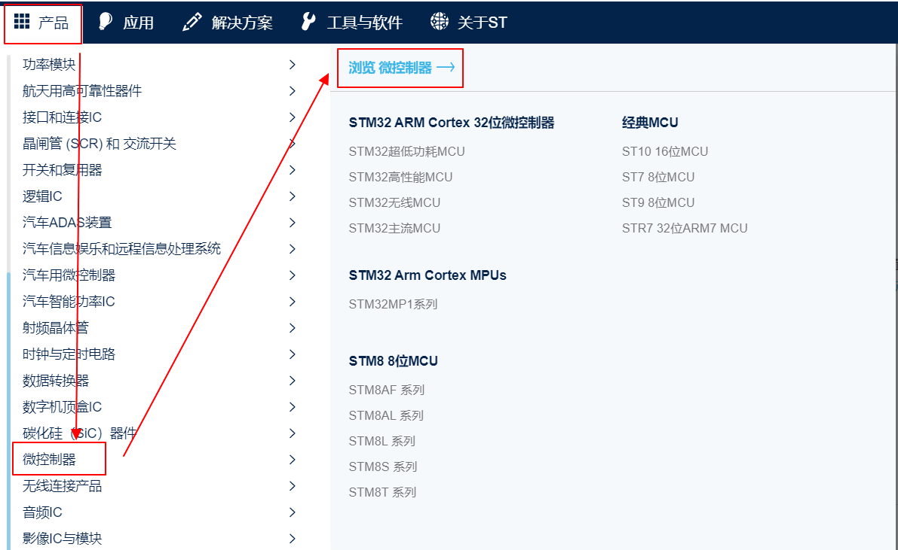
2. 在左侧栏找到自己芯片型号，并进入 `Documentation` 界面，选择对应文档下载即可。
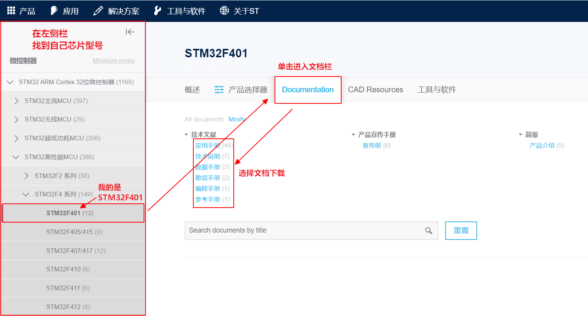
3. 下载以下文档：
   - 数据手册：`Arm® Cortex®-M4 32-bit MCU+FPU, 105 DMIPS, 256KB Flash / 64KB RAM, 11 TIMs, 1 ADC, 11 comm. interfacesV11.0` 芯片本身的手册，相当于产品说明书。
   - 参考手册：`STM32F401xB/C and STM32F401xD/E advanced Arm®-based 32-bit MCUs` ，芯片使用参考手册
   - 编程手册：`STM32 Cortex®-M4 MCUs and MPUs programming manual` ，芯片内核的编程手册（高阶）
4. HAL和LL库参考手册我们需要另外在官网搜索才能找到，`Description of STM32F4 HAL and low-layer drivers`，库函数API驱动描述手册：
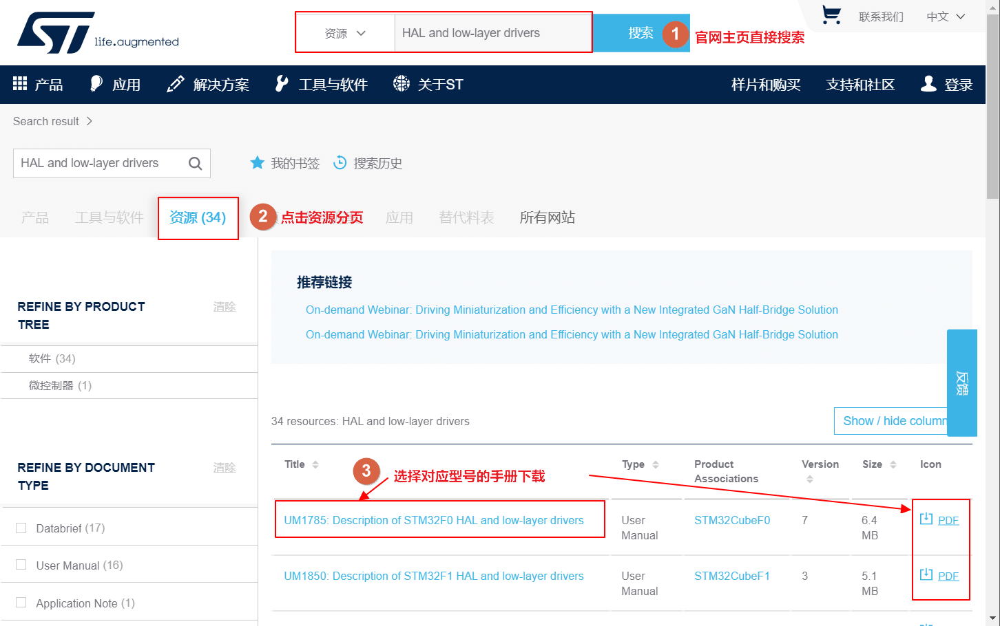

## STM32CubeIDE简介
>产品链接。建议多看看官网的资料，很多问题都能在这些文档里找到答案。
[STM32CubeIDE官网](https://www.stmicroelectronics.com.cn/en/development-tools/stm32cubeide.html)
[STM32CubeIDE user guide](https://www.st.com/content/ccc/resource/technical/document/user_manual/group1/f8/a2/48/77/68/e6/4b/74/DM00629856/files/DM00629856.pdf/jcr:content/translations/en.DM00629856.pdf)

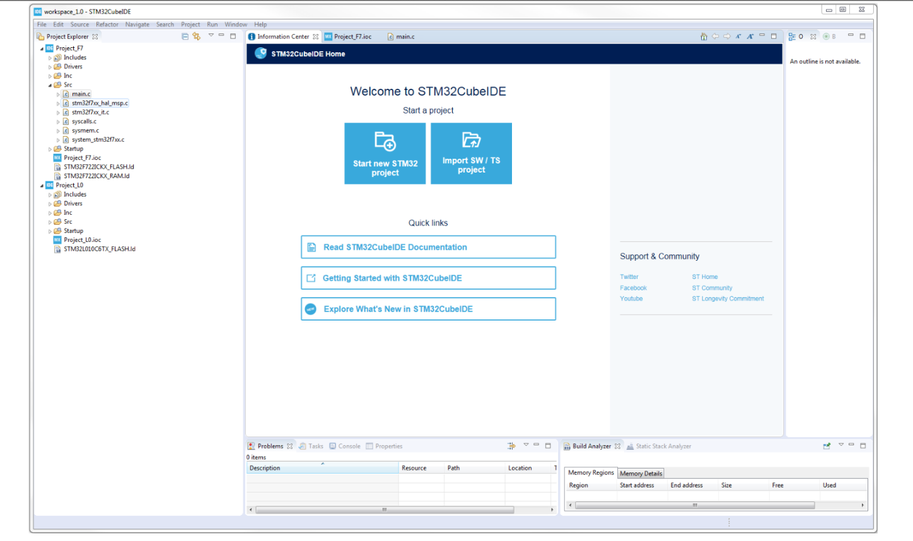

### 1. 特性

- 集成STM32CubeMX，提供以下服务：
   - STM32微控制器选择 
   - 引脚分配，时钟，IP和中间件配置 
   - 项目创建和初始化代码的生成

- 基于Eclipse™/ CDT，支撑ECLIPSE的™插件，GNU C / C ++中ARM ®工具链和GDB调试器。

- 其他高级调试功能包括：**
  - CPU内核，IP寄存器和内存视图
  - 实时变量观看视图
  - 系统分析和实时跟踪（SWV）
  - CPU故障分析工具
  
- 支持ST-LINK（STMicroelectronics）和J-Link（SEGGER）调试探针
- 从Atollic导入项目® TrueSTUDIO ®和AC6系统工作台的STM32
- 多支持操作系统：Windows ®，Linux的®和MacOS ®

### 2. 概述

[STM32CubeIDE](https://www.stmicroelectronics.com.cn/en/development-tools/stm32cubeide.html)是一款多功能的多操作系统开发工具，集成了TrueSTUDIO和STM32CubeMX，它是[STM32Cube](https://www.st.com/content/st_com/en/stm32cube-ecosystem.html)软件生态系统的一部分。  

简单来说就是：**STM32cubeIDE = true studio for stm32 + STM32cubeMX**

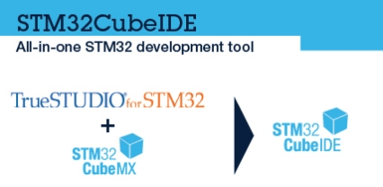

[STM32CubeIDE](https://www.stmicroelectronics.com.cn/en/development-tools/stm32cubeide.html)是一个高级C / C ++开发平台，具有用于STM32微控制器和微处理器的外设配置，代码生成，代码编译和调试功能。它基于ECLIPSE™/ CDT框架和GCCtoolchain用于开发，而GDB用于调试。它允许集成数百个现有插件，这些插件完成ECLIPSE™IDE的功能

[STM32CubeIDE](https://www.stmicroelectronics.com.cn/en/development-tools/stm32cubeide.html)集成了所有[STM32CubeMX](https://www.st.com/en/development-tools/stm32cubemx.html)功能，以提供多合一的工具体验，并节省安装和开发时间。从板上选择空的STM32 MCU、MPU或预配置的微控制器或微处理器后，将创建项目并生成初始化代码。在开发期间的任何时候，用户都可以返回外围设备或中间件的初始化和配置，并重新生成初始化代码，而不会影响用户代码。

[STM32CubeIDE](https://www.stmicroelectronics.com.cn/en/development-tools/stm32cubeide.html)包括构建和堆栈分析器，可为用户提供有关项目状态和内存要求的有用信息。

[STM32CubeIDE](https://www.stmicroelectronics.com.cn/en/development-tools/stm32cubeide.html)还包括标准和高级调试功能，包括CPU内核寄存器，存储器和外设寄存器的视图，以及实时变量监视，串行线查看器（Serial Wire Viewer）接口或故障分析器。

[STM32CubeIDE](https://www.stmicroelectronics.com.cn/en/development-tools/stm32cubeide.html)支持基于Arm®Cortex®处理器的STM32产品

### 3. STM32Cube介绍

[STM32Cube](https://www.st.com/content/st_com/en/stm32cube-ecosystem.html)是意法半导体的一项原始计划，旨在通过减少开发工作量，时间和成本来显着提高设计师的生产率。 [STM32Cube](https://www.st.com/content/st_com/en/stm32cube-ecosystem.html)涵盖了整个STM32产品组合。

**[STM32Cube](https://www.st.com/content/st_com/en/stm32cube-ecosystem.html)是软件工具和嵌入式软件库的结合**：
- 一套完整的PC软件工具，可满足一个完整项目开发周期的所有需求
= 在STM32微控制器和微处理器上运行的嵌入式软件模块，可带来各种功能（从MCU组件驱动程序到更高级的面向应用的特性)

**[STM32Cube](https://www.st.com/content/st_com/en/stm32cube-ecosystem.html)生态系统包括**
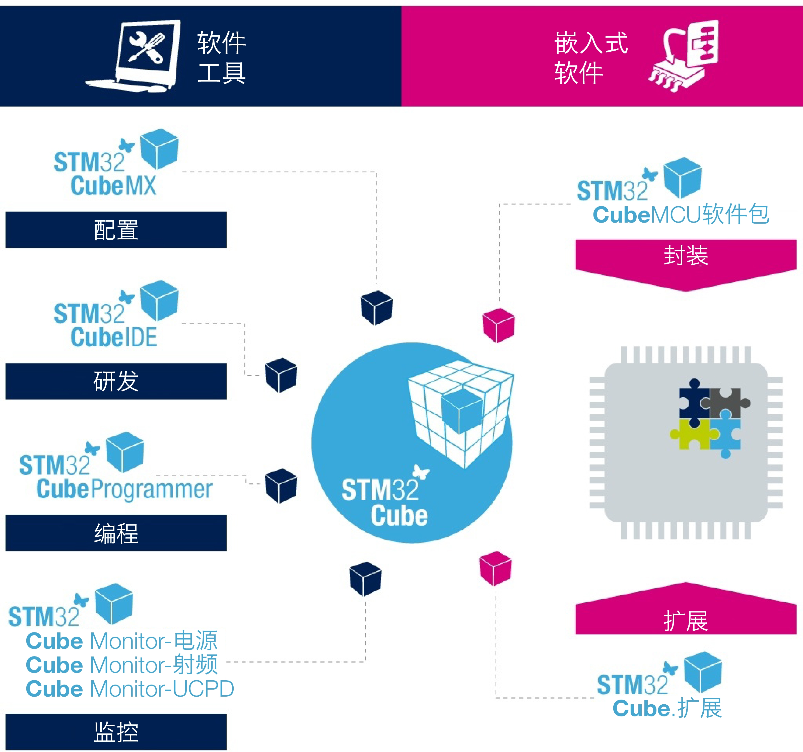

- **一套易于使用的软件开发工具，涵盖从概念到实现的项目开发，其中**

  - [STM32CubeMX](https://www.st.com/en/development-tools/stm32cubemx.html), 面向任意STM32设备的配置工具。这款简单易用的图形用户界面为Cortex-M内核生成初始化C代码，并为Cortex-A内核生成Linux设备树源码。
  - [STM32CubeIDE](https://www.st.com/en/development-tools/stm32cubeide.html), 一种集成开发环境。该IDE基于Eclipse或GNU C/C++工具链等开源解决方案，包括编译报告功能和高级调试功能。它还集成了其他工具，如STM32CubeMX（本身包含在STM32CubeIDE中）。
  - STM32CubeProgrammer（[STM32CubeProg](https://www.st.com/en/development-tools/stm32cubeprog.html)
）, 一种编程工具。它通过多种多样可用的通信媒介（JTAG、SWD、UART、USB DFU、I2C、SPI、CAN等）为读取、写入和验证设备和外部存储器等操作提供简单易用且高效的环境。
  - STM32CubeMonitor-Power（[STM32CubeMonPwr](https://www.st.com/en/development-tools/stm32cubemonpwr.html)
）。功能强大的监控工具，可帮助开发人员实时微调其应用程序的行为和性能。

- **[M32Cube MCU和MPU软件包](https://www.st.com/en/embedded-software/stm32cube-mcu-mpu-packages.html)，特定于每个微控制器和微处理器系列的全面嵌入式软件平台（例如STM32F4系列的STM32CubeF4），其中包括**
  - STM32Cube硬件抽象层（HAL），确保在STM32产品组合上实现最大的可移植性
  - STM32Cube低层API，通过对HW的高度用户控制来确保最佳性能和占用空间
  - 一套一致的中间件组件，例如RTOS，USB，TCP / IP和图形
  - 所有嵌入式软件实用程序以及全套外围设备和应用示例

- **[STM32Cube扩展包](https://www.st.com/en/embedded-software/stm32cube-expansion-packages.html)，包含嵌入式软件组件，这些组件通过以下功能补充STM32Cube MCU和MPU包的功能：**
  - 中间件扩展和应用层
  - 在某些特定的STMicroelectronics开发板上运行的示例

## 下载安装

### 1. 下载

可以从[STM32CubeIDE](https://www.st.com/en/development-tools/stm32cubeide.html) 网站上下载最新版本的安装程序。

在页面底部找到下图，根据自己电脑操作系统下载即可，这里以Windows版为例。  右边下拉菜单还可以选择其他版本，推荐下载最新版。
软件是免费的， 但下载时需要填写信息或注册登录。  

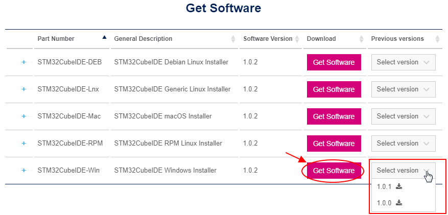

### 2. 安装

前面几步较简单，这里跳过。

**选择安装位置**
- 安装路径中不要包含中文字符，不要包含中文字符，不要包含中文字符
- 建议选择短路径以避免工作区路径过长而面临Windows®限制。
  
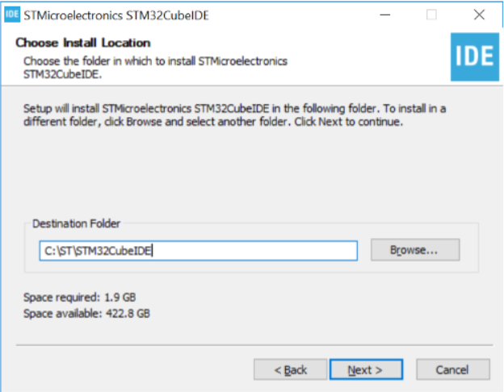

**“选择组件”对话框**
选择要与STM32CubeIDE一起安装的GDB服务器组件。用于STM32CubeIDE安装调试的每种JTAG探针类型都需要一个服务

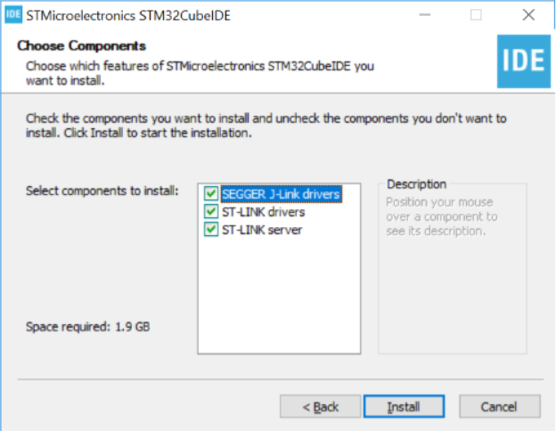

### 3. 可选配置

#### 1. 汉化

如下图打开安装软件界面：
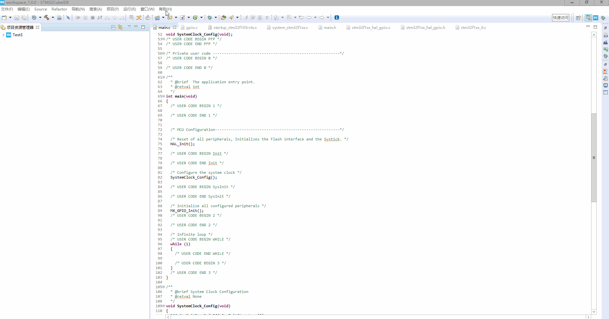

进入以下网址：
http://mirrors.ustc.edu.cn/eclipse/technology/babel/update-site/

选择 `R0.18.2`，并单击进入
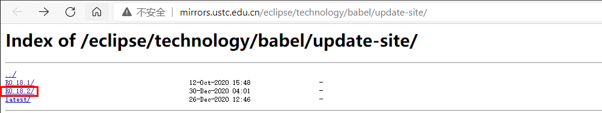
选择如选择:`2020-12`，并单击进入

复制此时网址链接


将以下内容填入 `Add Repository` 对话框。其中的位置就是上面得到的链接。

``` cpp
language

http://mirrors.ustc.edu.cn/eclipse/technology/babel/update-site/R0.18.2/2020-12/
```
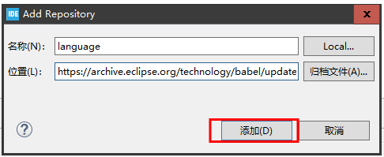

单击 `添加` 按钮。之后会弹出下面对话框，下拉找到图中红框选项，
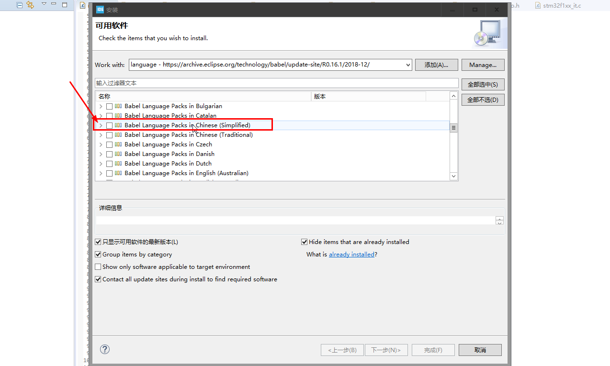

单击其最左侧的多选 `>` 按钮，在下拉框中选中打勾下图红框部分，之后单击 `下一步`。
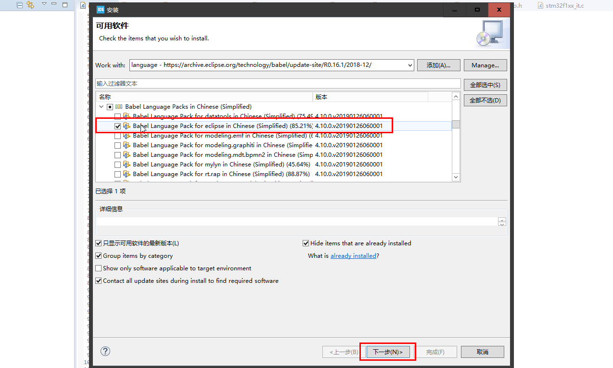

>注：   
上图红框选项指软件的界面汉化，其中后面的（85.21%）表示汉化程度，可见还并未完全汉化。
其他选项也是汉化选项，是关于库，编程等的，安装会导致程序BUG，故不推荐安装。这里只对界面进行汉化。

单击 `下一步` 

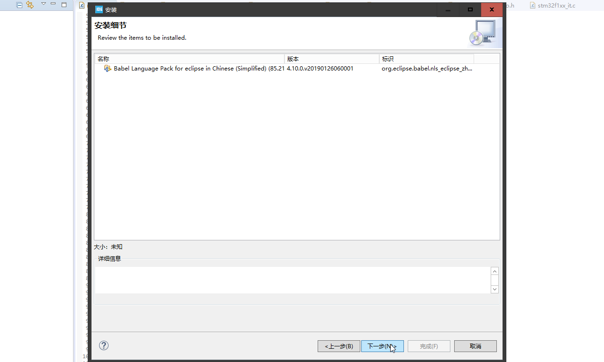

勾选接受许可协议，点击 `完成`

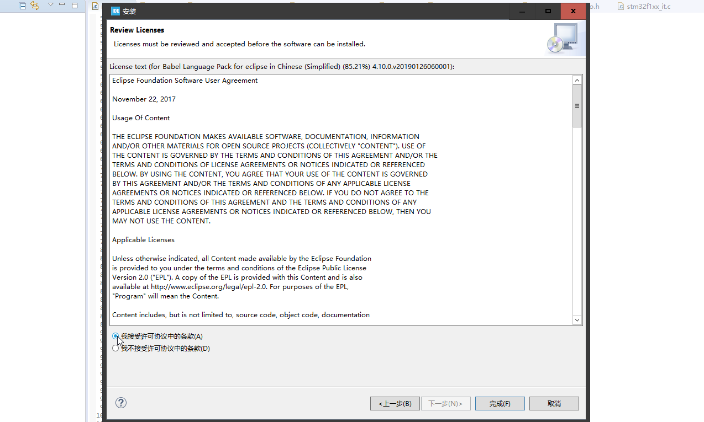

之后会弹出下面的对话框，单击 install anyway

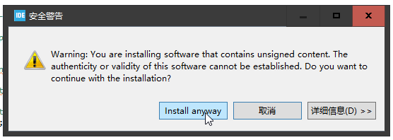

单击现在重启，汉化完成

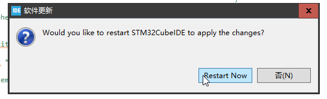

#### 2. 更换主题

软件自带了几个主题，具体可以点击菜单栏 `Windows`-> `preference`，搜索 `theme`并尝试。但官方主题不太好用，所以下面讲解如何使用外部主题。  
菜单栏 `Help`，在下拉栏中双击 `Eclipse Marketplace`打开。  
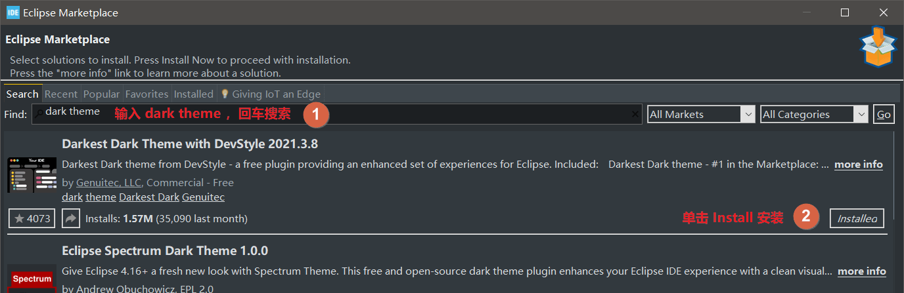
之后按照软件提示，一路默认安装即可。最后重启软件，选择主题。  
如果后面还想更改，点击菜单栏 `Windows`-> `preference`，搜索 `theme`并尝试。
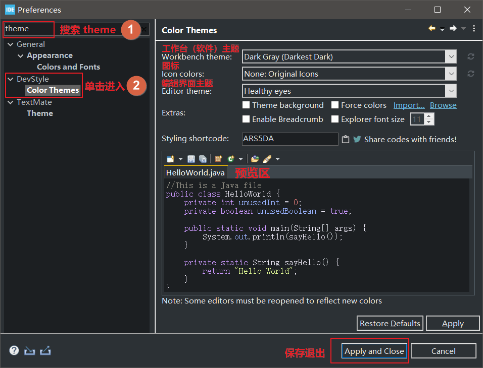

#### 3. 中文注释字体显示问题解决

当我们尝试中文注释和英文注释混编的时候，会出现中文注释突然变小的问题
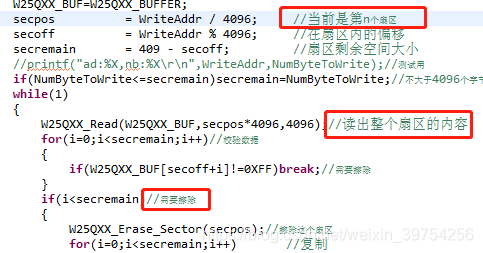

**解决办法：** 菜单栏 `Windows`-> `preference`
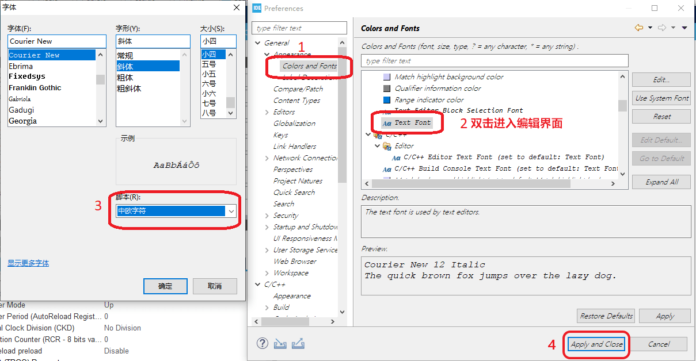

**参考链接**
- [STM32CubeIDE注释字体问题](http://www.openedv.com/thread-300647-1-1.html)
- [STM32的开发环境cubeIDE注释混乱问题解决方法](https://blog.csdn.net/weixin_39754256/article/details/104304634)

## 新建工程模板

这里以控制 GPIO 输出/输出为例说明

### 1.1 新建工程

新建工程有两种途径。如下图示：
>开发过程中有时候需要复制一个已有的项目，在该项目之上进行开发，STM32CubeIDE不允许同一个工作空间中出现同名项目，这时候就需要修改项目名称了，方法如下：
1. 右键项目名，选择 `Delete` 删除项目（不是真的删除，相当于卸载工程）。
2. 复制项目，并修改项目文件夹名称。
3. 打开项目，右键项目名，选择 `Rename` 重命名项目名
4. 删除以前的 `.elf`和`.launch`文件。重新启动 Debug 调试。

1. 第一种：界面左上角 `file` -> `New` -> STM32 Project`
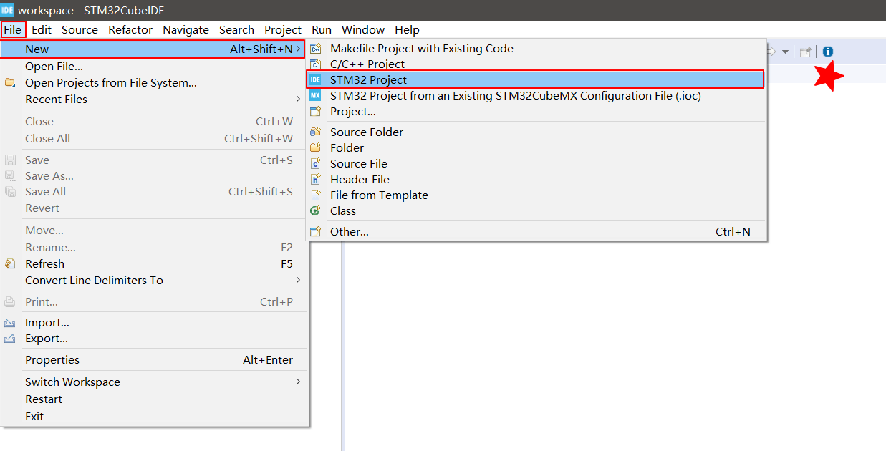


2. 第二种：默认启动界面，在这里直接单击开始新工程。如果看不到下图界面，单击上图中 `红色五角星` 上方的 “感叹号” 图标，就会出现了。
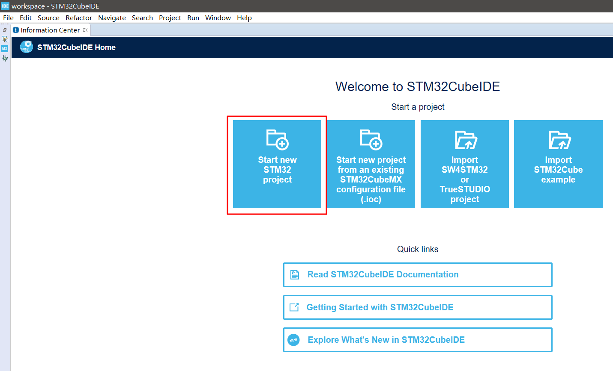

之后会弹出如下的 芯片选择界面。  
这里有很多种查找芯片的方法，我们这里直接在搜索框 （**1** 处）里搜索，在右下结果框里（**2**处）选中我们要查找的芯片即可。注意其最左边的五角星 <i class="far fa-star"></i>，单击收藏，则会变成蓝色。下次我们可以直接单击左上角搜索框上方的大五角星（ **3** 处），就能够快速查看已收藏的芯片，方便快速。  
选好后，我们单击 `下一步`。
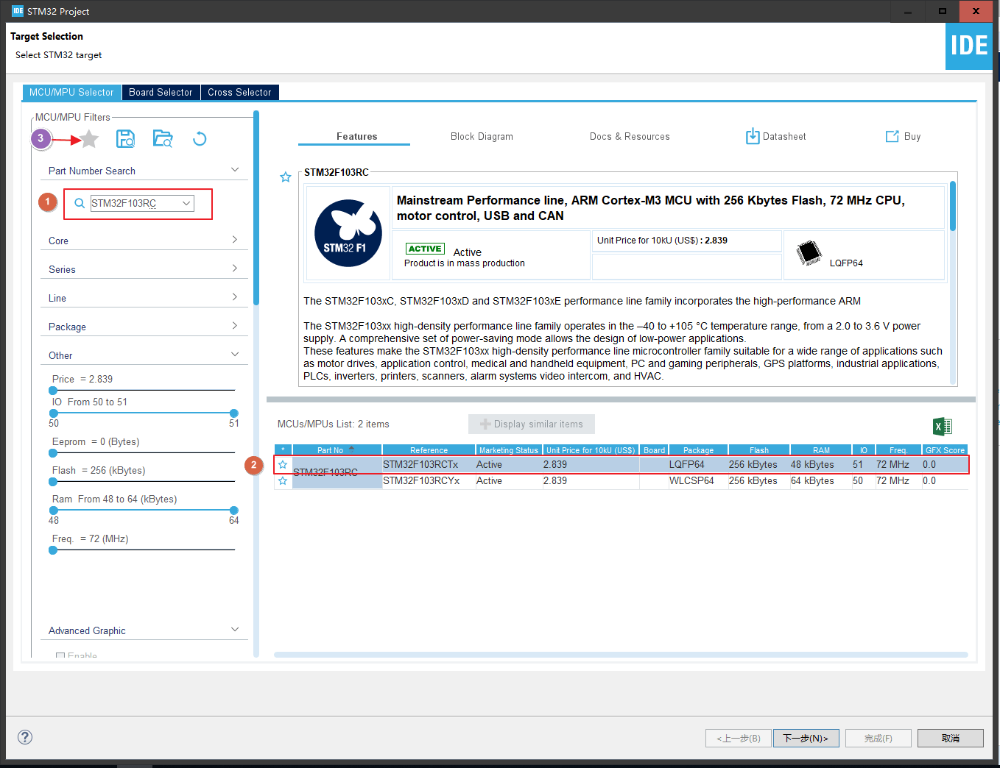
	
**1** 处输入工程名称  
**2**处 是工程存储地址，可以自定义 ，但要注意你需要为工程文件再单独新建一个文件夹，不然所有文件都会平铺在当前文件夹中。  
**3** 处是编程语言，这里选择使用C++。之后单击 `下一步`
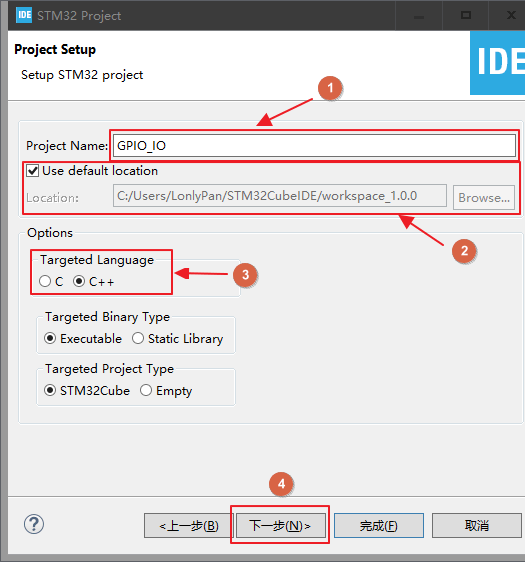

这里是关于库文件的选项，第一个是将库文件链接到安装目录下，这样工程目录下其实是没有库文件了，如果换电脑目录改变，则需要重新链接，不推荐。第二个是复制库文件到工程目录下。建议选择第二个。
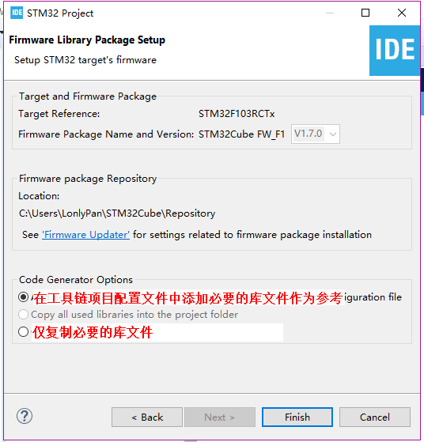

接下来就是熟悉的 CubeMX 初始化配置界面了，操作方法也没有什么难的，就是将我们之前用代码写的初始化变成了图形化操作，按照我们初始化的思路一步步勾选即可了。下面具体操作。

### 1.2 引脚与配置(Pinout  and Configuration)

1. 系统配置。这里是调试工具选择和基准时钟源选择。我们用的是ST-Link的SWD（Serial Wire Debug）调试模式，所以选择 **Serial Wire** 串行线。时钟基准源默认系统滴答时钟 **SysTick**。
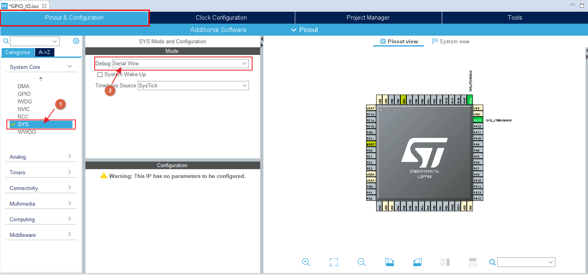

2. 时钟源配置。一共有以下选项。
- 外部晶体/陶瓷晶振(Crystal/Ceramic Resonator)：由外部无源晶体与MCU内部时钟驱动电路共同配合形成，有一定的启动时间，精度较高。外部晶振没有时，自动切换为自带的内部晶振。
- 旁路时钟源(Crystal/Ceramic Resonator)：直接从外界导入时钟信号。犹如芯片内部的驱动组件被旁路了
- Disable：无时钟，相关功能不工作。

  这里HSE配置为外部晶振，LSE选Disable(低速时钟是给看门狗和RTC的，目前未用)。时钟输出关闭。
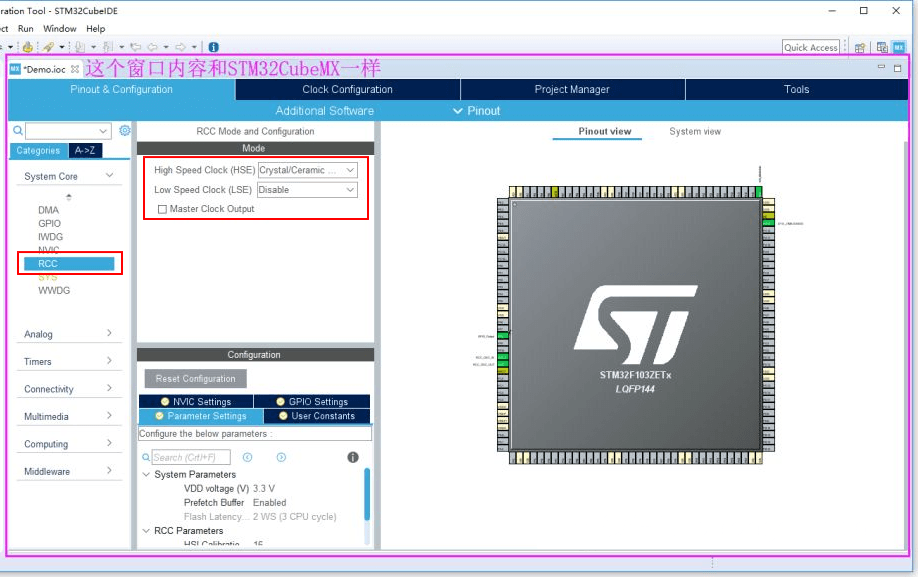

3. 引脚配置。
在图左图形界面单击我们用到的引脚。这里我们使用的LED引脚有 PD2 和 PC8，都是低电平点亮，具体可查看开发板原理图。两个引脚我们都配置为输出模式。
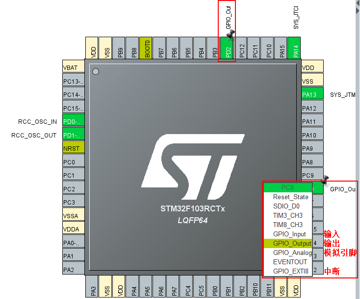

    然后我们到左边的引脚具体配置。配置如图示，两个引脚相同。
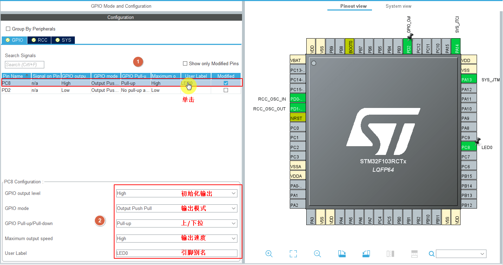

### 1.3 时钟配置(Clock Configuration)

选择外部8MHz晶振，配置系统时钟为72MHz。注意APB1总线时钟式36MHz，需二分频。
这里和后面的配置都不需要保存的，也没有保存按钮<i class="fas fa-smile"></i>
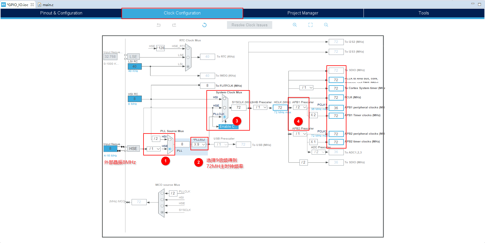

### 1.4 项目管理(Project Manager)

这里我们注意勾选上图中红框部分。这样生成的代码每个外设一个文件夹，就不会全堆在main.c文件里了。其他的默认。
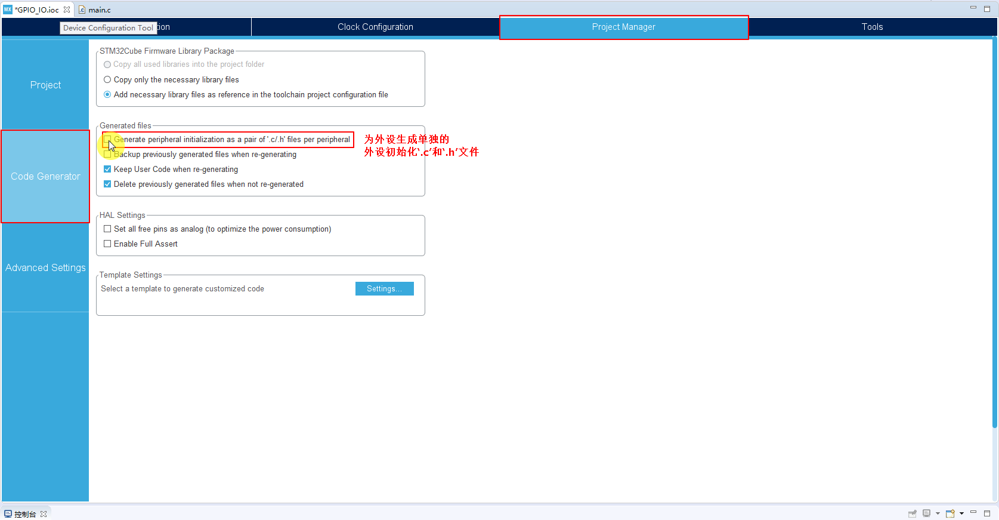

### 1.5 工具(Tools)

保持默认即可

### 1.6 编译生成初始化文件

单击上方工具栏的  `设备配置工具代码生成` ，完成工程建立。观察左侧的项目资源管理器，会发现多出了gpio.c文件等等。现在就可以正式编写程序了。
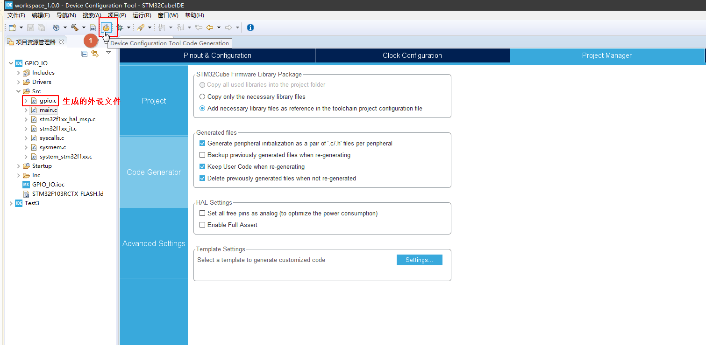

我们可以单击其左边的锤子 🔨 编译 按钮，编译应该是没有错误的。
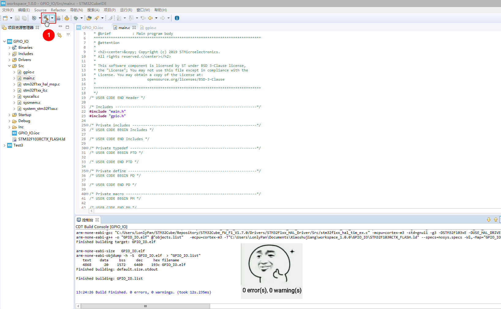


### 1.7 新建文件夹和文件

由于使用 Stm32CubeIDE 会自动生成配置初始化文件。为了将配置文件和自己的工程文件区分、避免相互影响，我们需要单独建立一个文件夹，存放我们自己的代码。 
>之后所有的参考程序都会存放在我们新建的 `BSP` 文件夹下。

这里有两种方法，一个是使用 STM32CubeIDE 重新建立文件和文件夹（适用从零开始的工程）。另一种是从外部导入文件和文件夹（适用工程迁移）。

#### 新建文件和文件夹

右键工程名，鼠标移至 `NEW`上，在右侧弹窗中单击 `Sorce Folder`新建文件夹。在这上面还有类似的 `Folder`选项，至于两者不同点，还请自行尝试。
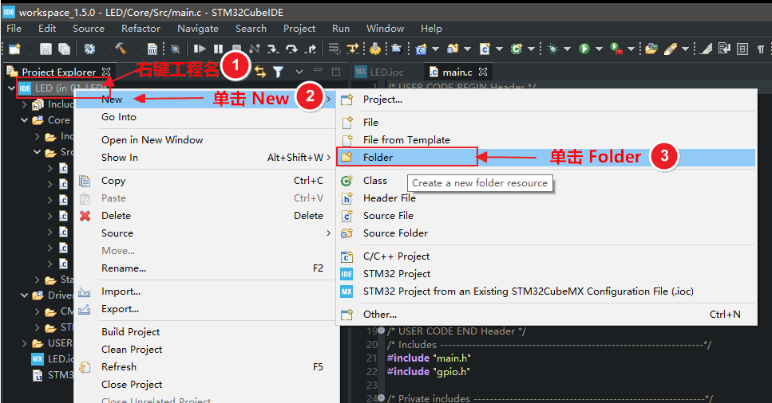
随后新建源文件或头文件，和上图类似，不过这次是在刚刚新建的`文件夹名`上右键，选择`NEW`，并在右侧弹窗中单击 `Sorce Files`或者`Header File` 新建源文件和头文件。
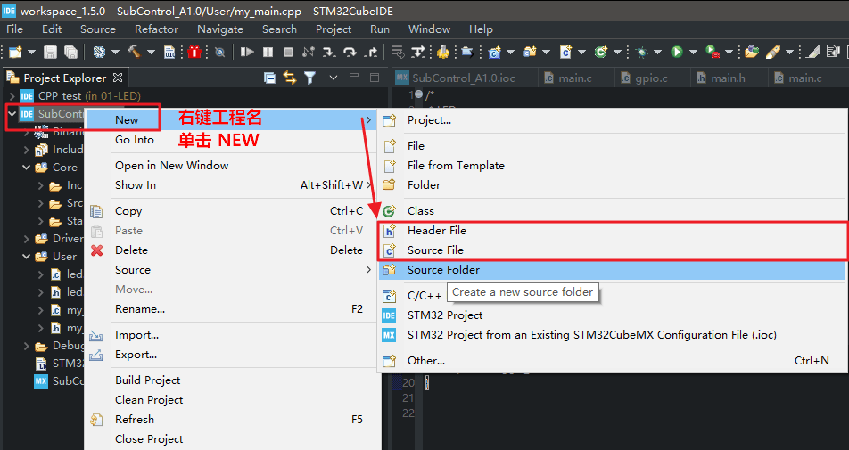
头文件包含，新建文件夹后，需要在编译器中另外包含文件夹地址，否则编译会提示找不到文件。
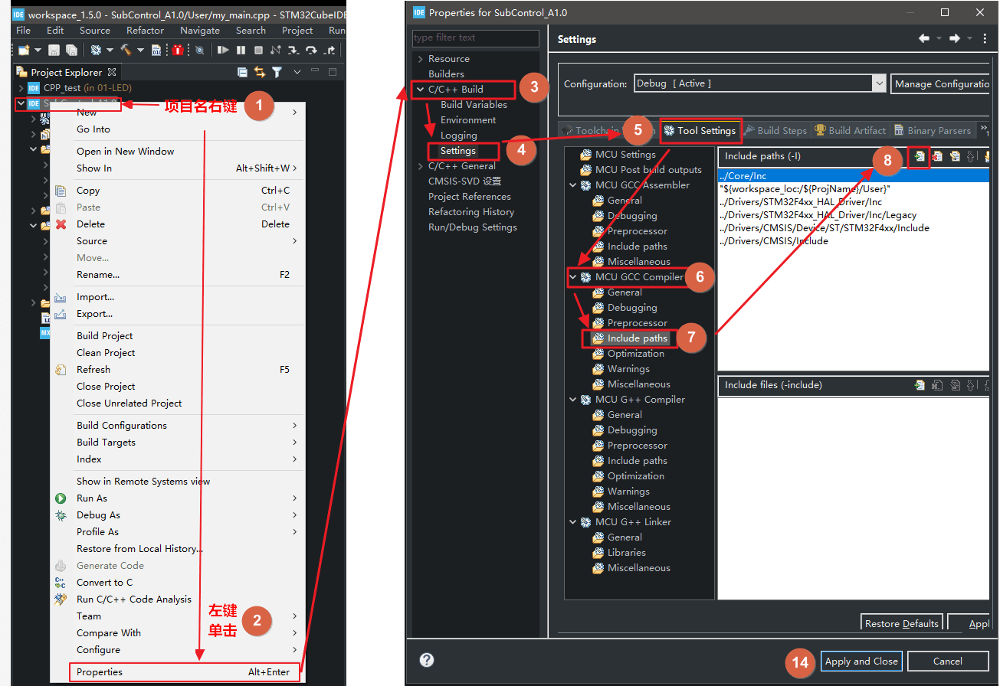


#### 导入外部文件-文件夹

- [stm32CubeIDE 在自己工程中添加.c 和.h文件](https://blog.csdn.net/qq_36300069/article/details/103226568)

### 1.8 使用 C++ 编程

1. 新建 C++ 工程
如下图所示，只需要改动一处即可。
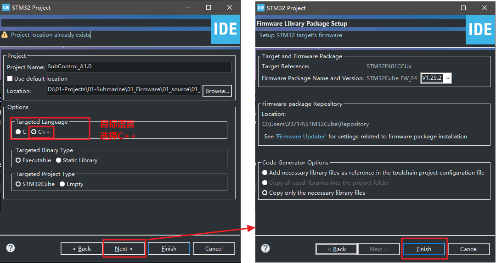
2. 添加个人文件夹（参考上文的`工程中添加文件`）
为了避免软件生成的配置文件和我们自定义文件混淆，建议将自己的文件单独放在一个文件夹中。
另外还需要在G++中包含头文件夹，`Properties`->`C/C++ Build`->`Tool Settings`：
* -> `MCU G++ Compiler` -> `include paths` 和 
* -> `MCU GCC Compiler` -> `include paths`
3. 编写程序，注意.cpp中函数有被.c中函数调用时，需要在.cpp函数的头文中添加 （源文件.cpp中不需要添加）`extern "C" `。
   ```
   #ifndef MY_MAIN_H_
   #define MY_MAIN_H_

   #ifdef __cplusplus
   extern "C" {
   #endif

   void setup();  // 被main.c调用
   void loop();   // 被main.c调用

   #ifdef __cplusplus
   }
   #endif

   #endif /* CPP_TEST_H_ */
  
    ```
4. 之后就可以自由使用 C++ 了。

### 参考链接

1. [STM32CubeIDE资源](https://www.st.com/zh/development-tools/stm32cubeide.html#resource)
2. [STM32CubeIDE属于一站式工具，本文带你体验它的强大](https://blog.csdn.net/ybhuangfugui/article/details/89702356)    
3. [STM32CubeMX系列教程03\_创建并生成代码工程](https://www.strongerhuang.com/STM32Cube/STM32CubeMX/STM32CubeMX%E7%B3%BB%E5%88%97%E6%95%99%E7%A8%8B03_%E5%88%9B%E5%BB%BA%E5%B9%B6%E7%94%9F%E6%88%90%E4%BB%A3%E7%A0%81%E5%B7%A5%E7%A8%8B.html) 
4. [STM32CubeIDE使用笔记（01）：基础说明与开发流程](https://blog.csdn.net/Naisu_kun/article/details/95935283)

## 工程模板文件解读

#### 1.1.7 文件夹结构

CMSIS

存放STM32F1xx芯片硬件与代码桥接的相关定义。

1）include

包含位于CMSIS标准的核内设备函数曾层的Cortex-M核通用的头文件，作用是为那些采用Cortex-M核设计SOC的芯片商设计的芯片外设提供一个进入内核的接口，定义了一些内核相关的寄存器。这些文件在其他公司的Cortex-M系列芯片也是相同的。写STM32F1xx的程序时，必须用到其中的四个文件：core_cm3.h、core_cmFunc.h、corecmlnstr.h、cmsis_armcc.h，其他的文件是属于其他内核的，还有几个文件时DSP函数库使用的头文件。

2）Device

时具体芯片直接相关的文件，将举办韩启动文件、芯片外设 寄存器定义、系统时钟初始化功能的一些文件，有ST公司提供
gpio：外设初始化配置函数

  - stm32f103xe.h  头文件 （Device\ST\STM32F1xx\include\stm32f103xe.h）

是stm32f103xe系列新片片底层相关的文件，包含了STM32中所有的外设寄存器地址和结构体类型定义，比如熟悉的宏定义GPIOA，结构体类型 GPIO_TyoeDef都在该文件定义。

  - systen_stm32f1xx.c文件（Device\ST\STM32F1xx\Source、Templates\systen_stm32f1xx.c）

定义了几个函数：系统初始化函数：SystemInit()、系统内核始终更新函数：SystemCoreClockUpdate()、外部SRAM启动控制函数：SystemInit_ExtMemCtl()。SystemInit函数是在芯片复位后执行的一个函数，用于预初始化内核时钟

  - startup_stm32f103xe.s 启动文件 (文件路径：\Device\ST\STM32F1xx\Source\Templates\arm\startup_stm32f103xe.s)

是一个汇编文件，不同开发环境平台该文件内容不同(虽然文件名称相同，所以使用时注意区分)。该文件内容才真正是芯片上电后运行的内容，在运行了这文件内容后程序才跳转至 main.c 文件中的 main 函数。后面我们会单独分析该文件内容。

STM32F1xx_HAL_Driver 文件夹：有 Inc 跟 Src 两个文件夹，这里的文件属于CMSIS 之外的、芯片片上外设部分。

Src 里面是每个设备外设的驱动源程序，Inc 则是相对应的外设头文件。Src 及 Inc 文件夹是 HAL 库的主要内容。在 Src
和 Inc 文件夹里的就是 HAL 库针对每个外设而编写的库函数文件，每个外设对应一个 stm32f1xx_hal_ppp.c 和 stm32f1xx_hal_ppp.h 文件，部分外设有特殊功能还有一个 stm32f1xx_hal_ppp_ex.c 文件，其中 ppp 为外设名称，比如
gpio、adc、i2c 等等，见下面表格。

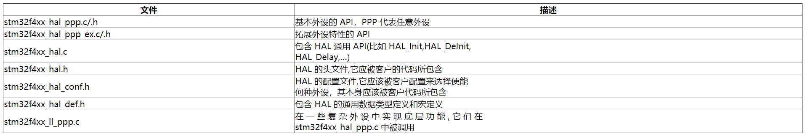

main.c：存放main函数和SystemClock_Config函数

stm32f1xx_assert.c：

stm32f1xx_hal_msp.c：其中的 `HAL_MspInit()` 是芯片系统级初始化，一般实现系统的中断配置，比如硬件错误、微处理器故障、总线错误等。其在 HAL_Msplnit函数中被调配，而main函数起始就调用 HAL_Init 函数。

stm32f1xx_it.c：存放中断服务函数

stm32f1xx_hal_conf.h：见上面表格

stm32f1xx_it.h：中断服务函数声明，一般很少改动


## STM32F030_HAL库学习笔记

操作系统：Win10
硬件平台：STM32F401
软件平台：STRM32CubeIDE V1.6.0
下载器：ST-Link V2

### GPIO HAL库 操作与调试

#### 初始化配置

参考上文中的工程模板建立。

#### 程序编写

**主要API：**
1. **HAL_GPIO_WritePin(GPIO_TypeDef\* GPIOx, uint16_t GPIO_Pin, GPIO_PinState PinState)**
控制某个具体引脚的状态
   - GPIO_TypeDef：IO端口编号  GPIOA、 GPIOB、 …、 GPIOG  
   - GPIO_Pin：IO引脚编号 GPIO_PIN_0…GPIO_PIN_15  
   - PinState：IO状态 GPIO_PIN_SET 或者 GPIO_PIN_RESET  
2. **HAL_GPIO_TogglePin(GPIO_TypeDef \*GPIOx, uint16_t GPIO_Pin)**
3. **HAL_GPIO_ReadPin(GPIO_TypeDef \*GPIOx, uint16_t GPIO_Pin)**
读取某个具体引脚的状态(**需要将引脚设置为输入模式 `GPIO_input`**)
4. HAL_Delay(uint32_t Delay)
ms 级延时函数。IDE内置的，但没有内置 us 级延时函数
**主函数：**

``` cpp
int main(void)
{
  HAL_Init();
  /* Configure the system clock */
  SystemClock_Config();

  /* Initialize all configured peripherals */
  MX_GPIO_Init();
  HAL_GPIO_WritePin(LED1_GPIO_Port,LED1_Pin, GPIO_PIN_SET)  /* LED1输出高电平 */ 
  while (1)
  {
	  HAL_GPIO_TogglePin(LED0_GPIO_Port,LED0_Pin); /* 间隔500ms翻转 LED0 引脚 */
	  HAL_Delay(500);
  }
}
```

这里的前两个`LED0_GPIO_Port,LED0_Pin`是引脚的宏定义，初始化时系统根据我们在配置界面设置的 IO 别名自动生成的，方便理解，否则没有。请在 main.h 文件中查看。

#### 调试Debug

点击工具栏的 `甲虫按钮`
  
在弹出对话框，选择 `STM32 CPU`，单击 `确认` 进入配置界面。在 `调试器`下选择 ST-Link 作为调试器，单击 `确认`。
  

在弹出的对话框选择 `Switch`，打开调试窗口。
  

这里就是调试窗口了，红框内的都是和调试有关的工具按钮，这里不多做介绍，自行摸索。
  


### GPIO 寄存器操作

#### 寄存器介绍

**BSRR 和 BRR 关系**

BSRR 和 BRR 都是 STM32 系列 MCU 中 GPIO 的寄存器。 BSRR 称为端口位设置/清除寄存器，BRR称为端口位清除寄存器。
- BSRR 低 16 位用于设置 GPIO 口对应位输出高电平，高 16 位用于设置 GPIO 口对应位输出低电平。
- BRR 低 16 位用于设置 GPIO 口对应位输出低电平。高 16 位为保留地址，读写无效。

所以理论上来讲，BRR 寄存器的功能和 BSRR 寄存器高 16 位的功能是一样的，都可以控制端口输出低电平。也就是说，输出低电平可以有如下两种写法。

```
#define SET_BL_LOW() GPIOA->BRR=GPIO_Pin_0
等价于
#define SET_BL_LOW() GPIOA->BSRR=GPIO_Pin_0 << 16
```
这么来看的话，其实 BRR 寄存器是比较多余的。而实际上，在最新的 STM32F4 系列 MCU 的 GPIO寄存器中，已经找不到 BRR 寄存器了，仅保留了 BSRR 寄存器用于实现端口输出高低电平。

可见，不管是输出高还是输出低，对 BSRR 寄存器的操作最为稳妥。


BSRR常见操作
```
/* 低8位操作 */
GPIOE->BSRR = (Newdata & 0xffff) | ( (~Newdata )<<16 );
/* 16位操作 */
GPIOE->BSRR = (Newdata & 0xff) | ( (~Newdata & 0xff)<<16 );
```
BSRR还有一个特点，就是如果低6位和高16位同时置1，结果以低16位为准。
就是说同一个bit在 BSRR 低16位中为1（输出高电平），但在高16位中也是1（输出低电平），结果该bit引脚输出 1（高电平）。
此时对多位同时操作可以这么写：
```
GPIOx->BSRR = 0xFFFF0000 | PATTEN;
```
不用考虑哪些需要置1，哪些需要清零

**ODR**

ODR 寄存器也是用于输出数据的寄存器，一个 ODR 寄存器控制了一组(16位)的 GPIO 输出。因此，对 ODR 进行修改也可以到达对 IO 口输出进行配置。同时通过读取该寄存器，也能够获取 IO 的当前输出状态。而 BSRR 和 BRR 只可写。

但是，由于对 ODR 寄存器的读写操作必须以 16 位的形式进行。因此，如果使用 ODR 改写数据以控制输出时，须采用“读-改-写”的形式进行。

假设需要对 GPIOA_Pin_6 输出高电平。采用改写 ODR 寄存器的方式时，使用“读-改-写”操作，代码如下：
```
GPIOB->ODR=((GPIOB->ODR | GPIO_Pin_6); 
```

而使用 BSRR 寄存器时，仅需要使用如下语句：
```
GPIOA->BSRR = GPIO_Pin_6;
```
这是因为在修改 ODR 时，为了确保对端口 6 的修改不会影响到其他端口的输出，需要对端口的原始数据进行保存，之后再对端口 6 的值进行修改，最后再写入寄存器。而对 BSRR 的操作，是写 1 有效，写 0 不改变原状态，因此可以对端口 6 置 1，其他位保持为 0。

BSRR 为 1 的话，程序运行时自动会修改相应的 ODR 位。

**BSRR、BRR、 ODR 之间的关系**

* ODR寄存器可读可写：既能控制管脚为高电平，也能控制管脚为低电平。管脚对于位写1 GPIO管脚为高电平，写 0 为低电平（有被中断打断的风险）
* BSRR 只写寄存器：既能控制管脚为高电平，也能控制管脚为低电平。对寄存器高16位 写1 对应管脚为低电平，写0无动作；对寄存器的第16位写1对应管脚为高电平，写 0 无动作。
* BRR 只写寄存器：只能改变管脚状态为低电平，对寄存器 管脚对于位写 1 相应管脚会为低电平。写 0 无动作。

ODR 能控制管脚高低电平为什么还需要BSRR和SRR寄存器的原因是：用BSRR和BRR去改变管脚状态的时候，没有被中断打断的风险。也就不需要关闭中断，关闭中断明显会延迟或丢失一事件的捕获，所以控制GPIO的状态最好还是用SBRR和BRR。

**IDR**

GPIO 端口输入数据寄存器。只用了低 16 位。该寄存器为只读寄存器，并且只能以 16 位的形式读出。  
要想知道某个 IO 口的状态， 你只要读这个寄存器，再看某个位的状态就可以了。

#### 初始化配置
沿用 HAL 库操作时的配置
#### 程序编写

寄存器的写法可以通过查看 HAL 函数底层实现，来学习官方如何使用寄存器的。
```
void led_blink()
{
#if 0 // ODR 方式
	if(LED_GPIO_Port->ODR & LED_Pin)  // 高电平
		LED_GPIO_Port->ODR=~(~LED_GPIO_Port->ODR | LED_Pin);  // 置0
	else
		LED_GPIO_Port->ODR=(LED_GPIO_Port->ODR | LED_Pin);  // 置1

    HAL_Delay(2000);

#endif
	if(LED_GPIO_Port->IDR & LED_Pin)  // 高电平
	   LED_GPIO_Port->BSRR = LED_Pin  << 16 ;   // 高位置0
	else
	   LED_GPIO_Port->BSRR = LED_Pin; // 低位置1

    HAL_Delay(2000);
}
```
**参考链接**
* [高手带你解析STM32 BSRR BRR ODR寄存器](http://news.moore.ren/industry/64985.htm)
* [STM32duino GPIO Registers and programming](https://gist.github.com/iwalpola/6c36c9573fd322a268ce890a118571ca)
* [GPIO Output Registers on the STM32](https://electronics.stackexchange.com/questions/336021/gpio-output-registers-on-the-stm32)
* [Would my solution work for 8-bit bus addressing using BSRR and BRR?](https://stackoverflow.com/questions/56822789/would-my-solution-work-for-8-bit-bus-addressing-using-bsrr-and-brr)
* [STM32裸机学习笔记（三）—寄存器映射之BSRR与延时的爱恨情仇](https://www.codenong.com/cs106676846/)
* [STM32 GPIO 配置之ODR, BSRR, BRR 详解](https://blog.csdn.net/GDNNNNN/article/details/87904592?spm=1001.2014.3001.5501)

### GPIO 位带操作

#### 位带操作设置
关于位带操作，网上有很多讲解，这里不再详述。可以参考：`参考手册` 的 GPIO 章节，`编程手册` 的 2.2.5 Bit-banding 章节，自行深入学习。只需要将下段代码加入到任意头文件中：

```c 
//位带操作,实现51类似的GPIO控制功能
//IO口操作宏定义
// 把“位带地址+位序号”转换成别名地址的宏
#define BITBAND(addr, bitnum) ((addr & 0xF0000000)+0x2000000+((addr &0xFFFFF)<<5)+(bitnum<<2))
// 把一个地址转换成一个指针
#define MEM_ADDR(addr)  *((volatile unsigned long  *)(addr))
// 把位带别名区地址转换成指针
#define BIT_ADDR(addr, bitnum)   MEM_ADDR(BITBAND(addr, bitnum))
//IO口地址映射
#define GPIOA_ODR_Addr    (GPIOA_BASE+20) //
#define GPIOB_ODR_Addr    (GPIOB_BASE+20) //
#define GPIOC_ODR_Addr    (GPIOC_BASE+20) //
#define GPIOD_ODR_Addr    (GPIOD_BASE+20) //
#define GPIOE_ODR_Addr    (GPIOE_BASE+20) //
#define GPIOF_ODR_Addr    (GPIOF_BASE+20) //
#define GPIOG_ODR_Addr    (GPIOG_BASE+20) //

#define GPIOA_IDR_Addr    (GPIOA_BASE+16) //
#define GPIOB_IDR_Addr    (GPIOB_BASE+16) //
#define GPIOC_IDR_Addr    (GPIOC_BASE+16) //
#define GPIOD_IDR_Addr    (GPIOD_BASE+16) //
#define GPIOE_IDR_Addr    (GPIOE_BASE+16) //
#define GPIOF_IDR_Addr    (GPIOF_BASE+16) //
#define GPIOG_IDR_Addr    (GPIOG_BASE+16) //

//IO口操作,只对单一的IO口!
//确保n的值小于16!
#define PAout(n)   BIT_ADDR(GPIOA_ODR_Addr,n)  //输出
#define PAin(n)    BIT_ADDR(GPIOA_IDR_Addr,n)  //输入

#define PBout(n)   BIT_ADDR(GPIOB_ODR_Addr,n)  //输出
#define PBin(n)    BIT_ADDR(GPIOB_IDR_Addr,n)  //输入

#define PCout(n)   BIT_ADDR(GPIOC_ODR_Addr,n)  //输出
#define PCin(n)    BIT_ADDR(GPIOC_IDR_Addr,n)  //输入

#define PDout(n)   BIT_ADDR(GPIOD_ODR_Addr,n)  //输出
#define PDin(n)    BIT_ADDR(GPIOD_IDR_Addr,n)  //输入

#define PEout(n)   BIT_ADDR(GPIOE_ODR_Addr,n)  //输出
#define PEin(n)    BIT_ADDR(GPIOE_IDR_Addr,n)  //输入

#define PFout(n)   BIT_ADDR(GPIOF_ODR_Addr,n)  //输出
#define PFin(n)    BIT_ADDR(GPIOF_IDR_Addr,n)  //输入

#define PGout(n)   BIT_ADDR(GPIOG_ODR_Addr,n)  //输出
#define PGin(n)    BIT_ADDR(GPIOG_IDR_Addr,n)  //输入
```

上述代码中：
- `#define BITBAND` 后的内容，不同内核可能需要另外修改（M3和M4内核已经验证，可通用）。 
- 数字 `20`和`16`是寄存器  ODR 和 IDR 的地址偏移，不同芯片也需要做出相应修改，具体查看 `参考手册` 的 GPIO 章节的 GPIOx_IDR、GPIOx_ODR寄存器描述
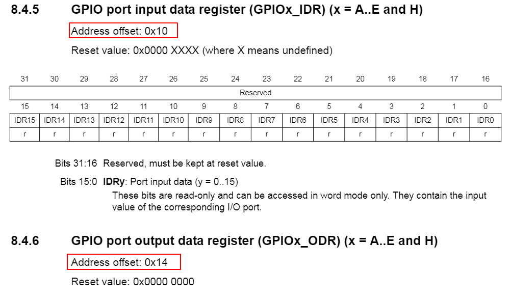
图中红框部分 0x10 、0x14 转换成十进制就是 16 和 20。例如 STM32F103 系列的是  0x08、0x0C，那这里就需要改为 12 和 8。

参考链接：
- [知乎-STM32位带操作全解](https://zhuanlan.zhihu.com/p/142586194)
- [CSDN-快速理解STM32位带操作原理和用途](https://blog.csdn.net/ybhuangfugui/article/details/108067563)
- [cnblogs-第13章 GPIO-位带操作—零死角玩转STM32-F429系列](https://www.cnblogs.com/firege/p/5748713.html)

#### 初始化配置

沿用 HAL 库操作时的配置

#### 程序编写
```
/* 操作相应I/O前，必须先配置初始化，才能使用位带操作 */
PGout(10)= 1;  // PG10 输出高电平
uint8_t io_status = PGin(9); // 读取PG9的高低电平状态
```

### GPIO双向 I/O

有时需要IO既要作为输出，还要作为输入读取。如果采用初始化重新配置的话，就会很慢且繁琐。
如果希望某GPIO做双向传输，将其配制为OD输出模式，

#### F401 开漏输出模式介绍
* 开漏模式：输出寄存器中的“0”可激活 N-MOS，而输出寄存器中的“1”会使端
* 口保持高组态 (Hi-Z)（ P-MOS 始终不激活）。
* 施密特触发器输入被打开
* 根据 GPIOx_PUPDR 寄存器中的值决定是否打开弱上拉电阻和下拉电阻
* 输入数据寄存器每隔 1 个 AHB1 时钟周期对 I/O 引脚上的数据进行一次采样
* 对输入数据寄存器的读访问可获取 I/O 状态
* 对输出数据寄存器的读访问可获取最后的写入值

  

另外其实将IO设置为推挽输出模式时，也可以随时读取 IO 引脚状态，但在该模式下，不论输出高、低电平，P-MOS和N-MOS总有一个处于导通状态，轻则影响外部输入信号，重则烧毁芯片（外部拉低或拉高，MOS都相当于短路，导致大电流）。所以并不能作为双向 IO。

#### 初始化配置

* 将该引脚配置为Output-OpenDrain，
* 在引脚上连接一个上拉电阻（从上图可以看出，**F401 能通过软件配置上下拉电阻的；但在 F103 上是没有的，则需要外部硬件上拉**）

上述具体实现：在沿用 HAL 库操作时的配置上，只需修改以下图示部分：
  


#### 程序编写

* 输出时： 
    ```
    GPIOx->BSRR ＝ 输出值;
    ```
* 输入时： 先输出高电平(否则如果之前输出的是低电平，N-MOS则会导通，影响外部输入)，然后通过 GPIOx->IDR 读.
   ```
   LED_GPIO_Port->ODR=(LED_GPIO_Port->ODR | LED_Pin);  // 置1
   LED_Pin_status = LED_GPIO_Port->IDR & LED_Pin;
   ```

#### 参考链接
* [STM32 MCU GPIO双向口使用的话题](http://www.360doc.com/content/17/1208/13/8706683_711243855.shtml)
* [stm32的双向io口](https://blog.csdn.net/weixin_30443813/article/details/96729719)
* [STM32 IO口双向问题](https://my.oschina.net/hoolev/blog/525208)
* [STM32 GPIO八种输入输出模式的功能及区别](https://blog.csdn.net/weixin_41072132/article/details/103264249)
* [STM32的8种GPIO输入输出模式深入详解](https://blog.csdn.net/baidu_37366055/article/details/80060962)

### GPIO模拟配置

#### 模拟配置介绍
该模式一般用于复用状态下或低功耗要求下。不作为普通输入输出控制下的模式配置。

  

**总结**
1、模拟配置会关闭引脚的一切内部相关联设施，此时普通 I/O 操作失效（不能读也不能输出）。因此引脚功耗为0。因此可以通过将引脚配置为该模式来**降低芯片功耗**。 
2、模拟配置另外好处就是保证了这个引脚是 **“干净”** 的，如果和外部连接，那个该引脚就完全反映了外部引脚状态。因此将该引脚内联到A/D 片上外设，就可以精确测量引脚的模拟值了。实际上在我们将引脚复用为 A/D 功能时，就会默认配置为 Analog 模式。

#### 初始化配置

`Pinout` 界面，引脚单击选择即可
  

或者在 `Project Manager` 界面选中将不用的引脚都配置为模拟模式，降低功耗
  

#### 程序编写

无

**参考资料**
- [1、Question about ADC versus GPIO Analog](https://community.st.com/s/question/0D50X00009XkfqtSAB/question-about-adc-versus-gpio-analog)  
- [2、What pins can I use for Analog Input/Output? STM32CubeMX allows every GPIO to be set to ''GPIO_Analog''?](https://community.st.com/s/question/0D50X00009XkWkeSAF/what-pins-can-i-use-for-analog-inputoutput-stm32cubemx-allows-every-gpio-to-be-set-to-gpioanalog)  


### 外部中断

通过外部按键，中断触发，再中断函数中翻转LED。

#### 硬件原理图

 

#### 初始化配置

1. 配置引脚为外部中断模式
2. 配置引脚：中断触发模式，上下拉。
根据按键原理图，这里设置为上拉，下降沿触发。
  
3. 中断配置：使能中断，中断分组及优先级
  

#### 程序编写

```
void HAL_GPIO_EXTI_Callback(uint16_t GPIO_Pin){

	if(GPIO_Pin & KEY_Pin){
		 led_toggle(); //电平反转
		 HAL_Delay(1000);  // 防抖，防止频繁触发中断，导致LED翻转现象不明显
	}
}

```
`HAL_GPIO_EXTI_Callback(uint16_t GPIO_Pin)`为 HAL 库的引脚外部中断回调函数，所有的引脚中断都会调用该函数。用户只需要在这里面编写中断处理函数接即可。`GPIO_Pin`传参表示触发中断的引脚编号。  
`GPIO_Pin & KEY_Pin`判断当前中断是否由按键引脚触发的，再运行处理函数。

>**注意：** 这个回调函数是只针对外部中断的（EXTI），定时中断和其他中断都都还有自己的回调函数。HAL的思想大概就是同类中断集中在一个回调函数，不同类的分开。


### 中断与事件

#### Cortex-M3 处理器内核 vs 基于Cortex-M3的MCU
Cortex-M3 处理器内核是由 ARM 公司设计的，传统意义上的 ARM7/ARM9（简称A7/A9）  也是处理器内核，也是 ARM 公司设计的。

Cortex‐M3处理器内核：故名思意就是单片机（MCU）的核心，是单片机的中央处理单元（CPU）

完整的基于CM3的MCU还需要很多其它组件。在芯片制造商得到CM3处理器内核的使用授权后，它们就可以把CM3内核用在自己的硅片设计中，添加存储器，外设， I/O以及其它功能块。不同厂家设计出的单片机会有不同的配置，包括存储器容量、类型、外设等都各具特色。


#### 中断和异常

中断属于异常的一种。所有能打断正常执行流的事件都称为异常

CM3 的所有中断机制都由 NVIC 实现。除了支持 240 条中断之外， NVIC 还支持 16‐4‐1=11 个内
部异常源（保留了 4+1 个档位），可以实现 fault 管理机制。结果， CM3 就有了 256 个预定义的异常类型。其中编号为 1－15 的对应系统异常，大于等于 16 的则全是外部中断。

类型编号为 1－15 的系统异常如表 7.1 所示（注意： 没有编号为 0 的异常），从 16 开始的外部中断类型如表 7.2 所示
 

  

虽然 CM3 是支持 240 个外中断的，但具体使用了多少个是由芯片制造商决定。 CM3 还有一个NMI（不可屏蔽中断）输入脚。当它被置为有效（ assert）时， NMI 服务例程会无条件地执行。

#### STM32外部中断（EXTI ）
STM32F103 是基于 CM3 内核设计的，ST 公司（芯片制造商）在原有 CM3 内核基础上，添加了储如定时器、串口、DMA等外设，最终组合成一个STM32单片机。其中 CM3 内核是整个单片机的核心部分，相当于CPU（大脑）

所以 STM32 根据原有 NVIC 中断，从中选择性添加了部分中断，并重新命名与排序。下图是STM32的中断向量表：

  

从表中可以看出，STM32 对上文中 CM3 内核的系统异常/外部中断表重新进行了编排和删减，把编号从-3 至 6 的中断向量定义为系统异常。从编号 7 开始将原本 CM3 所描述的外部中断又分成了若干中断类型：外部中断（EXTI）、定时器中断、DMA中断等等。


细心的朋友可能已经发现了这里有一个概念冲突：**外部中断**。释义如下:
>CM3 内核描述中的外部中断均是相对于内核而言的，比如串口中断、定时器中断等等都是（内核的）外部中断！而这里提到的STM32的外部中断（EXTI）指的是芯片的外部中断，主要是由芯片外部事件触发的中断，不是内核的外部中断！
STM32的外部中断（EXTI）属于内核的外部中断一部分。在STM32手册中外部中断（EXIT）均是指芯片的外部中断**加粗样式**，也就是上表中的 EXIT0-9。
这里的 `内外部` 就是物理空间的内外部。

所以当阅读 STM32 参考手册时，外部中断（EXTI）指的均是芯片外部（IO引脚）事件触发的中断。而当阅读网络文章时，则要注意区分。为了避免混淆，都会加 `（EXTI）` 以区分。

这里还有一个概念：`软件中断` ，下文中再详述。
另外 STM32 是没有 ~~内部中断~~  这个概念的，

  

#### 中断/事件关系
MCU运行过程，其中会有许多各种各样的事件，比方：管脚电平变化、计数器溢出、DMA空、FIFO非空、AD转换结束、超时、外设使能、初始化等等。
其中有些事件本身是不会导致中断产生的，比方外设使能或部分初始化动作是不会导致中断发生的；有些事件则可能导致中断发生，比方计数器溢出，AD转换结束等，这些就是中断事件。当然这些中断事件最终能否触发后续中断，还需要对中断事件进行配置。

**先说结论**
- 中断：处理器运行的一个状态，该状态会打断处理器当前正常的进程。
- 事件：就是事件。其可能触发中断。
- 中断事件：触发中断的事件，而且软件上也有中断函数的，叫中断事件
- 中断是中断事件发生的结果，中断事件属于事件，事件可分为中断事件或非中断事件

我们可以借助 STM32 MCU的GPIO的外部事件与中断控制器的框图来理解上述结论。
>这张图的在 STM32中文手册 中是错误的，英文版的是对的。因而网上很多文章此处的配图都有误，我这里重置了。


  

我们先关注两个寄存器：`中断屏蔽寄存器`和`事件屏蔽寄存器`。这两个寄存器决定了从编号1、2、3输入进来的事件最终会输出脉冲发生器（不产生中断）还是 NVIC 中断控制器（产生中断）。从而决定了输入的事件是中断事件还是非中断事件。

MCU参考手册里在谈到事件的触发方式时引入了`事件模式`和`中断模式`两个概念。这里的不同模式就是通过控制这两个寄存器实现的。
>**例子:**
比方STM32的GPIO口的电平跳变是可能触发外部中断（EXIT）的。但在具体配置时，可以根据需要来决定启用还是禁用相关脚的中断功能，从而选择不同的事件触发方式，即：`外部事件模式`和`外部中断模式`。如果不希望电平跳变事件触发中断，就配置为事件模式，反之，配置为中断模式

**接下来详细说明 EXIT 执行过程。**
上图中信号线上划有一条斜线，旁边标志 19字样的注释，表示相同的这样的中断线路共有19条。EXTI中有一个边沿检测电路(编号②)监视着输入线（编号①），并分别与上升沿和下降沿选择寄存器对比。 如果在这两个寄存器中相应的中断线检测开启了，那么当中断线上有上升沿或者下降沿时边沿检测电路就会产生一个事件触发信号给后继的或门。

除了边沿检测电路的输出外，或门（编号 ③）还接受一个`软件中断事件寄存器`的输入。 `软件中断事件寄存器`的存在使得我们可以通过软件的形式直接触发某一个中断线上的事件。
>我们可以通过程序控制此处的`软件中断事件寄存器`，人为的通过或门（编号 ③）输入一个外部事件，从而不需要真实的外部输入，就能产生一个可能触发中断的事件，相当与模拟该中断线上的事件。

>诸如ADC、串口、定时器之类产生的中断，就叫 `名称+中断`，如：定时器中断、串口中断、ADC中断。并不属于这里的`软件中断`范畴，STM32手册中唯一提到`软件中断`这个词的就是指这个寄存器，不要混淆了。

或门的输出接到了两个与门（编号 ④、⑤）上，一方面与中断屏蔽寄存器求与编号（④）触发中断， 另一方面与事件屏蔽寄存器求与（⑤）触发事件。 中断屏蔽寄存器控制了相应的中断是否开启了，如果开启了中断将会产生一个中断触发信号，置位中断请求寄存器， 同时将中断触发信号提交给中断控制器(NVIC)。 同样的道理，事件屏蔽寄存器控制事件是否开启，如果开启则直接产生一个脉冲通知后继的功能模块处理事件，例如通知DMA读写内存等。

从这张图上我们也可以知道，从外部激励信号来看，中断和事件的产生源都可以是一样的。之所以分成2个部分，因为中断是需要CPU参与的，需要软件的中断服务函数才能完成中断后产生的结果；但是事件，是靠脉冲发生器产生一个脉冲，进而由硬件自动完成这个事件产生的结果，当然相应的联动部件需要先设置好，比如引起DMA操作，AD转换等;

>**简单举例：** 外部I/O触发AD转换,来测量外部物品的重量;
> - 如果使用传统的中断通道，需要I/O触发产生外部中断（EXIT），外部中断（EXIT）服务程序启动AD转换，AD转换完成中断服务程序提交最后结果；
> - 要是使用事件通道，I/O触发产生事件，然后联动触发AD转换，AD转换完成中断服务程序提交最后结果；

相比之下，后者不要软件参与启动AD转换，并且响应速度也更块；要是再使用事件触发DMA操作，就完全不用软件参与（AD转换后操作）就可以完成某些联动任务了。

**总结:**
- 事件触发：机制提供了一个完全由硬件自动完成的触发到产生结果的通道，不要软件的参与，降低了CPU的负荷，节省了中断资源，提高了响应速度(硬件总快于软件)，是利用硬件来提升CPU芯片处理事件能力的一个有效方法;
- 中断触发：由软件控制，CPU 参与。

**参考链接**
- STM32F10xxx参考手册（Reference manual STM32F101xx, STM32F102xx, STM32F103xx, STM32F105xx and STM32F107xx advanced ARM®-based 32-bit MCUs）
- Cortex-M3权威指南（The Definitive Guide to the ARM COrtex-M3） 
- [Interrupt-Driven Input/Outputon the STM32F407 Microcontroller](https://docplayer.net/54908905-Interrupt-driven-input-output-on-the-stm32f407-microcontroller.html)
- [Exceptions and Interrupts——Cuauhtemoc Carbajal-ITESM CEM](https://www.google.com/url?sa=t&rct=j&q=&esrc=s&source=web&cd=&ved=2ahUKEwjK-vytkcbvAhUmJzQIHXtSARgQFjAAegQIAxAD&url=http://homepage.cem.itesm.mx/carbajal/Microcontrollers/SLIDES/Interrupts.pdf&usg=AOvVaw3OiAMagNDaIjozquuDcoMa)
- [新手入门之stm32中断系统](https://zhuanlan.zhihu.com/p/64921464)
- [stm32异常、中断和事件的区别](https://blog.csdn.net/jian3214/article/details/99818975)
- [STM32中断系统（NVIC和EXTI）](https://my.oschina.net/u/4383286/blog/4440596)
- [STM32的“外部中断”和“事件”区别和理解](https://blog.csdn.net/tanyjin/article/details/53359883)
- [【STM32】EXTI---外部中断/事件控制器](https://blog.csdn.net/qq_43328313/article/details/106559934)
- [STM32中断与事件](https://mp.weixin.qq.com/s?__biz=MzIxNTg1NzQwMQ==&mid=2247484547&idx=2&sn=de7a4464fe0dadadb3f9b8843dd33d0b&chksm=9790a515a0e72c036be83b413489bbc5cbf367caf11a0cb7403a05823e2938e00126248344ce&scene=178&cur_album_id=1359585244344696836#rd)
- [浅谈STM32中断模块](https://www.codenong.com/cs106293064/)
- [外部中断(EXTI)控制LED灯](https://gaoyichao.com/Xiaotu/?book=stm32&title=%E5%A4%96%E9%83%A8%E4%B8%AD%E6%96%AD%E6%8E%A7%E5%88%B6LED%E7%81%AF)

### us延时

#### SysTick介绍
HAL 官方是没有 us 级延时函数的。这里参考正点原子例程，改写了一点。

SysTick定时器是存在于系统内核的一个滴答定时器，只要是ARM Cortex-M0/M3/M4/M7内核的MCU都包含这个定时器，它是一个24位的递减定时器，当计数到 0 时，将从RELOAD 寄存器中自动重装载定时初值，开始新一轮计数。使用内核的SysTick定时器来实现延时，可以不占用系统定时器，由于和MCU外设无关，所以代码的移植，在不同厂家的Cortex-M内核MCU之间，可以很方便的实现。

STM32默认设置 SysTick 定时为1ms，也就是 HAL_Delay 的时钟来源。所以我们无需再初始化,如果是其它芯片，可能需要使用下面语句初始化 SysTick：
```
SysTick_Config(SystemCoreClock / 1000000);  //定时1us
// 或
SysTick_Config(SystemCoreClock / 1000);     //定时1ms
```

下面是具体实现，在新文件中添加以下代码并引用：
```
#define F_CPU SystemCoreClock  // 系统时钟
#define CYCLES_PER_MICROSECOND (F_CPU / 1000000U)   // 1us 的时钟周期
//延时nus
//nus为要延时的us数.	
//nus:0~190887435(最大值即2^32/fac_us@fac_us=22.5)	 
void delay_us(u32 nus)
{		
	u32 ticks;
	u32 told,tnow,tcnt=0;
	u32 reload=SysTick->LOAD;				//LOAD的值	    	 
	ticks=nus*CYCLES_PER_MICROSECOND; 		//nus 需要的节拍数 
	told=SysTick->VAL;        				//计数器值
	while(1)
	{
		tnow=SysTick->VAL;	
		if(tnow!=told)
		{	    
			if(tnow<told)tcnt+=told-tnow;	//这里注意一下SYSTICK是一个递减的计数器就可以了.
			else tcnt+=reload-tnow+told;	    
			told=tnow;
			if(tcnt>=ticks)break;			//时间超过/等于要延迟的时间,则退出.
		}  
	};
}

//延时nms
//nms:要延时的ms数
void delay_ms(u16 nms)
{
	u32 i;
	for(i=0;i<nms;i++) delay_us(1000);
}
```

#### 初始化配置

参考 HAL 库操作时的 SYS 和 RCC 配置，启动 Timebase Source 和 系统时钟。

#### 程序编写

直接引用即可。

## STM32F030_LL库学习笔记

[STM32LL库系列教程（一）—— LL库概览及资料](https://zhuanlan.zhihu.com/p/347459515)
[【stm32cubemx专题教程】ST全外设原理、配置、API使用详解](https://www.bilibili.com/video/BV1Tv411B7Uw)
[STM32 之十一 LL 库（low-layer drivers）详解 及 移植说明](https://blog.csdn.net/ZCShouCSDN/article/details/104174662)
标准库官方已经不更新了，虽然资料很多，所以不再使用。之后学习使用了HAL库，但最近做项目需要使用16和32KB的STM32F0芯片，使用HAL库新建个工程再加上串口，基本就是10KB+了，所以也是被迫重新选择了LL库。

下面是别人做的一个不同编程方式的效率对比：
原文链接：[https://blog.csdn.net/super828/article/details/79078693](https://blog.csdn.net/super828/article/details/79078693)

<!--more-->

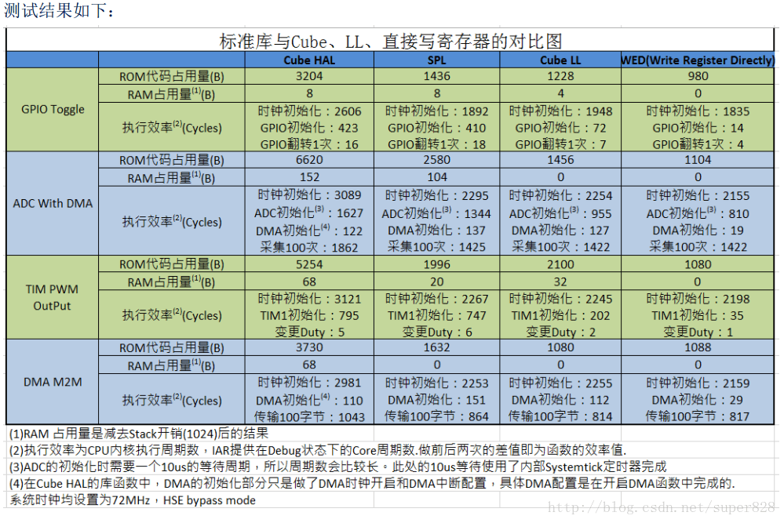

总的来说：代码效率与移植性成反比的规律是明显的。与HAL相比，LL的效率优势很明显，几乎和直接写寄存器的效率相差无几。而且目前STM32cubeIDE已经支持直接生成LL工程，对于追求效率的开发应用人员来说，非常值得推荐大家使用。


### GPIO操作

配置操作基本和前面的 HAL 一样，只有一处不同，驱动库选择 LL 库，如图所示：
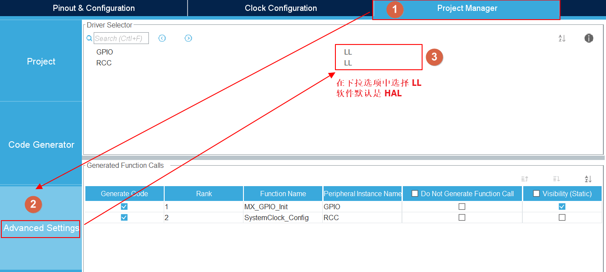

示例：
```
LL_GPIO_SetOutputPin(GPIOB, LL_GPIO_PIN_3); // PB3输出高电平
LL_GPIO_ResetOutputPin(GPIOB, LL_GPIO_PIN_3); // PB3输出低电平
LL_GPIO_TogglePin(GPIOB, LL_GPIO_PIN_3);    /* 翻转PB3输出电平
LL_GPIO_ReadInputPort(GPIO_TypeDef \*GPIOx);  /* 读取引脚电平状态 */

LL_mDelay(500); // ms延时，延时500ms
```
API详细使用请参考官方驱动描述手册：`Description of STM32F4 HAL and low-layer drivers`


## USART

不论是重定义和自定义printf函数，若想打印float类型，都需要再IDE中单独开启，否则无法打印，且额外占用内存 18 KB 左右。

http://begild.top/article/a854db16.html

### printf重定义

```c++
/* uart.c */
#ifdef __GNUC__
#define PUTCHAR_PROTOTYPE int __io_putchar(int ch) /* 防⽌重定义， 具体为什么会⽤到GNUC我以
为不知道*/
#else
#define PUTCHAR_PROTOTYPE int fputc(int ch, FILE *f)
#endif
PUTCHAR_PROTOTYPE{
    //LL_USART_TransmitData8(USART1,Usart1_TxBuff[i]);
    USART1->TDR = ch;
    //while(!LL_USART_IsActiveFlag_TXE(USART1));
    while((USART1->ISR&0X40)==0);
return ch;
}
/* main.c*/
printf("233\n"); /* 串⼝打印数据 */

### printf自己编写

/* uart.c */
#include "stdio.h"      //
#include "stdarg.h"        //
#include "string.h"     //
char Usart1_TxBuff[256];
void my_printf(char* fmt,...)
{
    unsigned int i,length;
    va_list ap;
    va_start(ap,fmt);
    vsprintf(Usart1_TxBuff,fmt,ap);
    va_end(ap);
    length=strlen((const char*)Usart1_TxBuff);
    while(!LL_USART_IsActiveFlag_TXE(USART1));
    //while((USART1->ISR&0X40)==0);
    for(i = 0; i < length; i ++)
    {
        
        LL_USART_TransmitData8(USART1,Usart1_TxBuff[i]);
        //USART1->TDR = Usart1_TxBuff[i];
        while(!LL_USART_IsActiveFlag_TXE(USART1));
        //while((USART1->ISR&0X40)==0);
    }
}
/* main.c*/
my_printf("233\n"); /* 串⼝打印数据 */
```
>备注：
1、知识点：va_list
3、自己编写 printf 函数比重定义节省 0.46 KB，但RAM增加了。

其他发送方法

1、只发送字符串数据

```c++
/* uart.c中定义 */
void USART_Print(unsigned char *Send_Text,uint32_t Size_Text)
{
  uint32_t index = 0;
 
  for (index = 0; index < Size_Text; index++)
  {
    while (!LL_USART_IsActiveFlag_TXE(USART1));
     LL_USART_TransmitData8(USART1,Send_Text[index]);
  }
  while (!LL_USART_IsActiveFlag_TC(USART1));
}
/* 使用 */
USART_Print("Ready for Tx\r\n",(uint32_t) sizeof("Ready for Tx\r\n") );
一般接受中断

/* stm32f0xx_it.c声明中断函数 */
void USART1_IRQHandler(void)
{
  /* USER CODE BEGIN USART1_IRQn 0 */
    USART_RxIdleCallback();
  /* USER CODE END USART1_IRQn 0 */
  /* USER CODE BEGIN USART1_IRQn 1 */
  /* USER CODE END USART1_IRQn 1 */
}
/* uart.c中定义 */
void USART_RxIdleCallback(void)
{
    uint8_t tmp;
    if(LL_USART_IsActiveFlag_RXNE(USART1)) //接收中断
    {
        tmp=LL_USART_ReceiveData8(USART1);   //读取出来接收到的数据
        LL_USART_TransmitData8(USART1,tmp);  //把数据再从串口发送出去
    }
}
/* uart.h声明 */
void USART_RxIdleCallback(void);
/* 使用 */
// main.c初始化使能接受中断
LL_USART_EnableIT_RXNE(USART1);
DMA接受中断


/* uart.c中定义 */
void USART_DMA_CONFIG(void)
{
    LL_DMA_SetPeriphAddress(DMA1, LL_DMA_CHANNEL_5, (uint32_t)(&USART1->RDR));// LL_USART_DMA_GetRegAddr(USART1->DR));
    LL_DMA_SetMemoryAddress(DMA1, LL_DMA_CHANNEL_5, (uint32_t)Usart1_RxBuff);
    LL_DMA_SetDataLength(DMA1, LL_DMA_CHANNEL_5, 255);
    LL_DMA_EnableIT_TC(DMA1, LL_DMA_CHANNEL_5);
    LL_DMA_EnableChannel(DMA1, LL_DMA_CHANNEL_5);
    LL_USART_EnableDMAReq_RX(USART1);
    LL_USART_EnableIT_IDLE(USART1);
}
void USART_RxIdleCallback(void)
{
    uint8_t cnt;
    if(LL_USART_IsActiveFlag_IDLE(USART1))
    {
        LL_DMA_DisableChannel(DMA1, LL_DMA_CHANNEL_5); //
        cnt = LL_DMA_GetDataLength(DMA1,LL_DMA_CHANNEL_5);
        u1_printf("data len is:%d\r\n",cnt);
        u1_printf("data rx is:%s\r\n",Usart1_RxBuff);
        LL_DMA_SetDataLength(DMA1, LL_DMA_CHANNEL_5, 255); 
        LL_DMA_EnableChannel(DMA1, LL_DMA_CHANNEL_5);
        LL_USART_ClearFlag_IDLE(USART1);
    }
}
/* uart.h声明 */
void USART_RxIdleCallback(void);
/* 使用 */
// main.c初始化DMA
USART_DMA_CONFIG();
```
>备注：
不可使用DMA3，会出现 "VDD VALUE" redefined 错误。
只要配置了DMA，延时函数LL_mDelay()失效

总结

## ADC

```c++
HAL_ADCEx_Calibration_Start(&hadc);
HAL_ADC_Start(&hadc);
uint16_t ADC_temp1=0;
HAL_ADC_PollForConversion(&hadc,10);
if(HAL_IS_BIT_SET(HAL_ADC_GetState(&hadc),HAL_ADC_STATE_REG_EOC))
    ADC_temp1=HAL_ADC_GetValue(&hadc);//0-4095
return ADC_temp1;
float updateTemperaturesFromRawValues(void)
{
static unsigned char temp_count = 0;
static unsigned long raw_temp_0_value = 0;

  temp_count++;
  raw_temp_0_value +=(ADC_Demo2()>>2);
  if(temp_count >= 16) // per 16 times 锛宑aculate once temp
  {
      temp_count = 0;
      current_temperature = analogtemp(raw_temp_0_value);
  }
  return current_temperature;
}
```


### 参考链接

https://zhuanlan.zhihu.com/p/133874308


 


 


