此文档适合已经系统学习过linux开发教程，后期用于参考，快速复习

# 嵌入式和单片机的区别

**较早的定义**
 - **英国电器工程师协会定义的：** 嵌入式系统（Embedded System），是一种“完全嵌入受控器件内部，为特定应用而设计的专用计算机系统”。
 - **行业定义：** 以应用为中心，计算机技术为基础，**软硬件可剪裁，适应应用系统对功能、成本、体积、可靠性、功耗严格要求的计算机系统**。
 - **个人总结**：除PC外的所有带有程序，可独立工作的系统都是嵌入式系统，包含单片机

**目前行业定义**
- 行业中普遍将两者区分开来，依据则是从软件上进行区分。

	
	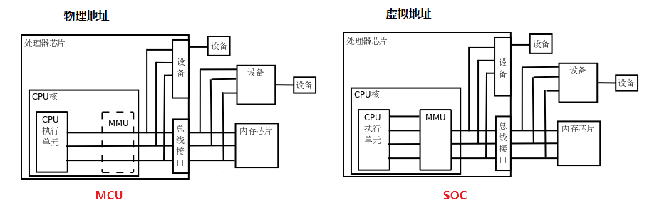
	
> CPU概念基本指中央处理器，微处理器都可以称为CPU
> MPU，和SOC概念模糊，不做区分，认为是一个

**参考资料**
- [CPU、MPU、MCU、SOC的区别（概念）](https://www.cnblogs.com/y4247464/p/12910642.html)
- [芯片名词对比](https://book.crifan.com/books/ic_chip_industry_chain_summary/website/ic_chip_summary/chip_names_compare.html)
- [嵌入式和单片机，是同一个东西吗？](http://www.xzclass.com/?p=464)
- [嵌入式Linux和stm32区别?之间有什么关系吗？](https://www.eet-china.com/mp/a125116.html)

## MMU（内存管理单元）

没有MMU，CPU执行单元发出的内存地址将直接传到芯片引脚上，被内存芯片接收，这称为物理地址（Physical Address）：

有MMU，CPU执行单元发出的内存地址将被MMU截获，从CPU到MMU的地址称为虚拟地址（Virtual Address），而MMU将这个地址翻译成另一个地址发到CPU芯片的外部地址引脚上，也就是将虚拟地址映射成物理地址：

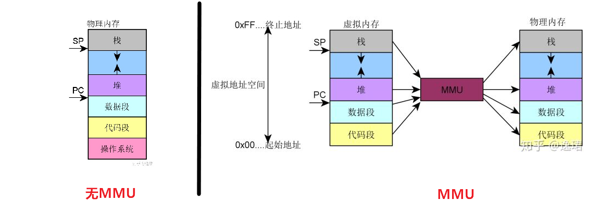

处理器一般有用户模式（User Mode）和特权模式（privileged Mode）之分。当CPU要访问一个VA（Virtual Address）时，MMU会检查CPU当前处于用户模式还是特权模式，访问内存的目的是读数据、写数据还是取指令执行，如果与操作系统设定的权限相符，则允许访问，把VA转换成PA，否则不允许执行，产生异常（Exception）。

**参考资料**
- [关于MMU那些事儿](https://zhuanlan.zhihu.com/p/137061978)
- [用于MCU/MPU的uCLinux与Linux有什么区别？](https://www.eet-china.com/mp/a11350.html)
- [arm-linux学习-（MMU内存管理单元）](https://www.cnblogs.com/alantu2018/p/9002309.html)
- [MMU原理](https://zhuanlan.zhihu.com/p/354142930)
- [arm-linux学习-（MMU内存管理单元）](https://www.cnblogs.com/alantu2018/p/9002309.html)

## 嵌入式软件

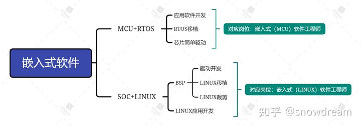
**参考资料**
- [嵌入式linux 和 用stm32进行的嵌入式开发 这两者之间有什么关联性吗？](https://www.zhihu.com/question/53880054/answer/164501004)

## STM32是否可以跑linux

操作系统有两种 用MMU的 和 不用MMU的
- 用MMU的是Windows MacOS Linux Android
- 不用MMU的是FreeRTOS VxWorks ucOS...

CPU有两种 带MMU的 和 不带MMU的
- 带MMU的有 Cortex-A系列 ARM9 ARM11系列
- 不带MMU的有 Cortex-M系列...

STM32是M系列...不可能运行Linux...（ucLinux不算Linux的...）
**在开发环境、程序开发上也都有很大区别，基本算是两种开发模式**

参考资料：
- [STM32是否可以跑linux](https://www.cnblogs.com/AI-Algorithms/p/3866586.html)

# 什么是linux

区分linux内核和linux操作系统
 - Linux严格来说是单指作业系统的内核。
 - 如今Linux常用来指基于Linux的完整操作系统，内核则改以Linux内核称之。

Linux内核由林纳斯·托瓦兹（Linus Torvalds）在1991年10月5日首次发布，在加上使用者空间的应用程序之后，成为Linux操作系统。除了一部分专家之外，大多数人都是直接使用Linux 发行版（Linux操作系统），而不是自己选择每一样组件或自行设置。
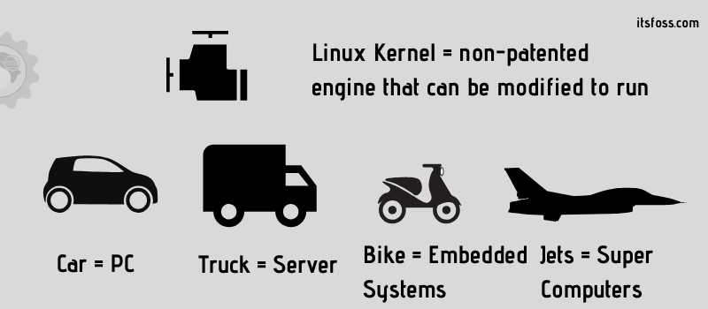
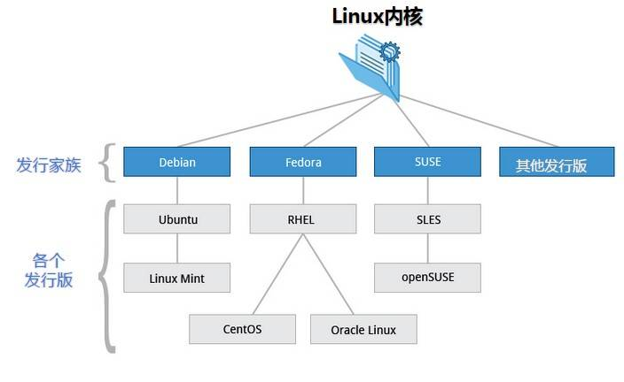

**参考资料：**
- [Linux 简介](https://www.runoob.com/linux/linux-intro.html)
- [Linux-wiki](https://zh.wikipedia.org/zh-hans/Linux)


# ubuntu安装与使用

开发板不涉及linux知识，使用ubuntu

1. ubuntu 系统安装：
	 - VirtualBox虚拟机。
2. ubuntu 系统系统使用：
	 - U盘支持(SD卡是2.0，推荐使用读卡器3.0接口)、增强扩展功能、分辨率、终端、Shell命令（命令行操作、大众用户都是图形操作）、APT下载源
	 - 更新本地数据库：sudo apt-get update
	- sudo apt-get install vim
	- vim /etc/vim/vimrc  ：`set ts=4   set nu`

## gcc -v
gcc编译器ubuntu自带，`gcc -v` 查看当前版本

`gcc [选项] [文件名字]`
选项如下：
- c： 只编译不链接为可执行文件，编译器将输入的.c 文件编译为.o 的目标文件。
- o：编译成可执行文件，默认编译出来的可执行文件名字为 a.out。
  \+  <输出文件名>指定编译结束以后的输出文件名

```
#include <stdio.h>
int main(int argc, char *argv[])
{
	printf("Hello World!\n");
}
```
	gcc main.c –o main.out
	./main.out

编译流程：
 1. 预处理（Preprocessing）：.c 文件中的文件包含（include）、预处理语句（e.g. 宏定义 define 等）进行分析，并替换成为真正的内容。
 2. 编译（Compilation）：生成 .s 汇编文件。
 3. 汇编（Assembly）：.生成以 .o 的目标文件。
 4. 链接（Linking）：多个.o文件、库文件链接成一个文件，变成可执行文件。
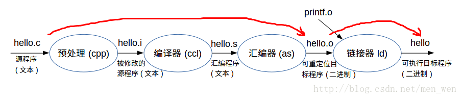

我们需要操作的步骤：.o 和可执行文件

## Makefile

多文件编译演示：
```
main.c
#include <stdio.h>
#include "input.h"
#include "calcu.h"

int main(int argc, char *argv[])
{
	int a, b, num;

	input_int(&a, &b);
	num = calcu(a, b);
	printf("%d + %d = %d\r\n", a, b, num);
}

input.c 

#include <stdio.h>
#include "input.h"

void input_int(int *a, int *b)
{
	printf("input two num:");
	scanf("%d %d", a, b);
	printf("\r\n");
}

#ifndef _INPUT_H
#define _INPUT_H

void input_int(int *a, int *b);
#endif

calcu.c 

#include "calcu.h"
int calcu(int a, int b)
{
 return (a + b);
}

calcu.h
#ifndef _CALCU_H
#define _CALCU_H

int calcu(int a, int b);
#endif
```
```
gcc main.c calcu.c input.c -o main
```

Makefile好处：
- 大量文件编译
- 只编译修改的文件
- 简便

新建Makefile
**命令列表中的每条命令必须以 TAB 键开始，不能使用空格！**
```
main: main.o input.o calcu.o
	gcc -o main main.o input.o calcu.o
main.o: main.c
	gcc -c main.c
input.o: input.c
	gcc -c input.c
calcu.o: calcu.c
	gcc -c calcu.c

clean:
	rm *.o
	rm main
```
自动化变量：
```
objects = main.o input.o calcu.o
main: $(objects)
	gcc -o main $(objects)

%.o : %.c
	gcc -c $<

clean:
	rm *.o
	rm main
```


# 裸机开发

## 开发环境

### FTP 服务（文件互传）

**Ubuntu安装**
`sudo apt-get install vsftpd` 安装。
`sudo vi /etc/vsftpd.conf`  取消下图两行语句注释
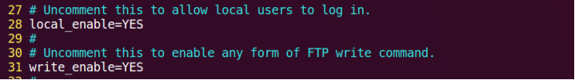
`sudo /etc/init.d/vsftpd restart` 重启FTP服务
**windows安装**
下载地址：https://www.filezilla.cn/download
新建站点，设置如下
地址通过 `ifconfig`获得，字符集修改未 UTF-8
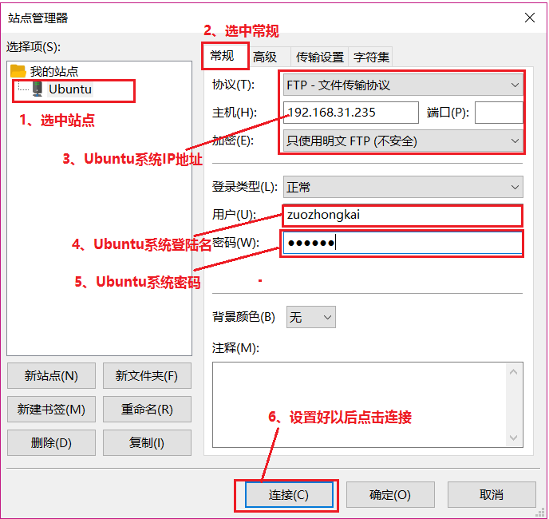

### NFS

sudo apt-get install nfs-kernel-server rpcbind
新建 linux->nfs 文件夹
sudo vi /etc/exports
文件后追加
`/home/用户名/linux/nfs *(rw,sync,no_root_squash)`
`sudo /etc/init.d/nfs-kernel-server restart` 重启服务

### SSH

`sudo apt-get install openssh-server`  开启服务
配置文件为/etc/ssh/sshd_config，使用默认配置即可。


### 交叉编译链安装

Linaro GCC 编译器：https://releases.linaro.org/components/toolchain/binaries/

选择7.5-2019.12，选择arm-linux-gnueabihf，单击 gcc-linaro-7.5.0-2019.12-x86_64_arm-linux-gnueabihf.tar.xz 下载

创建一个“tool”的文件夹：  `linux/tool`，存放开发工具（这里只是存放，安装在别的位置）。使用前面已经安装好的FileZilla将交叉编译器拷贝到Ubuntu中刚刚新建的“tool”文件夹中。

在Ubuntu中创建目录：`sudo mkdir /usr/local/arm`

进入tool目录，将交叉编译器复制到arm目录中
`sudo cp gcc-linaro-7.5.0-2019.12-x86_64_arm-linux-gnueabihf.tar.xz /usr/local/arm/ -f`
进入arm目录，解压：
`sudo tar -vxf gcc-linaro-7.5.0-2019.12-x86_64_arm-linux-gnueabihf.tar.xz`

修改环境变量，`sudo vi /etc/profile`
最后面输入如下所示内容：
`export PATH=$PATH:/usr/local/arm/gcc-linaro-7.5.0-2019.12-x86_64_arm-linux-gnueabihf/bin`

保存退出，重启Ubuntu系统，交叉编译工具链(编译器)就安装成功了。

安装相关库：`sudo apt-get install lsb-core lib32stdc++6`

验证：`arm-linux-gnueabihf-gcc -v`
注意，以下内容一定要有，特别是COLLECT_LTO_WRAPPER这一行。这一行没有的话，裸机编译可能没错，但是后面的uboot移植编译就会出错
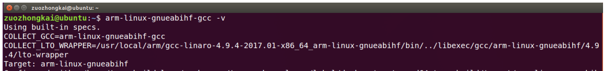

编译第一个裸机例程“1_leds”试试，在前面创建的linux文件夹下创建driver/board_driver文件夹，用来存放裸机例程
将第一个裸机例程“1_leds”拷贝到board_driver中，然后执行make命令进行编译，
```
lonly@lonly-VirtualBox:~/linux/driver/board_driver/1_leds$ make clean
rm -rf *.o led.bin led.elf led.dis
lonly@lonly-VirtualBox:~/linux/driver/board_driver/1_leds$ make
arm-linux-gnueabihf-gcc -g -c led.s -o led.o
arm-linux-gnueabihf-ld -Ttext 0X87800000 led.o -o led.elf
arm-linux-gnueabihf-objcopy -O binary -S -g led.elf led.bin
arm-linux-gnueabihf-objdump -D led.elf > led.dis
lonly@lonly-VirtualBox:~/linux/driver/board_driver/1_leds$ ls
imxdownload  led.bin  led.dis  led.elf  led.o  led.s  leds.code-workspace  load.imx  Makefile  SI
```
可以看到例程“1_leds”编译成功了，编译生成了led.o和led.bin这两个文件，使用如下命令查看led.o文件信息：
```
lonly@lonly-VirtualBox:~/linux/driver/board_driver/1_leds$ file led.o
led.o: ELF 32-bit LSB relocatable, ARM, EABI5 version 1 (SYSV), with debug_info, not stripped
```
可以看到led.o是32位LSB 的ELF格式文件，目标机架构为ARM，说明我们的交叉编译器工作正常

### vscode

图标都在目录/usr/share/applications 中，找到 Visual Studio Code 的图标，点击鼠标右键，选择复制到->桌面

**插件：**
- C/C++，这个肯定是必须的。
- C/C++ Snippets，即 C/C++重用代码块
-  C/C++ Advanced Lint,即 C/C++静态检测 。
-   Code Runner，即代码运行。
-   Include AutoComplete，即自动头文件包含。
-   GBKtoUTF8，将 GBK 转换为 UTF8。
-   ARM，即支持 ARM 汇编语法高亮显示。
-   compareit，比较插件，可以用于比较两个文件的差异。
-   DeviceTree，设备树语法插件。
-   TabNine，一款 AI 自动补全插件，强烈推荐，谁用谁知道！

### 串口驱动

### MobaXterm 

https://mobaxterm.mobatek.net
点击菜单栏中的“Sessions->New session”按钮，打开新建会话窗口
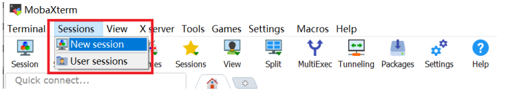
串口设置
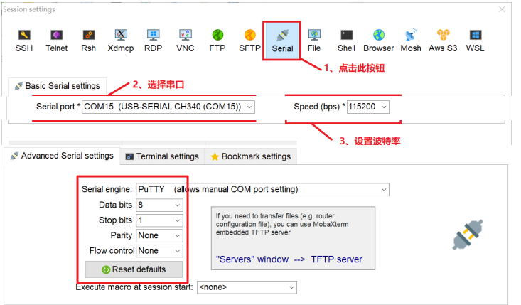


##  前置知识

A7架构和运行模式简单了解
汇编简单应用
- 其实 STM32 也一样的，一开始也是汇编，以 STM32F103 为例，启动文件startup_stm32f10x_hd.

## LED

### 汇编代码编写：

linux/driver/board_driver/01-leds

**程序烧录：**

`chmod 777 inxdownload` 权限
`ls /dev/sd*`查看设备
`./imxdownload led.bin /dev/sdd` 下载，速度几百KB/s 


# 以下内容为后期课程内容，待编写

# LInux系统移植

## U-Boot移植

uboot 移植的一般流程：
1. 在 uboot 中找到参考的开发平台，一般是原厂的开发板。
2. 参考原厂开发板移植 uboot 到我们所使用的开发板

1. 原版Uboot放松到ubuntu中，解压
```
tar -jvxf uboot-imx-rel_imx_4.1.15_2.1.0_ga.tar.bz2 
```
2. 原版编译烧录测试
创建sh文件
```
vim mx6ull_14x14_emmc.sh
```
填入内容：
```
#!/bin/bash
make ARCH=arm CROSS_COMPILE=arm-linux-gnueabihf- distclean
make ARCH=arm CROSS_COMPILE=arm-linux-gnueabihf- mx6ull_14x14_evk_emmc_defconfig
make V=1 ARCH=arm CROSS_COMPILE=arm-linux-gnueabihf- -j16
```
编译：
```
./mx6ull_14x14_emmc.sh
```
烧录：
```
chmod 777 imxdownload //给予 imxdownload 可执行权限
./imxdownload u-boot.bin /dev/sdd //烧写到 SD 卡中，不能烧写到/dev/sda 或 sda1 里面
```
3.  创建自定义配置文件
```
cd configs
cp mx6ull_14x14_evk_emmc_defconfig mx6ull_alientek_emmc_defconfig
```
修改内容
```
CONFIG_SYS_EXTRA_OPTIONS="IMX_CONFIG=board/freescale/mx6ull_alientek_emmc/imximage.cfg,MX6ULL_EVK_EMMC_REWORK"
CONFIG_ARM=y
CONFIG_ARCH_MX6=y
CONFIG_TARGET_MX6ULL_ALIENTEK_EMMC=y
CONFIG_CMD_GPIO=y
```
拷贝头文件
```
cp include/configs/mx6ullevk.h mx6ull_alientek_emmc.h
```
将
```
#ifndef __MX6ULLEVK_CONFIG_H
#define __MX6ULLEVK_CONFIG_H
```
改为：
```
#ifndef __MX6ULL_ALIENTEK_EMMC_CONFIG_H
#define __MX6ULL_ALIENTEK_EMMC_CONFIG_H
```

https://www.bilibili.com/video/BV1yD4y1m7Q9?from=search&seid=17466272019916726328
https://www.bilibili.com/video/BV1sJ41117Jd?from=search&seid=1145502530072362755
https://www.bilibili.com/video/BV12E411h71h?from=search&seid=5718148630492275519
https://www.bilibili.com/video/BV15W411m7AQ/?spm_id_from=333.788.recommend_more_video.1
https://www.bilibili.com/video/BV1qb4y127xc/?spm_id_from=333.788.recommend_more_video.0
https://www.cnblogs.com/lialong1st/p/11351095.html
https://0uyangsheng.github.io/2018/04/20/Build-Ubuntu-for-ARM-Platform-From-Scratch/
https://www.icode9.com/content-3-924261.html
https://wiki.t-firefly.com/zh_CN/ROC-RK3328-CC/flash_emmc.html
https://www.t-firefly.com/doc/download/page/id/34.html
https://www.t-firefly.com/doc/product/info/id/360.html
https://www.bilibili.com/video/BV19v411H7d3?p=13

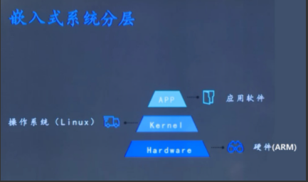

操作系统向下管理硬件（I/O，设备接口），向上提供接口（进程管理+文件IO+网络协议+数据库等，被APP软件调用）

Linux功能：
进程管理
内存管理（运存？）
网络协议
文件系统
设备管理（LED、键鼠、屏幕）
系统移植过程
windows系统                                           Linux系统
windows系统镜像、U盘启动盘            Linux内核镜像（需要裁剪移植）、SD卡启动盘（Uboot）
BIOS选择启动方式（U盘启动）          拨码开关选择启动方式（SD启动）
通过U盘中的引导程序安装系统           通过SD卡中的引导程序（Uboot）安装系统
安装驱动
安装应用
开发板启动过程
开发板上电后首先运行 SOC 内部 iROM 中固化的代码（BL0），这段代码先对基本的软银见环境（时钟等）初始化，然后检测拨码开关获取启动方式，再将对应存储器（SD卡）中的Uboot搬移到内存，然后跳转到uboot运行
uboot开始运行后首先对开发板软硬件环境初始化，然后将 linux内核、设备树（dtb） 、根文件系统（rootfs）从外部存储器（或网络）搬移到内存，然后跳转到linux运行
linux开始运行，先对系统环境初始化，当系统启动完成后，linux再从内存中（或网络）挂在根文件系统

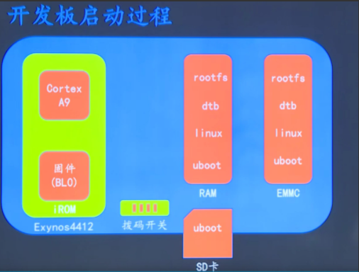
根据启动过程得出移植步骤：
uboot移植
linux内核移植（包含设备树）
根文件系统移植
开发环境准备
我们再linux系统中（安装再PC上的，一般是Ubuntu）编辑要移植的linux系统，然后再编译，最后生成一个安装包，再使用SD卡安装到开发板
注：后面说Ubuntu指安装在PC上的Linux系统，说Linux指要移植的linux系统

Ubuntu联网，下载文件机、开发板通信
tftp服务器环境搭建：基于网络通信协议（TCP/IP）在客户机（开发板）和服务器（PC）直接进行简单的文件传输
nfs环境搭建：基于网络通信协议（UDP/IP）在不同计算机之间通过网络进行文件共享，既可以在客户端（开发板）访问服务器（PC）文件，不需要频繁通过 tftp 先传输再访问

SD卡启动盘制作
选择SD卡启动，处理器上电默认从第一个扇区开始搬移到内存

uboot使用
uboot模式
自启动模式
uboot启动后若没有用户介入，倒计时结束后会自动执行自启动环境变量（bootcmd）中设置的命令（一般叫做加载和启动内核）
交互模式
倒计时结束前按下任意按键，uboot会进入交互模式，用户可输入uboot命令
     
	 
	

# linux内核

Linux是一个单体内核，支持真正的抢占式多任务处理（于用户态，和版本2.6系列之后的内核态[27][28]）、虚拟内存、共享库、请求分页、共享写时复制可执行体（通过内核同页合并）、内存管理、Internet协议族和线程等功能。

设备驱动程序和内核扩展运行于内核空间（在很多CPU架构中是ring 0），可以完全访问硬件，但也有运行于用户空间的一些例外，例如基于FUSE/CUSE的文件系统，和部分UIO[29][30]。多数人与Linux一起使用的图形系统不运行在内核中。与标准单体内核不同，Linux的设备驱动程序可以轻易的配置为内核模块，并在系统运行期间可直接装载或卸载。也不同于标准单体内核，设备驱动程序可以在特定条件下被抢占；增加这个特征用于正确处理硬件中断并更好的支持对称多处理[28]。出于自愿选择，Linux内核没有二进制内核接口[31]。

硬件也被集成入文件层级中。用户应用到设备驱动的接口是在/dev或/sys目录下的入口文件[32]。进程信息也通过/proc目录映射到文件系统[32]。

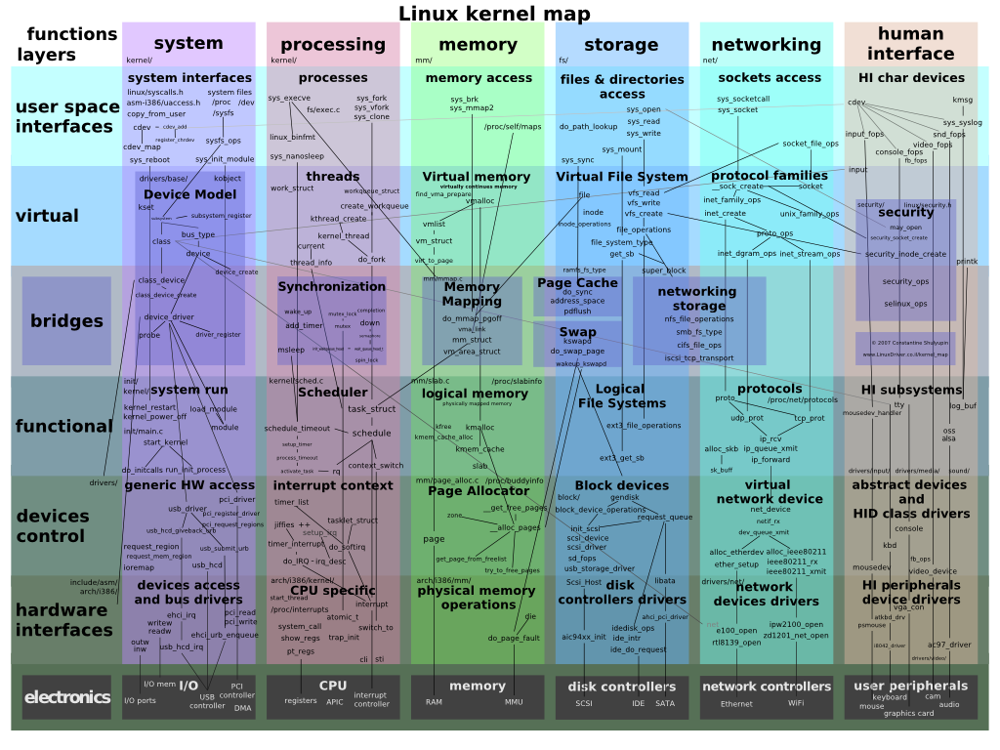

- [Linux内核-wiki](https://zh.wikipedia.org/wiki/Linux%E5%86%85%E6%A0%B8)
- [鸟哥linux第四版-基礎學習篇目錄 - for CentOS 7](https://linux.vbird.org/linux_basic/centos7/)

shell
- [Chapter 11 Shell 和 Shell Script](https://www.cyut.edu.tw/~ywfan/1109linux/201109chapter11shell%20script.htm)
- [Linux Shell 版本问题](https://achelous.org/BI-solutions/Linux_shell_version.html)
- [这些贝壳的插图哪一个是准确的？外壳是否仅通过外壳与内核对话？](https://www.reddit.com/r/linux4noobs/comments/kufgft/which_of_these_illustrations_of_the_shell_is/)
- https://imgur.com/a/VuvJ3dy
- [一篇文章從了解到入門shell](https://kknews.cc/code/3va5oq8.html)
- [Shell脚本是什么](http://c.biancheng.net/view/932.html)
- [Linux shell脚本](https://www.cnblogs.com/gd-luojialin/p/15028076.html)
- [Linux Shell程式設計及自動化運維實現——shell概述及變數](https://www.gushiciku.cn/pl/gLvW/zh-tw)
- [Bash 参考手册](https://www.gnu.org/software/bash/manual/bash.html)
- [bash (Bourne again shell)](https://www.techtarget.com/searchdatacenter/definition/bash-Bourne-Again-Shell)
- [什么是 Linux，为什么有 100 种 Linux 发行版？](https://itsfoss.com/what-is-linux/)
- [linux系统组成及结构](https://blog.csdn.net/kai_zone/article/details/80444872)

[Linux操作系统综述](https://blog.51cto.com/u_13800449/3049118)
[Linux系统组成.md](https://github.com/sunnyandgood/BigData)
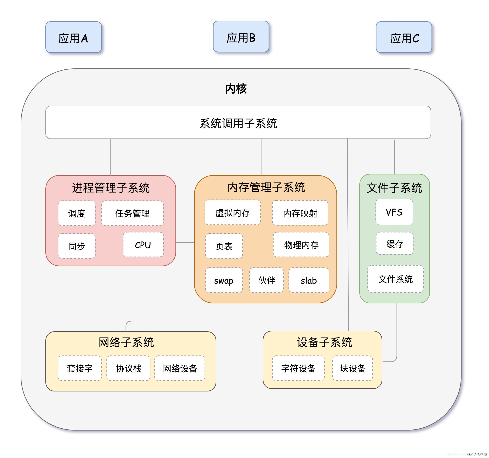


## 常用指令

<!--more-->


### SD开相关

查询设备
`ls /dev/sd*`

下载到SD卡
- imxdownload 复制到工程目录下
- 给与权限 `chmod 777 imxdownloa`

烧录到SD卡
`./imxdownload led.bin /dev/sdd`


重复执行上条命令的 4 种方法：
- 使用上方向键，并回车执行。（推荐）
- 按 Ctrl+P 并回车执行。（备选，有的命令上下键会没有，这个绝对会有）

## 串口连接
[MobaXterm]( https://mobaxterm.mobatek.net/) 

波特率根据不同开发板修改
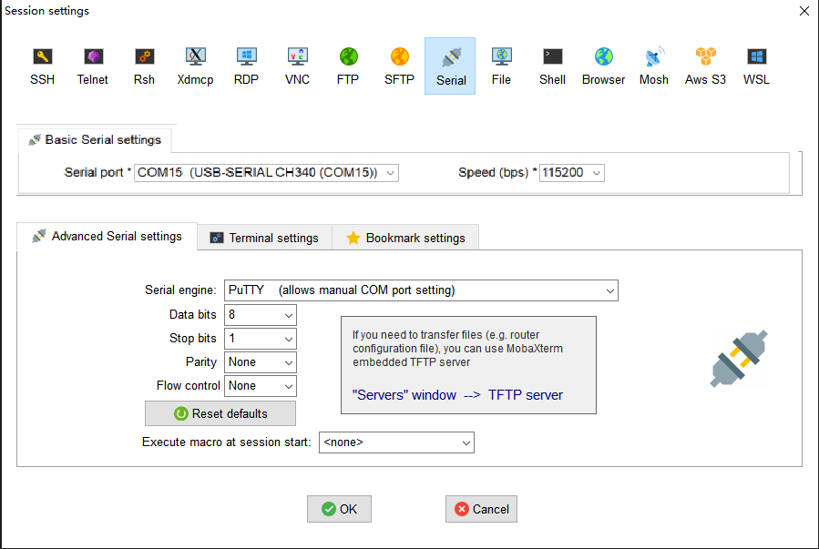

## uboot移植

### uboot编译

无uboot源码，跳过次步骤，直接进入uboot下载
首先在 Ubuntu 中安装 ncurses 库， 否则编译会报错，安装命令如下：
`sudo apt-get install libncurses5-dev`

ubuntu新建文件夹，拷贝开发板厂商的uboot到其中，例如正点原子的：uboot-imx-2016.03-2.1.0-ge468cdc-v1.5.tar.bz2
解压：
`tar -vxjf uboot-imx-2016.03-2.1.0-g8b546e4.tar.bz2`
新建 shell脚本文件 `mx6ull_alientek_emmc.sh`
输入如下内容(正点原子EMMC版本)：
```
1 #!/bin/bash
2 make ARCH=arm CROSS_COMPILE=arm-linux-gnueabihf- distclean
3 make ARCH=arm CROSS_COMPILE=arm-linux-gnueabihf- (加空格)
mx6ull_14x14_ddr512_emmc_defconfig
4 make V=1 ARCH=arm CROSS_COMPILE=arm-linux-gnueabihf- -j12
```
给与shell文件权限：
```
chmod 777 mx6ull_alientek_emmc.sh
```
编译
`./mx6ull_alientek_emmc.sh`

### uboot烧写

将 imxdownload 文件复制到uboot.bin 同级目录中
```
chmod 777 imxdownload //给予 imxdownload 可执行权限，一次即可
./imxdownload u-boot.bin /dev/sdd //烧写到 SD 卡，不能烧写到/dev/sda 或 sda1 设备里面！
```

>烧写速度在几百 KB/s 以下那么就是正常烧写。如果这个烧写速度大于几十 MB/s、甚至几百 MB/s 那么肯定是烧写失败了！

### uboot配置

修改环境变量
```
setenv bootdelay 5
saveenv
```

有空格的环境变量用单引号括起来
```
etenv bootargs 'console=ttymxc0,115200 root=/dev/mmcblk1p2 rootwait rw'
saveenv
```

#### 设置网络

dhcp 命令:自动获取ip地址,不用设置下面的ipaddr


 - ipaddr 开发板 ip 地址，可以不设置，使用 dhcp 命令来从路由器获取 IP 地址。
 - ethaddr 开发板的 MAC 地址，一定要设置。不同开发板地址要不同
 - gatewayip 网关地址。
 - netmask 子网掩码。
 - serverip 服务器 IP 地址，也就是 Ubuntu 主机 IP 地址，用于调试代码。

```
setenv ipaddr 192.168.1.50
setenv ethaddr b8:ae:1d:01:00:0
setenv gatewayip 192.168.1.1
setenv netmask 255.255.255.0
setenv serverip 192.168.1.253
saveenv
```

#### nfs网络传出镜像和设备树到DRAM中
`nfs [loadAddress] [[hostIPaddr:]bootfilename]`

下载(uboot操作):
`nfs 80800000 192.168.1.253:/home/zuozhongkai/linux/nfs/zImage`
