# 文档简介

 
|  版本   |  修改内容   |   完成日期  |  编制   |  审核   |  
| --- | --- | --- | --- | --- |
| V1.0    |   初始版本  |   20220715  |   潘良辉 |    | 

<!--more-->
___

# 电源板
- 直流点火，增加并联一路MOS，增加温控开关
- 富集加热60V标签修改+添加接口（之前漏画）
- 200V增加RC滤波
> 5V直流点火电路是否需要更改？

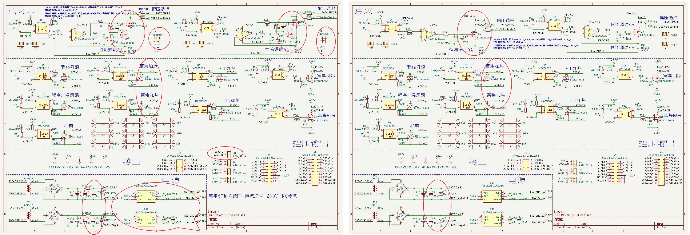
  
# 前放板

- 删除滤波电路放大电阻、仅滤波

  
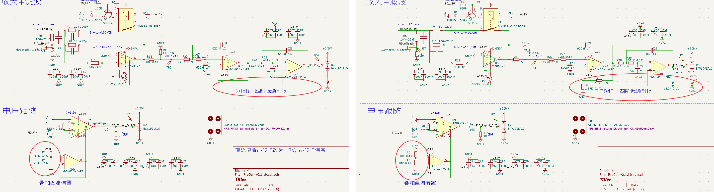

# 一次修改

比对原理图2版与1版不同
- 1版由赵玲宝、刘洋、牛运晨审核
- 2版修改时，又由刘洋、牛运晨再审核，形成最终的2版

# 主控板

## 主控电源板

主控电源独立成一个板子，统一给主控板供电
> LC滤波电感和电容值如何去确定？滤波频率是多少？

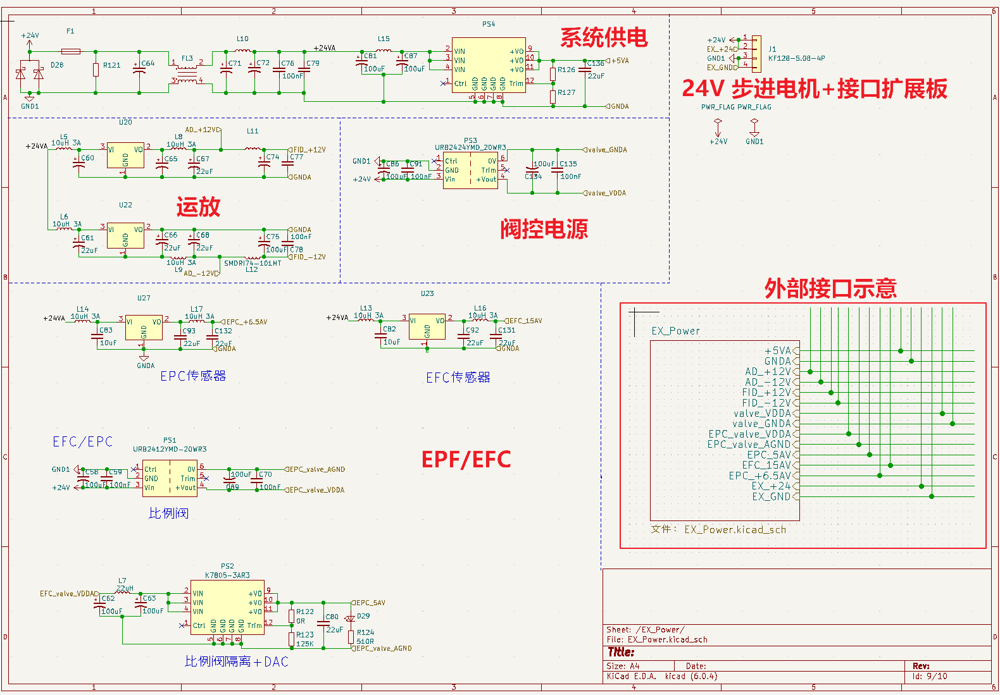

>**这里为了便于查看对比，理清各部分关系，电源板的原理图并未从主控板工程中独立出去，3版会单独绘制一个工程文件**

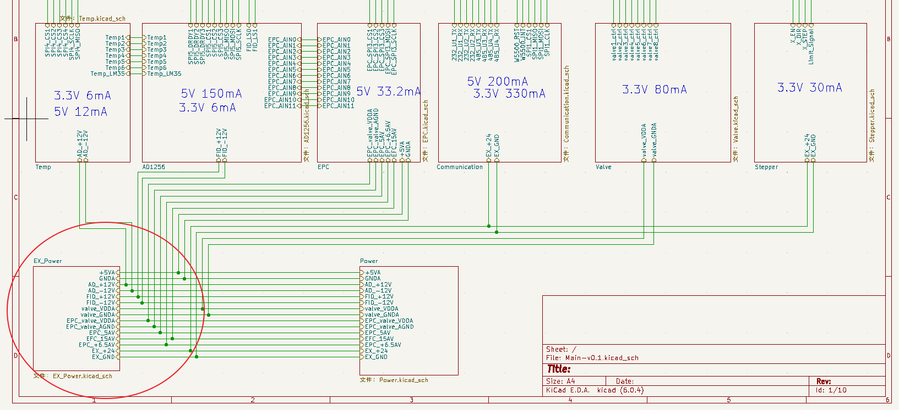

## MCU
 - 增加预留扩展接口
 - 开门狗复位电路修改
 - 完善MCU接口
   
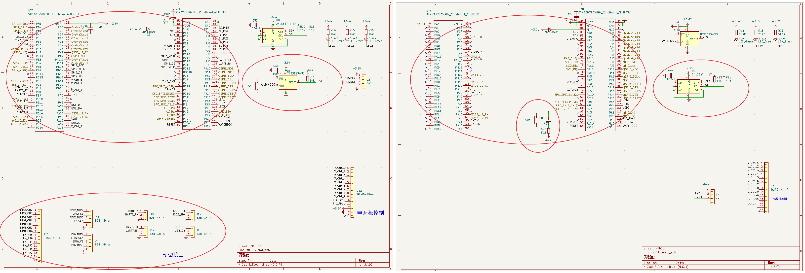

## Communication
- 全部改为金升阳模块通信
- 增加W5500通信接口
- 增加一路232、一路484（对外通信）
- 删除原电路的接口扩展部分，独立成通信板（还未画），使用内部485通信（是否使用CAN通信？）
  
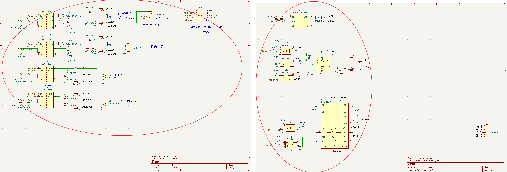
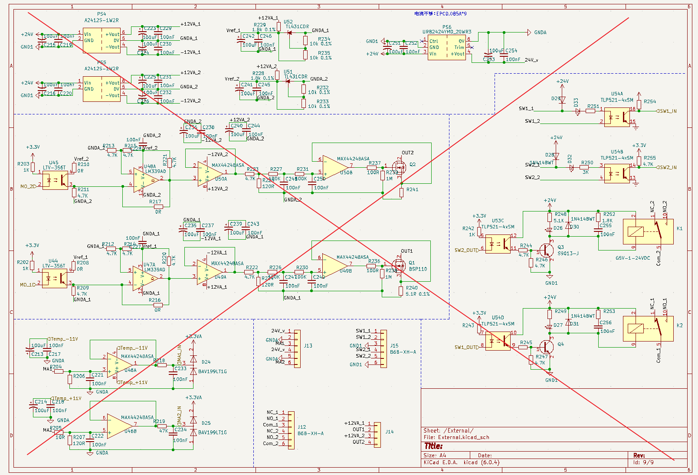

## EPC
- 删除并精简电源部分，由外部电源板供电
- 增加一路EFC
- SI8440接线方式修改
- 部分标签修改
  
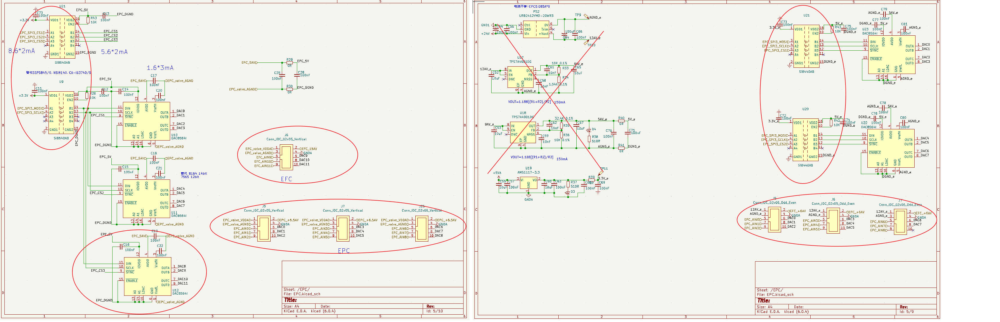
## valve
- 删除24V电源部分，由外部电源板供电
- 
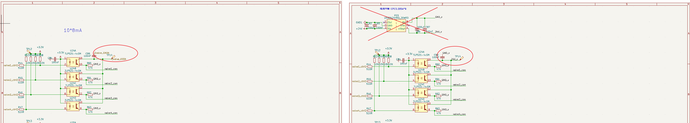

## temp
- 删除4路ad620热电偶测温，改为MAX31855测温
- 3.3V参考电压改为运放跟随
- AD620电源改为12V，由外部电源板供电
 
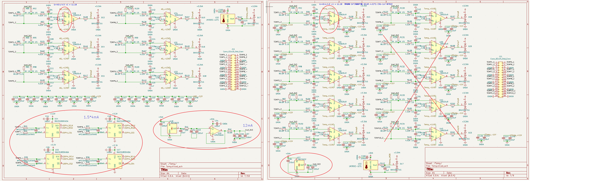

## ADS1256

 - 前放板运放电源改为12V，由外部电源板供电
 - ADS1256部分标签修改调整
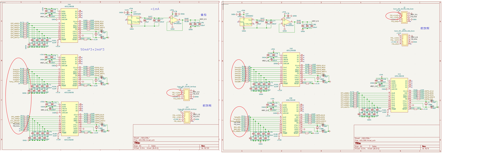

## Stepper
- 增加步进电机驱动电路

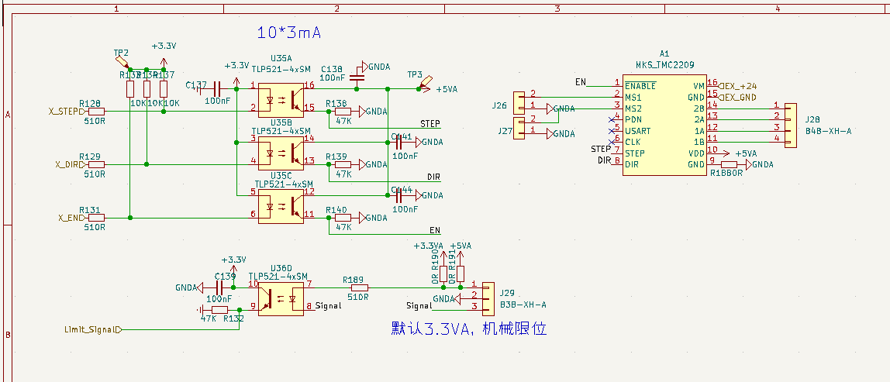

# 三次修改
