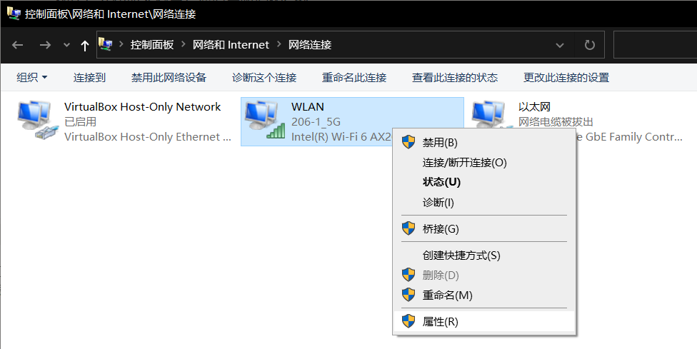

# 1. 电脑无法进入睡眠模式
**问题：**
以前电脑进入睡眠模式后，键盘灯会熄灭，主板上的风扇和灯也会灭。但最近屏幕熄灭后，但键盘灯却不灭了且电脑风扇和灯还在运行

**原因解决：**
刚下载了UU加速器，里面有个选项 `手动休眠不断网`导致的，在软件设置->系统设置里关闭即可。

<!--more-->

# WIN10卸载搜狗后语言栏仍有残留解决方案

https://blog.csdn.net/m0_47005349/article/details/115551801

# WLAN没有有效的IP分配

之前都是正常上网，就这两天开始开机后可以连上wlan，但是无internet。然后我就一直试疑难解答，它只能显示出问题：wlan没有有效的IP配置。

## 修复1 –重置TCP / IP(没效果)
1. 搜索 指令 在Windows 10任务栏搜索框中。
2. 右键单击 指令 图标，然后选择 以管理员身份运行 

3.在命令提示符窗口中，只需复制并粘贴以下给定的命令，然后按Enter键即可执行该程序。
`netsh winsock reset `
4.现在，复制并粘贴下面给出的命令并执行它。
`netsh int ip reset`
现在，关闭命令窗口，然后重新启动PC。
## 修复2 –手动设置IP地址(有效)
1. 右键点击 在您的WiFi适配器上，然后选择 属性 。

2. 选择 Internet协议版本4（TCP / IPv4） 然后点击 属性 。IP地址改为手动设置，IP地址不要和已有的冲突。
默认网关一般是：192.168.1.1，我这里不太一样。
可以手机连接WiFi，在手机的WiFi详细信息里查看到默认网关地址

# Win10新版输入法使用

## 模糊拼音

模糊拼音通俗理解，就是当你有输错的拼音时，输入法会自动予以纠错，并给出正确的候选词。

在微软输入法的设置面板中，你能看到两个与之相关的开关，其中“智能模糊拼音”是由输入法自动识别输错的拼音串，而“模糊拼音”则将选择权交给用户，以防止一些特殊输入被输入法错误纠正。

## u模式

U模式总共包含三种模式，分别是笔画输入、拆分输入、符号输入。输入u时输入法本身也会有提示，见上图。

使用前首先输入“u”进入U模式，然后按照相关规则打出生僻字即可。比如“犇”只要按顺序敲入代码“u”、“niu”、“”niu、“niu”即可输出，“淼”也是。

此外u模式还支持一些特殊的指令，比如 **“dw”代表单位符号、“ts”代表特殊符号、“bd”代表标点符号 ** 等等，输入前需要在字符串前面敲入两个“uu”作为前缀即可

## V模式
和U模式不同，V模式更多是用来搞定一些变量录入，比如时间显示转换、日期显示转换、数字小写转大写等等。
它的用法和U模式很像，也要在具体输入前以“V”开头，比如数字大小写转换就是v123：一百二十三，日期显示转换就是v2019.5.25：二〇一九年五月二十五日等等。

## 人名模式

第三方输入法大都支持人名模式，而这项功能在Win10中则是以快捷键切换的，比如你要输入的名字在默认候选区中没有，那么就可以点击** “;“+”r”  **直接切换到人名模式。
切换完成后，所有候选词都是与拼音串一致的人名组合，比如“刘雪”、“刘学”、“刘靴”等等。

## 专业词典

如果日常工作中，需要经常使用一些专业词库，那么可以进入设置面板开启对应的专业词库，这一点和第三方输入法同样没有两样。

开启后系统会在候选区展示这些专业词，当然这项功能尽量按需开启，一来输入法的工作效率更高，二来候选词的弹出也会更为精准。

## emoji、颜文字与符号面板

1、直接点击书法候选框最右侧表情符号

2、快捷键："Win + ." 或 "Win + ;" ，中英文你输入时都有效。但有个缺点按任意按键就消失了，无法固定。

## 图标显示问题
1、[win10下怎样设置的输入栏M图标和中英文输入提示](https://blog.csdn.net/SNK1992/article/details/79482003)，by CSDN-SNK1992   
2、[win10怎样修改右下角输入法的图标？](https://www.zhihu.com/question/37393684)，by 知乎  
3、[win10输入法任务栏M图标如何删除](https://jingyan.baidu.com/article/e9fb46e1228ca47521f766e0.html)，by 百度经验-www想想想  
4、[管理 Windows 10 中的输入语言设置和显示语言设置](https://support.microsoft.com/zh-cn/help/4496404/windows-10-manage-the-input-and-display-language#display_language)，by Microsoft  

## 参考链接：
1、[第三方拜拜 Win10新版输入法竟然这样好用](https://www.pconline.com.cn/win10/1263/12635657.html#ad=8385)，by PConline-幼儿园里的轩爸
2、[Win10如何快速输入“表情/颜文字/符号”](https://www.windows10.pro/input-emoji-kaomoji-symbols/)，by Windows10.Pro

