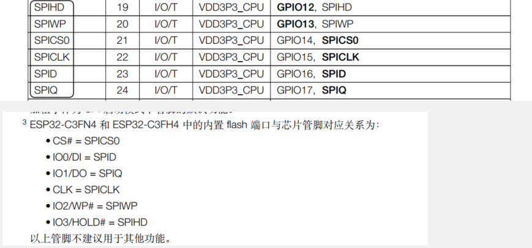
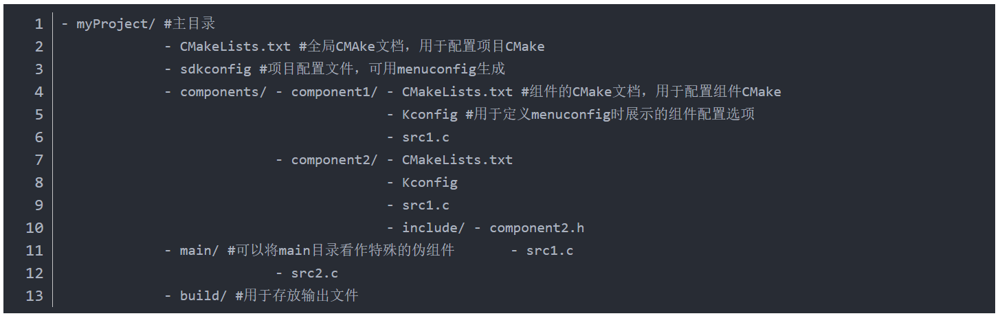
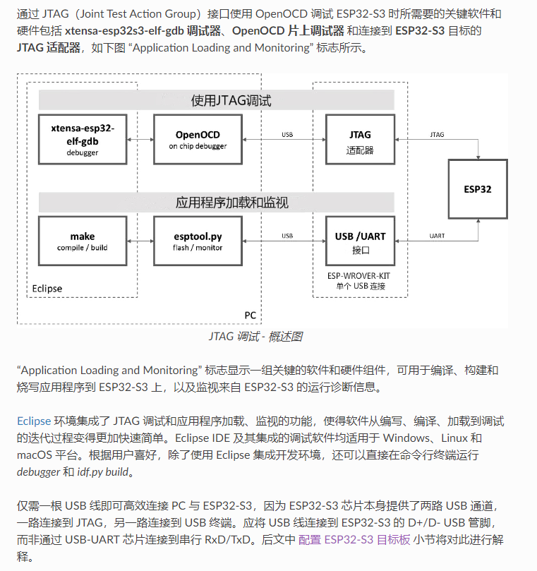
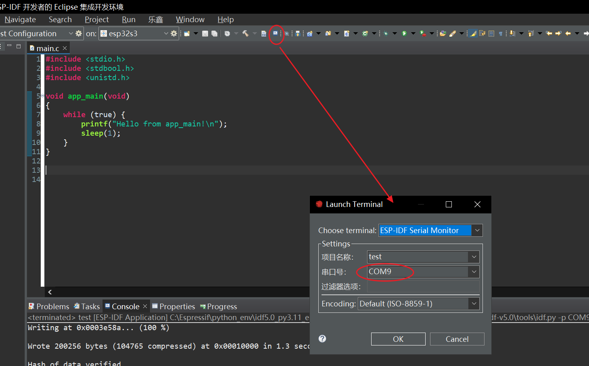
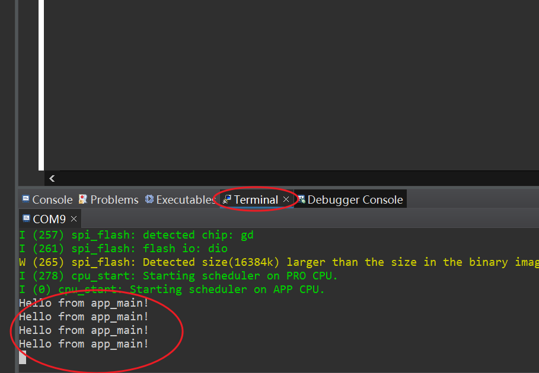
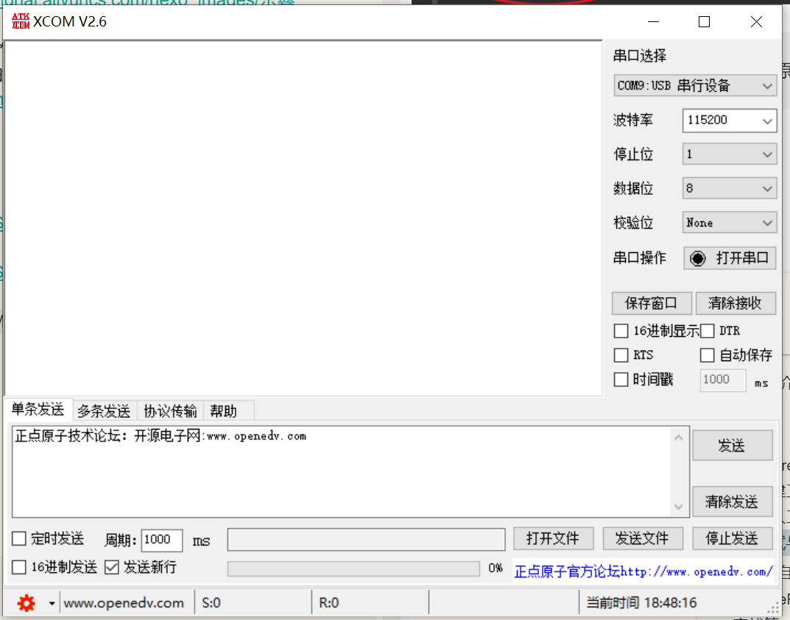
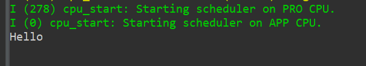
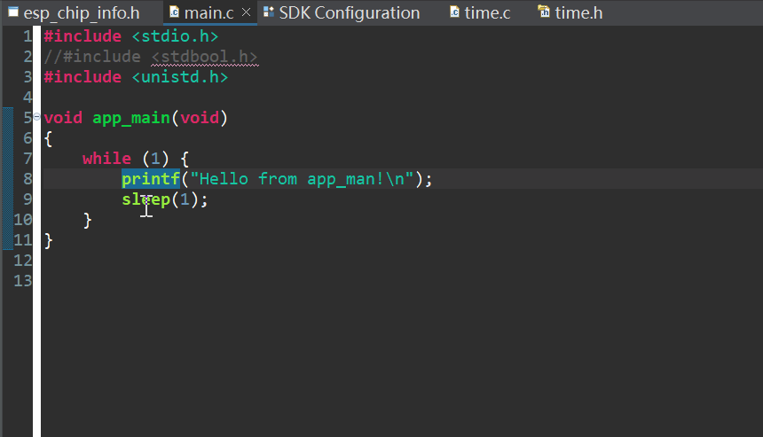

个人教程，第一次制作，有配套视频教程，bilibili个人空间：[合集和列表](https://space.bilibili.com/94050349/channel/series)，文章章节顺序和列表一致。

<!--more-->
# 内容简介

本手册将由浅入深，带领大家学习 ESP32-S3-WROOM-1-N16R8模组（ESP32-S3） 的各个功能，为您开启 ESP32-S3 的学习
之旅。本手册总共分为三篇： 

 1. 硬件篇：主要介绍本手册配套的硬件平台（开发板）；
 2. 软件篇：主要介绍ESP32-S3常用开发软件的使用以及一些下载调试的技巧，并详细介绍了几个常用的系统文件（程序）；
 3. 实战篇，主要通过 n 个实例（绝大部分都是使用 EDP-IDF 库完成的）带领大家一步步深入了解 ESP32-S3。

本手册为 ESP32-S3-WROOM-1-N16R8模组的配套教程，有详细原理图以及所有实例的完整代码，这些代码都有详细的注释，所有源码都经过我们严格测试，不会有任何警告和错误，另外，源码有我们生成好的 hex 文件，大家只需要通过仿真器下载到开发板即可看到实验现象，亲自体验实验过程。

本手册不仅非常适合广大学生和电子爱好者学习  ESP32-S3-WROOM-1-N16R8模组，其大量的实验以及详细的解说，也是公司产品开发的不二参考

# 前言 

## 01-开发板

使用[源地ESP32-S3核心板](https://item.taobao.com/item.htm?spm=a230r.1.14.1.283f2d6cAjCT7l&id=669443108979&ns=1&abbucket=6#detail)
也可以购买复刻版：[ESP32 S3核心板](https://item.taobao.com/item.htm?_u=fpkffgdda1e&id=695554257902)

N16R8（16M 外扩flash/8M PSRAM）/双Type-C USB口/W2812 rgb/高速USB转串口


## 02-模组资料：模组和芯片关系

简单来说，模组包含芯片，是一个最小系统，我们只需要模组供电，并引出引脚等，就构成了开发板。


如下图所示，单独的芯片时不能直接工作的，还需要外接晶振、Flash（基本所有的ESP32都是没有内部flash的，都需要外接flash工作）等才能正常工作


## 02-资料获取

牢记：官网是最佳的学习渠道

- [官方技术文档下载中心](https://www.espressif.com.cn/zh-hans/support/documents/technical-documents)

以下是从官网提取的关于S3芯片的几个重要文档，其它文档（如硬件设计指南等）请去上面文档中心下载
- [ESP32 S3芯片技术规格书](https://www.espressif.com/sites/default/files/documentation/esp32-s3_datasheet_cn.pdf)
- [ESP32-S3 芯片技术参考手册](https://www.espressif.com/sites/default/files/documentation/esp32-s3_technical_reference_manual_cn.pdf)
 - [ESP32-S3-WROOM-1 模组技术规格书](https://www.espressif.com/sites/default/files/documentation/esp32-s3-wroom-1_wroom-1u_datasheet_cn.pdf)

另外还有一个最重要的在线文档：
- [ESP-IDF 编程指南](https://docs.espressif.com/projects/esp-idf/zh_CN/latest/esp32s3/index.html)
- pdf格式文档-英文：[下载](https://docs.espressif.com/projects/esp-idf/en/latest/esp32s3/esp-idf-en-v5.1-dev-3619-g57b6be22a7-esp32s3.pdf)

推荐访问在线文档，该文档随时都会更新。另外轻易英文内容为准，中文的可能有翻译错误和更新延迟。

官方开发板资料：（产品开发参考，初学者不用看）
- [ESP32-S3-DevKitC-1](https://docs.espressif.com/projects/esp-idf/zh_CN/latest/esp32s3/hw-reference/esp32s3/user-guide-devkitc-1.html)
- [ESP32-S3-BOX](https://github.com/espressif/esp-box)
- [ESP32-S3-EYE](https://github.com/espressif/esp-who/blob/master/docs/en/get-started/ESP32-S3-EYE_Getting_Started_Guide.md)
- [ESP32-S3-Korvo-1](https://github.com/espressif/esp-skainet/blob/master/docs/en/hw-reference/esp32s3/user-guide-korvo-1.md)
- [ESP32-S3-Korvo-2](https://docs.espressif.com/projects/esp-adf/zh_CN/latest/get-started/user-guide-esp32-s3-korvo-2.html)

## 03-例程创建和项目文件结构介绍


 - 新建工程
	- 示例
	- 默认
	- 文件夹介绍（基本）
	- ESP IDF介绍
	- RTOS

## 04-GPIO引脚介绍

参考资料：
- ESP32­S3­WROOM 技术规格书
- ESP32-S3 系列芯片 技术规格书

我们已经知道芯片模组是在芯片基础上添加外设得来的。所以其中的部分引脚是被外设芯片占用了，是无法使用的。
参考下列芯片和模组引脚对比，我们可以发现
- 模组少了GPIO26-32，GPIO33-34引脚
我们从芯片引脚介绍得知，GPIO26-32用于内部falsh/PSRAM通信
另外我们在模组的最下面介绍也得知：在带有 OSPI PSRAM（即内置芯片为 ESP32-S3xxR8）的模组中，管脚 IO35、 IO36、 IO37 用于连接至模组内部集成的 OSPI PSRAM，不可用于其他功能
- 部分引脚只能作为单输入、输出的。GPIO39、41、42、44只能输入、无高阻态
 GPIO26、29、30、40、43、47、48只能输出，其中43无高阻态
- 当WIFI一致保持连接时，ADC2不可用

我们可以继续查看下面的关系表，可以发现
- 对于八线SPI（内置R8 PSRAM），GPIO26-37都不可使用
- 对于八线已下的，GPIO26-32都不可使用

那么GPIO22-34引脚去哪了呢，查看模组原理图，发现
- GPIO22-34官方并没有被引出来
所以如果我们使用的是八线以下的falsh/PSRAM，那么这两个引脚就被浪费了，所以我们自己设计模组时，是可以使用这两个引脚的，这样就相对于官方模组额外多了两个引脚（仅限八线以下的falsh/PSRAM）


另外我们还要看另一组特殊的IO口，Strapping 管脚 。
- GPIO0
- GPIO45
- GPIO46
- GPIO3
芯片每次上电或复位时，都需要一些初始配置参数，如加载芯片的启动模式、 flash 存储器的电压等。这些参数通过 strapping 管脚控制。复位放开后， strapping 管脚和普通 IO 管脚功能相同。
芯片复位时， strapping 管脚在复位时控制以下参数：
• 芯片启动模式 – GPIO0 和 GPIO46
• VDD_SPI 电压 – GPIO45
• ROM 代码日志打印 – GPIO46
• JTAG 信号源 – GPIO3
总之请确保这些引脚在上电时，都能处于默认配置值。


**总结：**
- 对于八线SPI（内置R8 PSRAM），GPIO26-37都不可使用
- 对于八线以下的，GPIO26-32都不可使用
- Strapping 管脚上电保持默认值
- 使用USB下载时，软件会自动复位芯片，并进入boot下载模式。GPIO0不要有外部上拉，否则无法自动下载
- GPIO22-34在官方模组中并没有被引出来
- EN引脚，上拉，上电使能芯片

### ESP32 C3

对于内置flash版本的，以下引脚不可用

GPIO11不可用

GPIO2、8、9为 strapping 管脚，GPIO9 内部默认弱上拉
- 实测GPIO2悬空也能用，但最好外部上拉
- GPIO8必须外部上拉，否则无法进入boot下载模式


## 05-IO MUX 和 GPIO 交换矩阵

ESP32-S3 芯片有 45 个物理通用输入输出管脚 (GPIO Pin)。每个管脚都可用作一个通用输入输出，或连接一个
内部外设信号。利用 GPIO 交换矩阵、IO MUX 和 RTC IO MUX，可配置外设模块的输入信号来源于任何的 GPIO
管脚，并且外设模块的输出信号也可连接到任意 GPIO 管脚。这些模块共同组成了芯片的输入输出控制。
>注意：这 45 个物理 GPIO 管脚的编号为：0 ~ 21、26 ~ 48。这些管脚既可作为输入又可作为输出管脚。

### GPIO 交换矩阵特性

 - GPIO 交换矩阵是外设输入输出信号和 GPIO 管脚之间的全交换矩阵；
 - 175 个数字外设输入信号可以选择任意一个 GPIO 管脚的输入信号；
 - 每个 GPIO 管脚的输出信号可以来自 184 个数字外设输出信号的任意一个；
 - 支持输入信号经 GPIO SYNC 模块同步至 APB 时钟总线；
 - 支持输入信号滤波；
 - 支持 Sigma Delta 调制输出 (SDM)；
 - 支持 GPIO 简单输入输出。

### IO MUX 特性

• 为每个 GPIO 管脚提供一个寄存器 IO_MUX_GPIOn_REG，每个管脚可配置成：
– GPIO 功能，连接 GPIO 交换矩阵；
– 直连功能，旁路 GPIO 交换矩阵。
• 支持快速信号如 SPI、JTAG、UART 等可以旁路 GPIO 交换矩阵以实现更好的高频数字特性。所以高速信号会直接通过 IO MUX 输入和输出

### RTC IO MUX 特性
• 控制 22 个 RTC GPIO 管脚的低功耗特性；
• 控制 22 个 RTC GPIO 管脚的模拟功能；
• 将 22 个 RTC 输入输出信号引入 RTC 系统


### 总结
- GPIO 交换矩阵就是说所有的外设都可以映射到设疑引脚，但有的速度可能会慢些
- IO MUX 特指GPIO功能和部分外设直连。不经过GPIO交换矩阵，速度快，性能好，但只支持部分外设（目前只有SPI和UART）
- RTC与低功耗和模拟输入输出有关，和IO MUX平级
- 在设计时，优先使用IO MUX引脚功能，在使用GPIO 交换矩阵
- 在程序编程时，软件会自动匹配，无需配置IO MIX和GPIO矩阵

以下有两张表说明GPIO 交换矩阵和IO MUX 区别
IO MUX管教表格就说明引脚的一般功能，非常类似于一般STM32的引脚图，这里的功能0-4说的就是引脚的不能复用功能，不需要经过内部的GPIO矩阵，速度快，性能好
ESP32­S3 技术参考手册：


外设管脚分配表，说明除了ADC、触摸、SPI0/1 外设，其它的外设都可以映射到任意引脚
ESP32-S3 系列芯片 技术规格书


# 环境篇

## Espressif-IDE简介与安装

### 简介

Espressif IDE 是乐鑫基于 Eclipse CDT，专为乐鑫物联网开发框架 ESP-IDF 打造的独立集成开发环境 (Integrated Development Environment, IDE)，支持用户使用 ESP-IDF 实现端到端物联网应用开发。

Espressif IDE 附带最新的 ESP-IDF Eclipse 插件、基本的 Eclipse CDT 插件、OpenOCD 插件以及其他来自 Eclipse 平台的第三方插件，以支持构建 ESP-IDF 应用程序。


ESP IDF 是乐鑫官方推出的物联网开发框架（类似标准库或HAL库）

**Espressif IDE 的主要特性**
 - 在 Eclipse CDT 环境下构建，易于使用
 - 专为 ESP-IDF 应用程序开发而打造
 - 集成编译所需的 ESP 工具链配置
 - 可自动配置编译环境变量
 - 提供新建项目向导以及 ESP-IDF 快速入门模板
 - 具备领先的的编辑、编译以及语法着色功能
 - 配有预建的函数头和函数定义导航
 - 支持安装一个全新的 ESP-IDF 或是配置现有的 ESP-IDF
 - 可直接从 IDE 中安装和配置 ESP-IDF 工具
 - 配有用于项目设置的 SDK 配置编辑器
 - 集成 CMake 编辑器，用于编辑 CMake 文件，如 CMakeLists.txt
 - 支持基于 CMake 的编译系统
 - 支持通过 UART 和 JTAG 烧录
 - 支持自定义的 ESP-IDF OpenOCD 调试功能，包含预配置和设置
 - 支持 GDB 硬件调试
 - 集成 ESP-IDF 串行监视器，用于查看程序的串行输出
 - 配备预置编译环境变量的 ESP-IDF 终端
 - 配备应用程序大小分析编辑器，用于分析应用程序的静态内存使用情况
 - 支持堆分析，用于进行内存分析并发现内存泄漏
 - 支持 Panic 模式下 GDB Stub 调试
 - 提供应用层跟踪，以便使用启动和停止命令，分析程序行为
 - 支持 ESP32、ESP32-S2、ESP32-S3 和 ESP32-C3 系列芯片
 - 支持中英文
 - 具备可扩展性，适用于 Eclipse 生态体系中的其他第三方插件
 - 支持 Windows、macOS 和 Linux 操作系统

Espressif-IDE 离线安装器，集成了 OpenJDK、Python、CMake、Git、ESP-IDF、Eclipse IDE、IDF Eclipse 插件及相关构建工具，类似与Keil。

### 下载

下载：[Espressif-IDE 离线安装器](https://dl.espressif.cn/dl/esp-idf/?idf=4.4) 
如果上述链接失效，可按下述方法找到：
1. 进入[ESP-IDF 编程指南](https://docs.espressif.com/projects/esp-idf/zh_CN/latest/esp32/index.html)
2. 左侧栏，找到手动安装，单击右侧链接进入下载界面


这里选择 **espressif-ide-setup-2.8.1-with-esp-idf-5.0** 离线安装包，包含IDE和IDF。上面第一个选项是在线安装，会很慢，不推荐


### 安装
1. 双击下载的安装包，开始安装

2. 语言默认中文，点击**确定**

3. 同意协议，单击**下一步**

4. 等待软件完成系统检查（如果检查有问题则无法安装，需要根据提示解决相应问题），单击下一步

5. 选择安装路径。**注意路径一定不要有中文、括号、空格及其它字符**
	**强烈建议保持默认路径及C盘不动，否则后续在编译和调试可能会出现一系列离谱错误，所以请保持默认路径不要动。光软件安装测试就用了两周时间的吐血教训！**

6. 选择组件，我们选择**完全安装**，单击**下一步**

7. 单击 **安装**，软件即开始自动安装，这个过程可能又10-30min，请耐心等待，中途不要退出安装或关机（最好什么都不要操作）

8. 安装完成，这里默认勾选所有，单击**完成**

9. 之后软件会自动运行类似下面的命令行，我们等待最后一行出现 `esp-idf` 字段时（此时命令行已停止自动运行），右上角❌关闭命令行即可

10. 此时桌面会出现三个软件图标，我们只需要使用 **Espressif IDE** 就行了，另两个不用关心
 

## 新建工程与工程结构讲解

打开并运行软件，会提示我们选择工作空间，工作空间相当于一个存档，保存了IDE的相关设置，如字体、排版、界面设置等自定义设置。如果下一次换了一个工作空间位置，软件就会恢复到默认设置。

工作空间的目的在于协作，我们将工程文件和工作空间文件夹一同发给别人，另一个人打开软件时，在下面界面就可以选择我们发送的那个工作空间文件夹，这样别人就能保持和你一样的软件设置，放置不同人使用的软件不用，导致一些位置错误。

这里我们时第一次使用，保持默认即可。你也可以自定义位置


首次运行会显示欢迎界面，这里有两个很重要的链接，不过如果你点击链接后，会直接在软件中打开，而不是浏览器打开，你也可以通过下方的链接访问
- [Espressif-IDE Guide](https://github.com/espressif/idf-eclipse-plugin/blob/master/README_CN.md)
- [ESP-IDF 编程指南-中文](https://docs.espressif.com/projects/esp-idf/zh_CN/latest/esp32/index.html)

第一个链接其实是 ESP-IDF Eclipse 插件的使用说明，但我们的Espressif-IDE就是基于Eclipse 的，所以也可以阅读参考学习IDE的使用
第二个链接就是关于ESP-IDF的教程了，类似于标准库或HAL库，这是官方教程， 是最好的学习资料，当然本教程也是基于官方资料讲解，并且更加细、易懂，欢迎大家学习参考


关闭欢迎界面，来到主窗口，主要分为5个区域
1. 菜单栏
2. 项目浏览器，显示项目文件
3. 编辑页面，编写代码的地方
4. 信息栏，包含有信息窗口、查找、错误信息等关于工程和代码的信息
5. 辅助栏，类似信息栏，也会显示部分信息，主要帮助理解代码结构的，必须显示一些类、函数名、全局变量等

以上窗口的详细介绍，会在后续的教程内容中逐步讲解


大家可能也注意到，我们安装时，选择了中文，但这里的界面只有部分时中文，这个是官方还没汉化完全，所以只能这么使用了
特别提醒大家，在菜单栏是有更改语言的选项的，但请**不要点击！不要点击！不要点击！** 否则软件会直接崩溃，彻底无法打开，只能重装软件。这是IDE软件已知有的bug了，至今还未修复。


### 新建样例工程
工程结构：
https://xie.infoq.cn/article/ddb67ebf28bfe7fecce6a2368
https://blog.csdn.net/qq_40500005/article/details/113840391

1. 有两种方式新建工程，如下图所示
- 通过项目浏览器中的快捷链接
- 左上角 **File** - > **New** ->  **乐鑫IDF项目**

2. 输入项目名 `SampleProject`，并选择项目存放位置，我们建议给项目新建一个文件夹 `01-SampleProject`，另外**注意路径不要有中文、空格、括号等**

3. 选择模板，这里我们选择官方提供的 `sample_project` 项目模板（至于为什么要使用模板，待会就会讲到），单击 **Finish** 完成工程创建
    在这里我们也可以看到，官方提供了很多模板例程，这是一个很好的学习资料，大家可以自行尝试不同模板例程。
> 使用模板创建工程，有一个问题就是，IDE会自动修改项目名称。所以你需要在这里再次手动修改项目名


4. 以下就是我们的工程了。此时 main.c 里只有一个主函数，还没有任何功能。
   同时也可以发现，程序中会有波浪线，和其它错误警告，在下面的编译完成后，就会都消失的


这里我们可以发现，主程序并不是常见的 `main`，而是 `app_main`，这是因为esp32默认待 Free RTOS 系统，关于该操作系统后面涉及时在讲解；对于初学，只需要把它当成 `main` 函数就行了。

### 编译和下载

5. 在编译前我们需要选择目标芯片。单击齿轮图标

6. IDF目标选择芯片类型 `esp32s3`
> 注意这里一定要先选择芯片型号，IDE有时会抽风，会自动变更这里的芯片型号，所以每次编译前最好都确认下。


7. 单击左上角锤子图标，编译程序
   编译就是将我们编写的程序变成可以在芯片上运行的文件，然后可以被我们下载到芯片中，芯片才能工作。

8. 我们可以在控制台（Console）窗口看到编译过程，同时在其右下角看到编译进度条。

9. 编译完成，我们可以看到0个错误、0个警告，说明我们的程序没有任何问题，可以下载了。如果这里有错误我们就需要根据提示修复错误，警告看情况修复。
    我们也可以在该窗口看到程序文件大小、占用内存大小等信息。
	编译完成后，程序中一开始的那些警告、波浪线也会随之消失

同时在工程名，右键，可以打开快捷菜单，打开 应用程序内存分析

可以更加直观的观察到内存占用情况

10. 下载。点击芯片类型边的齿轮图标

11. 在串口号选择开发板串口号。如果不确定是那个端口，可以插拔一下开发板，有变动的端口就是我们需要确定的端口号。

12. 单击开始图标，开始下载

13. 在控制台窗口，可以观看到下载进度。最后一行显示 **Done** 表示下载完成
	  由于我们程序中什么都没有，因此下载后，开发板并没有任何反应。


如果下载时遇到如下错误提示：
说明串口被其它软件（串口调试助手等）占用了，断开该软件的连接，重新下载即可
```
A fatal error occurred: Could not open COM9, the port doesn't exist

CMake Error at run_serial_tool.cmake:55 (message):
  
  python;;C:/Espressif/frameworks/esp-idf-v5.0/components/esptool_py/esptool/esptool.py;--chip;esp32s3
  failed


FAILED: CMakeFiles/flash D:/00-learning/010-ESP32/S3/2_sources/05-Log/build/CMakeFiles/flash 

cmd.exe /C "cd /D C:\Espressif\frameworks\esp-idf-v5.0\components\esptool_py && C:\Espressif\tools\cmake\3.24.0\bin\cmake.exe -D IDF_PATH=C:/Espressif/frameworks/esp-idf-v5.0 -D SERIAL_TOOL=python;;C:/Espressif/frameworks/esp-idf-v5.0/components/esptool_py/esptool/esptool.py;--chip;esp32s3 -D SERIAL_TOOL_ARGS=--before=default_reset;--after=hard_reset;write_flash;@flash_args -D WORKING_DIRECTORY=D:/00-learning/010-ESP32/S3/2_sources/05-Log/build -P C:/Espressif/frameworks/esp-idf-v5.0/components/esptool_py/run_serial_tool.cmake"

ninja: build stopped: subcommand failed.

ninja failed with exit code 1, output of the command is in the d:\00-learning\010-esp32\s3\2_sources\05-log\build\log\idf_py_stderr_output_5680 and d:\00-learning\010-esp32\s3\2_sources\05-log\build\log\idf_py_stdout_output_5680
```
### 新建默认工程
步骤和上面类似。只是在模板选择界面，我们保持默认，不选择任何模板，直接点击 Finish 完成工程创建

可以看到，默认工程中，main函数中是有一个打印函数的，打印函数的功能就是将其中的字符串通过串口发送给电脑，我们可以通过串口助手查看到开发板发送的信息

如下所示，串口波特率默认115200


## 导入工程

之所叫导入教程，是因为IDE的bug，无法正常打开工程
1. 按照一般如Eclipse和STM32CubeIDE使用方式，我们直接点击 **从文件系统打开工程**
  
2. 选择我们的工程文件夹，不要勾选main文件

否则你的mian文件夹也会出现 .project 文件。如果你的已经有了，直接删除即可

3. 你会发现，无论怎么编译，你的工程都会有这个波浪线，提示错误和警告。所以该方法导入项目并不可行
   
 
我们选择另一种可行方案，导入工程
1. 按以下来个那种方式，都可以，单击导入 **import**

2. 选择 **乐鑫 -> 现有IDF项目**

3. 单击**浏览**选择项目文件夹。单击**Finish**完成导入
 
4. 此时编译就不会有任何错误了
 
 
## 调试

要启用调试功能，需要先配置ESP-IDF工具

如果后续编译时遇到如下报错“
```
ninja: error: loading 'build.ninja': esp32
```
按下面教程重新安装ESP-IDF工具即可。一般都是因为windows系统自动更新导致的，更换工作空间也会导致这个错误。

> 至于为什么这样做，我也不知道，只知道按下面操作才能启动调试功能。参考视频 [【乐鑫开发者大会-13】在 Espressif-IDE 中使用 ESP-IDF 开发应用】](https://www.bilibili.com/video/BV1D8411Y7Vz/?share_source=copy_web&vd_source=8ebff88ae6397c9ea01f30029bc60928)，3分35秒开始


然后选择使用文件系统现有ESP-IDF，选择软件安装目录下的文件夹，如果你的软件默认在C盘，路径应该和下图一致

Yess

保持默认，点击 **安装工具**

等待系统下载安装完成，这个过程可能很慢或者失败，一般半小时左右。如果半小时还没动静，建议关闭软件重新安装。右下角是进度条

显示如下，标志安装完成

安装完成，**重启电脑。一定要重启电脑。**
重新打开软件，可能会弹出如下提示，点击 **是** 即可。

在工程名下拉，选择**New Launch Configuration**

单击 **Debug**，选择  **ESP-IDF GDB OpenOCD Debugging** 这里是配置调试工具，**Next**

Main 标签页保持默认，注意这里要有 .elf文件

Debugger 标签页，目标选择问哦们的芯片 S3，开发板应该翻译为调试工具，选择芯片内部 USB-JTAG，点击 **Apply** 保存设置，单击 **Finish** 退出设置

>根据官方描述，ESP32 C3和S3都内置JTAG调试器，即我们只需要通过USB线连接到ESP32的USB引脚，就能通过IDE直接调试，不需要额外的如ST-Link或Jtag调试硬件工具，非常方便。

> USB接口同时也支持虚拟串口，所以在接USB后，我们就不要再接串口RX和TX调试了，反而还省了两个口。否则像其它ESP32都需要使用串口下载程序的，因为S3和C3的USB自带虚拟串口，所以就不需要串口 引脚了。所以建议用S3和C3时，使用USB口调试、调试、虚拟串口打印。我们在使用USB连接ESP32时，电脑会自动生成一个串口，就跟普通的串口一样，使用即可。

>同时注意，使用调试功能，USB引脚就不能用于其它功能了。除非后续不再使用调试功能，usb两个引脚才可以作为他用。

> 后面教程都会只用USB接口和虚拟串口，虚拟串口默认和串口0相连


此时我们的目标文件名，已经自动变成 **test Configuration**，同时还需要将左侧的**Run**改为**Debug**
这里可以发现出现波浪线提示错误，单击最左侧 build 重新编译即可。

检查目标芯片和串口号没有错误

单击左侧的虫子图标，开始调试

等待软件编译完成，出现如下弹窗，选择 **Switch**，切换到调试界面

软件会自动停留在程序开始位置，可以使用工具栏的调试工具进行调试运行。

值得注意的是，当我们停止调试并返回到Run模式，是需要我们手动操作的，如下，都需要我们手动选择。
>所以这里建议，以后的项目都默认直接使用Debug模式。在Debug模式下编写程序和调试。避免来回切换。

在调试模式下，如果不想调试，只想下载，可以单击**运行**图标，选择**工程文件名**，即可下载。
注意不要选错了，不要选第二个Configurantion（用于调试的）。


## 自带终端，串口助手使用
打开终端，选择串口号，其它保持默认（串口监控）

界面底部栏，终端标签页会显示板子发送过来的串口信息


> 建议还是使用专门的串口调试软件，如正点原子的 XCOM 调试软件
> 默认波特率115200



## 内存分析查看

[ESP32 Programmers’ Memory Model](https://blog.espressif.com/esp32-programmers-memory-model-259444d89387)


编译后，在信息里会输出内存大小，如下图所示，总内存


-  IRAM用于代码（指令），DRAM用于数据。这里有两个是因为S3是双核
-   Iram是用于代码的，也就是函数，但只是那些需要在iram中快速执行的函数，而不是flash。 例如中断处理程序。 基于链接器脚本或手动标记具有iram属性的函数，将代码放置在iram中。 有许多menuconfig设置与iram函数放置相关。

也可以使用乐鑫的工具查看，如下图，在项目名上右键

软件会以图形形式展现内存占用情况

Details细节可以查看每个文件的内存占用


## 新建组件

内容参考：ESP-IDF编程指南 ：API 指南 » 构建系统

espressif IDE如果导入外部文件夹是一件比较麻烦的事，涉及CmakeLists文件的编写，并且IDE的图形操作见面并没有添加源文件的设置选项（原Eclipse是有的），这就意味着不能和Eclipse一样自己新建文件夹，再将文件夹包含到头文件，实现文件的导入或新建

但Espressif IDE给了我们另一个选择，**组件**。组件其实就是具备一个单独功能的文件夹，包含一个 .c和.h文件，保存在指定文件夹 components 下。实现模块化编程。

file -> New -> 乐鑫IDF组件


输入组件名称

确认OK

软件会自动在项目文件夹下创建 components文件和test组件文件夹。
- components是系统目录，不可更改
- test是我们自己的组件名
- 这里的test组件实际和IDF目录下的components下的组件是一个意思，就类似于库

但这里有个小问题。就是组件依赖。比如我们要在test.h 文件中包含 `#include "driver/gpio.h"`是不行的，编译会显示错误。但这个问题再以前IDE版本中并没有。为了解决这个问题。
我们需要打开test目录下的 CMakeLists.txt 文件。其中源码如下：
```
idf_component_register(SRCS "test.c"
                    INCLUDE_DIRS "include")
```
我们需要修改源码。修改后如下
```
idf_component_register(SRCS "test.c"
                    INCLUDE_DIRS "include"
                    REQUIRES driver)
```
意思就是告诉编译器我们的组件依赖driver组件（IDF目录下的components下）。这样我们再去头文件包含就不会又错了。。

## FreeRTOS操作系统


参考：
https://blog.csdn.net/believe666/article/details/127205502


### 基础知识

我们以前在使用 51、AVR、STM32 单片机裸机(未使用系统)的时候一般都是在
main 函数里面用 while(1)做一个大循环来完成所有的处理，即应用程序是一个无限的循环，循
环中调用相应的函数完成所需的处理。有时候我们也需要中断中完成一些处理。相对于多任务
系统而言，这个就是单任务系统，也称作前后台系统，中断服务函数作为前台程序，大循环
while(1)作为后台程序，如图所示：


前后台系统的实时性差，前后台系统各个任务(应用程序)都是排队等着轮流执行，不管你
这个程序现在有多紧急，没轮到你就只能等着！相当于所有任务(应用程序)的优先级都是一样
的。但是前后台系统简单啊，资源消耗也少啊！在稍微大一点的嵌入式应用中前后台系统就明
显力不从心了，此时就需要多任务系统出马了。

多任务系统会把一个大问题(应用)“分而治之”，把大问题划分成很多个小问题，这些小问题可以单独的作为一个小任务来处理。这些小任务是并发处理的，注意，并不是说同一时刻一起执行很多个任务，而是由于每个任务执行的时间很短，导致看起来像是同一时刻执行了很多个任务一样。多个任务带来了一个新的问题，究竟哪个任务先运行，哪个任务后运行呢？

完成这个功能的东西在 RTOS 系统中叫做任务调度器。不同的系统其任务调度器的实现方法也不同，比如 FreeRTOS 是一个抢占式的实时多任务系统，那么其任务调度器也是抢占式的，运行过程如图 5.1.2 所示：


高优先级的任务可以打断低优先级任务的运行而取得 CPU 的使用权，这样就保证了那些紧急任务的运行。这样我们就可以为那些对实时性要求高的任务设置一个很高的优先级，比如自动驾驶中的障碍物检测任务等。高优先级的任务执行完成以后重新把 CPU 的使用权归还给低优先级的任务，这个就是抢占式多任务系统的基本原理。

###  任务状态切换

任务挂起函数
vTaskSuspend() 

挂起指定任务，被挂起的任务绝不会得到 CPU 的使用权
vTaskSuspendAll() 

将所有的任务都挂起  任务恢复函数

复制
vTaskResume() 
vTaskResume() 
xTaskResumeFromISR() 
1.
2.
3.
任务恢复就是让挂起的任务重新进入就绪状态，恢复的任务会保留挂起前的状态信息，在恢复的时候根据挂起时的状态继续运行。xTaskResumeFromISR() 专门用在中断服务程序中。无论通过调用一次或多次vTaskSuspend()函数而被挂起的任务，也只需调用一次恢复即可解挂 。

 任务删除函数 vTaskDelete()用于删除任务。当一个任务可以删除另外一个任务，形参为要删除任 务创建时返回的任务句柄，如果是删除自身， 则形参为 NULL。


1. 函数 vTaskDelete()
被删除了的任务不再存在，也就是说再也不会进入运行态。任务被删除以后就不能再使用此任务的句柄！如果此任务是使用动态方法创建的，也就是使用函数 xTaskCreate()创建的，那么在此任务被删除以后此任
务之前申请的堆栈和控制块内存会在空闲任务中被释放掉，因此当调用函数 vTaskDelete()删除任务以后必须给空闲任务一定的运行时间。
只有那些由内核分配给任务的内存才会在任务被删除以后自动的释放掉，用户分配给任务的内存需要用户自行释放掉，比如某个任务中用户调用函数 pvPortMalloc()分配了 500 字节的内存，那么在此任务被删除以后用户也必须调用函数 vPortFree()将这 500 字节的内存释放掉，否则会导致内存泄露。

2. 函数 vTaskSuspend()
此函数用于将某个任务设置为挂起态，进入挂起态的任务永远都不会进入运行态。退出挂起态的唯一方法就是调用任务恢复函数 vTaskResume()或 xTaskResumeFromISR()。，函数原型如
注意！如果参数为 NULL 的话表示挂起任务自己。

3. 函数 vTaskResume()
将一个任务从挂起态恢复到就绪态，只有通过函数 vTaskSuspend()设置为挂起态的任务才可以使用 vTaskRexume()恢复！恢复的任务会保留挂起前的状态信息，在恢复的时候根据挂起时的状态继续运行。
4. 函数 xTaskResumeFromISR()
此函数是 vTaskResume()的中断版本，用于在中断服务函数中恢复一个任务。

### 任务创建

```
BaseType_t xTaskCreate( TaskFunction_t 			pxTaskCode,
						const char * const 		pcName,
						const uint16_t 			usStackDepth,
						void * const 			pvParameters,
						UBaseType_t 			uxPriority,
						TaskHandle_t * const 	pxCreatedTask )
```
参数：
- pxTaskCode：任务函数。
- pcName：任务名字，一般用于追踪和调试，任务名字长度不能超过。configMAX_TASK_NAME_LEN
- usStackDepth：任务堆栈大小，注意实际申请到的堆栈是 usStackDepth 的 4 倍。其中空闲任务的任务堆栈大小为 configMINIMAL_STACK_SIZE。
- pvParameters: 传递给任务函数的参数。
- uxPriotiry: 任务优先级，范围 0~ configMAX_PRIORITIES-1。
- pxCreatedTask: 任务句柄，任务创建成功以后会返回此任务的任务句柄，这个句柄其实就是任务的任务堆栈。此参数就用来保存这个任务句柄。其他 API 函数可能会使用到这个句柄

pxCreatedTask 任务句柄才是我们创建的任务，他是任务的ID，相当于身份证，可以通过句柄就能获取任务的所有信息。
而pxTaskCode 任务函数，是任务的执行部分，就是任务要做什么。因此多个不同任务是可以有相同的任务函数的。如果我们的任务函数是唯一的，并且也不需要对任务做任何额外操作，只是作为一个任务运行。那么pxCreatedTask 可以为空。（但要注意变量共享问题）
而pcName 只是一个名字，为了在调试时，可以打印这个名字，识别是什么任务，在程序中并无实际意义

建议自行参考视频资料学习：
- [手把手教你学FreeRTOS](http://www.openedv.com/docs/book-videos/zdyzshipin/4free/zdyz-freertos-book.html) 
- [什么是RTOS? - 孤独的二进制 - ESP32上的FREERTOS](https://www.bilibili.com/video/BV1q54y1Z7ca/?vd_source=03b483801bb82304e4324482b60bb93f)
- [ESP32_freeRTOS教程一： 入门介绍](https://www.bilibili.com/video/BV1Nb4y1q7xz/?vd_source=03b483801bb82304e4324482b60bb93f)

## IDE使用常见问题

### 1. has no explicit encoding set警告
编译时报如下警告
```
 has no explicit encoding set
```
解决办法
- 在Problems视图中，选择警告，按Ctrl+1并应用提供的QuickFix（将项目编码显式设置为工作区编码）
- 在“项目属性”中手动更改项目>：资源。Project > Properties: Resource

如果您希望忽略所有项目的此警告，则可以更改首选项：
- General -> Workspace -> Report missing project encoding as: Ignore
常规->工作区->将缺少的项目编码报告为：忽略


参考资料：
- [Eclipse: Project 'PROJECT_NAME' has no explicit encoding set](https://stackoverflow.com/questions/72692978/eclipse-project-project-name-has-no-explicit-encoding-set)

# 软件篇

## Flash Download Tools 固件烧录工具的使用
软件下载地址：https://www.espressif.com.cn/zh-hans/support/download/other-tools

软件安装包里有教程，这里说明几个重点

**如何确认下载地址**
首先你需要使用IDE个要下载的芯片下载程序，后在 Console 信息输出栏找到如下语句
- 可以通过找到 COMx 口语句找到


bin文件在项目文件夹下的build 文件夹下

后按提示信息将 .bin 文件和对应地址填到选项框中。文件前后顺序无要求，只要对应的地址是对的就行
- 这里有一个问题。就是bootloader的地址应该是0x1000，详见 [引导加载程序 (Bootloader)](https://docs.espressif.com/projects/esp-idf/zh_CN/latest/esp32s3/api-guides/bootloader.html)
- 但测试写0x0也是没问题的，之后为了安全还是改为0x1000


## ESP-IDF编译原理简述(CMakeLists/CMake)和构建自定义项目

https://blog.csdn.net/kangweijian/article/details/123283714

## 固件大小优化
https://blog.csdn.net/kangweijian/article/details/127497916

## Partition Tables分区表

一个ESP32的闪存（Flash存储芯片）可以包含多个应用程序，以及许多不同类型的数据（校准数据、文件系统、参数存储等）。因此，分区表在闪存中被刷新到（默认偏移量）0x8000。

分区表长度为0xC00字节，因为我们允许最多95个条目。MD5校验和用于在运行时检查分区表的完整性，被附加在表数据之后。因此，分区表占据了大小为0x1000（4KB）的整个闪存扇区。因此，它后面的任何分区必须至少位于（默认偏移量）+ 0x1000。

分区表就是一张表格，是 .csv格式文件，下载时转换成bin文件存储在0x8000位置，并且占据占据了大小为0x1000（4KB）

我们在项目名右键，找到Partition Table Editor就能打开分区表，这个是默认的

- NVS主要是给我们存储数据用的，类似EEPROM，比如wifi数据，用户信息、开机次数等等信息
- PHY分区主要和射频通信配置相关，例如WIFI、RF、蓝牙，存储一些校准数据（一般用不到），参考：[RF calibration射频校准](https://docs.espressif.com/projects/esp-idf/en/latest/esp32/api-guides/RF_calibration.html)、[什么是与ESP32相关的PHY？](https://www.esp32.com/viewtopic.php?t=1020)

以上两个分区时可以任意配置的，也可以直接删除不要。但下面的factory谨慎修改，factory里面存的就是我们的应用程序，系统在初始化后会自动跳转到该地址（0x10000） 运行程序，所以最后修改这里的偏移位置（0x10000），但我们可以修改其大小（Size），可以看到默认只有1M-Byte大小，如果我们的程序太大的话，是没办法下载运行的，就需要我们自行修改了分区表了。

系统自带几个默认的分区表配置，可以直接在 sdconfig 文件中修改，不需要在这里需改分区表。


有三种默认配置
```
# 配置1：Factory app，two OTA definitions

# ESP-IDF Partition Table
# Name,   Type, SubType, Offset,  Size, Flags
nvs,      data, nvs,     0x9000,  0x6000,
phy_init, data, phy,     0xf000,  0x1000,
factory,  app,  factory, 0x10000, 1M,

# 配置2：Factory app，two OTA definitions

# ESP-IDF Partition Table
# Name,   Type, SubType, Offset,  Size, Flags
nvs,      data, nvs,     0x9000,  0x6000,
phy_init, data, phy,     0xf000,  0x1000,
factory,  app,  factory, 0x10000, 1.5M,

# 配置2：Factory app，two OTA definitions

# ESP-IDF Partition Table
# Name,   Type, SubType, Offset,  Size, Flags
nvs,      data, nvs,     0x9000,  0x4000,
otadata,  data, ota,     0xd000,  0x2000,
phy_init, data, phy,     0xf000,  0x1000,
factory,  app,  factory, 0x10000,  1M,
ota_0,    app,  ota_0,   0x110000, 1M,
ota_1,    app,  ota_1,   0x210000, 1M,
```
配置三主要用于OTA升级程序使用的。可以看出来如果我们的Flash大小大于4M（ESP32模组默认最小内存2MByte），那么这三个默认配置其实都没有用到Flash的全部内存位置，并不适合实际使用

下面这张图可以帮助我们更好的理解分区
- boot 的地址是固定的 0x1000 （ESP8266 的 boot 地址为固定的 0x0000），而且 boot 地址的加载早于分区表的加载，因此无需在分区表中表现，大小与 boot 配置项有关，可以在编译完成后查看build/bootloader/bootloader.bin 来确认当前配置项 boot 大小。
- boot分区位置和大小是不能自定义的，但我们可以修改这里的bootloader.bin文件


结合之前flash下载工具的内存地址
- boot在0x1000，分区表在0x8000，程序在0x10000
- 0x8000-0x10000钟中间的是nvs和phy_init ，是存储信息的，因此不能下载文件

# 实战篇

## 1、printf

参考IDF官方例程：C:\Espressif\frameworks\esp-idf-v5.0\examples\get-started\hello_world\main\hello_world_main.c

新建样例工程（最简工程）。
添加如下代码：
```
#include <stdio.h>

void app_main(void)
{
	printf("Hello\n");
}

```
编译下载程序，打开终端监视器
可以发现串口成功输出
> USB虚拟串口和串口0都可以输出，应该时映射的，所以此时接串口0和USB虚拟串口都会有输出


如果将后面换行符 `\n`去除，再下载
```
#include <stdio.h>

void app_main(void)
{
	printf("Hello");
}
```
会发现并没有输出。这是因为串口发送会有一个缓存机制，芯片再检测到缓存满后，才会发送一次数据。而我们现在发送的数据并不能填充满缓存区，所以就没有输出。
有两种解决办法
1. 和上面一样，再输出内容最后加上换行符，可以强制打印输出
2. 加 `fflush(stdout)` ，也是强制刷新缓冲区，冲洗掉缓存区内容
该方法仅适用于传统串口，不适用于USB虚拟串口
```
#include <stdio.h>

void app_main(void)
{
	printf("Hello");
	fflush(stdout);
}
```

### sdkconfig项目配置

串口默认串口0，即GPIO43、44。默认波特率115200


我们也可以修改默认串口。按下图打开sdkconfig项目配置工具，找到ESP System Setttings，找到console输出配置，这里有两个关于串口的配置，我们可以点击右侧问好查看帮助信息

我们可以修改默认串口为用户自定义，这是后我们可以定义串口引脚（串口引脚需要查看芯片手册，按照引脚功能选择）和波特率。这里不推荐修改默认串口配置。

同时我们这里也可以看到，串口的第二通道，输出默认是USB-JTAG，这就解释了为什么我们的USB虚拟串口会和默认串口是一样可以打印输出了。如果这里我们关闭辅助输出功能，USB虚拟串口将不会打印输出，但还会保留启动输出。
>如果我们的默认串口连接了串口助手，那么USB虚拟串口的输出将会关闭。


> 设置完成，ctrl+s保存配置，重新编译下载才能生效

#### 帮助信息：

**配置esp_CONSOLE_uart**
控制台输出通道
选择控制台输出的发送位置（通过stdout和stderr）。
默认情况是在预定义的GPIO上使用UART0。
如果选择“自定义”，则可以选择UART0或UART1，并且可以选择任何引脚。
如果选择“None”（无），则除ROM引导加载程序的初始输出外，任何UART上都不会有控制台输出。此ROM输出可以通过GPIO捆扎或EFUSE抑制，详细信息请参阅芯片数据表。
在带有USB OTG外围设备的芯片上，“USB CDC”选项将输出重定向到CDC端口。此选项使用芯片ROM中的CDC驱动程序。此选项与TinyUSB堆栈不兼容。
在带有USB串行/JTAG调试控制器的芯片上，选择将输出重定向到该设备的CDC/ACM（串行端口仿真）组件的选项。
可用选项：

 - 默认值：UART0（ESP_CONSOLE_ART_Default）
 - USB CDC（ESP_CONSOLE_USB_CDC）
 - USB串行/JTAG控制器（ESP_CONSOLE_USB_Serial_JTAG）
 - 自定义UART（ESP_CONSOLE_ART_Custom）
 - 无（ESP_CONSOLE_None）

**配置sp_CONSOLE_SECONDARY**
控制台二次输出通道
位于：组件配置>ESP系统设置
当选择UART0端口作为主要端口但未连接时，此辅助选项支持通过其他特定端口（如USB_SERIAL_JTAG）输出。此辅助输出当前仅支持不使用REPL的非阻塞模式。如果您想用REPL以阻塞模式输出或通过该辅助端口输入，请在控制台输出菜单的通道中将主配置更改为该端口。
可用选项：
	 - 无辅助控制台（ESP_console_CONDARY_NONE）
	 - USB_SERIAL_JTAG端口（ESP_CONSOLE_condary_USB_SERIAL_JTAG）

**当UART0端口未连接时，此选项支持通过USB_SERIAL_JTAG端口输出。** 输出当前仅支持非阻塞模式，而不使用控制台。如果您想使用REPL以阻塞模式输出或通过USB_SERIAL_JTAG端口输入，请将主配置更改为上面的ESP_CONSOLE_USB_SERIAL_JTAG。

## 2、sleep 延时

在上一节课基础上，添加延时函数，时间间隔定时输出
需要包含头文件 `#include <unistd.h>`,完整程序如下
```
#include <stdio.h>
#include <unistd.h>

void app_main(void)
{
    while (1) {
        printf("Hello from app_man!\n");
        sleep(1);
    }
}

```
我们选中sleep单词，按F3或右键单击Open Declaration，可以其具体实现

可以看到，`sleep`实际调用的`usleep`，`usleep`则调用的`vTaskDelay`
而 `vTaskDelay` 实际和FreeRTOS有关，我们的EPS32 运行时离不开FreeRTOS的，相关的教程完成也有很多，这里不再讲解，大家可以参下网络教程学习，
- [ESP32 FreeRTOS-任务的创建与删除 (1)](https://blog.csdn.net/believe666/article/details/127175049?spm=1001.2014.3001.5502)
- [ESP32编程指南 —— Task API （任务）](https://blog.csdn.net/weixin_45652444/article/details/118867092?spm=1001.2014.3001.5502)
- [ESP32_IDF学习4【ESP32上的FreeRTOS】](https://www.cnblogs.com/redlightASl/p/15539672.html)
- [【深入浅出】FreeRTOS 学习笔记](https://www.cnblogs.com/liaozhelin/p/16290465.html) 
- [006-ESP32学习开发(SDK)-关于操作系统-任务,任务堆栈空间,任务的挂起,恢复,删除](https://www.cnblogs.com/yangfengwu/p/15089797.html) 
  
## 3、Log日志输出

参考：ESP-IDF 编程指南：API参考» 系统接口» 日志库

Log日志输出其实和printf类似，也是调用的默认串口输出信息。但它多了一个等级控制，可以方便程序员在调试时使用最高等级打印调试信息，在发布时关闭信息输出，或者打开部分输出。总之是非常方便程序员调试使用的。

Log一共5个输出等级：

 - ESP_LOGE- 错误（最低）
 - ESP_LOGW- 警告
 - ESP_LOGI- 信息
 - ESP_LOGD-调试
 - ESP_LOGV- 详细（最高）

要使用log打印，需包含库：esp_log.h

源码：
```
#include <stdio.h>
#include <stdbool.h>
#include <unistd.h>
#include <esp_log.h>
// 定义一个标签，方便批量换名字
static const char* tagMyModule = "MyModule";

void app_main(void)
{
    while (true) {

    	printf("Hello from app_main!\n");
    	// 错误
    	ESP_LOGE(tagMyModule,"error");  // 最低级别
    	// 警告
    	ESP_LOGW(tagMyModule,"warning");
    	// 信息
    	ESP_LOGI(tagMyModule,"information");
    	// 调试
    	ESP_LOGD(tagMyModule,"debug");
    	// 详细
    	ESP_LOGV(tagMyModule,"verbose"); // 最高级别
        sleep(1);
    }
}
```
串口打印输出


可以发现只打印三个，高级别的两个没有打印。这是因为Log打印输出是由等级控制的，在sdkconfig中设置，搜索log
- 默认等级：info。即info级别以下的都可以打印输出。可以自己更改选项
- 最高等级：如果这里设置的级别比上面默认等级低，那么打印等级就会被限制在最高等级。这里默认和默认等级一致，也就是我们默认等级设置多少，最高等级就是多少。

修改完成后，重新编译下载即可生效


上面的等级修改是在编译时就固定好的，我们也可以使用函数在程序中实时修改等级。
> 如果在程序修改等级，我们需要将sdkconfig中的最高等级改为最大（默认和默认等级一致），否则我们的等级也会被现在在最高等级

程序中如果修改了等级，则sdkconfig中的配置将失效，以程序中的设置为准

主要程序：
```
void app_main(void)
{

	// 指定tagMyModule标签的等级
	esp_log_level_set(tagMyModule, ESP_LOG_WARN);
	// 设置全局的等级
	// 与上面指定标签，分先后顺序
	// 如果最后一步设置的是全局的，则指定等级失效，以全局为准，例如现在的程序，则tagMyModule等级就等于全局等级ESP_LOG_DEBUG
	// 如果是先设置的全局，则指定标签等级=指定的等级，其它的=全局等级，可以将这两两行代码调换顺序尝试。
	esp_log_level_set("*", ESP_LOG_DEBUG);


    while (true) {

    	printf("Hello from app_main!\n");
    	// 错误
    	ESP_LOGE(tagMyModule,"error");  // 最低级别
    	// 警告
    	ESP_LOGW(tagMyModule,"warning");
    	// 信息
    	ESP_LOGI(tagMyModule,"information");
    	// 调试
    	ESP_LOGD(tagMyModule,"debug");
    	// 详细
    	ESP_LOGV(tagMyModule,"verbose"); // 最高级别
        sleep(1);
    }
}
```
打印输出内容：


## 4、GPIO 输出

参考：ESP-IDF 编程指南：API参考» 外设接口» GPIO & RTC GPIO
参考IDF官方例程：C:\Espressif\frameworks\esp-idf-v5.0\examples\get-started\blink\main\blink_example_main.c
要使用log打印，需包含库：#include "driver/gpio.h"


初始化配置。有两种方式
```
/**
 * @brief  led初始化，设置推挽输出，设置初始电平。
 *
 * @note 引脚会默认上拉
 */
void gpio_init()
{
	// 将 gpio 重置为默认状态（选择 gpio 功能，启用上拉并禁用输入和输出）。
    gpio_reset_pin(BLINK_GPIO);
    // 配置GPIO方向
    gpio_set_direction(BLINK_GPIO, GPIO_MODE_OUTPUT);

}

/**
 * @brief  led初始化，设置推挽输出，设置初始电平。推荐使用该方式
 *
 * @note 这里和gpio_reset_pin底层实现很相似，但可以自定义修改配置
 */
void led_init()
{
    gpio_config_t io_conf;
    //bit mask of the pins that you want to set,e.g.GPIO18/19 配置GPIO_OUT寄存器
    io_conf.pin_bit_mask = BIT64(BLINK_GPIO) | BIT64(BLINK_GPIO2);  // 使用BIT64替代1ULL<<BLINK_GPIO2
    //IO模式：输入输出
    io_conf.mode = GPIO_MODE_OUTPUT;
    //下拉电阻：禁止
    io_conf.pull_down_en = 0;
    //上拉电阻：禁止
    io_conf.pull_up_en = 0;
    //IO中断类型：禁止中断
    io_conf.intr_type = GPIO_INTR_DISABLE;
    //使用给定设置配置GPIO
    gpio_config(&io_conf);
}
```
控制输出使用 `gpio_set_level`，下面是主程序
```
void app_main(void)
{
	gpio_init();
	//led_init();
    while (true) {
        /* Blink off (output low) */
        ESP_LOGI(tagInfo,"Turning off the LED\n");
        gpio_set_level(BLINK_GPIO, 0);
        sleep(1);
        /* Blink on (output high) */
        ESP_LOGI(tagInfo,"Turning on the LED\n");
        gpio_set_level(BLINK_GPIO, 1);
        sleep(1);
    }
}
```
测量引脚输出波形，周期2S


## 3、GPIO 输入

参考：ESP-IDF 编程指南：API参考» 外设接口» GPIO & RTC GPIO


引脚内部是弱上拉，很容易受到外部干扰，最好外部硬件上拉保证稳定性。

```
void key_init()
{
    gpio_config_t io_conf;
    //bit mask of the pins that you want to set,e.g.GPIO18/19 配置GPIO_OUT寄存器
    io_conf.pin_bit_mask = BIT64(KEY_GPIO);  // 使用BIT64替代1ULL<<BLINK_GPIO2
    //IO模式：输入输出 如果不定义输入输出模式，将无法获取引脚电平
    io_conf.mode = GPIO_MODE_INPUT;
    //下拉电阻：禁止
    io_conf.pull_down_en = 0;
    //上拉电阻：禁止
    io_conf.pull_up_en = 1;
    //IO中断类型：禁止中断
    io_conf.intr_type = GPIO_INTR_DISABLE;
    //使用给定设置配置GPIO
    gpio_config(&io_conf);

}

//按键处理函数
//返回按键值
//mode:0,不支持连续按;1,支持连续按;
//0，没有任何按键按下
//1，WKUP按下 WK_UP
//注意此函数有响应优先级,KEY0>KEY1>KEY2>WK_UP!!
uint8_t KEY_Scan(uint8_t mode)
{
    if(KEY==0)
    {
    	usleep(10000);
        if(KEY==0)
        	return KEY_PRES;
    }

    return 0;   //无按键按下
}
```


## 4、外部中断

参考IDF官方例程：C:\Espressif\frameworks\esp-idf-v5.0\examples\peripherals\gpio\generic_gpio

> 中断里面调用ESP_LOGX或printf都会导致系统重启。所以不要再中断里调用打印函数

### 初始化
```
#include "exti.h"
#include "esp_attr.h" // IRAM_ATTR 库
#include "driver/gpio.h"
#include <led.h>
/**
 * @brief  GPIO配置为中断输入模式。下降沿触发
 *
 * @return
 *     - none
 */
void exti_init()
{
    gpio_config_t io_conf;
    //IO中断类型：下降沿
    io_conf.intr_type = GPIO_INTR_NEGEDGE;
    //IO模式：输入
    io_conf.mode = GPIO_MODE_INPUT;
    //bit mask of the pins that you want to set,e.g.GPIO18/19 配置GPIO_OUT寄存器
    io_conf.pin_bit_mask = BIT64(GPIO_NUM_4);
    //下拉电阻：禁止
    io_conf.pull_down_en = 0;
    //上拉电阻：禁止
    io_conf.pull_up_en = 1;
    //使用给定设置配置GPIO
    gpio_config(&io_conf);

    // 安装GPIO ISR处理程序服务。开启整个gpio的中断
    // ESP_INTR_FLAG_LEVEL1 优先级最低
    gpio_install_isr_service(ESP_INTR_FLAG_LEVEL1);
    //添加中断回调处理函数
    gpio_isr_handler_add(GPIO_NUM_4, gpio_isr_handler, NULL);//gpio_isr_handler
}
```
中断函数
```
// 定义 gpio isr 中断服务处理函数。
// IRAM_ATTR 是将函数定义在iRAM区 提高中断程序加载速度
void IRAM_ATTR gpio_isr_handler()
{
	led_toggle();
}
```

### 主程序
主程序只调用一个初始化程序。
```
// 定义一个标签，方便批量换名字
static const char* tagInfo = "tagInfo";

void app_main(void)
{
	uint8_t key;
	led_init();
	exti_init();
    while (true) {
    	key=KEY_Scan(0); 		    //得到键值
    	if(key)
    		ESP_LOGI(tagInfo,"keyValue = %d\r\n",key);
    	//led_toggle(LED_GPIO, 0);
        usleep(10000);
    }
}
```

### 现象
没触发一次中断，LED反转一次

## 串口

参考：ESP-IDF 编程指南：API参考»  外设 API » 通用异步接收器/发送器 (UART)
参考例程：esp-idf-v5.0\examples\peripherals\uart\uart_async_rxtxtasks
### 功能概述

下文介绍了如何使用 UART 驱动程序的函数和数据类型在 ESP32-S3 和其他 UART 设备之间建立通信。基本编程流程分为以下几个步骤：

 1. 设置通信参数 - 设置波特率、数据位、停止位等
 2. 设置通信管脚 - 分配连接设备的管脚
 3. 安装驱动程序 - 为 UART 驱动程序分配 ESP32-S3 资源
 4. 运行 UART 通信 - 发送/接收数据
 5. 使用中断 - 触发特定通信事件的中断
 6. 删除驱动程序 - 如无需 UART 通信，则释放已分配的资源

步骤 1 到 3 为配置阶段，步骤 4 为 UART 运行阶段，步骤 5 和 6 为可选步骤。

UART 驱动程序函数通过 uart_port_t 识别不同的 UART 控制器。

```
void uart_init(void) {
    const uart_config_t uart_config = {
        .baud_rate = 115200,  // 波特率
        .data_bits = UART_DATA_8_BITS,  // 数据位
        .parity = UART_PARITY_DISABLE, // 奇偶校验
        .stop_bits = UART_STOP_BITS_1,  // 停止位
        .flow_ctrl = UART_HW_FLOWCTRL_DISABLE, // 流控
        .source_clk = UART_SCLK_DEFAULT,   // 时钟源
    };
    // We won't use a buffer for sending data.
    uart_driver_install(UART_NUM_1, RX_BUF_SIZE * 2, 0, 0, NULL, 0);
    uart_param_config(UART_NUM_1, &uart_config);
    uart_set_pin(UART_NUM_1, TXD_PIN, RXD_PIN, UART_PIN_NO_CHANGE, UART_PIN_NO_CHANGE);

    xTaskCreate(uart_rx_task, "uart_rx_task", 1024*2, NULL, configMAX_PRIORITIES, NULL);
    xTaskCreate(uart_tx_task, "uart_tx_task", 1024*4, NULL, configMAX_PRIORITIES-1, NULL);
}
```
```
// 接受缓存大小
static const int RX_BUF_SIZE = 1024;

#define TXD_PIN (GPIO_NUM_17)
#define RXD_PIN (GPIO_NUM_18)

int uart_sendData(const char* logName, const char* data)
{
    const int len = strlen(data);
    const int txBytes = uart_write_bytes(UART_NUM_1, data, len);
    ESP_LOGI(logName, "Wrote %d bytes", txBytes);
    return txBytes;
}

static void uart_tx_task(void *arg)
{
    static const char *TX_TASK_TAG = "TX_TASK";
    while (1) {
    	uart_sendData(TX_TASK_TAG, "Hello world");
        vTaskDelay(2000 / portTICK_PERIOD_MS);
    }
}

static void uart_rx_task(void *arg)
{
    static const char *RX_TASK_TAG = "RX_TASK";
    uint8_t* data = (uint8_t*) malloc(RX_BUF_SIZE+1);
    while (1) {
        const int rxBytes = uart_read_bytes(UART_NUM_1, data, RX_BUF_SIZE, 1000 / portTICK_PERIOD_MS);
        if (rxBytes > 0) {
            data[rxBytes] = 0;
            ESP_LOGI(RX_TASK_TAG, "Read %d bytes: '%s'", rxBytes, data);
            //以下语句会导致系统重启，原因未知
            //ESP_LOG_BUFFER_HEXDUMP(RX_TASK_TAG, data, rxBytes, ESP_LOG_INFO);
        }
    }
    free(data);
}

```

## 串口DMA

目前并没有查询到DMA模式


## LED PWM 控制器 (LEDC)

LED PWM 控制器用于生成控制 LED 的脉冲宽度调制信号 (PWM)，具有占空比自动渐变等专门功能。该外设也可成生成 PWM 信号用作其他用途。

### 主要特性
LED PWM 控制器具有如下特性:
• 八个独立的 PWM 生成器（即八个通道）
• 四个独立定时器，可实现小数分频
• 占空比自动渐变（即 PWM 信号占空比可逐渐增加或减小，无须处理器干预），渐变完成时产生中断
• 输出 PWM 信号相位可调
• 低功耗模式 (Light-sleep mode) 下可输出 PWM 信号
• PWM 最大精度为 14 位
四个定时器具有相同的功能和运行方式，下文将四个定时器统称为定时器x（x 的范围是 0 到 3）。八个 PWM 生成器的功能和运行方式也相同，下文将统称为 PWM n（n 的范围是 0 到 7）。


>从以上描述可以得到以下信息：
>- 只有8个PWM输出
>- 结合之前讲解的GPIO矩阵，这8个PWM可以配置到任意引脚
>- 定时器决定了PWM的频率，因此可以只使用一个定时器，生成8路频率相同的PWM（占空比可不同）。如果要频率不同，就必须再使用一个定时器。

### 功能概览

设置 LEDC 通道分三步完成。注意，ESP32-S3 仅支持设置通道为**低速模式**。

- 定时器配置 指定 PWM 信号的频率和占空比分辨率。
- 通道配置 绑定定时器和输出 PWM 信号的 GPIO。
- 改变 PWM 信号 输出 PWM 信号来驱动 LED。可通过软件控制或使用硬件渐变功能来改变 LED 的亮度。

另一个可选步骤是可以在渐变终端设置一个中断。


>首次 LEDC 配置时，建议先配置定时器（调用函数 ledc_timer_config()），再配置通道（调用函数 ledc_channel_config()）。这样可以确保 IO 脚上的 PWM 信号自有输出开始其频率就是正确的。

### 定时器配置

要设置定时器，可调用函数 ledc_timer_config()，并将包括如下配置参数的数据结构ledc_timer_config_t 传递给该函数：
- 速度模式（值必须为 LEDC_LOW_SPEED_MODE）
- 定时器索引 ledc_timer_t
- PWM 信号频率
- PWM 占空比分辨率
- 时钟源 ledc_clk_cfg_t

频率和占空比分辨率相互关联。PWM 频率越高，占空比分辨率越低，反之亦然。

时钟源同样可以限制PWM频率。选择的时钟源频率越高，可以配置的PWM频率上限就越高。


>备注:
>1. 如果 ESP32-S3 的定时器选用了RC_FAST_CLK作为其时钟源，驱动会通过内部校准来得知这个时钟源的实际频率。这样确保了输出PWM信号频率的精准性。
>2. ESP32-S3 的所有定时器共用一个时钟源。因此 ESP32-S3 不支持给不同的定时器配置不同的时钟源。

### 通道配置

定时器设置好后，请配置所需的通道（ledc_channel_t 之一）。配置通道需调用函数 ledc_channel_config()。

通道的配置与定时器设置类似，需向通道配置函数传递包括通道配置参数的结构体 ledc_channel_config_t 。

此时，通道会按照 ledc_channel_config_t 的配置开始运作，并在选定的 GPIO 上生成由定时器设置指定的频率和占空比的 PWM 信号。在通道运作过程中，可以随时通过调用函数 ledc_stop() 将其暂停。

### 改变 PWM 信号

通道开始运行、生成具有恒定占空比和频率的 PWM 信号之后，有几种方式可以改变该信号。驱动 LED 时，主要通过改变占空比来变化光线亮度。

以下两节介绍了如何使用软件和硬件改变占空比。如有需要，PWM 信号的频率也可更改，详见 **改变 PWM 频率** 一节。

>备注
>在 ESP32-S3 的 LED PWM 控制器中，所有的定时器和通道都只支持低速模式。对 PWM 设置的任何改变，都需要由软件显式地触发（见下文）。

#### 使用软件改变 PWM 占空比

调用函数 ledc_set_duty() 可以设置新的占空比。之后，调用函数 ledc_update_duty() 使新配置生效。要查看当前设置的占空比，可使用 _get_ 函数 ledc_get_duty()。

另外一种设置占空比和其他通道参数的方式是调用 通道配置 一节提到的函数 ledc_channel_config()。

传递给函数的占空比数值范围取决于选定的 duty_resolution，应为 0 至 (2 ** duty_resolution) - 1。例如，如选定的占空比分辨率为 10，则占空比的数值范围为 0 至 1023。此时分辨率为 ~0.1%。

#### 使用硬件改变 PWM 占空比
LED PWM 控制器硬件可逐渐改变占空比的数值。要使用此功能，需用函数 ledc_fade_func_install() 使能渐变，之后用下列可用渐变函数之一配置：

- ledc_set_fade_with_time()
- ledc_set_fade_with_step()
- ledc_set_fade()

最后需要调用 ledc_fade_start() 开启渐变。渐变可以在阻塞或非阻塞模式下运行，具体区别请查看 ledc_fade_mode_t。需要特别注意的是，不管在哪种模式下，下一次渐变或是单次占空比配置的指令生效都必须等到前一次渐变完成或被中止。中止一个正在运行中的渐变需要调用函数 ledc_fade_stop()。

此外，在使能渐变后，每个通道都可以额外通过调用 ledc_cb_register() 注册一个回调函数用以获得渐变完成的事件通知。回调函数的原型被定义在 ledc_cb_t。每个回调函数都应当返回一个布尔值给驱动的中断处理函数，用以表示是否有高优先级任务被其唤醒。此外，值得注意的是，由于驱动的中断处理函数被放在了 IRAM 中， 回调函数和其调用的函数也需要被放在 IRAM 中。 ledc_cb_register() 会检查回调函数及函数上下文的指针地址是否在正确的存储区域。

如不需要渐变和渐变中断，可用函数 ledc_fade_func_uninstall() 关闭。

#### 改变 PWM 频率
LED PWM 控制器 API 有多种方式即时改变 PWM 频率：

- 通过调用函数 ledc_set_freq() 设置频率。可用函数 ledc_get_freq() 查看当前频率。
- 通过调用函数 ledc_bind_channel_timer() 将其他定时器绑定到该通道来改变频率和占空比分辨率。
- 通过调用函数 ledc_channel_config() 改变通道的定时器。

#### 控制 PWM 的更多方式
有一些较底层的定时器特定函数可用于更改 PWM 设置：

- ledc_timer_set()
- ledc_timer_rst()
- ledc_timer_pause()
- ledc_timer_resume()

前两个功能可通过函数 ledc_channel_config() 在后台运行，在定时器配置后启动。

#### 使用中断
配置 LED PWM 控制器通道时，可在 ledc_channel_config_t 中选取参数 ledc_intr_type_t ，在渐变完成时触发中断。

要注册处理程序来处理中断，可调用函数 ledc_isr_register()。

### 频率和占空比分辨率支持范围

LED PWM 控制器主要用于驱动 LED。该控制器 PWM 占空比设置的分辨率范围较广。比如，PWM 频率为 5 kHz 时，占空比分辨率最大可为 13 位。这意味着占空比可为 0 至 100% 之间的任意值，分辨率为 ~0.012%（2 ^ 13 = 8192 LED 亮度的离散电平）。然而，这些参数取决于为 LED PWM 控制器定时器计时的时钟信号，LED PWM 控制器为通道提供时钟（具体可参考 定时器配置 和 ESP32-S3 技术参考手册 > LED PWM 计时器 (LEDC) [PDF]）。

LED PWM 控制器可用于生成频率较高的信号，足以为数码相机模组等其他设备提供时钟。此时，最大频率可为 40 MHz，占空比分辨率为 1 位。也就是说，占空比固定为 50%，无法调整。

LED PWM 控制器 API 会在设定的频率和占空比分辨率超过 LED PWM 控制器硬件范围时报错。例如，试图将频率设置为 20 MHz、占空比分辨率设置为 3 位时，串行端口监视器上会报告如下错误：

E (196) ledc: requested frequency and duty resolution cannot be achieved, try reducing freq_hz or duty_resolution. div_param=128
此时，占空比分辨率或频率必须降低。比如，将占空比分辨率设置为 2 会解决这一问题，让占空比设置为 25% 的倍数，即 25%、50% 或 75%。

如设置的频率和占空比分辨率低于所支持的最低值，LED PWM 驱动器也会反映并报告，如：

E (196) ledc: requested frequency and duty resolution cannot be achieved, try increasing freq_hz or duty_resolution. div_param=128000000
占空比分辨率通常用 ledc_timer_bit_t 设置，范围是 10 至 15 位。如需较低的占空比分辨率（上至 10，下至 1），可直接输入相应数值。


### 程序编写

#### 实验一，软件修改占空比

```
#include <stdio.h>
#include "driver/ledc.h"
#include "esp_err.h"

#define LEDC_TIMER             LEDC_TIMER_0
#define LEDC_MODE              LEDC_LOW_SPEED_MODE
#define LEDC_OUTPUT_IO          (5) // Define the output GPIO
#define LEDC_CHANNEL            LEDC_CHANNEL_0
#define LEDC_DUTY_RES           LEDC_TIMER_13_BIT // Set duty resolution to 13 bits
#define LEDC_DUTY               (4095) // Set duty to 50%. ((2 ** 13) - 1) * 50% = 4095
#define LEDC_FREQUENCY          (5000) // Frequency in Hertz. Set frequency at 5 kHz

static void example_ledc_init(void)
{
    // Prepare and then apply the LEDC PWM timer configuration
    ledc_timer_config_t ledc_timer = {
        .speed_mode       = LEDC_MODE,
        .timer_num        = LEDC_TIMER,
        .duty_resolution  = LEDC_DUTY_RES,
        .freq_hz          = LEDC_FREQUENCY,  // Set output frequency at 5 kHz
        .clk_cfg          = LEDC_AUTO_CLK
    };
    ESP_ERROR_CHECK(ledc_timer_config(&ledc_timer));

    // Prepare and then apply the LEDC PWM channel configuration
    ledc_channel_config_t ledc_channel = {
        .speed_mode     = LEDC_MODE,
        .channel        = LEDC_CHANNEL,
        .timer_sel      = LEDC_TIMER,
        .intr_type      = LEDC_INTR_DISABLE,
        .gpio_num       = LEDC_OUTPUT_IO,
        .duty           = 0, // Set duty to 0%
        .hpoint         = 0
    };
    ESP_ERROR_CHECK(ledc_channel_config(&ledc_channel));
}

void app_main(void)
{
    // Set the LEDC peripheral configuration
    example_ledc_init();
    // Set duty to 50%
    ESP_ERROR_CHECK(ledc_set_duty(LEDC_MODE, LEDC_CHANNEL, LEDC_DUTY));
    // Update duty to apply the new value
    ESP_ERROR_CHECK(ledc_update_duty(LEDC_MODE, LEDC_CHANNEL));
}

```

输出波形

后期可以调用
- ledc_set_duty
- ledc_update_duty
改变PWM占空比

### 实验二，硬件修改占空比

硬件修改只能实现渐变，我们设置好参数后，硬件就会自动修改PWM，不需要软件再参与

```

void ledc_init(void)
{
    // Prepare and then apply the LEDC PWM timer configuration
    ledc_timer_config_t ledc_timer = {
        .speed_mode       = LEDC_MODE,
        .timer_num        = LEDC_TIMER,
        .duty_resolution  = LEDC_DUTY_RES,
        .freq_hz          = LEDC_FREQUENCY,  // Set output frequency at 5 kHz
        .clk_cfg          = LEDC_AUTO_CLK
    };
    ledc_timer_config(&ledc_timer);

    // Prepare and then apply the LEDC PWM channel configuration
    ledc_channel_config_t ledc_channel = {
        .speed_mode     = LEDC_MODE,
        .channel        = LEDC_CHANNEL,
        .timer_sel      = LEDC_TIMER,
        .intr_type      = LEDC_INTR_DISABLE,
        .gpio_num       = LEDC_OUTPUT_IO,
        .duty           = 0, // Set duty to 0%
        .hpoint         = 0
    };
    ledc_channel_config(&ledc_channel);

    // 设置占空比
    ledc_set_duty(LEDC_MODE, LEDC_CHANNEL, LEDC_DUTY);
    // 更新，应用生效
    ledc_update_duty(LEDC_MODE, LEDC_CHANNEL);
    // 初始化渐变fade服务
    ledc_fade_func_install(0);

    // 指定ledc通道，在设定的时间time内ms，从0渐变到 期望脉宽duty（0~定时器的满分辨率，需要手动计算）
    // 渐变到的期望脉宽值（与定时器Bit有关，100%占空比对应满分辨率）
    ledc_set_fade_with_time(LEDC_MODE,LEDC_CHANNEL, 8192, 10000);
    ledc_fade_start(LEDC_MODE,LEDC_CHANNEL, LEDC_FADE_NO_WAIT);


}

```
仅仅是初始化程序修改了，增加了三个函数。
- 占空比达到期望值后，就会一直保持期望脉宽
- 实际测试，按13bit频率算，8192才是100%占空比，8191不行（不是从0开始的吗，不解）
- 软件和硬件修改PWM，那个最后一次使用，那个生效，同一时间两者只能有一个可用
- 硬件PWM还可以配合中断，实现脉宽的连续递增递减，淡入淡出

输出波形，占空比自动渐变


## ADC

- Wi-Fi也使用ADC2，即只要WIFI工作，ADC2就不能工作。因此建议只是用ADC1
- ADC引脚是特定的引脚，不可使用IO MUX任意指定
 
每个 ADC 单元支持两种工作模式，ADC 单次采样模式和ADC连续采样（DMA）模式。
- ADC 单次采样模式适用于低频采样操作。
- ADC 连续采样（DMA）模式适用于高频连续采样动作。
- 最大12位，位数减少会减小内存占用

配置顺序：
- 设置通道引脚
- 设置精度、衰减倍数
- 读取转换结果（数字）
- 可选：将数字结果转换为电压（相对于参考电压引脚），需要先执行校准


```
/*  ESP32 ADC 衰减系数 与 量程 对照表

    +----------+------------+--------------------------+------------------+
    |   SoC    | attenuation|   suggested range (mV)   |  full range (V)  |
    +==========+============+==========================+==================+
    |          |  0         |     100 ~ 800            |     0 ~ 1.1      |
    |          +------------+--------------------------+------------------+
    |          |  2.5       |     100 ~ 1100           |     0 ~ 1.5      |
    | ESP32-S2 +------------+--------------------------+------------------+
    |          |  6         |     150 ~ 1350           |     0 ~ 2.2      |
    |          +------------+--------------------------+------------------+
    |          |  11        |     150 ~ 2600           |     0 ~ 3.9      |
    +----------+------------+--------------------------+------------------+

*/

```
 
### 程序编写

```
#include "adc.h"
#include <stdio.h>
#include <stdlib.h>
#include <string.h>
#include "soc/soc_caps.h"
#include "esp_adc/adc_oneshot.h"
#include "esp_adc/adc_cali.h"
#include "esp_adc/adc_cali_scheme.h"
#include "esp_log.h"
//-------------ADC1 Init---------------//
adc_oneshot_unit_handle_t adc1_handle;

void adc_init()
{


    adc_oneshot_unit_init_cfg_t init_config1 = {
        .unit_id = ADC_UNIT_1,
		.ulp_mode = ADC_ULP_MODE_DISABLE,//协处理器，与低功耗有关，暂时不用
    };
    ESP_ERROR_CHECK(adc_oneshot_new_unit(&init_config1, &adc1_handle));

    //-------------ADC1 Config---------------//
    adc_oneshot_chan_cfg_t config = {
        .bitwidth = ADC_BITWIDTH_DEFAULT,
        .atten = ADC_ATTEN_DB_11,
    };
    ESP_ERROR_CHECK(adc_oneshot_config_channel(adc1_handle, ADC_CHANNEL_7, &config));
}

static int adc_raw[2][10];
const static char *TAG = "ADC_TEST";
void adc_loop()
{
    ESP_ERROR_CHECK(adc_oneshot_read(adc1_handle, ADC_CHANNEL_7, &adc_raw[0][0]));
    ESP_LOGI(TAG, "ADC%d Channel[%d] Raw Data: %d", ADC_UNIT_1 + 1, ADC_CHANNEL_7, adc_raw[0][0]);
}


```
主程序
```
// 定义一个标签，方便批量换名字
static const char* tagInfo = "tagInfo";

void app_main(void)
{

	//uart_init();
    ledc_init();
    adc_init();
    while (true) {
    	adc_loop();
    	ESP_LOGI(tagInfo,"running\r\n");
        sleep(1);
    }
}
```
### 实验现象：
将引脚8连接到3.3V和GND，串口输出
```
I (8317) ADC_TEST: ADC1 Channel[7] Raw Data: 4095
I (8317) tagInfo: running

I (9317) ADC_TEST: ADC1 Channel[7] Raw Data: 4095
I (9317) tagInfo: running

I (10317) ADC_TEST: ADC1 Channel[7] Raw Data: 1097
I (10317) tagInfo: running

I (11317) ADC_TEST: ADC1 Channel[7] Raw Data: 0
I (11317) tagInfo: running

I (12317) ADC_TEST: ADC1 Channel[7] Raw Data: 0
I (12317) tagInfo: running
```

## ADC连续转换模式

连续转换模式实际使用的是DMA，我们将需要转换的通道序列传给DMA，它就会自动按顺序转换数据，并存储到我们指定的内存数组中。
- 没完成一组序列转换，就是一帧
- 连续转换支持开辟内存缓存多帧数据（通常转换回避读取快）

#### 程序编写

参考例程：C:\Espressif\frameworks\esp-idf-v5.0\examples\peripherals\adc\continuous_read

- channel[3] 就是我们的转换序列，这里有三个
- 例程里最多只能7个通道，有一个bug，以修改
- 例程里使用了ADC2，但实际采集为0，已修改仅使用ADC1
- 例程中衰减倍数改为11，可以测量3.3V
```
#include "adc.h"
#include <stdio.h>
#include <stdlib.h>
#include <string.h>
#include "sdkconfig.h"
#include "esp_log.h"
#include "freertos/FreeRTOS.h"
#include "freertos/task.h"
#include "freertos/semphr.h"
#include "esp_adc/adc_continuous.h"

const static char *TAG = "ADC_TEST";
static TaskHandle_t s_task_handle;

#define EXAMPLE_READ_LEN   256


static adc_channel_t channel[3] = {ADC_CHANNEL_2, ADC_CHANNEL_3, ADC_CHANNEL_8};

//-------------ADC1 Init---------------//
adc_continuous_handle_t handle = NULL;


static bool IRAM_ATTR s_conv_done_cb(adc_continuous_handle_t handle, const adc_continuous_evt_data_t *edata, void *user_data)
{
    BaseType_t mustYield = pdFALSE;
    //Notify that ADC continuous driver has done enough number of conversions
    vTaskNotifyGiveFromISR(s_task_handle, &mustYield);

    return (mustYield == pdTRUE);
}

void adc_init(adc_channel_t *channel, uint8_t channel_num, adc_continuous_handle_t *out_handle)
{

    adc_continuous_handle_cfg_t adc_config = {
        .max_store_buf_size = 1024,  // 转换结果缓存，超出结果将丢失，字节
        .conv_frame_size = EXAMPLE_READ_LEN,  // 一帧的大小，包含多个转换结果
    };
    ESP_ERROR_CHECK(adc_continuous_new_handle(&adc_config, &handle));

    adc_continuous_config_t dig_cfg = {
        .sample_freq_hz = 20 * 1000,  // 最大100kSPS
        .conv_mode = ADC_CONV_SINGLE_UNIT_1,  // S3仅支持ADC1。不支持ADC2
		// 参考adc_digi_output_data_t    C:\Espressif\frameworks\esp-idf-v5.0\components\hal\include\hal\adc_types.h
		// 不同芯片会有不同的输出格式 每个转换结果是一个结构体，并不单单是一个adc数据
		// s3就只有一个TYPE2
        .format = ADC_DIGI_OUTPUT_FORMAT_TYPE2,
    };

    adc_digi_pattern_config_t adc_pattern[SOC_ADC_PATT_LEN_MAX] = {0};
    dig_cfg.pattern_num = channel_num;
    for (int i = 0; i < channel_num; i++) {
        uint8_t ch = channel[i];
        adc_pattern[i].atten = ADC_ATTEN_DB_11;
        adc_pattern[i].channel = ch;
        adc_pattern[i].unit = ADC_UNIT_1;
        adc_pattern[i].bit_width = ADC_BITWIDTH_12;  // SOC_ADC_DIGI_MAX_BITWIDTH

        ESP_LOGI(TAG, "adc_pattern[%d].atten is :%x", i, adc_pattern[i].atten);
        ESP_LOGI(TAG, "adc_pattern[%d].channel is :%x", i, adc_pattern[i].channel);
        ESP_LOGI(TAG, "adc_pattern[%d].unit is :%x", i, adc_pattern[i].unit);
    }
    dig_cfg.adc_pattern = adc_pattern;
    ESP_ERROR_CHECK(adc_continuous_config(handle, &dig_cfg));

    *out_handle = handle;
}

static bool check_valid_data(const adc_digi_output_data_t *data)
{
    const unsigned int unit = data->type2.unit;
    if (unit > 2) return false;
    if (data->type2.channel >= SOC_ADC_CHANNEL_NUM(unit)) return false;

    return true;
}


void adc_loop()
{
    esp_err_t ret;
    uint32_t ret_num = 0;
    uint8_t result[EXAMPLE_READ_LEN] = {0};
    memset(result, 0xcc, EXAMPLE_READ_LEN);

    s_task_handle = xTaskGetCurrentTaskHandle();

    adc_continuous_handle_t handle = NULL;
    adc_init(channel, sizeof(channel) / sizeof(adc_channel_t), &handle);

    // 注册转换完成回调函数
    adc_continuous_evt_cbs_t cbs = {
        .on_conv_done = s_conv_done_cb,
    };
    ESP_ERROR_CHECK(adc_continuous_register_event_callbacks(handle, &cbs, NULL));
    ESP_ERROR_CHECK(adc_continuous_start(handle));

    while(1) {

        /**
         * This is to show you the way to use the ADC continuous mode driver event callback.
         * This `ulTaskNotifyTake` will block when the data processing in the task is fast.
         * However in this example, the data processing (print) is slow, so you barely block here.
         *
         * Without using this event callback (to notify this task), you can still just call
         * `adc_continuous_read()` here in a loop, with/without a certain block timeout.
         */
        ulTaskNotifyTake(pdTRUE, portMAX_DELAY);

        while (1) {
            ret = adc_continuous_read(handle, result, EXAMPLE_READ_LEN, &ret_num, 0);
            if (ret == ESP_OK) {
                ESP_LOGI("TASK", "ret is %x, ret_num is %"PRIu32, ret, ret_num);
                for (int i = 0; i < ret_num; i += SOC_ADC_DIGI_RESULT_BYTES) {
                    adc_digi_output_data_t *p = (void*)&result[i];

					if (check_valid_data(p)) {
						ESP_LOGI(TAG, "Unit: %d,_Channel: %d, Value: %x", p->type2.unit+1, p->type2.channel, p->type2.data);
					} else {
						ESP_LOGI(TAG, "Invalid data [%d_%d_%x]", p->type2.unit+1, p->type2.channel, p->type2.data);
					}
                }
                /**
                 * Because printing is slow, so every time you call `ulTaskNotifyTake`, it will immediately return.
                 * To avoid a task watchdog timeout, add a delay here. When you replace the way you process the data,
                 * usually you don't need this delay (as this task will block for a while).
                 */
                vTaskDelay(1);
            } else if (ret == ESP_ERR_TIMEOUT) {
                //We try to read `EXAMPLE_READ_LEN` until API returns timeout, which means there's no available data
                break;
            }
        }
    }
}
```

## LCD-SPI接口

参考资料：[ESP-IDF 编程指南：API 参考 » 外设 API » LCD](https://docs.espressif.com/projects/esp-idf/zh_CN/latest/esp32s3/api-reference/peripherals/lcd.html)
参考IDF官方例程：C:\Espressif\frameworks\esp-idf-v5.0\examples\get-started\blink\main\blink_example_main.c
### SPI接口与引脚

#### SPI接口

ESP32-S3 具有以下 SPI 接口：
• SPI0，供 ESP32-S3 和加密 DMA (EDMA) 访问封装内或封装外 flash/PSRAM
• SPI1，供 CPU 访问封装内或封装外 flash/PSRAM
• SPI2，通用 SPI 控制器，具有单独的 DMA 通道，主机80MHz，从机60MHz
• SPI3，通用 SPI 控制器，和部分外设共用一个 DMA 通道，主机80MHz，从机60MHz

结合 前言-GPIO交换矩阵可知
- EPS32 S3芯片的SPI0/1用于外部flash和PSRAM.所以只有SP2/3可用
- ESP32 S3 中SPI3和部分外设公用DMA通道，因此速度受限
- ESP32 S3推荐使用SPI2作为LCD的接口

EPS32 只有SPI2可用。SPI0/1用于flash和PSRAM
可连接 GDMA 通道。
- 在主机模式下，时钟频率最高为 80 MHz，支持 SPI 传输的四种时钟模式。
- 在从机模式下，时钟频率最高为 60 MHz，也支持 SPI 传输的四种时钟模式。

另外ESP32的普通GPIO最大只能30MHz，而IOMUX默认的SPI，CLK最大可以设置到80MHz。所以为了提高刷屏速度，尽量使用硬件的IOMUX端口。

ESP32的SPI默认使用DMA，在传输长度较长的数据时可以明显提高效率

#### SPI引脚
SPI2的IO MUX 管脚如下。SPI3可以可以映射到任意引脚 


## 看门狗


## 定时器中断

## 输入捕获

## 电容触摸


## 触摸

## LCD SPI

参考例程：https://github.com/espressif/esp-bsp/tree/master/components/lcd

## LCD LVGL

参考程序：https://github.com/espressif/esp-bsp
其中LVGL接口程序：https://github.com/espressif/esp-bsp/tree/master/components/esp_lvgl_port

一直过程中需要修改


sdkconfig 打开颜色交换。部分LCD适用，如果你发向颜色不对


## RTC

编程指南： API 参考 » System API » 系统时间
RTC不太实用，我们使用另一个SNTP从网络获取时间，见下一章节

### 概述
ESP32-S3 使用两种硬件时钟源建立和保持系统时间。根据应用目的及对系统时间的精度要求，既可以仅使用其中一种时钟源，也可以同时使用两种时钟源。这两种硬件时钟源为：

- RTC 定时器：RTC 定时器在任何睡眠模式下及在任何复位后均可保持系统时间（上电复位除外，因为上电复位会重置 RTC 定时器）。时钟频率偏差取决于 RTC 定时器时钟源，该偏差只会在睡眠模式下影响时间精度。睡眠模式下，时间分辨率为 6.667 μs。

- 高分辨率定时器：高分辨率定时器在睡眠模式下及在复位后不可用，但其时间精度更高。该定时器使用 APB_CLK 时钟源（通常为 80 MHz），时钟频率偏差小于 ±10 ppm，时间分辨率为 1 μs。

高分辨率定时器无法获取的年月日，重启后计数归零。因此还是用RTC，另外使用RTC还需要外部电池和低功耗模式，维持RTC的运行，否则 如果整个系统彻底断电重启，则日期回到初始状态。
### RTC 定时器时钟源
RTC 定时器有以下时钟源：

- 内置 136 kHz RC 振荡器 （默认）：Deep-sleep 模式下电流消耗最低，不依赖任何外部元件。但由于温度波动会影响该时钟源的频率稳定性，在 Deep-sleep 和 Light-sleep 模式下都有可能发生时间偏移。

- 外置 32 kHz 晶振：需要将一个 32 kHz 晶振连接到 XTAL_32K_P 和 XTAL_32K_N 管脚。频率稳定性更高，但在 Deep-sleep 模式下电流消耗略高（比默认模式高 1 μA）。

- 管脚 XTAL_32K_P 外置 32 kHz 振荡器：允许使用由外部电路产生的 32 kHz 时钟。外部时钟信号必须连接到管脚 XTAL_32K_P。正弦波信号的振幅应小于 1.2 V，方波信号的振幅应小于 1 V。正常模式下，电压范围应为 0.1 < Vcm < 0.5 xVamp，其中 Vamp 代表信号振幅。使用此时钟源时，管脚 XTAL_32K_P 无法用作 GPIO 管脚。

- 内置 17.5 MHz 振荡器的 256 分频时钟 (~68 kHz)：频率稳定性优于 内置 136 kHz RC 振荡器，同样无需外部元件，但 Deep-sleep 模式下电流消耗更高（比默认模式高 5 μA）。

时钟源的选择取决于系统时间精度要求和睡眠模式下的功耗要求。要修改 RTC 时钟源，请在项目配置中设置 CONFIG_RTC_CLK_SRC。

模组中不自带外置晶振的，所以还需要自己搭建电路，这里测试使用内部振荡器。

## SNTP

 - SNTP 简单网络时间协议（Simple Network Time Protocol），由 NTP 改编而来。
 - SNTP 主要用来同步因特网中的计算机时钟。在 RFC2030 中定义。
 - SNTP 基于UDP协议，存在SNTP服务器和SNTP客户端
 - SNTP 有单播和广播两种模式。
 - 单播模式下，SNTP客户端定时访问SNTP服务器获得准确的时间信息，用于同步时间。
 - 广播模式下，SNTP服务器周期性地发送消息给指定的IP广播地址或者IP多播地址，用户SNTP客户端同步时间。
 - 网络中存在多个SNTP服务器，SNTP客户端可以选择多个SNTP服务器作为外部时间源，当某个SNTP服务器故障断开连接时，可以及时切换到其他SNTP服务器。
 - ESP32的SNTP同步功能是基于lwIP SNTP库，功能实现很简单，请见下文。


## 非易失性存储 (NVS)
参考资料：[非易失性存储库](https://docs.espressif.com/projects/esp-idf/zh_CN/latest/esp32/api-reference/storage/nvs_flash.html)

再说NVS前，我们需要先说一下Partition Tables分区表

一个ESP32的闪存可以包含多个应用程序，以及许多不同类型的数据（校准数据、文件系统、参数存储等）。因此，分区表在闪存中被刷新到（默认偏移量）0x8000。

非易失性存储 (NVS) 库主要用于在 flash 中存储键值格式的数据。

NVS 库通过调用 esp_partitionAPI 使用主 flash 的部分空间，即类型为 data 且子类型为 nvs 的所有分区。

应用程序可调用 nvs_open()选择使用带有 nvs 标签的分区，也可以通过调用 nvs_open_from_partition()选择使用指定名称的任意分区。

## 待机唤醒


## 内部温度

## DAC

## PWM DAC

## IIC

## SPI

## DMA

### 串口 DMA

###  SPI DMA

### LCD DMA

##  SRAM

## 内存管理

## SD

## FATFS

## 汉字显示

## 图片显示

## 照相机

## 音乐播放

## 视频播放

## 手写识别

## 输入法

## 串口IAP

## USB、OTA

## RTOS

## WIFI网络

## 蓝牙

## 温度传感器

## MPU6050


## Cmake学习

cmake_minimum_required()： cmake最小支持版本
include()：cmake 包含
project(): cmake 工程名
idf_component_register(): idf文件注册
- 参数：SCRS 源文件
- INCLUDE_DIRS .h头文件
- REQUIRES 依赖

file()： 文件操作命令
- 参数： GLOB 通过正则表达式匹配文件名并保存到变量中

# ESP32/ESP8266程序下载电路

## 官方一键下载电路分析
https://www.espressif.com/zh-hans/products/modules

https://zhuanlan.zhihu.com/p/145369083
https://blog.csdn.net/weixin_41975300/article/details/104834771
https://blog.csdn.net/woniulx2014/article/details/117172805
https://blog.csdn.net/wutongpro/article/details/109101063
https://www.jianshu.com/p/d7c0dbb223a0
https://www.jianshu.com/p/fe98713e40eb
https://www.cnblogs.com/cai-zi/p/13942615.html

官方下载程序的SDK代码：
```
	# issue reset-to-bootloader:
    # RTS = either CH_PD/EN or nRESET (both active low = chip in reset
    # DTR = GPIO0 (active low = boot to flasher)
    #
    # DTR & RTS are active low signals,
    # ie True = pin @ 0V, False = pin @ VCC.
    if mode != 'no_reset':
        self._setDTR(False)  # IO0=HIGH
    1)  self._setRTS(True)   # EN=LOW, chip in reset
        time.sleep(0.1)
    2)  self._setDTR(True)   # IO0=LOW
    3)  self._setRTS(False)  # EN=HIGH, chip out of reset
        time.sleep(0.05)
    4)  self._setDTR(False)  # IO0=HIGH, done

```
分析代码可知，下载程序有四步：
1. IO0=HIGH  EN=LOW, chip in reset  延时 100ms
2. IO0=LOW EN=HIGH, chip out of reset  延时 50ms
2. IO0=HIGH done
程序下载流程：
1. 芯片断电，设置 IO0 = 0  EN = 0 进入下载模式
2. 上电，

## S2 硬件设计注意事项

- IO0相当于 WAKEUP，EN相当于 RESET
- U0TXD 需串联 499R 电阻，S2 模组已经内置。
- S2模组的管脚 IO26 默认用于连接至模组上集成的 PSRAM 的 CS 端，不可用于其他功能
- IO0 和  IO46 为系统启动模式功能。为0下载模式，为1从内部flash启动
    |管脚|默认|SPI启动模式|下载启动模式|
	|---|---|---|---|
	| IO0 |  上拉 | 1| 0|
	|IO46|下拉|x|0|
	复位放开后， 管脚和普通管脚功能相同
- IO45 设置 VDD_SPI 电压。下拉为3.3V，上拉为1.8V。S2模组中 VDD_SPI为扩展的SPI、PSRAM电压。
- GPIO18 作为 U1RXD，在芯片上电时是不确定状态，可能会影响芯片正常进入下载启动模式，需要在外部增加一个上拉电阻来解决

[用Arduino玩ESP32（05）：GPIO使用](https://www.jianshu.com/p/6f2042f7064e)
