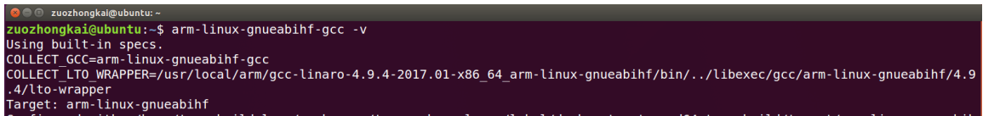

<!--more-->

# 一、 基础概念

## 嵌入式和单片机的区别

**较早的定义**
 - **英国电器工程师协会定义的：** 嵌入式系统（Embedded System），是一种“完全嵌入受控器件内部，为特定应用而设计的专用计算机系统”。
 - **行业定义：** 以应用为中心，计算机技术为基础，**软硬件可剪裁，适应应用系统对功能、成本、体积、可靠性、功耗严格要求的计算机系统**。
 - **个人总结**：除PC外的所有带有程序，可独立工作的系统都是嵌入式系统，包含单片机

**目前行业定义**
- 行业中普遍将两者区分开来，依据则是从软件上进行区分。


> CPU概念基本指中央处理器，微处理器都可以称为CPU
> MPU，和SOC概念模糊，不做区分，认为是一个

**参考资料**
- [CPU、MPU、MCU、SOC的区别（概念）](https://www.cnblogs.com/y4247464/p/12910642.html)
- [芯片名词对比](https://book.crifan.com/books/ic_chip_industry_chain_summary/website/ic_chip_summary/chip_names_compare.html)
- [嵌入式和单片机，是同一个东西吗？](http://www.xzclass.com/?p=464)
- [嵌入式Linux和stm32区别?之间有什么关系吗？](https://www.eet-china.com/mp/a125116.html)

### MMU（内存管理单元）

没有MMU，CPU执行单元发出的内存地址将直接传到芯片引脚上，被内存芯片接收，这称为物理地址（Physical Address）：

有MMU，CPU执行单元发出的内存地址将被MMU截获，从CPU到MMU的地址称为虚拟地址（Virtual Address），而MMU将这个地址翻译成另一个地址发到CPU芯片的外部地址引脚上，也就是将虚拟地址映射成物理地址：


处理器一般有用户模式（User Mode）和特权模式（privileged Mode）之分。当CPU要访问一个VA（Virtual Address）时，MMU会检查CPU当前处于用户模式还是特权模式，访问内存的目的是读数据、写数据还是取指令执行，如果与操作系统设定的权限相符，则允许访问，把VA转换成PA，否则不允许执行，产生异常（Exception）。

**参考资料**
- [关于MMU那些事儿](https://zhuanlan.zhihu.com/p/137061978)
- [用于MCU/MPU的uCLinux与Linux有什么区别？](https://www.eet-china.com/mp/a11350.html)
- [arm-linux学习-（MMU内存管理单元）](https://www.cnblogs.com/alantu2018/p/9002309.html)
- [MMU原理](https://zhuanlan.zhihu.com/p/354142930)
- [arm-linux学习-（MMU内存管理单元）](https://www.cnblogs.com/alantu2018/p/9002309.html)

### 嵌入式软件


**参考资料**
- [嵌入式linux 和 用stm32进行的嵌入式开发 这两者之间有什么关联性吗？](https://www.zhihu.com/question/53880054/answer/164501004)

### STM32是否可以跑linux

操作系统有两种 用MMU的 和 不用MMU的
- 用MMU的是Windows MacOS Linux Android
- 不用MMU的是FreeRTOS VxWorks ucOS...

CPU有两种 带MMU的 和 不带MMU的
- 带MMU的有 Cortex-A系列 ARM9 ARM11系列
- 不带MMU的有 Cortex-M系列...

STM32是M系列...不可能运行Linux...（ucLinux不算Linux的...）
**在开发环境、程序开发上也都有很大区别，基本算是两种开发模式**

参考资料：
- [STM32是否可以跑linux](https://www.cnblogs.com/AI-Algorithms/p/3866586.html)

## 什么是linux

区分linux内核和linux操作系统
 - Linux严格来说是单指作业系统的内核。
 - 如今Linux常用来指基于Linux的完整操作系统，内核则改以Linux内核称之。

Linux内核由林纳斯·托瓦兹（Linus Torvalds）在1991年10月5日首次发布，在加上使用者空间的应用程序之后，成为Linux操作系统。除了一部分专家之外，大多数人都是直接使用Linux 发行版（Linux操作系统），而不是自己选择每一样组件或自行设置。


**参考资料：**
- [Linux 简介](https://www.runoob.com/linux/linux-intro.html)
- [Linux-wiki](https://zh.wikipedia.org/zh-hans/Linux)


`

## gcc -v
gcc编译器ubuntu自带，`gcc -v` 查看当前版本

`gcc [选项] [文件名字]`
选项如下：
- c： 只编译不链接为可执行文件，编译器将输入的.c 文件编译为.o 的目标文件。
- o：编译成可执行文件，默认编译出来的可执行文件名字为 a.out。
  \+  <输出文件名>指定编译结束以后的输出文件名

```
#include <stdio.h>
int main(int argc, char *argv[])
{
	printf("Hello World!\n");
}
```
	gcc main.c –o main.out
	./main.out

编译流程：
 1. 预处理（Preprocessing）：.c 文件中的文件包含（include）、预处理语句（e.g. 宏定义 define 等）进行分析，并替换成为真正的内容。
 2. 编译（Compilation）：生成 .s 汇编文件。
 3. 汇编（Assembly）：.生成以 .o 的目标文件。
 4. 链接（Linking）：多个.o文件、库文件链接成一个文件，变成可执行文件。


我们需要操作的步骤：.o 和可执行文件

## Makefile

多文件编译演示：
```
main.c
#include <stdio.h>
#include "input.h"
#include "calcu.h"

int main(int argc, char *argv[])
{
	int a, b, num;

	input_int(&a, &b);
	num = calcu(a, b);
	printf("%d + %d = %d\r\n", a, b, num);
}

input.c 

#include <stdio.h>
#include "input.h"

void input_int(int *a, int *b)
{
	printf("input two num:");
	scanf("%d %d", a, b);
	printf("\r\n");
}

#ifndef _INPUT_H
#define _INPUT_H

void input_int(int *a, int *b);
#endif

calcu.c 

#include "calcu.h"
int calcu(int a, int b)
{
 return (a + b);
}

calcu.h
#ifndef _CALCU_H
#define _CALCU_H

int calcu(int a, int b);
#endif
```
```
gcc main.c calcu.c input.c -o main
```

Makefile好处：
- 大量文件编译
- 只编译修改的文件
- 简便

新建Makefile
**命令列表中的每条命令必须以 TAB 键开始，不能使用空格！**
```
main: main.o input.o calcu.o
	gcc -o main main.o input.o calcu.o
main.o: main.c
	gcc -c main.c
input.o: input.c
	gcc -c input.c
calcu.o: calcu.c
	gcc -c calcu.c

clean:
	rm *.o
	rm main
```
自动化变量：
```
objects = main.o input.o calcu.o
main: $(objects)
	gcc -o main $(objects)

%.o : %.c
	gcc -c $<

clean:
	rm *.o
	rm main
```


# 裸机开发


# 以下内容为后期课程内容，待编写

# LInux系统移植

## U-Boot移植

uboot 移植的一般流程：
1. 在 uboot 中找到参考的开发平台，一般是原厂的开发板。
2. 参考原厂开发板移植 uboot 到我们所使用的开发板

1. 原版Uboot放松到ubuntu中，解压
```
tar -jvxf uboot-imx-rel_imx_4.1.15_2.1.0_ga.tar.bz2 
```
2. 原版编译烧录测试
创建sh文件
```
vim mx6ull_14x14_emmc.sh
```
填入内容：
```
#!/bin/bash
make ARCH=arm CROSS_COMPILE=arm-linux-gnueabihf- distclean
make ARCH=arm CROSS_COMPILE=arm-linux-gnueabihf- mx6ull_14x14_evk_emmc_defconfig
make V=1 ARCH=arm CROSS_COMPILE=arm-linux-gnueabihf- -j16
```
编译：
```
./mx6ull_14x14_emmc.sh
```
烧录：
```
chmod 777 imxdownload //给予 imxdownload 可执行权限
./imxdownload u-boot.bin /dev/sdd //烧写到 SD 卡中，不能烧写到/dev/sda 或 sda1 里面
```
3.  创建自定义配置文件
```
cd configs
cp mx6ull_14x14_evk_emmc_defconfig mx6ull_alientek_emmc_defconfig
```
修改内容
```
CONFIG_SYS_EXTRA_OPTIONS="IMX_CONFIG=board/freescale/mx6ull_alientek_emmc/imximage.cfg,MX6ULL_EVK_EMMC_REWORK"
CONFIG_ARM=y
CONFIG_ARCH_MX6=y
CONFIG_TARGET_MX6ULL_ALIENTEK_EMMC=y
CONFIG_CMD_GPIO=y
```
拷贝头文件
```
cp include/configs/mx6ullevk.h mx6ull_alientek_emmc.h
```
将
```
#ifndef __MX6ULLEVK_CONFIG_H
#define __MX6ULLEVK_CONFIG_H
```
改为：
```
#ifndef __MX6ULL_ALIENTEK_EMMC_CONFIG_H
#define __MX6ULL_ALIENTEK_EMMC_CONFIG_H
```

https://www.bilibili.com/video/BV1yD4y1m7Q9?from=search&seid=17466272019916726328
https://www.bilibili.com/video/BV1sJ41117Jd?from=search&seid=1145502530072362755
https://www.bilibili.com/video/BV12E411h71h?from=search&seid=5718148630492275519
https://www.bilibili.com/video/BV15W411m7AQ/?spm_id_from=333.788.recommend_more_video.1
https://www.bilibili.com/video/BV1qb4y127xc/?spm_id_from=333.788.recommend_more_video.0
https://www.cnblogs.com/lialong1st/p/11351095.html
https://0uyangsheng.github.io/2018/04/20/Build-Ubuntu-for-ARM-Platform-From-Scratch/
https://www.icode9.com/content-3-924261.html
https://wiki.t-firefly.com/zh_CN/ROC-RK3328-CC/flash_emmc.html
https://www.t-firefly.com/doc/download/page/id/34.html
https://www.t-firefly.com/doc/product/info/id/360.html
https://www.bilibili.com/video/BV19v411H7d3?p=13


操作系统向下管理硬件（I/O，设备接口），向上提供接口（进程管理+文件IO+网络协议+数据库等，被APP软件调用）

Linux功能：
进程管理
内存管理（运存？）
网络协议
文件系统
设备管理（LED、键鼠、屏幕）
系统移植过程
windows系统                                           Linux系统
windows系统镜像、U盘启动盘            Linux内核镜像（需要裁剪移植）、SD卡启动盘（Uboot）
BIOS选择启动方式（U盘启动）          拨码开关选择启动方式（SD启动）
通过U盘中的引导程序安装系统           通过SD卡中的引导程序（Uboot）安装系统
安装驱动
安装应用
开发板启动过程
开发板上电后首先运行 SOC 内部 iROM 中固化的代码（BL0），这段代码先对基本的软银见环境（时钟等）初始化，然后检测拨码开关获取启动方式，再将对应存储器（SD卡）中的Uboot搬移到内存，然后跳转到uboot运行
uboot开始运行后首先对开发板软硬件环境初始化，然后将 linux内核、设备树（dtb） 、根文件系统（rootfs）从外部存储器（或网络）搬移到内存，然后跳转到linux运行
linux开始运行，先对系统环境初始化，当系统启动完成后，linux再从内存中（或网络）挂在根文件系统


根据启动过程得出移植步骤：
uboot移植
linux内核移植（包含设备树）
根文件系统移植
开发环境准备
我们再linux系统中（安装再PC上的，一般是Ubuntu）编辑要移植的linux系统，然后再编译，最后生成一个安装包，再使用SD卡安装到开发板
注：后面说Ubuntu指安装在PC上的Linux系统，说Linux指要移植的linux系统

Ubuntu联网，下载文件机、开发板通信
tftp服务器环境搭建：基于网络通信协议（TCP/IP）在客户机（开发板）和服务器（PC）直接进行简单的文件传输
nfs环境搭建：基于网络通信协议（UDP/IP）在不同计算机之间通过网络进行文件共享，既可以在客户端（开发板）访问服务器（PC）文件，不需要频繁通过 tftp 先传输再访问

SD卡启动盘制作
选择SD卡启动，处理器上电默认从第一个扇区开始搬移到内存

uboot使用
uboot模式
自启动模式
uboot启动后若没有用户介入，倒计时结束后会自动执行自启动环境变量（bootcmd）中设置的命令（一般叫做加载和启动内核）
交互模式
倒计时结束前按下任意按键，uboot会进入交互模式，用户可输入uboot命令
     
	 
	

# linux内核

Linux是一个单体内核，支持真正的抢占式多任务处理（于用户态，和版本2.6系列之后的内核态[27][28]）、虚拟内存、共享库、请求分页、共享写时复制可执行体（通过内核同页合并）、内存管理、Internet协议族和线程等功能。

设备驱动程序和内核扩展运行于内核空间（在很多CPU架构中是ring 0），可以完全访问硬件，但也有运行于用户空间的一些例外，例如基于FUSE/CUSE的文件系统，和部分UIO[29][30]。多数人与Linux一起使用的图形系统不运行在内核中。与标准单体内核不同，Linux的设备驱动程序可以轻易的配置为内核模块，并在系统运行期间可直接装载或卸载。也不同于标准单体内核，设备驱动程序可以在特定条件下被抢占；增加这个特征用于正确处理硬件中断并更好的支持对称多处理[28]。出于自愿选择，Linux内核没有二进制内核接口[31]。

硬件也被集成入文件层级中。用户应用到设备驱动的接口是在/dev或/sys目录下的入口文件[32]。进程信息也通过/proc目录映射到文件系统[32]。


- [Linux内核-wiki](https://zh.wikipedia.org/wiki/Linux%E5%86%85%E6%A0%B8)
- [鸟哥linux第四版-基礎學習篇目錄 - for CentOS 7](https://linux.vbird.org/linux_basic/centos7/)

shell
- [Chapter 11 Shell 和 Shell Script](https://www.cyut.edu.tw/~ywfan/1109linux/201109chapter11shell%20script.htm)
- [Linux Shell 版本问题](https://achelous.org/BI-solutions/Linux_shell_version.html)
- [这些贝壳的插图哪一个是准确的？外壳是否仅通过外壳与内核对话？](https://www.reddit.com/r/linux4noobs/comments/kufgft/which_of_these_illustrations_of_the_shell_is/)
- https://imgur.com/a/VuvJ3dy
- [一篇文章從了解到入門shell](https://kknews.cc/code/3va5oq8.html)
- [Shell脚本是什么](http://c.biancheng.net/view/932.html)
- [Linux shell脚本](https://www.cnblogs.com/gd-luojialin/p/15028076.html)
- [Linux Shell程式設計及自動化運維實現——shell概述及變數](https://www.gushiciku.cn/pl/gLvW/zh-tw)
- [Bash 参考手册](https://www.gnu.org/software/bash/manual/bash.html)
- [bash (Bourne again shell)](https://www.techtarget.com/searchdatacenter/definition/bash-Bourne-Again-Shell)
- [什么是 Linux，为什么有 100 种 Linux 发行版？](https://itsfoss.com/what-is-linux/)
- [linux系统组成及结构](https://blog.csdn.net/kai_zone/article/details/80444872)

[Linux操作系统综述](https://blog.51cto.com/u_13800449/3049118)
[Linux系统组成.md](https://github.com/sunnyandgood/BigData)


## 常用指令

<!--more-->


### SD卡相关

查询设备
`ls /dev/sd*`

下载到SD卡
- imxdownload 复制到工程目录下
- 给与权限 `chmod 777 imxdownloa`

烧录到SD卡
`./imxdownload led.bin /dev/sdd`


重复执行上条命令的 4 种方法：
- 使用上方向键，并回车执行。（推荐）
- 按 Ctrl+P 并回车执行。（备选，有的命令上下键会没有，这个绝对会有）

## 串口连接
[MobaXterm]( https://mobaxterm.mobatek.net/) 

波特率根据不同开发板修改


## uboot移植

### uboot编译

无uboot源码，跳过次步骤，直接进入uboot下载
首先在 Ubuntu 中安装 ncurses 库， 否则编译会报错，安装命令如下：
`sudo apt-get install libncurses5-dev`

ubuntu新建文件夹，拷贝开发板厂商的uboot到其中，例如正点原子的：uboot-imx-2016.03-2.1.0-ge468cdc-v1.5.tar.bz2
解压：
`tar -vxjf uboot-imx-2016.03-2.1.0-g8b546e4.tar.bz2`
新建 shell脚本文件 `mx6ull_alientek_emmc.sh`
输入如下内容(正点原子EMMC版本)：
```
1 #!/bin/bash
2 make ARCH=arm CROSS_COMPILE=arm-linux-gnueabihf- distclean
3 make ARCH=arm CROSS_COMPILE=arm-linux-gnueabihf- (加空格)
mx6ull_14x14_ddr512_emmc_defconfig
4 make V=1 ARCH=arm CROSS_COMPILE=arm-linux-gnueabihf- -j12
```
给与shell文件权限：
```
chmod 777 mx6ull_alientek_emmc.sh
```
编译
`./mx6ull_alientek_emmc.sh`

### uboot烧写

将 imxdownload 文件复制到uboot.bin 同级目录中
```
chmod 777 imxdownload //给予 imxdownload 可执行权限，一次即可
./imxdownload u-boot.bin /dev/sdd //烧写到 SD 卡，不能烧写到/dev/sda 或 sda1 设备里面！
```

>烧写速度在几百 KB/s 以下那么就是正常烧写。如果这个烧写速度大于几十 MB/s、甚至几百 MB/s 那么肯定是烧写失败了！

### uboot配置

修改环境变量
```
setenv bootdelay 5
saveenv
```

有空格的环境变量用单引号括起来
```
etenv bootargs 'console=ttymxc0,115200 root=/dev/mmcblk1p2 rootwait rw'
saveenv
```

#### 设置网络

dhcp 命令:自动获取ip地址,不用设置下面的ipaddr


 - ipaddr 开发板 ip 地址，可以不设置，使用 dhcp 命令来从路由器获取 IP 地址。
 - ethaddr 开发板的 MAC 地址，一定要设置。不同开发板地址要不同
 - gatewayip 网关地址。
 - netmask 子网掩码。
 - serverip 服务器 IP 地址，也就是 Ubuntu 主机 IP 地址，用于调试代码。

```
setenv ipaddr 192.168.1.50
setenv ethaddr b8:ae:1d:01:00:0
setenv gatewayip 192.168.1.1
setenv netmask 255.255.255.0
setenv serverip 192.168.1.253
saveenv
```

#### nfs网络传出镜像和设备树到DRAM中
`nfs [loadAddress] [[hostIPaddr:]bootfilename]`

下载(uboot操作):
`nfs 80800000 192.168.1.253:/home/zuozhongkai/linux/nfs/zImage`


# 二、Ubuntu系统安装与使用

Ubuntu系统是基础linux内核的操作系统。就像开发电脑软件需要在win10系统上一样，我们之后的linux软件开发也需要在 Linux 系统上（即Ubuntu系统）
**本章内容：**
虚拟机安装 -> 使用虚拟机安装ubuntu -> ubuntu配置使用

## 1. 虚拟机安装

要想在windows系统安装 ubuntu ，就得借助虚拟机。这样就可以在电脑上同时存在两个操作系统，并且可以同时运行。

### 下载

VirtualBox[下载地址](http://download.virtualbox.org/virtualbox/ )
选择你需要下载的版本 (32位系统请务必选择5.2)。这里我的是 64 位系统，选择最新版 （下图左半图红框）。单击进入文件选择界面（下图右半图）选择文件下载，其中一个是 VirtualBox 主体安装包，一个是 扩展包，扩展包必须和 VirtualBox 主体安装包版本保持一致（后缀140961也要一样）。

- 扩展包提供了对USB 2.0、USB 3.0、远程桌面协议 VRDP（VirtualBox Remote Desktop Protocol）等实用功能的支持。但相关扩展包并非开源软件，而是在 VirtualBox Personal Use and Evaluation License (PUEL) 许可证限制下发布的软件，所以扩展包并未与 VirtulBox 安装文件集成在一起，而是需要单独下载和安装。
 


### 安装

上述两个文件下载完成后，先双击运行 `VirtualBox-6.1.16-140961-Win.exe` 安装VirtualBox。安装过程全程按照提示进行，点击下一步，遇到弹窗，点选 "是" 或 “安装” 即可。可以更改软件安装位置。                                                                                                                                                                                              
VirtualBox安装后。双击 `Oracle_VM_VirtualBox_Extension_Pack-6.1.16.vbox-extpack` 安装扩展包。（下图左半图）。安装完成后，运行 VirtualBox，在左上角 `管理` -> `全局设定` -> `扩展`，确认扩展包安装成功。


### 新建虚拟机

虚拟机，相当于一台虚拟的电脑，用于后面的 Ubuntu 操作系统安装。

1. 单击新建


2. 虚拟机配置
**名称：** 随意
**文件夹：** 存放虚拟机的配置文件，区别与存放Ubuntu操作系统的文件夹。随意。
**类型：** Linux
**版本：** Ubuntu（64-bit）
**内存大小：** 一般是本机的一半，例如你电脑是16G内存，这里就选8G
勾选 `现在创建虚拟硬盘`，点击 `创建`


3. 创建虚拟硬盘
建议单独创建一个电脑硬盘分区，且大小最好在100G以上，用来安装 LInux 操作系统，学习中可能会经常格式化。
 
虚拟硬盘文件类型：VDI
内存分配：固定大小。
文件位置和大小：文件位置就选择我们上面新建的分区，大小剩5-10G作用，用于存放我们的ubuntu映像文件（即.iso文件）
点击创建，配置完毕，等待软件自动创建完成。

4. 虚拟机创建完成的样子
  
  
## 2. Ubuntu安装

0. 修改启动顺序。设置 -> 系统，将硬盘移到首位。不然会默认使用光驱启动，这会导致下面系统安装成功后会又进入系统安装界面。


1. 下载 Ubuntu，进入[Ubuntu 阿里云镜像下载](https://mirrors.aliyun.com/ubuntu-releases/)，下载 18.04.5 版。建议放在我们之前新建的磁盘分区中即E盘下，后面可能会涉及频繁重装系统，所以 iso 文件最好不要删。
**不推荐下载最新版，软件适配不足，bug较多。资料较少。还是下载老版本。--20201207  
后面教程中版本都是 20.04.1（写教程时一开始使用的最新版，后面出现很多问题，亲身教训）。实际以 18.04.5 版本为准**
 
2. 点击`启动`

3. 选择启动盘

4. 点击注册，在弹出界面选择我们第一步下载好的 ISO 文件

5. 点击选择

6. 点击启动

7. 等待安装启动，语言选择 `English`（个人推荐，程序员应该拥抱英语），然后选择 `install Ubuntu`
	- 选择英文，后面会涉及输入法无法写中文的问题，需要在系统中安装语言包。如果怕麻烦，这里可以选中文，安装时系统会自动安装。

8. 选择  `Nomal installation`，安装时更新（系统自带的软件更新）可以不勾选，安装时间会加长，建议勾选。点击继续。  
安装类型选择 `擦除磁盘并安装`。


9. 写入磁盘。弹窗里点击继续。
时区正常选择中国时区就可以，继续

10. 设置用户名和密码。又图是其会出现的位置。最常用的是用户名和密码，这个在命令终端中操作会经常输入，所有尽量简单短小。

11. 接下来就是漫长的安装过长，我这里大概用了2小时。出现下面弹窗表示安装完成，点击重新启动即可。


**参考资料**
- [Drag and Drop not working for Ubuntu 20.04 VirtualBox](https://askubuntu.com/questions/1230102/drag-and-drop-not-working-for-ubuntu-20-04-virtualbox)
- [VirtualBox Ubuntu 20.04 LTS super buggy](https://www.linux.org/threads/virtualbox-ubuntu-20-04-lts-super-buggy.29161/)


## 3. Ubuntu配置

### 增强扩展功能

安装增强扩展功能。解决以下问题：
- 更改屏幕分辨率，解决显示界面太小问题
- 本地电脑和虚拟机电脑文件共享
- 剪贴板共享等等等等

1. 设备->安装增强功能 

2.  弹窗点击 `Run`，输入密码。（数字小键盘关闭可能会无法输入。）

3.  不出意外的话，会出现下左图的安装失败。我们需要打开终端，并输入   
`sudo apt-get install build-essential gcc make perl dkms`  
等待系统自动安装，再重新安装增强功能。直到出现下右图表示安装成功。

安装失败后，桌面会多出一个 iso 文件，双击打开，点击运行，就可以直接安装增强功能，不用再从菜单栏选择了。

4. 关闭虚拟机，在virtualbox主界面打开 `设置`：
`常规`->`高级`：**共享剪切板** 和 **拖拽**都 选择 **双向**  
`存储`->`控制器SATA`：勾选 **使用主机输入输出(I/O)缓存**  
`存储`->`控制器SATA`->`Ubuntu-Embeded.vdi`：勾选 **固态驱动器**    
启动虚拟机。此时就可以直接从 Windows 系统窗口拖动文件到 Linux 界面了。

6. 更改分辨率。在设置里找到系统设置，选择合适的屏幕分辨率即可。


**参考链接**
- [Install guest additions on a VirtualBox](https://www.youtube.com/watch?v=V4tGpsZiOdw)
- 
### 软件和更新源

Ubuntu 使用 apt 进行软件包安装管理，默认情况下其使用国外的软件源进行软件包的下载/安装/更新等操作。而由于不可抗力，这些下载操作可能会很慢。此时可以采用国内的镜像软件源替换 Ubuntu 的默认软件源，提高软件更新下载速度。
1. 打开 Software&Updates -> Ubuntu Software,其界面有个 Download from 项，找到 China 项，会有很多源，选择其中一个即可。


**参考资料**
- [Ubuntu18.04 设置国内镜像软件源进行软件下载/更新](https://www.cnblogs.com/yhjoker/p/12813423.html)

### U盘支持

我们也希望能在 LInux 系统中读取电脑上的 usb 设备。此时就发挥我们之前安装的扩展包作用了。
- 这里实测，不安装扩展包，也是可以使用 usb3.0 的hub识别usb2.0读卡器读写SD卡

1. 关闭虚拟机，virtualbox主界面打开 `设置` -> `USB设备`，勾选USB 3.0。并将USB设备添加进来（只有添加进这里的才能在虚拟机中被识别到）。

2. 打开虚拟机，一般会自动加载设备（左下角两个设备图标），直接双击即可打开。如果没有：`设备`->`USB`，单击USB设备名字，将完成设备加载。

3. 移除设备，右键左下角设备图标，单击 `Eject` 弹出；或者虚拟机右下角，右键U盘图标，单击设备名弹出


**参考链接**
- [How to Enable USB in VirtualBox](https://www.tecmint.com/enable-usb-in-virtualbox/)

### 图标对齐

虽然LInux基本都是命令行操作，但桌面有时也会偶尔存放东西。默认拖动到桌面的文件图标会堆叠在一起，不像 Windows 或自动整理、对齐。其实这里需要我们自己选择。在桌面右键：
- keep aligned：保持对齐
- Organize Desktop by Name：按名称排序桌面


### 锁屏

Ubuntu默认5分钟自动锁屏，我们希望永不锁屏，打开设置界面，找到`Power`,设置自己的时间即可。


## 参考链接

 - [virtualbox虚拟机使用教程](https://zsxwz.com/2020/01/27/virtualbox%E8%99%9A%E6%8B%9F%E6%9C%BA%E4%BD%BF%E7%94%A8%E6%95%99%E7%A8%8B/)
 - [Oracle VM VirtualBox 使用教程(Windows操作系统下)](https://www.xckjsys.com/2019/08/20/154/)
 - [优麒麟使用教程第二期：VirtualBox 虚拟机安装](https://www.ubuntukylin.com/news/1513-cn.html)
 - [win10虚拟机Oracle VM VirtualBox安装和使用教程](https://zhuanlan.zhihu.com/p/111567471)
 - [虚拟框 / Windows 10 主机 / 文件位置](http://learn.openwaterfoundation.org/owf-learn-virtualbox/install-host/win/file-locations/)
 - [一张图搞懂Ubuntu安装时姓名、计算机名、用户名](https://blog.csdn.net/weixin_43350051/article/details/104874088)
 - https://zhuanlan.zhihu.com/p/35619204
 - https://www.jianshu.com/p/796866e933e1
 - https://segmentfault.com/a/1190000022468063
 - https://www.codeleading.com/article/61115145053/

# 四、shell命令

这里的命令一定**多多动手尝试，多多动手尝试，多多动手尝试**。不要死记硬背，光看是无法学会且领会不到真谛的。
 - 命令都是带参数的，自己多上网查查其它用法
 - 命令区分大小写
 - 查询一个命令：man xx 或者 xx --help
 - `q` 键退出当前操作
- 参数可以组合使用
- * 为通配符
- 上下
- [Linux命令大全(手册)](https://www.linuxcool.com/)
- [Linux 命令大全](https://www.runoob.com/linux/linux-command-manual.html)

### 重复执行上条命令的 4 种方法：

 - 使用上方向键，并回车执行。（推荐）
 - 按 Ctrl+P 并回车执行。（备选，有的命令上下键会没有，这个绝对会有）
 - 按 !! 并回车执行。
 - 输入 !-1 并回车执行。
 - !$ 使用上一个命令的参数

**参考链接**
- [Linux系统下Shell重复执行上条命令的几种方法](https://www.nenew.net/linux-shell-rerun-command.html)
 
## cd 切换目录

`changeDirectorym`，这是一个非常基本、经常需要使用的命令，它用于切换当前目录，它的参数是要切换到的目录的路径，可以是绝对路径，也可以是相对路径。如：

```
cd /root/Docements # 切换到目录/root/Docements
cd ./path          # 切换到当前目录下的path目录中，可省略 "./" 
cd ../path         # 切换到上层目录中的path目录中，
cd ~             # 进入用户目录，打开终端时默认路径，=  cd/home/用户名，home 为各个用户存放位置
cd -     #进入上一次工作路径
cd /    # 进入根目录,只紧跟cd时 "/"表示根目录下，其他目录时表示当前目录下
pwd    # 查看位置的绝对路径，可以用这个对比`cd ~`和`cd / `的区别
```
- "." 表示当前目录 ，其实就是使用 "." 代替了当前目录的目录名
- ".." 表示上一层目录
- "/" 在首位表示根目录，其它位置后面表示其目录下
```
lonly@lonly-VirtualBox:~$ cd ~
lonly@lonly-VirtualBox:~$ cd /  # 默认用户目录 '$' 为 '~' 符号
lonly@lonly-VirtualBox:/$   # 根目录 '$' 为 '/' 符号
```
 
## ls 查看文件与目录

`list` ，查看文件与目录的命令，它的参数非常多，下面就列出一些我常用的参数吧，如下：
```
-a：列出目录所有文件，包含以.开始的隐藏文件
-A：列出除.及..的其它文件
-l：除了文件名之外，还将文件的权限、所有者、文件大小等信息详细列出来
-d：仅列出目录本身，而不是列出目录的文件数据
-r：反序排列
-t：以文件修改时间排序
-S：以文件大小排序
-h：将文件容量以较易读的方式（GB，kB等）列出来
-R：连同子目录的内容一起列出（递归列出），等于该目录下的所有文件都会显示出来
```
## uname 显示系统相关信息

`Unix name`，用于显示系统相关信息，比如主机名、内核版本号、硬件架构等。

```
-a：显示系统所有相关信息
-m：显示计算机硬件架构
-n：显示主机名称
-r：显示内核发行版本号
-s：显示内核名称
-v：显示内核版本
-p：显示主机处理器类型
-o：显示操作系统名称
-i：显示硬件平台
```
## clear 清除屏幕

clear命令用于清除屏幕。这个命令将会刷新屏幕，本质上只是让终端显示页向后翻了一页，如果向上滚动屏幕还可以看到之前的操作信息。

## cat 查看文本

该命令用于查看文本文件的内容，后接要查看的文件名
`cat [参数] [文件]`
```
-n：显示行数（空行也编号）
-s：显示行数（多个空行算一个编号）
-b：显示行数（空行不编号）
-E：每行结束处显示$符号
```

## sudo 超级用户

允许一个已授权用户以超级用户或者其它用户的角色运行一个命令。

```
-l 列出目前的权限

```
**举例：**  
`sudo xxx指令 # 以超级用户（管理员）执行该指令，临时切换当前身份  `  
`sudo su # 切换身份为超级用户（永久），不建议这么做，可能会误删除一些系统核心文件，导致系统崩溃`

## cp 复制文件

`copy`，该命令用于复制文件，它还可以把多个文件一次性地复制到一个目录下， 常用参数如下：
```
-d：复制时保留链接。这里所说的链接相当于Windows系统中的快捷方式。
-f：覆盖已经存在的目标文件而不给出提示。
-i：与-f选项相反，在覆盖目标文件之前给出提示，要求用户确认是否覆盖，回答"y"时目标文件将被覆盖。默认方式
-p：除复制文件的内容外，还把修改时间和访问权限也复制到新文件中。
-r：若给出的源文件是一个目录文件，此时将复制该目录下所有的子目录和文件。
-l：不复制文件，只是生成链接文件。
-u：目标文件与源文件有差异时才会复制
-a：此选项通常在复制目录时使用，它保留链接、文件属性，并复制目录下的所有内容。其作用等于上面dpr参数组合。

```
**举例：**  
`cp -a file1 file2 #连同文件的所有特性把文件file1复制成文件file2`  
`cp file1 file2 file3 dir #把文件file1、file2、file3复制到目录dir中，以默认 "-i" 方式`

## touch 创建新的空文件

touch命令有两个功能：一是创建新的空文件，二是改变已有文件的时间戳属性。
touch命令会根据当前的系统时间更新指定文件的访问时间和修改时间。如果文件不存在，将会创建新的空文件，除非指定了”-c”或”-h”选项。
```
-a：改变档案的读取时间记录
-m：改变档案的修改时间记录
-r:	使用参考档的时间记录，与 --file 的效果一样
-c:	不创建新文件
-d:	设定时间与日期，可以使用各种不同的格式
-t:	设定档案的时间记录，格式与 date 命令相同
--no-create: 不创建新文件
```

## rm 删除文件或目录

`remove`，该命令用于删除文件或目录，它的常用参数如下：
```
-f：就是force的意思，忽略不存在的文件，不会出现警告消息
-i：互动模式，在删除前会询问用户是否操作
-r：递归删除，最常用于目录删除，它是一个非常危险的参数
```
**举例：**  
`rm -i file # 删除文件file，在删除之前会询问是否进行该操作`  
`rm -fr dir # 强制删除目录dir中的所有文件`

## mkdir
`make directories`创建目录。
```
-p:	递归创建多级目录
-m:	建立目录的同时设置目录的权限
-z:	设置安全上下文
-v:	显示目录的创建过程
```
**实例**  
`mkdir test  # 创建名为 test 的目录`  
`mkdir dir1 dir2 dir3 # 同时创建子目录dir1，dir2，dir3`  
`mkdir -p linuxcool/dir # 同时创建目录linuxcool，并在linuxcool目录下创建子目录dir`

## rmdir
`remove directory`，删除空的目录  
**注意：** rmdir命令只能删除空目录。当要删除非空目录时，就要使用带有 “-r” 选项的rm命令。
```
-p:	用递归的方式删除指定的目录路径中的所有父级目录，非空则报错
```


## mv

`move`，用于移动文件、目录或更名，常用参数如下：
```
-f：force强制的意思，如果目标文件已经存在，不会询问而直接覆盖
-i：若目标文件已经存在，就会询问是否覆盖
-u：若目标文件已经存在，且比目标文件新，才会更新
```

注：该命令可以把一个文件或多个文件一次移动一个文件夹中，但是最后一个目标文件一定要是“目录”。

**实例：**  
`mv file1 file2 file3 dir # 把文件file1、file2、file3移动到目录dir中`  
`mv file1 file2 # 把文件file1重命名为file2`  
`mv test/ test1/ # 重命名文件夹`  
`mv a.c test1/ # 将 a.c 移动到 test1 文件夹下`


## ifconfig

`network interfaces configuring`，配置和显示Linux内核中网络接口的网络参数。用ifconfig命令配置的网卡信息，在网卡重启后机器重启后，配置就不存在。要想将上述的配置信息永远的存的电脑里，那就要修改网卡的配置文件了。

```
ifconfig 查看网络配置
down	关闭指定的网络设备
up	启动指定的网络设备
reload 重启网络设备
IP地址	指定网络设备的IP地址
```
**实例**
```
lonly@lonly-VirtualBox:~$ ifconfig

命令行显示：
Command 'ifconfig' not found, but can be installed with:
sudo apt install net-tools

此时输入上述语句，安装网络工具
lonly@lonly-VirtualBox:~$ sudo apt install net-tools
再输入指令：
lonly@lonly-VirtualBox:~$ ifconfig
enp0s3: flags=4163<UP,BROADCAST,RUNNING,MULTICAST>  mtu 1500
        inet 10.0.2.15  netmask 255.255.255.0  broadcast 10.0.2.255
        inet6 fe80::a397:12be:107d:4a2d  prefixlen 64  scopeid 0x20<link>
        ether 08:00:27:fc:78:e4  txqueuelen 1000  (Ethernet)
        RX packets 91301  bytes 131638308 (131.6 MB)
        RX errors 0  dropped 0  overruns 0  frame 0
        TX packets 12415  bytes 869131 (869.1 KB)
        TX errors 0  dropped 0 overruns 0  carrier 0  collisions 0

lo: flags=73<UP,LOOPBACK,RUNNING>  mtu 65536
        inet 127.0.0.1  netmask 255.0.0.0
        inet6 ::1  prefixlen 128  scopeid 0x10<host>
        loop  txqueuelen 1000  (Local Loopback)
        RX packets 683  bytes 64537 (64.5 KB)
        RX errors 0  dropped 0  overruns 0  frame 0
        TX packets 683  bytes 64537 (64.5 KB)
        TX errors 0  dropped 0 overruns 0  carrier 0  collisions 0
```
```
ifconfig enp0s3 down  # 启动指定网卡
ifconfig enp0s3 up  # 关闭指定网卡
ifconfig enp0s3 add 33ffe:3240:800:1005::2/ 64 # 为网卡设置IPv6地址
ifconfig enp0s3 del 33ffe:3240:800:1005::2/ 64 # 为网卡删除IPv6地址
ifconfig enp0s3 192.168.1.56 # 给enp0s3网卡配置IP地址
ifconfig enp0s3 192.168.1.56 netmask 255.255.255.0 # 给enp0s3网卡配置IP地址,并加上子掩码
ifconfig enp0s3 192.168.1.56 netmask 255.255.255.0 broadcast 192.168.1.255 # 给enp0s3网卡配置IP地址,加上子掩码,加上个广播地址
```

## reboot

用于用来重新启动计算机，和Windows系统中的restart一样。但是机器重启必须要root用户才有权限。
```
-n	在重开机前不做将记忆体资料写回硬盘的动作 帮助
-w 	并不会真的重开机，只是把记录写到 /var/log/wtmp 档案里，模拟重开机
-d	不把记录写到 /var/log/wtmp 档案里（-n 这个参数包含了 -d）
-f	强迫重开机，不呼叫 shutdown 这个指令
-i	在重开机之前先把所有网络相关的装置先停止
```

## poweroff

关闭计算机操作系统并且切断系统电源。如果确认系统中已经没有用户存在且所有数据都已保存，需要立即关闭系统，可以使用poweroff命令。
```
-n: 在关机前不做将记忆体资料写回硬盘的动作（部分数据可能会丢失）
-w : 并不会真的关机，只是把记录写到 /var/log/wtmp 档案里
-d : 不把记录写到 /var/log/wtmp 文件里
-f	强制关闭操作系统
-i : 在关机之前先把所有网络相关的装置先停止
-h: 关闭操作系统之前将系统中所有的硬件设置为备用模式（standby节电模式）。
```

## sync

 在Linux/Unix系统中，在文件或数据处理过程中一般先放到内存缓冲区中，等到适当的时候再写入磁盘，以提高系统的运行效率。  
sync命令则可用来强制将内存缓冲区中的数据立即写入磁盘中。用户通常不需执行sync命令，系统会自动执行update或bdflush操作，将缓冲区的数据写 入磁盘。只有在update或bdflush无法执行或用户需要非正常关机时，才需手动执行sync命令。

## find命令

find是一个基于查找的功能非常强大的命令，相对而言，它的使用也相对较为复杂，参数也比较多，所以在这里将给把它们分类列出，它的基本语法如下：
`find [PATH] [option] [action]`

**与时间有关的参数：**
```
-mtime n : n为数字，意思为在n天之前的“一天内”被更改过的文件；
-mtime +n : 列出在n天之前（不含n天本身）被更改过的文件名；
-mtime -n : 列出在n天之内（含n天本身）被更改过的文件名；
-newer file : 列出比file还要新的文件名
```
例如：  
`find ./ -mtime 0 # 在当前目录下查找今天之内有改动的文件`

**与用户或用户组名有关的参数：**
```
-user name : 列出文件所有者为name的文件
-group name : 列出文件所属用户组为name的文件
-uid n : 列出文件所有者为用户ID为n的文件
-gid n : 列出文件所属用户组为用户组ID为n的文件
```
例如：  
`find /home/lonly -user lonly # 在目录/home/ljianhui中找出所有者为ljianhui的文件`

**与文件权限及名称有关的参数：**
```
-name filename ：找出文件名为filename的文件
-size [+-]SIZE ：找出比SIZE还要大（+）或小（-）的文件
-tpye TYPE ：查找文件的类型为TYPE的文件，TYPE的值主要有：一般文件（f)、设备文件（b、c）、
             目录（d）、连接文件（l）、socket（s）、FIFO管道文件（p）；
-perm mode ：查找文件权限刚好等于mode的文件，mode用数字表示，如0755；
-perm -mode ：查找文件权限必须要全部包括mode权限的文件，mode用数字表示
-perm +mode ：查找文件权限包含任一mode的权限的文件，mode用数字表示
```
例如：  
`find / -name passwd # 查找文件名为passwd的文件`  
`find ./ -name '*.log' # 在当前目录查找 以 .log 结尾的文件。 . 代表当前目录`  
`find . -perm 0755 # 查找当前目录中文件权限的0755的文件`  
`find . -size +12k # 查找当前目录中大于12KB的文件，注意c表示byte`

## grep命令

`global search regular expression and print out the line`，用于查找内容包含指定的范本样式的文件，如果发现某文件的内容符合所指定的范本样式，预设 grep 指令会把含有范本样式的那一列显示出来。若不指定任何文件名称，或是所给予的文件名为 -，则 grep 指令会从标准输入设备读取数据。

grep命令的选项用于对搜索过程的补充，而其命令的模式十分灵活，可以是变量、字符串、正则表达式。需要注意的是：当模式中包含了空格，务必要用双引号将其引起来。  
`grep [参数][-A<显示列数>][-B<显示列数>][-C<显示列数>][-d<进行动作>][-e<范本样式>][-f<范本文件>][--help][范本样式][文件或目录...]`

它的常用参数如下：

```
-b 或 --byte-offset : 在显示符合样式的那一行之前，标示出该行第一个字符的编号。
-e<范本样式> 或 --regexp=<范本样式> : 指定字符串做为查找文件内容的样式。
-f<规则文件> 或 --file=<规则文件> : 指定规则文件，其内容含有一个或多个规则样式，让grep查找符合规则条件的文件内容，格式为每行一个规则样式。
-h 或 --no-filename : 在显示符合样式的那一行之前，不标示该行所属的文件名称。
-i 或 --ignore-case : 忽略字符大小写的差别。
-l 或 --file-with-matches : 列出文件内容符合指定的样式的文件名称。
-n 或 --line-number : 在显示符合样式的那一行之前，标示出该行的列数编号。
-r 或 --recursive : 定要查找的是目录而非文件
-v 或 --invert-match : 显示不包含匹配文本的所有行。
-w 或 --word-regexp : 匹配整词
-x --line-regexp : 	匹配整行
```
**实例**  
```
$ grep test test* # 在当前目录中,查找文件名前缀有“test”的文件中含“test”字符串所在行信息
testfile1:This a Linux testfile! # 列出testfile1 文件中包含test字符的行  
testfile_2:This is a linux testfile! # 列出testfile_2 文件中包含test字符的行  
testfile_2:Linux test # 列出testfile_2 文件中包含test字符的行 
```
```
$ grep -r update /etc/acpi # 查找指定目录/etc/acpi 及其子目录（如果存在子目录的话）下所有文件中包含字符串"update"的文件，并打印出该字符串所在行的内容
/etc/acpi/ac.d/85-anacron.sh:# (Things like the slocate updatedb cause a lot of IO.)  
Rather than  
/etc/acpi/resume.d/85-anacron.sh:# (Things like the slocate updatedb cause a lot of  
IO.) Rather than  
/etc/acpi/events/thinkpad-cmos:action=/usr/sbin/thinkpad-keys--update 
```
```
$ grep-v test* #查找文件名中包含test 的文件中不包含test 的行  
testfile1:helLinux!  
testfile1:Linis a free Unix-type operating system.  
testfile1:Lin  
testfile_1:HELLO LINUX!  
...
```
## du

`Disk Usage`，即用于查看磁盘占用空间的意思。但是与df命令不同的是du命令是对文件和目录磁盘使用的空间的查看，而不是某个分区。
```
-a	显示目录中所有文件大小
-k	以KB为单位显示文件大小
-m	以MB为单位显示文件大小
-g	以GB为单位显示文件大小
-h	以易读方式显示文件大小，根据磁盘容量自动变换合适的单位
-s	仅显示总计
```
**实例**
```
du log2012.log  # 显示指定文件所占空间 ：
du -h scf/  # 以易读方式显示文件夹内及子文件夹大小 ：
```

## df

`Disk Free`，用于显示系统上可使用的磁盘空间。默认显示单位为KB，建议使用“df -h”的参数组合，根据磁盘容量自动变换合适的单位，更利于阅读。  
日常普遍用该命令可以查看磁盘被占用了多少空间、还剩多少空间等信息。
```
-a	显示所有系统文件
-h	以容易阅读的方式显示
-i	显示索引字节信息
-k	指定块大小为1KB
-m  以 MBytes 的容量显示各文件系统；
```
**实例**
```
[root@linuxcool ~]# df /etc/dhcp  # 显示指定文件所在分区的磁盘使用情况
文件系统                             1K-块    已用     可用   已用% 挂载点
/dev/mapper/fedora_linuxcool-root 15718400 2040836 13677564   13% /
```

## gedit

gedit命令是GNOME桌面环境的官方文本编辑器，尽管gedit旨在简化和易用，但它是功能强大的通用文本编辑器；它可以用来创建和编辑各种文本文件。和 notepad 类似。

```
--list-encodings	显示可使用的编码选项列表
--encoding=编码	设置打开命令行中列出的文件时使用的字符编码
-w	以独占方式打开文件直到文件关闭
-s	以独立模式运行gedit
```

## ps

`process status`，显示当前系统的进程状态。可以搭配 `kill` 指令随时中断、删除不必要的程序。

ps命令是最基本同时也是非常强大的进程查看命令，使用该命令可以确定有哪些进程正在运行和运行的状态、进程是否结束、进程有没有僵死、哪些进程占用了过多的资源等等，总之大部分信息都是可以通过执行该命令得到的。
```
-A ：所有的进程均显示出来
-a ：不与terminal有关的所有进程
-u ：有效用户的相关进程
-x ：一般与a参数一起使用，可列出较完整的信息
-l ：较长，较详细地将PID的信息列出
```
其实我们只要记住ps一般使用的命令参数搭配即可，它们并不多，如下：
```
ps aux # 查看系统所有的进程数据
ps ax # 查看不与terminal有关的所有进程
ps -lA # 查看系统所有的进程数据
ps axjf # 查看连同一部分进程树状态
```


## kill
linux系统中kill命令用来删除执行中的程序或工作。  
kill命令可将指定的信号发送给相应的进程或工作。 kill命令默认使用信号为15，用于结束进程或工作。如果进程或工作忽略此信号，则可以使用信号9，强制杀死进程或作业。  
语法格式：`kill [参数] [进程号]`
```
注：最前面的数字为信号的代号，使用时可以用代号代替相应的信号。
1：SIGHUP，启动被终止的进程
2：SIGINT，相当于输入ctrl+c，中断一个程序的进行
9：SIGKILL，强制中断一个进程的进行
15：SIGTERM，以正常的结束进程方式来终止进程
17：SIGSTOP，相当于输入ctrl+z，暂停一个进程的进行
```
**实例**
```
以正常的结束进程方式来终于第一个后台工作，可用jobs命令查看后台中的第一个工作进程
kill -SIGTERM %1 
 重新改动进程ID为PID的进程，PID可用ps命令通过管道命令加上grep命令进行筛选获得
kill -SIGHUP PID
```

## file

file命令用来识别文件类型，也可用来辨别一些文件的编码格式。因为在Linux下文件的类型并不是以后缀为分的，所以这个命令对我们来说就很有用了，它的用法非常简单，基本语法如下：  
`file filename`

## top

Linux下常用的性能分析工具，能够实时显示系统中各个进程的资源占用状况，常用于服务端性能分析。

在 `top` 命令中按 `f`按可以查看显示的列信息，按对应字母来开启/关闭列，大写字母表示开启，小写字母表示关闭。带\*号的是默认列。
```
-d	改变显示的更新速度，或是在交谈式指令列( interactive command)按 s
-q	没有任何延迟的显示速度，如果使用者是有 superuser 的权限，则 top 将会以最高的优先序执行
-c 	切换显示模式
-s	安全模式，将交谈式指令取消, 避免潜在的危机
-i	不显示任何闲置 (idle) 或无用 (zombie) 的行程
-n	更新的次数，完成后将会退出 top
```
**实例**
```
[root@linuxcool ~]# top -n 2  # 设置信息更新次数
```

## gcc命令

gcc命令使用GNU推出的基于C/C++的编译器，是开放源代码领域应用最广泛的编译器，具有功能强大，编译代码支持性能优化等特点。现在很多程序员都应用gcc，目前gcc可以用来编译C/C++、FORTRAN、JAVA、OBJC、ADA等语言的程序，可根据需要选择安装支持的语言。
```
-o ：output之意，用于指定生成一个可执行文件的文件名
-c ：用于把源文件生成目标文件（.o)，并阻止编译器创建一个完整的程序
-I ：增加编译时搜索头文件的路径
-L ：增加编译时搜索静态连接库的路径
-S ：把源文件生成汇编代码文件
-lm：表示标准库的目录中名为libm.a的函数库
-lpthread ：连接NPTL实现的线程库
-std= ：用于指定使用的C语言的版本
```
**实例**
```
gcc -o test test.c -lm -std=c99  # 把源文件test.c按照c99标准编译成可执行程序test
gcc -S test.c  # 把源文件test.c转换为相应的汇编程序源文件test.s
```

# 五、Ubuntu 软件安装

## 1、软件商店安装


## 2、 sudo apt-get

直接使用该命令在线下载并自动安装软件。  
`sudo apt-get install git  # 安装 get 工具 `

## 3. deb 软件包

类似windows下的 `.exe` 安装包。要先去官网下载软件的 .deb 安装包。
```
sudo dpkg -i|netease.xxx.deb  # 安装网易云，得先进入到 .deb 所在文件夹
安装好的图标文件再 /usr/share/applications 下
```

## 4、源码编译

一般下下载好软件的源码并解压，进入到源码根目录下，执行 
```
make
...
make install
```
>  安装命令各软件不尽相同，这里仅举一般例子说明

# 六、Ubuntu 文件系统结构


### /bin：
bin 是 Binaries (二进制文件) 的缩写, 这个目录存放着最经常使用的命令。存放着最常用的程序和指令

### /sbin：
s 就是 Super User 的意思，是 Superuser Binaries (超级用户的二进制文件) 的缩写，这里存放的是系统管理员使用的程序和指令。

### /boot：
这里存放的是启动 Linux 时使用的一些核心文件，包括一些连接文件以及镜像文件。

### /dev ：
dev 是 Device(设备) 的缩写, 该目录下存放的是 Linux 的外部设备，在 Linux 中访问设备的方式和访问文件的方式是相同的。

### /etc：
etc 是 Etcetera(等等) 的缩写,这个目录用来存放所有的系统管理所需要的配置文件和子目录。更改目录下的文件可能会导致系统不能启动。

### /home：
用户的主目录，在 Linux 中，每个用户都有一个自己的目录，一般该目录名是以用户的账号命名的，如上图中的 alice、bob 和 eve。

### /lib：
lib 是 Library(库) 的缩写这个目录里存放着系统最基本的动态连接共享库，其作用类似于 Windows 里的 DLL 文件。几乎所有的应用程序都需要用到这些共享库。

### /media：
linux 系统会自动识别一些设备，例如U盘、光驱等等，当识别后，Linux 会把识别的设备挂载到这个目录下。

### /mnt：
系统提供该目录是为了让用户临时挂载别的文件系统的，我们可以将光驱挂载在 /mnt/ 上，然后进入该目录就可以查看光驱里的内容了。

### /opt：
opt 是 optional(可选) 的缩写，这是给主机额外安装软件所摆放的目录。比如你安装一个ORACLE数据库则就可以放到这个目录下。默认是空的。

### /proc：
管理内存空间！proc 是 Processes(进程) 的缩写，/proc 是一种伪文件系统（也即虚拟文件系统），存储的是当前内核运行状态的一系列特殊文件，这个目录是一个虚拟的目录，它是系统内存的映射，我们可以通过直接访问这个目录来获取系统信息。  
这个目录的内容不在硬盘上而是在内存里，我们也可以直接修改里面的某些文件，比如可以通过下面的命令来屏蔽主机的ping命令，使别人无法ping你的机器：  
`echo 1 > /proc/sys/net/ipv4/icmp_echo_ignore_all`
### /root：
该目录为系统管理员，也称作超级权限者的用户主目录。

### /srv：
 该目录存放一些服务启动之后需要提取的数据。（不用服务器就是空）

### /sys：

这是 Linux2.6 内核的一个很大的变化。该目录下安装了 2.6 内核中新出现的一个文件系统 sysfs 。

sysfs 文件系统集成了下面3种文件系统的信息：针对进程信息的 proc 文件系统、针对设备的 devfs 文件系统以及针对伪终端的 devpts 文件系统。

该文件系统是内核设备树的一个直观反映。

当一个内核对象被创建的时候，对应的文件和目录也在内核对象子系统中被创建。

###  /tmp：
tmp 是 temporary(临时) 的缩写这个目录是用来存放一些临时文件的。

### /usr：
 usr 是 unix shared resources(共享资源) 的缩写，这是一个非常重要的目录，用户的很多应用程序和文件都放在这个目录下，类似于 windows 下的 program files 目录。

### /usr/bin：
系统用户使用的应用程序。

### /usr/sbin：
超级用户使用的比较高级的管理程序和系统守护程序。

### /usr/src：
内核源代码默认的放置目录。

### /var：
var 是 variable(变量) 的缩写，这个目录中存放着在不断扩充着的东西，我们习惯将那些经常被修改的目录放在这个目录下。包括各种日志文件。
>这是一个非常重要的目录，系统上跑了很多程序，那么每个程序都会有相应的日志产生，而这些日志就被记录到这个目录下，具体在 /var/log 目录下，另外 mail 的预设放置也是在这里。

### /run：
是一个临时文件系统，存储系统启动以来的信息。当系统重启时，这个目录下的文件应该被删掉或清除。如果你的系统上有 /var/run 目录，应该让它指向 run。

# 七、磁盘管理

Linux下，不像Windows可以有C,D,E,多个目录，Linux只有一个根目录/。在装系统时，我们分配给linux的所有区都在/下的某个位置，比如/home等等。

### df

该命令上文有说说明，这里更多以实例讲解回顾。  
检查文件系统的磁盘空间占用情况。可以利用该命令来获取硬盘被占用了多少空间，目前还剩下多少空间等信息。  
**语法：**`df [-ahikHTm] [目录或文件名]`

**实例**
将系统内所有的文件系统列出来！默认会将系统内所有的 (不含特殊内存内的文件系统与 swap) 都以 1 Kbytes 的容量来列出来！
```
[root@www ~]# df
Filesystem      1K-blocks      Used Available Use% Mounted on
/dev/hdc2         9920624   3823112   5585444  41% /
/dev/hdc3         4956316    141376   4559108   4% /home
/dev/hdc1          101086     11126     84741  12% /boot
tmpfs              371332         0    371332   0% /dev/shm
```
将容量结果以易读的容量格式显示出来
```
[root@www ~]# df -h
Filesystem            Size  Used Avail Use% Mounted on
/dev/hdc2             9.5G  3.7G  5.4G  41% /
/dev/hdc3             4.8G  139M  4.4G   4% /home
/dev/hdc1              99M   11M   83M  12% /boot
tmpfs                 363M     0  363M   0% /dev/shm
```
将 /etc 底下的可用的磁盘容量以易读的容量格式显示
```
[root@www ~]# df -h /etc
Filesystem            Size  Used Avail Use% Mounted on
/dev/hdc2             9.5G  3.7G  5.4G  41% /
```

### du

该命令上文有说说明，这里更多以实例讲解回顾。    
du命令也是查看使用空间的，但是与df命令不同的是Linux du命令是对文件和目录磁盘使用的空间的查看，还是和df命令有一些区别的，这里介绍Linux du命令。  
>df不光考虑文件占用空间，还统计被命令和程序占用的空间（又是文件被删除时，只有等其没有被占用时才会真正删除，但磁盘中已经不存在了，属于程序暂用空间）
du命令只计算文件或目录占用的空间
所以，df统计的会大于du统计的。

语法：`du [-ahskm] 文件或目录名称`  

**实例**

只列出当前目录下的所有文件夹容量（包括隐藏文件夹），直接输入 du 没有加任何选项时，则 du 会分析当前所在目录的文件与目录所占用的硬盘空间。
```
[root@www ~]# du
8       ./test4     <==每个目录都会列出来
8       ./test2
....中间省略....
12      ./.gconfd   <==包括隐藏文件的目录
220     .           <==这个目录(.)所占用的总量
```
将文件的容量也列出来
```
[root@www ~]# du -a
12      ./install.log.syslog   <==有文件的列表了
8       ./.bash_logout
8       ./test4
8       ./test2
....中间省略....
12      ./.gconfd
220    
```
检查根目录底下每个目录所占用的容量
```
[root@www ~]# du -sm /*
7       /bin
6       /boot
.....中间省略....
0       /proc
.....中间省略....
1       /tmp
3859    /usr     <==系统初期最大就是他了啦！
77      /var
```

### fdisk

`Partition table manipulator for Linux`，Linux 的磁盘分区表操作工具。  进行硬盘分区从实质上说就是对硬盘的一种格式化， 用一个形象的比喻，分区就好比在一张白纸上画一个大方框，而格式化好比在方框里打上格子。  
**语法：** `fdisk [-l] 装置名称`
```
-b	指定每个分区的大小
-l	列出指定的外围设备的分区表状况
-s	将指定的分区大小输出到标准输出上，单位为区块
```
**菜单操作指令**
```
m ：显示菜单和帮助信息
a ：活动分区标记/引导分区
d ：删除分区
l ：显示分区类型
n ：新建分区
p ：显示分区信息
q ：退出不保存
t ：设置分区号
v ：进行分区检查
w ：保存修改
x ：扩展应用，高级功能
```

**实例**   
```
[root@AY120919111755c246621 tmp]# fdisk -l

Disk /dev/xvda: 21.5 GB, 21474836480 bytes
255 heads, 63 sectors/track, 2610 cylinders
Units = cylinders of 16065 * 512 = 8225280 bytes
Sector size (logical/physical): 512 bytes / 512 bytes
I/O size (minimum/optimal): 512 bytes / 512 bytes
Disk identifier: 0x00000000

    Device Boot      Start         End      Blocks   Id  System
tmpfs           797M   28K  797M   1% /run/user/121
tmpfs           797M   32K  797M   1% /run/user/1000
/dev/sdb2       494K  464K   30K  94% /media/lonly/UEFI_NTFS
/dev/sdb1        29G  5.1G   24G  18% /media/lonly/CPBA_X64FRE_ZH-CN_DV9
/dev/sdc1          2048  6291456  6289409    3G 83 Linux
/dev/sdc2       6293504 30564351 24270848 11.6G 83 Linux
```
进入磁盘sdc，注意这里命令后面不带数字。xvda1/2 其实都是svda这个磁盘的一个分区。好比一个 U 盘的两个分区。那么分区操作肯定时相对于 U 盘 （svda）来说。要进行分区磁盘操作，必须先进入该磁盘目录下。fdisk 硬盘设备名 例如：fdisk /dev/sdb
```
lonly@lonly-VirtualBox:$ sudo fdisk /dev/sdc  <==仔细看，不要加上数字喔！我这里加了sudo否则无法进入，网上大多教程都不需要
[sudo] password for lonly: 

Welcome to fdisk (util-linux 2.31.1).
Changes will remain in memory only, until you decide to write them.
Be careful before using the write command.

Command (m for help): p  <==等待你的输入！这里就进入了菜单操作了，需要用到上面的菜单操作指令。
```
先输入 p 查看磁盘目前分区情况。
- 一个扇区sectors = 512 bytes
- 1GB = 1024MB = 1024 * 1024 KB = 1024 * 1024* 1024 = 1073741824 byte = 1073741824/512 sectors
- 这里的 sectors 在后面新建分区时输入分区大小时会需要
- 下面的英文一定要每个都能看懂并理解
```
Disk /dev/sdc: 14.6 GiB, 15648948224 bytes, 30564352 sectors
Units: sectors of 1 * 512 = 512 bytes
Sector size (logical/physical): 512 bytes / 512 bytes
I/O size (minimum/optimal): 512 bytes / 512 bytes
Disklabel type: dos
Disk identifier: 0xf6057dc9

# 笔者注释
# 分区        开始扇区位置 结束位置 扇区大小 字节大小
Device     Boot   Start      End  Sectors  Size Id Type
/dev/sdc1          2048  6291456  6289409    3G 83 Linux
/dev/sdc2       6293504 30564351 24270848 11.6G 83 Linux
```
输入 d 然后选择分区，删除现有分区：
```
Command (m for help): d    
Partition number (1,2, default 2): 1

Partition 1 has been deleted.

Command (m for help): d  # 当仅有一个分区时，输入 d 直接删除分区，请小心。
Selected partition 2
Partition 2 has been deleted.

```
查看分区情况，确认已删除。
```
Command (m for help): p
Disk /dev/sdc: 14.6 GiB, 15648948224 bytes, 30564352 sectors
Units: sectors of 1 * 512 = 512 bytes
Sector size (logical/physical): 512 bytes / 512 bytes
I/O size (minimum/optimal): 512 bytes / 512 bytes
Disklabel type: dos
Disk identifier: 0xf6057dc9
```
输入n建立新的磁盘分区，建立两个主磁盘分区：
```
Command (m for help): n
Partition type
   p   primary (0 primary, 0 extended, 4 free)  # 主分区
   e   extended (container for logical partitions)  # 扩展分区。关于两者区别请看下文

Select (default p): p    # 建立主分区
Partition number (1-4, default 1): 1  # 分区号
First sector (2048-30564351, default 2048):   # 回车，默认分区起始位置
Last sector, +sectors or +size{K,M,G,T,P} (2048-30564351, default 30564351): +3G  # 分区结束位置，单位为G，注意看本句前面提示

Created a new partition 1 of type 'Linux' and of size 3 GiB.

# 剩余空间再建立一个分区
Command (m for help): n
Partition type
   p   primary (1 primary, 0 extended, 3 free)
   e   extended (container for logical partitions)
Select (default p): p
Partition number (2-4, default 2): 2
First sector (6293504-30564351, default 6293504):    # 回车，默认
Last sector, +sectors or +size{K,M,G,T,P} (6293504-30564351, default 30564351):   # 回车，默认

Created a new partition 2 of type 'Linux' and of size 11.6 GiB.

# 查看分区情况，确认
Command (m for help): p 
Disk /dev/sdc: 14.6 GiB, 15648948224 bytes, 30564352 sectors
Units: sectors of 1 * 512 = 512 bytes
Sector size (logical/physical): 512 bytes / 512 bytes
I/O size (minimum/optimal): 512 bytes / 512 bytes
Disklabel type: dos
Disk identifier: 0xf6057dc9

Device     Boot   Start      End  Sectors  Size Id Type
/dev/sdc1          2048  6293503  6291456    3G 83 Linux
/dev/sdc2       6293504 30564351 24270848 11.6G 83 Linux

```
至此两个分区已经建立完成，输入 w 保存

```
Command (m for help): w
The partition table has been altered.
Syncing disks.
```
建立好分区之后我们还需要对分区进行格式化才能在系统中使用磁盘。
```
lonly@lonly-VirtualBox:$ mkfs.vfat /dev/sdc1
mkfs.fat 4.1 (2017-01-24)
lonly@lonly-VirtualBox:$ sudo mkfs.vfat /dev/sdc2
mkfs.fat 4.1 (2017-01-24)

```

建立两个目录，将新建好的两个分区挂载到系统
```
lonly@lonly-VirtualBox:$ sudo mkdir /media/lonly/sdc1
lonly@lonly-VirtualBox:$ sudo mount /dev/sdc1 /media/lonly/sdc1
lonly@lonly-VirtualBox:$ sudo mkdir /media/lonly/sdc2
lonly@lonly-VirtualBox:$ sudo mount /dev/sdc2 /media/lonly/sdc2
```
查看分区挂载情况：
```
lonly@lonly-VirtualBox:/$ df -h
tmpfs           797M   28K  797M   1% /run/user/121
tmpfs           797M   32K  797M   1% /run/user/1000
/dev/sdb2       494K  464K   30K  94% /media/lonly/UEFI_NTFS
/dev/sdb1        29G  5.1G   24G  18% /media/lonly/CPBA_X64FRE_ZH-CN_DV9
/dev/sdc1        15G  3.8G   11G  27% /media/lonly/sdc1
/dev/sdc2        12G  8.0K   12G   1% /media/lonly/sdc2
```
## 主分区、扩展分区和逻辑分区

### 概念

硬盘分区有三种，主磁盘分区、扩展磁盘分区、逻辑分区。这三个术语是针对操作系统而言，主要是从**功能上**划分的概念。

**主分区：**

也叫引导分区，一个硬盘主分区至少有1个，最多4个，当创建四个主分区时候，就无法再创建扩展分区了，当然也就没有逻辑分区了。  
在windows下激活的主分区是硬盘的启动分区，他是独立的，也是硬盘的第一个分区，正常分的话就是C区。

**扩展分区：**

分出主分区后，其余的部分可以分成扩展分区，一般是剩下的部分全部分成扩展分区，扩展分区可以没有，最多1个。 且主分区+扩展分区总共不能超过4个。严格地讲它不是一个实际意义的分区，它仅仅是一个指向下一个分区的指针，这种指针结构将形成一个单向链表。这样在主引导扇区中除了主分区外，仅需要存储一个被称为扩展分区的分区数据，通过这个扩展分区的数据可以找到下一个分区`(实际上也就是下一个逻辑磁盘)的起始位置，以此起始位置类推可以找到所有的分区。无论系统中建立多少个逻辑磁盘，在主引导扇区中通过一个扩展分区的参数就可以逐个找到每一个逻辑磁盘。`

**逻辑分区：**

但扩展分区是不能直接用的，他是以逻辑分区的方式来使用的，所以说扩展分区可分成若干逻辑分区。 他们的关系是包含的关系，所有的逻辑分区都是扩展分区的一部分。逻辑分区相当于一块存储截止，和操作系统还有别的逻辑分区、主分区没有什么关系，是“独立的”。


### 补充

给新硬盘上建立分区时都要遵循以下的顺序：`建立主分区→建立扩展分区→建立逻辑分区→激活主分区→格式化所有分区。`

主分区+扩展分区总共不能超过4个，（扩展分区也可以看成是主分区）其个数是由硬盘的主引导记录MBR(Master Boot Recorder)决定的，MBR存放启动管理程序(如GRUB)和分区表记录。扩展分区下又可以包含多个逻辑分区.

在linux中第一块硬盘分区为hda分区(或者是sda分区)，主分区编号为hda1-4，逻辑分区从5开始。  
（hd0，0）表示第一块硬盘第一个主分区，(hd1,4)表示第2块硬盘第一个逻辑分区。

硬盘的容量=主分区的容量+扩展分区的容量 扩展分区的容量=各个逻辑分区的容量之和

主分区也可成为“引导分区”，会被操作系统和主板认定为这个硬盘的第一个分区。 所以C盘永远都是排在所有磁盘分区的第一的位置上。

MBR（主引导记录）的分区表（主分区表）只能存放4个分区，如果要分更多的分区的话就要 一个扩展分区表（EBR），扩展分区表放在一个系统ID为0x05的主分区上，这个主分区就是扩展分区， 扩展分区能可以分若干个分区，每个分区都是个逻辑分区

### 参考链接

- [Linux 磁盘和分区](https://gtcsq.readthedocs.io/en/latest/linux_tools/disk_note.html)
- [主分区、扩展分区和逻辑分区的区别，系统分区、引导分区和启动分区的区别](https://blog.csdn.net/buzaikoulan/article/details/44405915)
- [磁盘分区——主分区、扩展分区、逻辑分区](https://www.cnblogs.com/jiechn/p/4494958.html)

## 磁盘格式化

磁盘分割完毕后自然就是要进行文件系统的格式化，格式化的命令非常的简单，使用 mkfs（make filesystem） 命令。

**语法：**
```
mkfs [-t 文件系统格式] 装置文件名
mkfs         mkfs.cramfs  mkfs.ext2    mkfs.ext3    mkfs.msdos   mkfs.vfat
```
```
-t ：可以接文件系统格式，例如 ext3, ext2, vfat 等(系统有支持才会生效)
```

**实例 1**
查看 mkfs 支持的文件格式
```
[root@www ~]# mkfs[tab][tab]  # 紧跟mkfs按下两个[tab]（tab键不会显示出来，这里仅示意），查看 mkfs 支持的文件格式如上所示。
mkfs         mkfs.cramfs  mkfs.ext3    mkfs.fat     mkfs.msdos   mkfs.vfat
mkfs.bfs     mkfs.ext2    mkfs.ext4    mkfs.minix   mkfs.ntfs   
```
将分区 /dev/sdc1 格式化为 vfat (fat32)文件系统：
```
lonly@lonly-VirtualBox:$ mkfs.vfat /dev/sdc1
mkfs.fat 4.1 (2017-01-24)
```

## 磁盘挂载与卸除
1. 提一句Windows下，mount挂载，就是给磁盘分区提供一个盘符（C,D,E,...）。比如插入U盘后系统自动分配给了它I:盘符其实就是挂载，退优盘的时候进行安全弹出，其实就是卸载unmount。
2.  插入了新硬盘，分了新磁盘区sdb1。它现在还不属于/。我们虽然可以在一些图形桌面系统里找到他的位置，浏览管理里面的文件，但在命令行却不知怎么访问它的目录，比如无法使用cd或者ls。也无法在编程时指定一个目录对它操作。
3. 这时使用了 mount /dev/sdb1 ~/Share/ ，把新硬盘的区sdb1挂载到工作目录的~/Share/文件夹下，之后访问这个~/Share/文件夹就相当于访问这个硬盘2的sdb1分区了。对/Share/的任何操作，都相当于对sdb1里文件的操作。
4. 所以Linux下，mount挂载的作用，就是将一个设备（通常是存储设备）挂接到一个已存在的目录上。访问这个目录就是访问该存储设备。
5. linux操作系统将所有的设备都看作文件，它将整个计算机的资源都整合成一个大的文件目录。我们要访问存储设备中的文件，必须将文件所在的分区挂载到一个已存在的目录上，然后通过访问这个目录来访问存储设备。挂载就是把设备放在一个目录下，让系统知道怎么管理这个设备里的文件，了解这个存储设备的可读写特性之类的过程。
6. 我们不是有/dev/sdb1 吗，直接对它操作不就行了？这不是它的目录吗？
7. 这不是它的目录。虽然/dev是个目录，但/dev/sdb1不是目录。可以发现ls/dev/sdb1无法执行。/dev/sdb1，是一个类似指针的东西，指向这个分区的原始数据块。mount前，系统并不知道这个数据块哪部分数据代表文件，如何对它们操作。
9. 挂载一个设备前，必须先建立一个挂在点

Linux 的磁盘挂载使用 mount 命令，卸载使用 umount 命令。

**磁盘挂载语法：**  
`mount [-t 文件系统] [-L Label名] [-o 额外选项] [-n]  装置文件名  挂载点`

**磁盘卸载命令 umount 语法：**
`umount [-fn] 装置文件名或挂载点`
```
-f ：强制卸除！可用在类似网络文件系统 (NFS) 无法读取到的情况下；
-n ：不升级 /etc/mtab 情况下卸除。
```

**实例**

用默认的方式，将刚刚创建的 /dev/hdc6 挂载到 /mnt/hdc6 上面！
```
[root@www ~]# mkdir /mnt/hdc6  # 新建一个挂载点
[root@www ~]# mount /dev/hdc6 /mnt/hdc6  # 挂载设备
[root@www ~]# df
Filesystem           1K-blocks      Used Available Use% Mounted on
.....
/dev/hdc6              1976312     42072   1833836   3% /mnt/hdc6
```
卸载/dev/hdc6
```
[root@www ~]# umount /dev/hdc6     
```

# 八、压缩与解压缩

压缩格式：windows (zip、rar)    

 linux  (gz ，bzip，zip)
 
 ## 打包与压缩

 **打包：** 将多个文件打包成一个文件，没有层级目录之分。文件大小不变。类似多个购物袋放进一个袋子，方便好拿。
**压缩：** 把打包后的那个文件压缩，文件大小减小。先将多个购物袋放进一个袋子，再抽真空压缩，减小尺寸。
先打包再压缩， 打包后可以拆包，压缩后可以解压	。一般压缩软件自带打包与压缩，所以看似是只有压缩一步。

## 压缩软件

该压缩软件是要**安装在 windows系统下**，方便和 linux 文件传输，同意格式。**LInux 不安装 。**  
我经常使用的 360 压缩不支持 gzip、bzip2 压缩格式，所以不选择。另一个免费的 [7-Zip](https://www.7-zip.org/download.html) 支持这两种格式。


## tar命令

该命令用于对文件进行打包，ta文件通常都是以 .tar 结尾。默认情况并不会压缩，如果指定了相应的参数，它还会调用相应的压缩程序（如gzip和bzip等）进行压缩和解压。它的常用参数如下：

```
-c ：新建打包文件
-t ：查看打包文件的内容含有哪些文件名
-x ：解打包或解压缩的功能，可以搭配-C（大写）指定解压的目录，注意-c,-t,-x不能同时出现在同一条命令中
-j ：通过bzip2的支持进行压缩/解压缩
-z ：通过gzip的支持进行压缩/解压缩
-v ：在压缩/解压缩过程中，将正在处理的文件名显示出来
-f filename ：filename为要处理的文件
-C dir ：指定压缩/解压缩的目录dir
```
上面的解说可以已经让你晕过去了，但是通常我们只需要记住下面三条命令即可：
```
打包：tar -vcf test.tar test  # 打包 test 文件夹，并新建 .tar 文件
拆包：tar -vxf test.tar   # 拆包

#压缩
[root@localhost tmp]# tar -zvcf buodo.tar.gz buodo
[root@localhost tmp]# tar -jvcf buodo.tar.bz2 buodo 

#解压
[root@localhost tmp]# tar -zvxf buodo.tar.gz 
[root@localhost tmp]# tar -jvxf buodo.tar.bz2
```

## rar压缩格式

要在 linux 下处理 .rar 文件，需要安装 RAR for Linux。 安装方式：  
`sudo apt-get install rar`
```
[root@localhost tmp]$ rar a test *.jpg  # 将所有 .jpg 的文件压缩成 test.rar，该程序会将 .rar 扩展名自动附加到包名后。
[root@localhost tmp]$  unrar e test.rar  # 将 test.rar 中的所有文件解压出来：

```

## ZIP压缩格式

linux 下自带了 zip 和 unzip 程序，zip 是压缩程序，unzip 是解压程序。它们的参数选项很多，这里只做简单介绍，依旧举例说明一下其用法：

```
-q	不显示指令执行过程
-r	递归处理，将指定目录下的所有文件和子目录一并处理
-z	替压缩文件加上注释
-v	显示指令执行过程或显示版本信息
```
实例
```
[root@localhost tmp]$ zip all.zip *.jpg   # 将所有 .jpg 的文件压缩成一个 zip 包:
[root@localhost tmp]$ zip all.zip all   # 将test文件夹及其子目录的文件一并压缩成一个 zip 包:
[root@localhost tmp]$ unzip all.zip   # 将 all.zip 中的所有文件解压出来。
```

# 九、用户和用户组

Linux系统是一个多用户多任务的分时操作系统，任何一个要使用系统资源的用户，都必须首先向系统管理员申请一个账号，然后以这个账号的身份进入系统。用户的账号一方面可以帮助系统管理员对使用系统的用户进行跟踪，并控制他们对系统资源的访问；另一方面也可以帮助用户组织文件，并为用户提供安全性保护。  
每个用户账号都拥有一个唯一的用户名（UID）和各自的口令。
实现用户账号的管理，要完成的工作主要有如下几个方面：
 - 用户账号的添加、删除与修改。
 - 用户口令的管理。
 - 用户组的管理。
 
注意三个文件：
 - /etc/passwd 存储用户的关键信息
 - /etc/group 存储用户组的关键信息
 - /etc/shadow 存储用户的密码信息

## Linux用户
Linux是一个多用户操作系统，不同的用户拥有不同的权限。可以查看和操作不同的文件。 Ubuntu有三种用户：

 - 初次创建的用户
 - root用户
 - 普通用户

root 用户和初次创建的用户其实就是一个用户，是第一次安装这个 Linux 系统的那个用户。初次创建的用户权限其实就是 root 用户约束了一部分权力（防止误操作删除了系统文件，导致系统崩溃），但仍可以使用 sudo 命令获取临时的root权限或永久切换为 root 权限。普通用户无法创建用户，也无法获得 root 权限。

## Linux用户组

为了方便管理，将用户进行分组。这样就可以设置非本组人员不能访问某些文件。每个用户可以属于多个不同的组。

用户：家里有你、弟弟、妹妹个人，每个人都有自己的房间，你们三个人都是用户，你们都不能随便的乱翻别人的房间。  
用户组：你们三个都是一个家庭的，也就是属于同一个用户组，你们三个可以共用厨房，书房等空间。  

**因此：**  
用户和用户组的存在就是为了控制文件的访问权限的。  
每个用户组都有一个ID，叫做GID。

## 创建用户和用户组
### 图形化界面创建

要使用图形化界面创建用户和用户组的话就需要安装gnome-system-tools这个工具：
`sudo apt-get install gnome-system-tools`

### 命令创建用户和用户组

```
-c comment 指定一段注释性描述。
-d 目录 指定用户主目录，如果此目录不存在，则同时使用-m选项，可以创建主目录。
-g 用户组 指定用户所属的用户组。
-G 用户组，用户组 指定用户所属的附加组。
-s Shell文件 指定用户的登录Shell。
-u 用户号 指定用户的用户号，如果同时有-o选项，则可以重复使用其他用户的标识号。
```
**实例：**
```
[root@localhost tmp]$ useradd –d  /home/sam -m sam  # 此命令创建了一个用户sam，其中-d和-m选项用来为登录名sam产生一个主目录 /home/sam（/home为默认的用户主目录所在的父目录）。
[root@localhost tmp]$ useradd sam  # 添加用户sam
[root@localhost tmp]$ finger 用户名 # 用户查询
[root@localhost tmp]$ passwd 用户名 # 修改用户密码
[root@localhost tmp]$ deluser 用户名  # 删除用户

[root@localhost tmp]$ groupadd 用户组名  # 添加用户组，
[root@localhost tmp]$ groups 用户组名  # 显示组内用户名，
[root@localhost tmp]$ groupdel 用户组名  # 删除用户组
```

### 参考链接

- Linux 用户和用户组管理[enter description here](https://www.runoob.com/linux/linux-user-manage.html)
- [管理文件权限和所有权](https://developer.ibm.com/zh/technologies/linux/tutorials/l-lpic1-104-5/)
# 文件基本属性

inux 系统是一种典型的多用户系统，不同的用户处于不同的地位，拥有不同的权限。

为了保护系统的安全性，Linux 系统对不同的用户访问同一文件（包括目录文件）的权限做了不同的规定。
在 Linux 中我们通常使用以下两个命令来修改文件或目录的所属用户与权限：

- chown (change ownerp) ： 修改所属用户与组。
- chmod (change mode) ： 修改用户的权限。

在 Linux 中我们可以使用 `ll` 或者 `ls –l` 命令来显示一个文件的属性以及文件所属的用户和组，如：
```
[root@www /]# ls -l
total 64
dr-xr-xr-x   2 root root 4096 Dec 14  2012 bin
dr-xr-xr-x   4 root root 4096 Apr 19  2012 boot
```

实例中，bin 文件的第一个属性用 d 表示。d 在 Linux 中代表该文件是一个目录文件。  
在 Linux 中第一个字符代表这个文件是目录、文件或链接文件等等。
```
d 目录
- 文件；
l 链接文档(link file)；
b 装置文件里面的可供储存的接口设备(可随机存取装置)；
c 装置文件里面的串行端口设备，例如键盘、鼠标(一次性读取装置)。
```

接下来的字符中，以三个为一组，且均为 r、w、x 三个参数的组合。其中， r 代表可读(read)、 w 代表可写(write)、 x 代表可执行(execute)。 要注意的是，这三个权限的位置不会改变，如果没有权限，就会出现减号 - 而已。

每个文件的属性由左边第一部分的 10 个字符来确定（如下图）。

从左至右用 0-9 这些数字来表示。  

- 第 0 位确定文件类型，第 1-3 位确定属主（该文件的所有者）拥有该文件的权限。
- 第4-6位确定属组（所有者的同组用户）拥有该文件的权限，第7-9位确定其他用户拥有该文件的权限。
- 其中，第 1、4、7 位表示读权限，如果用 r 字符表示，则有读权限，如果用 - 字符表示，则没有读权限；
- 第 2、5、8 位表示写权限，如果用 w 字符表示，则有写权限，如果用 - 字符表示没有写权限；
- 第 3、6、9 位表示可执行权限，如果用 x 字符表示，则有执行权限，如果用 - 字符表示，则没有执行权限。

## Linux文件属主和属组
```
[root@www /]# ls -l
total 64
drwxr-xr-x 2 root  root  4096 Feb 15 14:46 cron
drwxr-xr-x 3 mysql mysql 4096 Apr 21  2014 mysql
……
```
对于文件来说，它都有一个特定的所有者，也就是对该文件具有所有权的用户。
同时，在Linux系统中，用户是按组分类的，一个用户属于一个或多个组。文件所有者以外的用户又可以分为文件所有者的同组用户和其他用户。  
在以上实例中，mysql 文件是一个目录文件，属主和属组都为 mysql，属主有可读、可写、可执行的权限；与属主同组的其他用户有可读和可执行的权限；其他用户也有可读和可执行的权限。
对于 root 用户来说，一般情况下，文件的权限对其不起作用。

## 更改文件属性
### 1、chgrp：更改文件属组
语法：`chgrp [-R] 属组名 文件名`
```
-R：递归更改文件属组，就是在更改某个目录文件的属组时，如果加上-R的参数，那么该目录下的所有文件的属组都会更改。
```
### 2、chown：更改文件属主，也可以同时更改文件属组

语法：
```
chown [–R] 属主名 文件名
chown [-R] 属主名：属组名 文件名
```
#### 3、chmod：更改文件9个属性

##### 数字格式

文件的权限字符为： -rwxrwxrwx ， 这九个权限是三个三个一组的！其中，我们可以使用数字来代表各个权限，各权限的分数对照表如下：

owner = rwx = 4+2+1 = 7
group = rwx = 4+2+1 = 7
others= --- = 0+0+0 = 0
所以等一下我们设定权限的变更时，该文件的权限数字就是 770。变更权限的指令 chmod 的语法是这样的：
 `chmod [-R] xyz 文件或目录`
选项与参数：
```
xyz : 代表属主权限、属组权限、代表其他权限

-R : 进行递归(recursive)的持续变更，亦即连同次目录下的所有文件都会变更
```
#### 符号格式

user：用户
group：组
others：其他

那么我们就可以使用 u, g, o 来代表三种身份的权限。
 
```
chmod [-R] u=rwx,g=rwx,o-rwx 文件名
// -R 代表递归，即目录下所有文件都会更改属性
// u 代表属主
// g 代表属组
// o 代表其他
```
```
# chmod u=rwx,g=rx,o=r  test1    // 修改 test1 权限
#  chmod  a-x test1   // a 则代表 all，即全部的身份。
```

# 连接文件

文件都有文件名与数据，这在 Linux 上被分成两个部分：用户数据 (user data) 与元数据 (metadata)。用户数据，即文件数据块 (data block)，是记录文件真实内容的地方；而元数据则是文件的附加属性，如文件大小、创建时间、所有者等信息。在 Linux 中，元数据中的 inode 号（索引节点号，inode 是元数据的一部分但并不包含文件名）才是文件的唯一标识而非文件名。文件名仅是为了方便人们的记忆和使用，系统或程序实际是通过 inode 号寻找正确的文件数据块。下图展示了程序通过文件名获取文件内容的过程。


在 Linux 系统中查看 inode 号可使用命令 stat 或 ls -i。

```
lonly@lonly-VirtualBox:~$ stat file1.c 
  File: file1.c
  Size: 20        	Blocks: 8          IO Block: 4096   regular file
Device: 801h/2049d	Inode: 2884087     Links: 1
...
...
lonly@lonly-VirtualBox:~$ ls -i file1.c 
2884087 file2.c
```

为解决文件的共享使用，Linux 系统引入了两种链接：硬链接 (hard link) 与软链接（又称符号链接，即 soft link 或 symbolic link）。链接为 Linux 系统解决了文件的共享使用，还带来了隐藏文件路径、增加权限安全及节省存储等好处。

## 硬链接：
若一个 inode 号对应多个文件名，则称这些文件为硬链接。换言之，硬链接就是同一个文件使用了多个别名。由于硬链接是有着相同 inode 号仅文件名不同的文件，因此硬链接存在以下几点特性：
 - 文件有相同的 inode 及 data block；
 - 只能对已存在的文件进行创建；
 - 不能跨文件系统，因为不同的文件系统有不同的inode table； 
 - 不能对目录进行创建，只可对文件创建；
 - 删除一个硬链接文件并不影响其他有相同 inode 号的文件。
 - 所有硬链接文件修改时同步的。

inode 是随着文件的存在而存在，因此只有当文件存在时才可创建硬链接，inode 号仅在各文件系统下是唯一的，当 Linux 挂载多个文件系统后将出现 inode 号重复的现象，因此硬链接创建时不可跨文件系统。

## 软链接
软链接（也叫符号链接），类似于windows系统中的快捷方式。软链接就是一个普通文件，只是数据块内容有点特殊，存放的内容是另一文件的路径名的指向，通过这个方式可以快速定位到软连接所指向的源文件实体。软链接有着自己的 inode 号以及用户数据块。因此软链接的创建与使用没有类似硬链接的诸多限制：

 - 软链接有自己的文件属性及权限等；
 - 可对不存在的文件或目录创建软链接；
 - 软链接可交叉文件系统；
 - 软链接可对文件或目录创建；
 - 删除软链接并不影响被指向的文件，但若被指向的原文件被删除，则相关软连接被称为死链接（即 dangling link，若被指向路径文件被重新创建，死链接可恢复为正常的软链接）。

软链接创建时原文件的路径指向使用绝对路径较好。使用相对路径创建的软链接被移动后该软链接文件将成为一个死链接，因为链接数据块中记录的亦是相对路径指向。

## 二者区别

硬链接实际上是为文件建一个别名，链接文件和原文件实际上是同一个文件。而软链接建立的是一个指向，即链接文件内的内容是指向原文件的指针，它们是两个文件。  
不论是硬链接或软链接都不会将原本的档案复制一份，只会占用非常少量的磁碟空间。


## ln命令

软链接和硬链接都是通过ln命令来创建，只是参数不同。命令格式如下：  
`ln 参数 源文件或目录 目标文件或目录`  
>注意：源目录和目标目录都必须是绝对路径！

```
-b 删除，覆盖以前建立的链接
-d 允许超级用户制作目录的硬链接
-f 强制执行
-i 交互模式，文件存在则提示用户是否覆盖
-n 把符号链接视为一般目录
-s 软链接(符号链接)
-v 显示详细的处理过程
```
创建软链接 （符号链接）使用：`ln -s source target `
创建硬链接 （实体链接）使用：`ln source target`

### 参考链接

 - [理解 Linux 的硬链接与软链接](https://www.ibm.com/developerworks/cn/linux/l-cn-hardandsymb-links/)
 - [浅谈linux中的硬链接和软链接文件以及ln的使用方法](https://blog.csdn.net/LEON1741/article/details/100136449)
 - [Linux ln 命令](https://www.runoob.com/linux/linux-comm-ln.html)
 - [在Linux系统，关于硬链接的描述正确的是（）](https://www.nowcoder.com/questionTerminal/efad6d9702d042d1bc21fe750af606eb)

# linux 编程

LInux下编程分为两步：
1. 编写
2. 编译
而这两步是使用不同的软件实现的。

更新本地数据库：sudo apt-get update

## vim编译器

Linux系统都会自带vi编辑器，但是vi编辑器太难用了！所以建议大家安装vim编辑器，安装命令：
`sudo apt-get install vim`

### vi/vim 的使用
`vi xxx`	使用vi编辑器打开文件，没有则自动创建。 
基本上 vi/vim 共分为三种模式，分别是命令模式（Command mode），输入模式（Insert mode）和底线命令模式（Last line mode）。 这三种模式的作用分别是：

### 命令模式
 
用户刚刚启动 vi/vim，便进入了命令模式。  
此状态下敲击键盘动作会被Vim识别为命令，而非输入字符。比如我们此时按下i，并不会输入一个字符，i被当作了一个命令。  
以下是常用的几个命令：  

 - “i、I、a、A、o、O、s、r”等任一个切换到输入模式，以输入字符。
 - x 删除当前光标所在处的字符。
 - : 切换到底线命令模式，以在最底一行输入命令。
 - dd，删除光标所在行，ndd，删除光标所在行及其下n行。
 - u，撤销，恢复上一步。
 - . ,重复前一个操作。
 - yy，复制光标所在行
 - nyy，复制光标所在向下n行，比如10yy就是复制光标下10行。
 - p和P，p为复制到光标下一行，P复制到光标上一行。

命令模式只有一些最基本的命令，因此仍要依靠底线命令模式输入更多命令

### 输入模式

在命令模式下按下i就进入了输入模式。  
在输入模式中，可以使用以下按键：

 - 字符按键以及Shift组合，输入字符
 - ENTER，回车键，换行
 - BACK SPACE，退格键，删除光标前一个字符
 - DEL，删除键，删除光标后一个字符
 - 方向键，在文本中移动光标
 - HOME/END，移动光标到行首/行尾
 - Page Up/Page Down，上/下翻页
 - Insert，切换光标为输入/替换模式，光标将变成竖线/下划线
 - ESC，退出输入模式，切换到命令模式

### 底线命令模式
在命令模式下按下`:`（英文冒号）就进入了底线命令模式。  
底线命令模式可以输入单个或多个字符的命令，可用的命令非常多。  
在底线命令模式中，基本的命令有（已经省略了冒号）`：`
```
q 退出程序
w 保存文件
wq 保存退出
q! 不保存退出
/xxx，表示在文件中查找xxx
```
按ESC键可随时退出底线命令模式。
简单的说，我们可以将这三个模式想成底下的图标来表示：


### 编写第一个程序

使用前，还需要简单配置一下
 1. `vim /etc/vim/vimrc` 打开文件（如果保存时提示错误，加 sudo）
 2. `set ts = 4` 按下 `i` 进入编辑模式，找到文件最后面，输入该代码，设置TAB键为空4格
 3. `set nu` 再 输入，打开行号显示。`esc` 退出编辑模式，`:wq` 保存

```
 57 " Source a global configuration file if available
 58 if filereadable("/etc/vim/vimrc.local")
 59   source /etc/vim/vimrc.local
 60 endif
 61 
 62 set ts=4
 63 
 64 set nu
 65 
```

`vi main.c` 创建一个源文件。输入如下代码：

```
 #include <stdio.h>

int main(int argc,char *argv[])
{
     printf("Hello World!\n");
}
```

 **参考链接**
- [Linux vi/vim](https://www.runoob.com/linux/linux-vim.html)
- [VIM 编辑器简介 ： VIM 编辑器教程](https://dasunhegoda.com/tutorial-in-vim-editor-introduction-vim/510/)

## GCC

gcc命令使用GNU推出的基于C/C++的编译器，是开放源代码领域应用最广泛的编译器，具有功能强大，编译代码支持性能优化等特点。

现在很多程序员都应用gcc，目前gcc可以用来编译C/C++、FORTRAN、JAVA、OBJC、ADA等语言的程序，可根据需要选择安装支持的语言。

 ```
-c	只编译并生成目标文件。
-E	只运行 C 预编译器。
-g	生成调试信息。GNU 调试器可利用该信息。
-o  生成指定的输出文件。用在生成可执行文件时。
-O0	不进行优化处理。
-O 或 -O1	优化生成代码。
-O2	进一步优化。
-O3	比 -O2 更进一步优化，包括 inline 函数。
-w	不生成任何警告信息。
-Wall	生成所有警告信息。
```

**实例：**
无选项编译文件，默认编译并生成 a.out  可执行文件
```
$ gcc main.c
$ ls
a.out main.c
```
自定义输出文件文件名
```
$ gcc -o main.out main.c  // 或者 gcc main.c -o main.out
$ ls
main.out main.c

```
运行可执行文件
```
$ ./main.out
Hello World!

```

### 程序编译流程

 1. 预处理：生成 .i 的文件[预处理器cpp]
展开所有的头文件、替换程序中的宏、解析条件编译并添加到文件中
 2. 编译：生成文件 .s [编译器egcs]
将经过预编译处理的代码编译成汇编代码，也就是我们常说的程序编译
 3. 汇编：生成 .o 的文件[汇编器as]
 将汇编语言文件编译成二进制目标文件（机器代码）
 4. 链接：生成可执行程序 [链接器ld]
 将汇编出来的多个二进制目标文件链接在一起，形成最终的可执行文件，链接的时候还会涉及到静态库和动态库等问题。

上面演示的例程都只有一个文件，因此可以直接使用gcc命令生成可执行文件 main.out，并没有先将c文件编译成.o文件，然后再链接在一起。

**参考链接**
- [GCC 参数详解](https://www.runoob.com/w3cnote/gcc-parameter-detail.html)
- [gcc命令 – GUN C/C++编译器](https://www.linuxcool.com/gcc)

# Makefile编写

## make工具
利用make工具可以自动完成编译工作。这些工作包括：

 - 如果仅仅修改了某几个源文件，则只重新编译这几个源文件；
 - 如果某个头文件被修改，则重新编译所有包含该头文件的源文件。

利用这种自动编译可大大简化开发工作，避免不必要的重新编译。

## Makefile

make工具通过一个称为Makefile的文件来完成并自动维护编译工作。Makefile文件描述了整个工程的编译、链接等规则。


## Makefile一般规则

```c++
# 注释   注释开头使用 '#',不能使用 '//'、'/* */'
目标...:  依赖文件集合...
		命令1
		命令2
		...
		
```
 - 目标（TARGET）：程序产生的文件，如可执行文件和目标文件；目标也可以是要执行的动作，如clean，也称伪目标。
 - 依赖（DEPENDENCIES）是用来产生目标的输入文件列表，一个目标通常依赖于多个文件。有的目标可以没有依赖文件。
 - 命令（COMMAND）：是make执行的动作（命令是shell命令或者是可在shell下执行的程序）。注意：每个命令行的起始字符必须为TAB字符，命令可以不止一条。
 - 如果依赖文件中有一个或多个文件更新的话，命令就要执行，这就是Makefile最核心的内容。

以上由目标，命令组成的就叫做一条规则语句，Makefile 会包含很多规则语句，但每条规则都遵循上面的规则

接下来就根据这个Makefile基本规则来编写一个最基本的Makefile文件
```
.PHONY:clean
main:main.o sub.o add.o print.o
    gcc -o main main.o add.o sub.o print.o 
main.o:main.c 
    gcc -o main.o main.c 
add.o:add.c add.h
    gcc -o add.o add.c 
sub.o:sub.c sub.h
    gcc -o sub.o sub.c 
print.o:print.c print.h
    gcc -o print.o print.c 
clean:
    rm *.o 
	rm main
```

我们可以看到，我们使用了 **6 条规则**，`main`是我们最终想要生成的目标文件，它依赖`main.o` `sub.o` `add.o` `print.o`这四个 `.o`文件。因此要执行 ` gcc -o main main.o add.o sub.o print.o `命令来生成目标文件 `main`，但是当前没有这些 `.o`文件( 一开始只有编写为 .c和.h文件)，因此就要先生成这些 `.o`文件。我们写了四条`xxx.o:xxx.c`然后执行`gcc -Wall -g -c xxx.c -o xxx.o`，这些语句就会生成目标文件的依赖项。

`clean` 是一个伪目标文件，因为它没有依赖项。我们只是想通过 `make clean` 来将 `.o` 文件删除，但是我们通常要指定 `.PHONY:clean` 这条语句，用来显式的指定 `clean` 是伪目标，来防止当前目录下有一个同名的 `clean` 文件。这样，一个简单呢的Makefile文件就写好了。

### 实例

我们完成这样一个小工程，通过键盘输入两个整形数字，然后计算他们的和并将结果显示在屏幕上，在这个工程中我们有main.c、input.c和calcu.c这三个C文件和input.h、calcu.h这两个头文件。其中main.c是主体，input.c负责接收从键盘输入的数值，calcu.h进行任意两个数相加。  

其中main.c文件内容如下：

```
#include <stdio.h>
#include "input.h"
#include "calcu.h"

int main(int argc,char *argv[])
{
	int a,b,num;
	
	input_int(&a,&b);
	num = calcu(a,b);
	printf("%d + %d = %d\r\n",a,b,num);
}
```
input.c文件内容如下：
```
#include <stdio.h>
#include "input.h"

void input_int(int *a,int *b)
{
	printf("input two num:");
	scanf("%d %d",a,b);
	printf("\r\n");
}
```
calcu.c文件内容如下：
```
#include "calcu.h"
int calcu(int a,int b)
{
	return(a + b);
}
```
文件input.h内容如下：
```
#ifndef _INPUT_H
#define _INPUT_H
void input_int(int *a,int *b);
#endif
```
文件calcu.h内容如下：
```
#ifndef _CALCU_H
#define _CALCU_H
int calcu(int a,int b);
#endif
```
1
#### gcc方法

```
lonly@lonly-VirtualBox:~/Desktop/program_test$ gcc main.c input.c calcu.c -o main
lonly@lonly-VirtualBox:~/Desktop/program_test$ ls
calcu.c  calcu.h  input.c  input.h  main  main.c
lonly@lonly-VirtualBox:~/Desktop/program_test$ ./main
input two num:2 6

2 + 6 = 8
```

gcc方法特点：
- 有多少个文件每次就得写多少个文件名，几千个文件的话就不太现实了
- 每次编译都是所有文件都编译，不论有没有修改过，太花时间

因此我们需要：
1. 如果工程没有编译过，那么工程中的所有.c文件都要被编译并且链接成可执行程序。
2. 如果工程中只有个别C文件被修改了，那么只编译这些被修改的C文件即可。
3. 如果工程的头文件被修改了，那么我们需要编译所有引用这个头文件的C文件，并且链接成可执行文件。
  
能够完成这个功能的就是Makefile了。
 
#### make方法

在工程目录下创建名为“Makefile”的文件，文件名一定要叫做“Makefile”！！！  Makefile和C文件是处于同一个目录的。
```
lonly@lonly-VirtualBox:~/Desktop/program_test$ ls
calcu.c  calcu.h  input.c  input.h  main.c
lonly@lonly-VirtualBox:~/Desktop/program_test$ vi Makefile
lonly@lonly-VirtualBox:~/Desktop/program_test$ ls
calcu.c  calcu.h  input.c  input.h  main.c  Makefile
```
在Makefile文件中输入如下代码：
```
 main: main.o input.o calcu.o
       gcc -o main main.o input.o calcu.o
  main.o: main.c
       gcc -c main.c
  input.o: input.c
       gcc -c input.c
  calcu.o: calcu.c
       gcc -c calcu.c
   
 clean:
      rm *.o
      rm main

```
Makefile编写好以后我们就可以使用make命令来编译我们的工程了，直接在命令行中输入“make”即可，make命令会在当前目录下查找是否存在“Makefile”这个文件，如果存在的话就会按照Makefile里面定义的编译方式进行编译，如下所示：
```
lonly@lonly-VirtualBox:~/Desktop/program_test$ make
gcc -c main.c
gcc -c input.c
gcc -c calcu.c
gcc -o main main.o input.o calcu.o
lonly@lonly-VirtualBox:~/Desktop/program_test$ ls
calcu.c  calcu.o  input.h  main    main.o
calcu.h  input.c  input.o  main.c  Makefile
lonly@lonly-VirtualBox:~/Desktop/program_test$ ./main
input two num:2 5

2 + 5 = 7
```

## Makefile变量

Makefile中变量的引用方法是：  
`$(变量名)`  

跟C语言一样Makefile也支持变量的，先观察一下前面的例子：

```
 main: main.o input.o calcu.o
       gcc -o main main.o input.o calcu.o
```
这里`main.o input.o calcu.o` 书写了两边，重复书写，为了解决这个问题，Makefile加入了变量支持。不像C语言中的变量有int、char等各种类型，**Makefile中的变量都是字符串，且无需声明**！**类似C语言中的宏**。使用变量将上面的代码修改，修改以后如下所示：
```
OBJ = main.o input.o calcu.o
 main: $(OBJ)
       gcc -o main $(OBJ)

```
我们定义了一个变量叫OBJ，他是我们的依赖项列表。然后使用变量来代替对应的文件，这样就可以避免重复书写  `main.o sub.o add.o print.o`。后面使用`$(objects)` 调用变量objects。

我们再观察：
```
  main.o: main.c
       gcc -c main.c
  input.o: input.c
       gcc -c input.c
  calcu.o: calcu.c
       gcc -c calcu.c
```
似乎有一些规律，都是
```
xxx.o:xxx.c 
	gcc -c xxx.c
```
那么能不能够用一两句来替代上述语句呢，答案是有的。此时我们需要引入 Makefile 模式规则和自动化变量。

## Makefile模式规则

模式规则中，至少在规则的目标定义中要包含 "%"，否则，就是一般的规则（上述内容就是一般规则）。  格式如下：

` %.o : %.c ;`  

目标中的 "%" 定义表示对文件名的匹配，"%" 表示长度任意的非空字符串。例如："%.c" 表示以 ".c" 结尾的文件名（文件名的长度至少为3），而 "s.%.c" 则表示以 "s." 开头，".c" 结尾的文件名（文件名的长度至少为5）。

如果 "%" 定义在目标中，那么，目标中的 "%" 的值决定了依赖目标中的 "%" 的值，也就是说，目标中的模式的" %" 决定了依赖目标中 "%" 的样子。  

例如 `%.o`表示要生成的目标是`main.o`，那么依赖中 `%c` 就会自动表示为 `main.c`。如果有多个目标文件，`%.o : %.c ` 就会轮询这些文件。

如此我们便可以简写之前的 一般规则，实例如下：
```
  %.o: %.c  # 代替了每一个 xxx.o:xxx.c
       <command ......>
```

## Makefile自动化变量

在上述的模式规则中，目标和依赖文件都是一系例的文件，但在每一次的对模式规则的解析时，都会是不同的目标和依赖文件。命令 ` gcc -c xxx.c` 中的 `xxx.c` 也就会不一样， 那么我们如何代替 `xxx.c`呢，答案是自动化变量。

所谓自动化变量，就是这种变量会把模式中所定义的一系列的文件自动地挨个取出，直至所有的符合模式的文件都取完了。这种自动化变量**只应出现在规则的命令中**。

下面是一部分自动化变量及其说明：
```
选项名	作用
$@		规则的目标文件名。在模式规则中，如果有多个目标，那么，"$@"就是匹配于目标中模式定义的集合。
$<		规则的第一个依赖文件名，如果依赖目标是以模式（即"%"）定义的，那么"$<"将是符合模式的一系列的文件集。注意，其是一个一个取出来的。
$^		规则的所有依赖文件列表，如果在依赖目标中有多个重复的，那个这个变量会去除重复的依赖目标，只保留一份。
```
如此我们便可以简写之前的 一般规则，实例如下：
```
OBJ = main.o input.o calcu.o
main: $(OBJ)
    gcc -o $@ $^
main.o: main.c
    gcc -c $<
input.o: input.c
    gcc -c $<
calcu.o: calcu.c
    gcc -c $< 
print.o:print.c print.h
    gcc -c $<  
```
这里我们用 `$^` 代替了 `xxx.c`，这样其实每一条命令书写方式就是一样的了。再结合上述的模式规则，我们的Makefile 代码最终像是如下：
```
  1 OBJ = main.o input.o calcu.o
  2 
  3 main: $(OBJ)
  4     gcc -o $@ $^
  5 %.o: %.c
  6     gcc -c $^
  7 
  8 clean:
  9     rm *.o
 10     rm main
```
可以看出相比原来的代码要精简了很多，1、3 行使用了变量，4、6 行使用了自动化变量，5 行使用了模式规则


## Makefile 条件判断

在C语言中我们通过条件判断语句来根据不同的情况来执行不同的分支，Makefile也支持条件判断，语法有两种如下：
```
<条件关键字>
	<条件为真时执行的语句>
endif
```
以及：
```
<条件关键字>
	<条件为真时执行的语句>
else
	<条件为假时执行的语句>
endif
```
其中条件关键字有4个：`ifeq、ifneq、ifdef和ifndef`，这四个关键字其实分为两对、ifeq与ifneq、ifdef与ifndef

|  关键字   |   功能  |
| --- | --- |
|  ifeq   |   判断参数是否不相等，相等为 true，不相等为 false。  |
|   ifneq  |  判断参数是否不相等，不相等为 true，相等为 false。   |
|   ifdef	  |  判断是否有值，有值为 true，没有值为 false。   |
|   ifndef	  |  判断是否有值，没有值为 true，有值为 false。   |

### ifeq 和 ifneq
条件判断的使用方式如下：
```
ifeq(<参数1>,    <参数2>)
ifeq ‘<参数1>’,‘<参数2>’
ifeq “<参数1>”, “<参数2>”
ifeq“<参数1>”, ‘<参数2>’
ifeq‘<参数1>’, “<参数2>”
```
上述用法中都是用来比较“参数1”和“参数2”是否相同，如果相同则为真，“参数1”和“参数2”可以为函数返回值。
**实例：**
```
libs_for_gcc= -lgnu
normal_libs=
foo:$(objects)
ifeq ($(CC),gcc)
    $(CC) -o foo $(objects) $(libs_for_gcc)
else
    $(CC) -o foo $(objects) $(noemal_libs)
endif
```

条件语句中使用到三个关键字“ifeq”、“else”、“endif”。其中：“ifeq”表示条件语句的开始，并指定一个比较条件（相等）。括号和关键字之间要使用空格分隔，两个参数之间要使用逗号分隔。参数中的变量引用在进行变量值比较的时候被展开。“ifeq”，后面的是条件满足的时候执行的，条件不满足忽略；“else”表示当条件不满足的时候执行的部分，可以没有；“endif”是判断语句结束标志，Makefile 中条件判断的结束都要有。

ifneq的用法类似，只不过ifneq是用来了比较“参数1”和“参数2”是否不相等，如果不相等的话就为真。

### ifdef和ifndef

的用法如下：
```
ifdef <变量名>
```
如果“变量名”的值非空，那么表示表达式为真，否则表达式为假。“变量名”同样可以是一个函数的返回值。  

**实例 1：**
```
bar =
foo = $(bar)
all:
ifdef foo
    @echo yes
else
    @echo  no
endif
```
**实例 2：**
```
foo=
all:
ifdef foo
    @echo yes
else
    @echo  no
endif
```

通过打印 "yes" 或 "no" 来演示执行的结果。我们执行 make 可以看到实例 1打印的结果是 "yes" ，实例 2打印的结果是 "no" 。其原因就是在实例 1 中，变量“foo”的定义是“foo = $(bar)”。虽然变量“bar”的值为空，但是“ifdef”的判断结果为真，这种方式判断显然是不行的，因此当我们需要判断一个变量的值是否为空的时候需要使用“ifeq" 而不是“ifdef”。

ifndef用法类似，但是含义用户ifdef相反

>注意：在条件表达式中不能使用自动化变量，自动化变量在规则命令执行时才有效

## Makefile 函数使用

Makefile支持函数，类似C语言一样，Makefile中的函数是已经定义好的，我们直接使用，**不支持我们自定义函数**。make所支持的函数不多，但是绝对够我们使用了，函数的用法如下：
```
$(函数名 参数集合)  # 小括号
```
或者
```
${函数名 参数集合}  # 大括号
```
可以看出，调用函数和调用普通变量一样，使用符号“$”来标识。参数集合是函数的多个参数，参数之间以逗号“,”隔开，函数名和参数之间以“空格”分隔开，函数的调用以“$”开头。接下来我们介绍几个常用的函数。

### 1、subst
函数subst用来完成字符串替换，调用形式如下：
```
$(subst <from>,<to>,<text>)
```
此函数的功能是将字符串 `<text> 中的`\<from>`内容替换为`\<to>`，函数返回被替换以后的字符串，比如如下示例：
```
$(subst  zzk,ZZK,my name is zzk)
```
把字符串 “myname is zzk” 中的 “zzk” 替换为“ZZK”，替换完成以后的字符串为“my name is ZZK”。

### 2、patsubst
函数patsubst用来完成模式字符串替换，使用方法如下：
```
$(patsubst <pattern>,<replacement>,<text>)
```
此函数查找字符串 `\<text>`中的单词是否符合模式`\<pattern>`，如果匹配就用 `\<replacement>` 来替换掉，`\<pattern>`可以使用包括通配符“%”，表示任意长度的字符串，函数返回值就是替换后的字符串。如果 `\<replacement>` 中也包涵“%”，那么 `\<replacement>` 中的“%”将是`\<pattern>` 中的那个“%”所代表的字符串，比如：
```
$(patsubst %.c,%.o,a.c b.c c.c)
```
将字符串“a.c b.c c.c”中的所有符合“%.c”的字符串，替换为“%.o”，替换完成以后的字符串为“a.o b.o c.o”。

### 3、dir

函数dir用来获取目录，使用方法如下：
```
$(dir<names...>)
```
此函数用来从文件名序列 ` <names>` 中提取出目录名，返回值是文件名序列 `<names>`的目录部分，比如：
```
$(dir </src/a.c>)
```
提取文件“/src/a.c”的目录部分，也就是“/src”。

### 4、notdir

去除文件中的目录部分，也就是提取文件名，用法如下：
```
$(notdir <names...>)
```
此函数用与从文件名序列\<names>中提取出文件名非目录部分，比如：
```
$(notdir </src/a.c>)
```
提取文件“/src/a.c”中的非目录部分，也就是文件名“a.c”。

### 5、foreach
foreach函数用来完成循环，用法如下：
```
$(foreach <var>, <list>,<text>)
```
此函数的意思就是把参数 `<list>` 中的单词逐一取出来放到参数 `<var>` 中，然后再执行 `<text>`所包含的表达式。每次 `<text>` 都会返回一个字符串，循环的过程中，`<text>`中所包含的每个字符串会以空格隔开，最后当整个循环结束时，`<text>`所返回的每个字符串所组成的整个字符串将会是函数foreach函数的返回值。比如：
```
name:=a b c d
files:=$(foreach n,$(names),$(n).o)
all:
    @echo $(files)
```
执行 make 命令，我们得到的值是“a.o b.o c.o d.o”。

### 6、wildcard
通配符“%”只能用在规则中，只有在规则中它才会展开，如果在变量定义和函数使用时，通配符不会自动展开，这个时候就要用到函数wildcard，使用方法如下：
```
$(wildcard PATTERN...)
```
函数的功能是列出当前目录下所有符合模式 PATTERN 格式的文件名。返回值为空格分隔并且存在当前目录下的所有符合模式 PATTERN 的文件名。比如：
```
$(wildcard *.c)
```
上面的代码是用来获取当前目录下所有的 .c文件，类似“%”。这个函数通常跟的通配符 "\*" 连用，使用在依赖规则的描述的时候被展开


## 参考链接：
[跟我一起写Makefile](https://www.google.com.hk/url?sa=t&rct=j&q=&esrc=s&source=web&cd=&ved=2ahUKEwjOovyO4pXtAhWCGaYKHfQjBuQQjBAwAXoECAYQAQ&url=https%3A%2F%2Fseisman.github.io%2Fhow-to-write-makefile%2FMakefile.pdf&usg=AOvVaw3n6s_cIN9yn7MR2DstZbhd)
[Make 命令教程](http://www.ruanyifeng.com/blog/2015/02/make.html)
[GNU make](https://www.gnu.org/software/make/manual/make.html)
[What is a Makefile and how does it work?](https://opensource.com/article/18/8/what-how-makefile)
[Makefile的工作流程](http://c.biancheng.net/view/7091.html)
[Makefile编写入门教程](https://www.linuxidc.com/Linux/2018-01/150580.htm)

## shell 脚本

Shell 是一个用 C 语言编写的程序，它是用户使用 Linux 的桥梁。Shell 既是一种命令语言，又是一种程序设计语言。  
Shell 脚本（shell script），是一种为 shell 编写的脚本程序。类似windows的批处理文件，shell脚本就是将连续执行的命令写成一个文件。      
shell脚本提供数组、循环、条件判断的等功能。shell脚本一般是Linux运维或者系统管理员要掌握的，作为嵌入式开发人员，只需要掌握shell脚本最基础的部分即可。

Shell 编程跟 JavaScript、php 编程一样，只要有一个能编写代码的文本编辑器和一个能解释执行的脚本解释器就可以了。

Linux 的 Shell 种类众多，常见的有：

 - Bourne Shell（/usr/bin/sh或/bin/sh）
 - Bourne Again Shell（/bin/bash）
 - C Shell（/usr/bin/csh）
 - K Shell（/usr/bin/ksh）
 - Shell for Root（/sbin/sh）

本教程关注的是 Bash，也就是 Bourne Again Shell，由于易用和免费，Bash 在日常工作中被广泛使用。同时，Bash 也是大多数Linux 系统默认的 Shell。

在一般情况下，人们并不区分 Bourne Shell 和 Bourne Again Shell，所以，像 `#!/bin/sh`，它同样也可以改为 `#!/bin/bash`。

`#!` 告诉系统其后路径所指定的程序即是解释此脚本文件的 Shell 程序。

>所以脚本其实就是短小的、用来让计算机自动化完成一系列工作的程序，这类程序可以用文本编辑器修改，不需要编译，通常是解释运行的。

### 第一个shell脚本

shell脚本是个纯文本文件，命令从上而下，一行一行的开始执行。  
使用 vim 新建一个文件 test.sh，**扩展名并不影响脚本执行**，见名知意就好。文本内容如下：
```
#!/bin/bash
echo "Hello World !"
```
`#!` 是一个约定的标记，它告诉系统这个脚本需要什么解释器来执行，即使用哪一种 Shell。  
`echo` 命令用于向窗口输出文本。  
写完保存，我们还不能直接运行。  
**运行 Shell 脚本有两种方法：**
1. 作为可执行程序
将上面的代码保存为 test.sh，在该文件目录下输出命令：
```
chmod +x ./test.sh  #使脚本具有执行权限
./test.sh  #执行脚本
```

2. 作为解释器参数
这种运行方式是，直接运行解释器，其参数就是 shell 脚本的文件名，如：
```
/bin/sh test.sh
/bin/php test.php
```
这种方式运行的脚本，不需要在程序第一行指定解释器信息（`#!/bin/bash`），写了也没用。

### Shell 注释

以 # 开头的行就是注释，会被解释器忽略。
```
#!/bin/bash
# 这是一个注释
echo "Hello World !"
```
#### 多行注释

多行注释可以使用以下格式：
```
:<<EOF
注释内容...
注释内容...
注释内容...
EOF
```
EOF 也可以使用其他符号:
```
:<<'
注释内容...
注释内容...
注释内容...
'
:<<!
注释内容...
注释内容...
注释内容...
!
```
### Shell 变量

定义变量时，变量名不加美元符号（$，PHP语言中变量需要），如：
```
your_name="runoob.com"
```
>注意，变量名和等号之间不能有空格，这可能和你熟悉的所有编程语言都不一样。同时，变量名的命名须遵循如下规则：

 - 命名只能使用英文字母，数字和下划线，首个字符不能以数字开头。
 - 中间不能有空格，可以使用下划线（\_）。
 - 不能使用标点符号。
 - 不能使用bash里的关键字（可用help命令查看保留关键字）。

#### 使用变量
使用一个定义过的变量，只要在变量名前面加美元符号即可，和 Makefile 类似：
```
your_name="qinjx"
echo ${your_name}
```
变量名外面的花括号是可选的，加不加都行，推荐给所有变量加上花括号。

#### 只读变量
使用 readonly 命令可以将变量定义为只读变量，只读变量的值不能被改变。

下面的例子尝试更改只读变量，结果报错：
```
#!/bin/bash
myUrl="https://www.google.com"
readonly myUrl
myUrl="https://www.runoob.com"
```
运行脚本，结果如下：
```
/bin/sh: NAME: This variable is read only.
```
#### 删除变量
使用 unset 命令可以删除变量。语法：
```
unset variable_name
```
变量被删除后不能再次使用。unset 命令不能删除只读变量。

实例
```
#!/bin/sh
myUrl="https://www.runoob.com"
unset myUrl
echo $myUrl
```
以上实例执行将没有任何输出。

#### 变量类型

运行shell时，会同时存在三种变量：

1) 局部变量 局部变量在脚本或命令中定义，仅在当前shell实例中有效，其他shell启动的程序不能访问局部变量。
2) 环境变量 所有的程序，包括shell启动的程序，都能访问环境变量，有些程序需要环境变量来保证其正常运行。必要的时候shell脚本也可以定义环境变量。
3) shell变量 shell变量是由shell程序设置的特殊变量。shell变量中有一部分是环境变量，有一部分是局部变量，这些变量保证了shell的正常运行

### Shell 字符串

字符串是shell编程中最常用最有用的数据类型（除了数字和字符串，也没啥其它类型好用了），字符串可以用单引号，也可以用双引号，也可以不用引号。

#### 单引号
```
str='this is a string'
```
单引号字符串的限制：

 - 单引号里的任何字符都会原样输出，单引号字符串中的变量是无效的；
 - 单引号字串中不能出现单独一个的单引号（对单引号使用转义符后也不行），但可成对出现，作为字符串拼接使用。

#### 双引号
```
your_name='runoob'
str="Hello, I know you are \"$your_name\"! \n"
echo -e $str
```
输出结果为：
```
Hello, I know you are "runoob"! 
```
双引号的优点：

 - 双引号里可以有变量
 - 双引号里可以出现转义字符

#### 拼接字符串
```
your_name="runoob"
# 使用双引号拼接
greeting="hello, "$your_name" !"
greeting_1="hello, ${your_name} !"
echo $greeting  $greeting_1
# 使用单引号拼接
greeting_2='hello, '$your_name' !'
greeting_3='hello, ${your_name} !'  # 不能使用变量，会原样输出
echo $greeting_2  $greeting_3
```
输出结果为：
```
hello, runoob ! hello, runoob !
hello, runoob ! hello, ${your_name} !
```
#### 获取字符串长度
```c++
string="abcd"
echo ${#string} #输出 4
```

#### 提取子字符串
以下实例从字符串第 2 个字符开始截取 4 个字符：
```
string="runoob is a great site"
echo ${string:1:4} # 输出 unoo
```
注意：第一个字符的索引值为 0。

#### 查找子字符串

查找字符 i 或 o 的位置(哪个字母先出现就计算哪个)：
```
string="runoob is a great site"
echo `expr index "$string" io`  # 输出 4
```

注意： 以上脚本中  \`  是反引号(键盘数字 1 左边按键)，而不是单引号 `'`，不要看错了哦。

### Shell 数组

bash支持一维数组（不支持多维数组），并且没有限定数组的大小。  
类似于 C 语言，数组元素的下标由 0 开始编号。获取数组中的元素要利用下标，下标可以是整数或算术表达式，其值应大于或等于 0。  


#### 定义数组  

在 Shell 中，用括号来表示数组，数组元素用 "空格" 符号分割开。定义数组的一般形式为：
```
数组名=(值1 值2 ... 值n)
```
例如：
```
array_name=(value0 value1 value2 value3)
```
或者
```
array_name=(
value0
value1
value2
value3
)
```
还可以单独定义数组的各个分量：
```
array_name[0]=value0
array_name[1]=value1
array_name[n]=valuen
```
可以不使用连续的下标，而且下标的范围没有限制。


#### 读取数组

读取数组元素值的一般格式是：
```c++
${数组名[下标]}
```
例如：
```c++
valuen=${array_name[n]}
```
使用 @ 符号可以获取数组中的所有元素，例如：
```c++
echo ${array_name[@]}
```
会依次打印出数组中的所有元素。

#### 获取数组的长度

获取数组长度的方法与获取字符串长度的方法相同，例如：
```c++
# 取得数组元素的个数
length=${#array_name[@]}
# 或者
length=${#array_name[*]}
# 取得数组单个元素的长度
lengthn=${#array_name[n]}
```

### Shell 传递参数

我们可以在执行 Shell 脚本时，向脚本传递参数，脚本内获取参数的格式为：$n。n 代表一个数字，1 为执行脚本的第一个参数，2 为执行脚本的第二个参数，以此类推……。
>0 为执行的文件名（包含文件路径）：

**实例**
以下实例我们向脚本传递三个参数，并分别输出，其中 $0 为执行的文件名（包含文件路径）：
```
#!/bin/bash

echo "Shell 传递参数实例！";
echo "执行的文件名：$0";
echo "第一个参数为：$1";
echo "第二个参数为：$2";
echo "第三个参数为：$3";
```
为脚本设置可执行权限，并执行脚本，输出结果如下所示：
```
$ chmod +x test.sh 
$ ./test.sh 1 2 3
Shell 传递参数实例！
执行的文件名：./test.sh
第一个参数为：1
第二个参数为：2
第三个参数为：3
```
另外，还有几个特殊字符用来处理参数：

|  参数处理   |   说明  |
|---|---|
|  $#   |   传递到脚本的参数个数  |
|  $*   | 以一个单字符串显示所有向脚本传递的参数。如"$\*"用「"」括起来的情况、以"$1 $2 … $n"的形式输出所有参数。    |
|  $$   |  	脚本运行的当前进程ID号   |
|  $!	  |  后台运行的最后一个进程的ID号 |
|   $@  |   与$\*相同，但是使用时加引号，并在引号中返回每个参数。 如"$@"用「"」括起来的情况、以"$1" "$2" … "$n" 的形式输出所有参数。  |
|  $-   |   显示Shell使用的当前选项，与set命令功能相同。  |
|  $?   |  显示最后命令的退出状态。0表示没有错误，其他任何值表明有错误。   |

```
#!/bin/bash

echo "Shell 传递参数实例！";
echo "第一个参数为：$1";

echo "参数个数为：$#";
echo "传递的参数作为一个字符串显示：$*";
```
执行脚本，输出结果如下所示：
```
$ chmod +x test.sh 
$ ./test.sh 1 2 3
Shell 传递参数实例！
第一个参数为：1
参数个数为：3
传递的参数作为一个字符串显示：1 2 3
```
**$* 与 $@ 区别：**

 - 相同点：都是引用所有参数。
 - 不同点：只有在双引号中体现出来。假设在脚本运行时写了三个参数 1、2、3，，则 " * " 等价于 "1 2 3"（传递了一个参数），而 "@" 等价于 "1" "2" "3"（传递了三个参数）。

```
#!/bin/bash

echo "-- \$* 演示1 ---"
for i in "$*"; do
    echo $i
done

echo "-- \$@ 演示2 ---"
for i in "$@"; do
    echo $i
done
```
执行脚本，输出结果如下所示：
```
$ chmod +x test.sh 
$ ./test.sh 1 2 3
-- $* 演示1 ---
1 2 3
-- $@ 演示2 ---
1
2
3
```
echo  执行默认回车，演示1 这里实际只执行了一次，演示2 执行了两次。 这里涉及 for 语句，后续将会讲解。
 
 
### 运算符

Shell 和其他编程语言一样，支持多种运算符，包括：

 - 算数运算符
 - 关系运算符
 - 布尔运算符
 - 字符串运算符
 - 文件测试运算符

原生bash不支持简单的数学运算，但是可以通过其他命令来实现，例如 awk 和 expr，expr 最常用。

expr 是一款表达式计算工具，使用它能完成表达式的求值操作。

例如，两个数相加(注意**使用的是反引号 \` 而不是单引号 '**)：

**实例**
```
#!/bin/bash

val=`expr 2 + 2`  # 推荐使用 val=$(expr 2 + 2)
echo "两数之和为 : $val"
```
执行脚本，输出结果如下所示：
```
两数之和为 : 4
```
两点注意：

 - 表达式和运算符之间要有空格，例如 `2+2` 是不对的，必须写成 `2 + 2`，这与我们熟悉的大多数编程语言不一样。
 - 完整的表达式要被 ` ` 反引号包含，注意这个字符不是常用的单引号，在 Esc 键下边。

#### 算术运算符

下表列出了常用的算术运算符，假定变量 a 为 10，变量 b 为 20：

|  运算符   |  说明   |  举例   |
| --- | --- | --- |
|  +   |  加法   |  	`expr $a + $b` 结果为 30   |
|   -  |  减法   |   `expr $a - $b` 结果为 -10。  |
|  *   |  乘法   |  `expr $a \* $b` 结果为  200。   |
|  /   |  除法	   |   `expr $b / $a` 结果为 2。  |
|  %   | 取余    |  	`expr $b % $a` 结果为 0。   |
|  =   |   赋值  |   a=$b 将把变量 b 的值赋给 a。  |
|   ==  |   相等  |   用于比较两个数字，相同则返回 true。\[ $a == $b ] 返回 false  |
|   !=  |   不相等  |  用于比较两个数字，不相同则返回 true。	\[ $a != $b ] 返回 true。   |

**注意：** 条件表达式要放在方括号之间，并且要有空格，例如: \[$a==$b] 是错误的，必须写成 \[ $a == $b ]。

**实例**
算术运算符实例如下：
```
#!/bin/bash

a=10
b=20

val=`expr $a + $b`
echo "a + b : $val"

val=`expr $a - $b`
echo "a - b : $val"

val=`expr $a \* $b`
echo "a * b : $val"

val=`expr $b / $a`
echo "b / a : $val"

val=`expr $b % $a`
echo "b % a : $val"

if [ $a == $b ]
then
   echo "a 等于 b"
fi
if [ $a != $b ]
then
   echo "a 不等于 b"
fi
```
执行脚本，输出结果如下所示：
```
a + b : 30
a - b : -10
a * b : 200
b / a : 2
b % a : 0
a 不等于 b
```
>注意：
> - 乘号(\*)前边必须加反斜杠(\)才能实现乘法运算；
> - if...then...fi 是条件语句，后续将会讲解。
> - 在 MAC 中 shell 的 expr 语法是：$((表达式))，此处表达式中的 "\*" 不需要转义符号 "\" 。

#### 关系运算符
关系运算符只支持数字，不支持字符串，除非字符串的值是数字。

下表列出了常用的关系运算符，假定变量 a 为 10，变量 b 为 20：

|  运算符	  |  说明   |   举例  |
| --- | --- | --- |
|  -eq	   |   检测两个数是否相等，相等返回 true。  | \[ $a -eq $b ] 返回 false。   |
|  -ne   |  检测两个数是否不相等，不相等返回 true。   |   \[ $a -ne $b ] 返回 true。  |
|  -gt	   |  检测左边的数是否大于右边的，如果是，则返回 true。   |  \[ $a -gt $b ] 返回 false。   |
| -lt	    |  检测左边的数是否小于右边的，如果是，则返回 true。   |  \[ $a -lt $b ] 返回 true。  |
|   -ge	  |   检测左边的数是否大于等于右边的，如果是，则返回 true。  |   	\[ $a -ge $b ] 返回 false。  |
|   -le	  | 检测左边的数是否小于等于右边的，如果是，则返回 true。    |  	\[ $a -le $b ] 返回 true。   |

**实例**

```
#!/bin/bash

a=10
b=20

if [ $a -eq $b ]
then
   echo "$a -eq $b : a 等于 b"
else
   echo "$a -eq $b: a 不等于 b"
fi
if [ $a -ne $b ]
then
   echo "$a -ne $b: a 不等于 b"
else
   echo "$a -ne $b : a 等于 b"
fi
if [ $a -gt $b ]
then
   echo "$a -gt $b: a 大于 b"
else
   echo "$a -gt $b: a 不大于 b"
fi
if [ $a -lt $b ]
then
   echo "$a -lt $b: a 小于 b"
else
   echo "$a -lt $b: a 不小于 b"
fi
if [ $a -ge $b ]
then
   echo "$a -ge $b: a 大于或等于 b"
else
   echo "$a -ge $b: a 小于 b"
fi
if [ $a -le $b ]
then
   echo "$a -le $b: a 小于或等于 b"
else
   echo "$a -le $b: a 大于 b"
fi
```
执行脚本，输出结果如下所示：
```
10 -eq 20: a 不等于 b
10 -ne 20: a 不等于 b
10 -gt 20: a 不大于 b
10 -lt 20: a 小于 b
10 -ge 20: a 小于 b
10 -le 20: a 小于或等于 b
```

#### 布尔运算符

下表列出了常用的布尔运算符，假定变量 a 为 10，变量 b 为 20：

|  运算符	   |  说明   |   	举例  |
| --- | --- | --- |
| !	 | 非运算，表达式为 true 则返回 false，否则返回 true。 |	\[ ! false ] 返回 true。 |
| -o	 |  或运算，有一个表达式为 true 则返回 true。 |	\[ $a -lt 20 -o $b -gt 100 ] 返回 true。 |
| -a	  |  与运算，两个表达式都为 true 才返回 true。 |	\[ $a -lt 20 -a $b -gt 100 ] 返回 false。 |

**实例**
```
#!/bin/bash

a=10
b=20

if [ $a != $b ]
then
   echo "$a != $b : a 不等于 b"
else
   echo "$a == $b: a 等于 b"
fi
if [ $a -lt 100 -a $b -gt 15 ]
then
   echo "$a 小于 100 且 $b 大于 15 : 返回 true"
else
   echo "$a 小于 100 且 $b 大于 15 : 返回 false"
fi
if [ $a -lt 100 -o $b -gt 100 ]
then
   echo "$a 小于 100 或 $b 大于 100 : 返回 true"
else
   echo "$a 小于 100 或 $b 大于 100 : 返回 false"
fi
if [ $a -lt 5 -o $b -gt 100 ]
then
   echo "$a 小于 5 或 $b 大于 100 : 返回 true"
else
   echo "$a 小于 5 或 $b 大于 100 : 返回 false"
fi
```
执行脚本，输出结果如下所示：
```
10 != 20 : a 不等于 b
10 小于 100 且 20 大于 15 : 返回 true
10 小于 100 或 20 大于 100 : 返回 true
10 小于 5 或 20 大于 100 : 返回 false
```

#### 逻辑运算符

以下介绍 Shell 的逻辑运算符，假定变量 a 为 10，变量 b 为 20:

| 运算符 | 说明	| 举例
|---|---|---|
| &&	|  逻辑的 AND	|  \[\[ $a -lt 100 && $b -gt 100 ]] 返回 false |
|  \|\|	|  逻辑的 OR	| \[\[ $a -lt 100 || $b -gt 100 ]] 返回 true  |

**实例**
```
#!/bin/bash

a=10
b=20

if [[ $a -lt 100 && $b -gt 100 ]]
then
   echo "返回 true"
else
   echo "返回 false"
fi

if [[ $a -lt 100 || $b -gt 100 ]]
then
   echo "返回 true"
else
   echo "返回 false"
fi
```
执行脚本，输出结果如下所示：
```
返回 false
返回 true
```

#### 字符串运算符

下表列出了常用的字符串运算符，假定变量 a 为 "abc"，变量 b 为 "efg"：

| 运算符	| 说明	| 举例 |
|---|---|---|
| =	| 检测两个字符串是否相等，相等返回 true。|	\[ $a = $b ] 返回 false。|
| != |	检测两个字符串是否相等，不相等返回 true。|	\[ $a != $b ] 返回 true。|
| -z  |	检测字符串长度是否为0，为0返回 true。|	\[ -z $a ] 返回 false。|
| -n  |	检测字符串长度是否不为 0，不为 0 返回 true。|	\[ -n "$a" ] 返回 true。|
| $	  | 检测字符串是否为空，不为空返回 true。|	\[ $a ] 返回 true。|

**实例**

```
#!/bin/bash

a="abc"
b="efg"

if [ $a = $b ]
then
   echo "$a = $b : a 等于 b"
else
   echo "$a = $b: a 不等于 b"
fi
if [ $a != $b ]
then
   echo "$a != $b : a 不等于 b"
else
   echo "$a != $b: a 等于 b"
fi
if [ -z $a ]
then
   echo "-z $a : 字符串长度为 0"
else
   echo "-z $a : 字符串长度不为 0"
fi
if [ -n "$a" ]
then
   echo "-n $a : 字符串长度不为 0"
else
   echo "-n $a : 字符串长度为 0"
fi
if [ $a ]
then
   echo "$a : 字符串不为空"
else
   echo "$a : 字符串为空"
fi
```
执行脚本，输出结果如下所示：
```
abc = efg: a 不等于 b
abc != efg : a 不等于 b
-z abc : 字符串长度不为 0
-n abc : 字符串长度不为 0
abc : 字符串不为空
```


#### 文件测试运算符

文件测试运算符用于检测 Unix 文件的各种属性。

属性检测描述如下：

| 操作符| 	说明	| 举例| 
|---|---|---|
| -b file	| 检测文件是否是块设备文件，如果是，则返回 true。| 	\[ -b $file ] 返回 false。| 
| -c file	| 检测文件是否是字符设备文件，如果是，则返回 true。| 	\[ -c $file ] 返回 false。| 
| -d file	| 检测文件是否是目录，如果是，则返回 true。| 	\[ -d $file ] 返回 false。| 
| -f file	| 检测文件是否是普通文件（既不是目录，也不是设备文件），如果是，则返回 true。| 	\[ -f $file ] 返回 true。| 
| -g file	v检测文件是否设置了 SGID 位，如果是，则返回 true。其他检查符：| \[ -g $file ] 返回 false。| 
| -k file	| 检测文件是否设置了粘着位(Sticky Bit)，如果是，则返回 true。| \[ -k $file ] 返回 false。| 
| -p file	| 检测文件是否是有名管道，如果是，则返回 true。| \[ -p $file ] 返回 false。| 
| -u file	| 检测文件是否设置了 SUID 位，如果是，则返回 true。| \[ -u $file ] 返回 false。| 
| -r file	| 检测文件是否可读，如果是，则返回 true。| \[ -r $file ] 返回 true。| 
| -w file| 	检测文件是否可写，如果是，则返回 true。| \[ -w $file ] 返回 true。| 
| -x file	| 检测文件是否可执行，如果是，则返回 true。| \[ -x $file ] 返回 true。| 
| -s file	| 检测文件是否为空（文件大小是否大于0），不为空返回 true。| \[ -s $file ] 返回 true。| 
| -e file	| 检测文件（包括目录）是否存在，如果是，则返回 true。| \[ -e $file ] 返回 true。其他检查符：| 

其他检查符：

 - -S: 判断某文件是否 socket。
 - -L: 检测文件是否存在并且是一个符号链接。

**实例**
变量 file 表示文件 /var/www/runoob/test.sh，它的大小为 100 字节，具有 rwx 权限。下面的代码，将检测该文件的各种属性：
```
#!/bin/bash

file="/var/www/runoob/test.sh"
if [ -r $file ]
then
   echo "文件可读"
else
   echo "文件不可读"
fi
if [ -w $file ]
then
   echo "文件可写"
else
   echo "文件不可写"
fi
if [ -x $file ]
then
   echo "文件可执行"
else
   echo "文件不可执行"
fi
if [ -f $file ]
then
   echo "文件为普通文件"
else
   echo "文件为特殊文件"
fi
if [ -d $file ]
then
   echo "文件是个目录"
else
   echo "文件不是个目录"
fi
if [ -s $file ]
then
   echo "文件不为空"
else
   echo "文件为空"
fi
if [ -e $file ]
then
   echo "文件存在"
else
   echo "文件不存在"
fi
```
执行脚本，输出结果如下所示：
```
文件可读
文件可写
文件可执行
文件为普通文件
文件不是个目录
文件不为空
文件存在
```

### Shell printf 命令

printf 命令模仿 C 程序库（library）里的 printf() 程序。

printf 由 POSIX 标准所定义，因此使用 printf 的脚本比使用 echo 移植性好。

printf 使用引用文本或空格分隔的参数，外面可以在 printf 中使用格式化字符串，还可以制定字符串的宽度、左右对齐方式等。默认 printf 不会像 echo 自动添加换行符，我们可以手动添加 \n。

printf 命令的语法：
```
printf  format-string  [arguments...]
```
**参数说明：**

 - format-string: 为格式控制字符串
 - arguments: 为参数列表。

实例如下：
```
$ echo "Hello, Shell"
Hello, Shell
$ printf "Hello, Shell\n"
Hello, Shell
$
```
接下来,我来用一个脚本来体现printf的强大功能：
```
#!/bin/bash

printf "%-10s %-8s %-4s\n" 姓名 性别 体重kg  
printf "%-10s %-8s %-4.2f\n" 郭靖 男 66.1234 
printf "%-10s %-8s %-4.2f\n" 杨过 男 48.6543 
printf "%-10s %-8s %-4.2f\n" 郭芙 女 47.9876 
```
执行脚本，输出结果如下所示：
```
姓名     性别   体重kg
郭靖     男      66.12
杨过     男      48.65
郭芙     女      47.99
```
%s %c %d %f都是格式替代符

%-10s 指一个宽度为10个字符（-表示左对齐，没有则表示右对齐），任何字符都会被显示在10个字符宽的字符内，如果不足则自动以空格填充，超过也会将内容全部显示出来。

%-4.2f 指格式化为小数，其中.2指保留2位小数。


### test命令

Shell中的 test 命令用于检查某个条件是否成立，它可以进行数值、字符和文件三个方面的测试。

#### 数值测试

| 参数	| 说明 |
|---|---|
|-eq	|等于则为真|
|-ne	|不等于则为真|
|-gt	|大于则为真|
|-ge	|大于等于则为真|
|-lt	|小于则为真|
|-le	|小于等于则为真|

**实例**
```
num1=100
num2=100
if test $[num1] -eq $[num2]
then
    echo '两个数相等！'
else
    echo '两个数不相等！'
fi
```
输出结果：
```
两个数相等！
```
代码中的 [] 执行基本的算数运算，如：

**实例**
```
#!/bin/bash

a=5
b=6

result=$[a+b] # 注意等号两边不能有空格
echo "result 为： $result"
```
结果为:
```
result 为： 11
```

#### 字符串测试

|  参数	|  说明  |
|---|---|
| =	 |等于则为真  |
|  !=	|  不相等则为真  |
| -z 字符串|	字符串的长度为零则为真 |
| -n 字符串	|字符串的长度不为零则为真|

**实例**
```
num1="ru1noob"
num2="runoob"
if test $num1 = $num2
then
    echo '两个字符串相等!'
else
    echo '两个字符串不相等!'
fi
```
输出结果：
```
两个字符串不相等!
```
#### 文件测试

| 参数 |	说明 |
| -e 文件名	|如果文件存在则为真|
| -r 文件名	| 如果文件存在且可读则为真  |
| -w 文件名	| 如果文件存在且可写则为真  |
| -x 文件名	| 如果文件存在且可执行则为真|
|-s 文件名	| 如果文件存在且至少有一个字符则为真|
| -d 文件名	| 如果文件存在且为目录则为真 |
| -f 文件名	| 如果文件存在且为普通文件则为真  |
|  -c 文件名	| 如果文件存在且为字符型特殊文件则为真  |
| -b 文件名	| 如果文件存在且为块特殊文件则为真  |

**实例**
```
cd /bin
if test -e ./bash
then
    echo '文件已存在!'
else
    echo '文件不存在!'
fi
```

输出结果：
```
文件已存在!
```
另外，Shell 还提供了与( -a )、或( -o )、非( ! )三个逻辑操作符用于将测试条件连接起来，其优先级为： ! 最高， -a 次之， -o 最低。例如：

**实例**
```
cd /bin
if test -e ./notFile -o -e ./bash
then
    echo '至少有一个文件存在!'
else
    echo '两个文件都不存在'
fi
```
输出结果：
```
至少有一个文件存在!
```
#### 参考链接

- [Shell test 命令](https://www.runoob.com/linux/linux-shell-test.html)

test命令用于查看文件是否存在、权限等信息，可以进行数值，字符，文件三方面的测试。

### Shell 流程控制

#### if else

**if 语句语法格式：**
```
if condition
then
    command1 
    command2
    ...
    commandN 
fi
```
写成一行（适用于终端命令提示符）：
```
if [ $(ps -ef | grep -c "ssh") -gt 1 ]; then echo "true"; fi
```
末尾的fi就是if倒过来拼写，后面还会遇到类似的。

**if else 语法格式：**
```
if condition
then
    command1 
    command2
    ...
    commandN
else
    command
fi
```

**if else-if else 语法格式：**
```
if condition1
then
    command1
elif condition2 
then 
    command2
else
    commandN
fi
```
以下实例判断两个变量是否相等：
```
a=10
b=20
if [ $a == $b ]
then
   echo "a 等于 b"
elif [ $a -gt $b ]
then
   echo "a 大于 b"
elif [ $a -lt $b ]
then
   echo "a 小于 b"
else
   echo "没有符合的条件"
fi
```
输出结果：
```
a 小于 b
```
if else语句经常与test命令结合使用，如下所示：
```
num1=$[2*3]
num2=$[1+5]
if test $[num1] -eq $[num2]
then
    echo '两个数字相等!'
else
    echo '两个数字不相等!'
fi
```
输出结果：
```
两个数字相等!
```
#### for 循环

for循环一般格式为：
```
for var in item1 item2 ... itemN
do
    command1
    command2
    ...
    commandN
done
```
写成一行：
```
for var in item1 item2 ... itemN; do command1; command2… done;
```
上面格式对于习惯其他语言 for 循环的朋友来说可能有点别扭。下面格式的 for 循环与 C 中的相似，但并不完全相同。
```
for((assignment;condition:next));do
    command_1;
    command_2;
    commond_..;
done;
```
通常情况下 shell 变量调用需要加 $,但是 for 的 (()) 中不需要,下面来看一个例子：
```
#!/bin/bash
for((i=1;i<=5;i++));do
    echo "这是第 $i 次调用";
done;
```
执行结果：
```
这是第1次调用
这是第2次调用
这是第3次调用
这是第4次调用
这是第5次调用
```

当变量值在列表里，for循环即执行一次所有命令，**使用变量名获取列表中的当前取值**(注意这里的区别，这里的变量变成了列表中的值)。命令可为任何有效的shell命令和语句。in列表可以包含替换、字符串和文件名。
in列表是可选的，如果不用它，for循环使用命令行的位置参数。

例如，顺序输出当前列表中的数字：
```
for loop in 1 2 4 5
do
    echo "The value is: $loop"
done\
```
输出结果：
```
The value is: 1
The value is: 2
The value is: 4
The value is: 5
```
顺序输出字符串中的字符：
```
for str in 'This is a string'
do
    echo $str
done
```
输出结果：
```
This is a string
```
#### while 语句

while循环用于不断执行一系列命令，也用于从输入文件中读取数据；命令通常为测试条件。其格式为：
```
while condition
do
    command
done
```
以下是一个基本的while循环，测试条件是：如果int小于等于5，那么条件返回真。int从0开始，每次循环处理时，int加1。运行上述脚本，返回数字1到5，然后终止。
```
#!/bin/bash
int=1
while(( $int<=5 ))
do
    echo $int
    let "int++"
done
```
运行脚本，输出：
```
1
2
3
4
5
```
以上实例使用了 Bash let 命令，它用于执行一个或多个表达式，变量计算中不需要加上 $ 来表示变量，具体可查阅：Bash let 命令。

#### 无限循环

无限循环语法格式：
```
while :
do
    command
done
```
或者
```
while true
do
    command
done
```
或者
```
for (( ; ; ))
```
#### until 循环

until 循环执行一系列命令直至条件为 true 时停止。  
until 循环与 while 循环在处理方式上刚好相反。  
一般 while 循环优于 until 循环，但在某些时候—也只是极少数情况下，until 循环更加有用。  

until 语法格式:
```
until condition
do
    command
done
```
condition 一般为条件表达式，如果返回值为 false，则继续执行循环体内的语句，否则跳出循环。

以下实例我们使用 until 命令来输出 0 ~ 9 的数字：
```
#!/bin/bash

a=0

until [ ! $a -lt 10 ]
do
   echo $a
   a=`expr $a + 1`
done
```
运行结果：
```
输出结果为：

0
1
2
3
4
5
6
7
8
9
```
#### case

case ... esac 与其他语言中的 switch ... case 语句类似，是一种多分枝选择结构，每个 case 分支用右圆括号开始，用两个分号 ;; 表示 break，即执行结束，跳出整个 case ... esac 语句，esac（就是 case 反过来）作为结束标记。case语句格式如下：
```
case 值 in
模式1)
    command1
    command2
    ;;
模式2）
    command1
    command2
    ;;
 *)   # 类似 default
    command1
    command2
    ;;
esac
```
case工作方式如上所示。取值后面必须为单词in，每一模式必须以右括号结束。取值可以为变量或常数。匹配发现取值符合某一模式后，其间所有命令开始执行直至 ;;。
取值将检测匹配的每一个模式。一旦模式匹配，则执行完匹配模式相应命令后不再继续其他模式。如果无一匹配模式，使用星号 * 捕获该值，再执行后面的命令。

下面的脚本提示输入1到4，与每一种模式进行匹配：
```
echo '输入 1 到 4 之间的数字:'
echo '你输入的数字为:'
read aNum
case $aNum in
    1)  echo '你选择了 1'
    ;;
    2)  echo '你选择了 2'
    ;;
    3)  echo '你选择了 3'
    ;;
    4)  echo '你选择了 4'
    ;;
    *)  echo '你没有输入 1 到 4 之间的数字'
    ;;
esac
```
输入不同的内容，会有不同的结果，例如：
```
输入 1 到 4 之间的数字:
你输入的数字为:
3
你选择了 3
```
#### 跳出循环

在循环过程中，有时候需要在未达到循环结束条件时强制跳出循环，Shell使用两个命令来实现该功能：break和continue。

**break命令**

break命令允许跳出所有循环（终止执行后面的所有循环）。

下面的例子中，脚本进入死循环直至用户输入数字大于5。要跳出这个循环，返回到shell提示符下，需要使用break命令。
```
#!/bin/bash
while :
do
    echo -n "输入 1 到 5 之间的数字:"
    read aNum
    case $aNum in
        1|2|3|4|5) echo "你输入的数字为 $aNum!"
        ;;
        *) echo "你输入的数字不是 1 到 5 之间的! 游戏结束"
            break
        ;;
    esac
done
```
执行以上代码，输出结果为：
```
输入 1 到 5 之间的数字:3
你输入的数字为 3!
输入 1 到 5 之间的数字:7
你输入的数字不是 1 到 5 之间的! 游戏结束
```
#### continue

continue命令与break命令类似，只有一点差别，它不会跳出所有循环，仅仅跳出当前循环。

对上面的例子进行修改：
```
#!/bin/bash
while :
do
    echo -n "输入 1 到 5 之间的数字: "
    read aNum
    case $aNum in
        1|2|3|4|5) echo "你输入的数字为 $aNum!"
        ;;
        *) echo "你输入的数字不是 1 到 5 之间的!"
            continue
            echo "游戏结束"
        ;;
    esac
done
```
运行代码发现，当输入大于5的数字时，该例中的循环不会结束，语句 echo "游戏结束" 永远不会被执行。


### Shell函数

linux shell 可以用户定义函数，然后在shell脚本中可以随便调用。

shell中函数的定义格式如下：
```
[ function ] funname [()]

{

    action;

    [return int;]

}
```
说明：

 - 1、可以带function fun() 定义，也可以直接fun() 定义,不带任何参数。
 - 2、参数返回，可以显示加：return 返回，如果不加，将以最后一条命令运行结果，作为返回值。 return后跟数值n(0-255

下面的例子定义了一个函数并进行调用：
```
#!/bin/bash

demoFun(){
    echo "这是我的第一个 shell 函数!"
}
echo "-----函数开始执行-----"
demoFun
echo "-----函数执行完毕-----"
```
输出结果：
```
-----函数开始执行-----
这是我的第一个 shell 函数!
-----函数执行完毕
```
下面定义一个带有return语句的函数：
```
#!/bin/bash

funWithReturn(){
    echo "这个函数会对输入的两个数字进行相加运算..."
    echo "输入第一个数字: "
    read aNum
    echo "输入第二个数字: "
    read anotherNum
    echo "两个数字分别为 $aNum 和 $anotherNum !"
    return $(($aNum+$anotherNum))
}
funWithReturn
echo "输入的两个数字之和为 $? !"
```
输出类似下面：
```
这个函数会对输入的两个数字进行相加运算...
输入第一个数字: 
1
输入第二个数字: 
2
两个数字分别为 1 和 2 !
输入的两个数字之和为 3 !
```
函数返回值在调用该函数后通过 $? 来获得。

注意：所有函数在使用前必须定义。这意味着必须将函数放在脚本开始部分，直至shell解释器首次发现它时，才可以使用。调用函数仅使用其函数名即可。

#### 函数参数

在Shell中，调用函数时可以向其传递参数。在函数体内部，通过 $n 的形式来获取参数的值，例如，$1表示第一个参数，$2表示第二个参数...

带参数的函数示例：
```
#!/bin/bash

funWithParam(){
    echo "第一个参数为 $1 !"
    echo "第二个参数为 $2 !"
    echo "第十个参数为 $10 !"
    echo "第十个参数为 ${10} !"
    echo "第十一个参数为 ${11} !"
    echo "参数总数有 $# 个!"
    echo "作为一个字符串输出所有参数 $* !"
}
funWithParam 1 2 3 4 5 6 7 8 9 34 73
```
输出结果：
```
第一个参数为 1 !
第二个参数为 2 !
第十个参数为 10 !
第十个参数为 34 !
第十一个参数为 73 !
参数总数有 11 个!
作为一个字符串输出所有参数 1 2 3 4 5 6 7 8 9 34 73 !
```
注意，$10 不能获取第十个参数，获取第十个参数需要${10}。当n>=10时，需要使用${n}来获取参数。

另外，还有几个特殊字符用来处理参数：

| 参数处理	| 说明 |
|---|---|
| $#	|  传递到脚本或函数的参数个数  |
| $*	| 以一个单字符串显示所有向脚本传递的参数  |
| $$	| 脚本运行的当前进程ID号 |
| $!	| 后台运行的最后一个进程的ID号 |
| $@	| 与$\*相同，但是使用时加引号，并在引号中返回每个参数。|
| $-	| 显示Shell使用的当前选项，与set命令功能相同。 |
| $?	| 显示最后命令的退出状态。0表示没有错误，其他任何值表明有错误。|

# 开发环境搭建


## 开发环境


### NFS

sudo apt-get install nfs-kernel-server rpcbind
新建 linux->nfs 文件夹
sudo vi /etc/exports
文件后追加
`/home/用户名/linux/nfs *(rw,sync,no_root_squash)`
`sudo /etc/init.d/nfs-kernel-server restart` 重启服务

### SSH

`sudo apt-get install openssh-server`  开启服务
配置文件为/etc/ssh/sshd_config，使用默认配置即可。


### 交叉编译链安装

Linaro GCC 编译器：https://releases.linaro.org/components/toolchain/binaries/

选择7.5-2019.12，选择arm-linux-gnueabihf，单击 gcc-linaro-7.5.0-2019.12-x86_64_arm-linux-gnueabihf.tar.xz 下载

创建一个“tool”的文件夹：  `linux/tool`，存放开发工具（这里只是存放，安装在别的位置）。使用前面已经安装好的FileZilla将交叉编译器拷贝到Ubuntu中刚刚新建的“tool”文件夹中。

在Ubuntu中创建目录：`sudo mkdir /usr/local/arm`

进入tool目录，将交叉编译器复制到arm目录中
`sudo cp gcc-linaro-7.5.0-2019.12-x86_64_arm-linux-gnueabihf.tar.xz /usr/local/arm/ -f`
进入arm目录，解压：
`sudo tar -vxf gcc-linaro-7.5.0-2019.12-x86_64_arm-linux-gnueabihf.tar.xz`

修改环境变量，`sudo vi /etc/profile`
最后面输入如下所示内容：
`export PATH=$PATH:/usr/local/arm/gcc-linaro-7.5.0-2019.12-x86_64_arm-linux-gnueabihf/bin`

保存退出，重启Ubuntu系统，交叉编译工具链(编译器)就安装成功了。

安装相关库：`sudo apt-get install lsb-core lib32stdc++6`

验证：`arm-linux-gnueabihf-gcc -v`
注意，以下内容一定要有，特别是COLLECT_LTO_WRAPPER这一行。这一行没有的话，裸机编译可能没错，但是后面的uboot移植编译就会出错


编译第一个裸机例程“1_leds”试试，在前面创建的linux文件夹下创建driver/board_driver文件夹，用来存放裸机例程
将第一个裸机例程“1_leds”拷贝到board_driver中，然后执行make命令进行编译，
```
lonly@lonly-VirtualBox:~/linux/driver/board_driver/1_leds$ make clean
rm -rf *.o led.bin led.elf led.dis
lonly@lonly-VirtualBox:~/linux/driver/board_driver/1_leds$ make
arm-linux-gnueabihf-gcc -g -c led.s -o led.o
arm-linux-gnueabihf-ld -Ttext 0X87800000 led.o -o led.elf
arm-linux-gnueabihf-objcopy -O binary -S -g led.elf led.bin
arm-linux-gnueabihf-objdump -D led.elf > led.dis
lonly@lonly-VirtualBox:~/linux/driver/board_driver/1_leds$ ls
imxdownload  led.bin  led.dis  led.elf  led.o  led.s  leds.code-workspace  load.imx  Makefile  SI
```
可以看到例程“1_leds”编译成功了，编译生成了led.o和led.bin这两个文件，使用如下命令查看led.o文件信息：
```
lonly@lonly-VirtualBox:~/linux/driver/board_driver/1_leds$ file led.o
led.o: ELF 32-bit LSB relocatable, ARM, EABI5 version 1 (SYSV), with debug_info, not stripped
```
可以看到led.o是32位LSB 的ELF格式文件，目标机架构为ARM，说明我们的交叉编译器工作正常

### vscode

图标都在目录/usr/share/applications 中，找到 Visual Studio Code 的图标，点击鼠标右键，选择复制到->桌面

**插件：**
- C/C++，这个肯定是必须的。
- C/C++ Snippets，即 C/C++重用代码块
-  C/C++ Advanced Lint,即 C/C++静态检测 。
-   Code Runner，即代码运行。
-   Include AutoComplete，即自动头文件包含。
-   GBKtoUTF8，将 GBK 转换为 UTF8。
-   ARM，即支持 ARM 汇编语法高亮显示。
-   compareit，比较插件，可以用于比较两个文件的差异。
-   DeviceTree，设备树语法插件。
-   TabNine，一款 AI 自动补全插件，强烈推荐，谁用谁知道！

### 串口驱动

### MobaXterm 

https://mobaxterm.mobatek.net
点击菜单栏中的“Sessions->New session”按钮，打开新建会话窗口

串口设置


## FTP 服务（文件互传）
这里的互传不是使用 VirtualBox 的扩展功能，而是借用 FTP 服务，这样，我们就可以远程互传文件。


### 开启Ubuntu下的FTP服务

安装FTP服务：
```
sudo apt-get install vsftpd
```
安装完成以后使用如下VI命令打开/etc/vsftpd.conf：
```
sudo vi /etc/vsftpd.conf
```
找到如下两行：
```
local_enable=YES
write_enable=YES
```
确保上面两行前面没有“#”，有的话就取消掉，完成以后如图所示：


修改修改完vsftpd.conf以后保存退出，使用如下命令重启FTP服务：
```
sudo /etc/init.d/vsftpd restart
```

### Windows 下 FTP 安装


#### ip地址

这里是一个大坑，为了避免问题，需要有限解决该问题。  

我们先在Ubuntu的命令行输入  `ifconfig` 查询虚拟机当前的地址：

期间可能会提示没有   `ifconfig` ，如下，根据提示输入指令 `sudo apt install net-tools` 安装即可
```
lonly@lonly-VirtualBox:~$ ifconfig

Command 'ifconfig' not found, but can be installed with:

sudo apt install net-tools

lonly@lonly-VirtualBox:~$ sudo apt install net-tools
[sudo] lonly 的密码： 
正在读取软件包列表... 完成
```


```
lonly@lonly-VirtualBox:~$ ifconfig
enp0s3: flags=4163<UP,BROADCAST,RUNNING,MULTICAST>  mtu 1500
        inet 192.168.1.9  netmask 255.255.255.0  broadcast 192.168.1.255
        inet6 240e:3a1:a10:a6f0:244d:d97c:7e95:883b  prefixlen 64  scopeid 0x0<global>
        inet6 240e:3a1:a10:a6f0:ae08:7e36:2613:2d3a  prefixlen 64  scopeid 0x0<global>
        inet6 fe80::a397:12be:107d:4a2d  prefixlen 64  scopeid 0x20<link>
        ether 08:00:27:fc:78:e4  txqueuelen 1000  (Ethernet)
        RX packets 5617  bytes 4691857 (4.6 MB)
        RX errors 2  dropped 3  overruns 0  frame 0
        TX packets 4728  bytes 532025 (532.0 KB)
        TX errors 0  dropped 0 overruns 0  carrier 0  collisions 0
        device interrupt 19  base 0xd020  

lo: flags=73<UP,LOOPBACK,RUNNING>  mtu 65536
        inet 127.0.0.1  netmask 255.0.0.0
        inet6 ::1  prefixlen 128  scopeid 0x10<host>
        loop  txqueuelen 1000  (Local Loopback)
        RX packets 444  bytes 48687 (48.6 KB)
        RX errors 0  dropped 0  overruns 0  frame 0
        TX packets 444  bytes 48687 (48.6 KB)
        TX errors 0  dropped 0 overruns 0  carrier 0  collisions 0
```
第三行的 `192.168.1.9`  就是我们的网络地址了。你的可能跟会和我的不同，后面会解决该问题。  

我们接着打开 Windows的命令行输出 `ipconfig` 查询电脑主机网络地址：
```
C:\Users\23714>ipconfig

Windows IP 配置


以太网适配器 SSTAP 1:

   媒体状态  . . . . . . . . . . . . : 媒体已断开连接
   连接特定的 DNS 后缀 . . . . . . . :

以太网适配器 以太网:

   连接特定的 DNS 后缀 . . . . . . . :
   IPv6 地址 . . . . . . . . . . . . : 240e:3a1:a10:a6f0:c8b6:2a80:ec72:f670
   临时 IPv6 地址. . . . . . . . . . : 240e:3a1:a10:a6f0:b18d:e4ec:7905:743c
   本地链接 IPv6 地址. . . . . . . . : fe80::c8b6:2a80:ec72:f670%13
   IPv4 地址 . . . . . . . . . . . . : 192.168.1.7
   子网掩码  . . . . . . . . . . . . : 255.255.255.0
   默认网关. . . . . . . . . . . . . : fe80::1%13
                                       192.168.1.1

以太网适配器 VirtualBox Host-Only Network:

   连接特定的 DNS 后缀 . . . . . . . :
   本地链接 IPv6 地址. . . . . . . . : fe80::9142:54cb:53c3:d135%5
   IPv4 地址 . . . . . . . . . . . . : 192.168.56.1
   子网掩码  . . . . . . . . . . . . : 255.255.255.0
   默认网关. . . . . . . . . . . . . :

...
```
`以太网适配器 以太网:`项中的 IPv4 地址：`192.168.1.7` 就是我们的主机地址了。可以看到和我们的虚拟主机地址只有最后一位不一样的，如果你的虚拟机不知最后一位不一样，如：`10.0.2.15`。那就说明网络设置有错误，我们需要修改 VirtualBox 软件的网络配置。

1. Ubuntu 关键，进入 VirtualBox的网络配置界面：


方法1. 按如下要求设置（该方法可能导致ubuntu无法正常上网，推荐方法2）
 - 连接方式 选择 桥接网卡
 - 界面名称 选择 （如果你的笔记本有无线网卡和有线网卡，需要根据现在的上网方式对应选择）
 - 高级-控制芯片 选择 PCnet-FAST III
 - 高级-混杂模式 拒绝
 - 高级-接入网线 √
 
方法2. （20220611）
原网络配置不动（默认网络地址转换模式），再启动一个网卡2，设置为 `仅主机(Host-Only)网络`


在ubuntu中输入命令  
`sudo service network-manager restart`  
重启网络服务，再重新查看IP地址，确保虚拟机和主机的IP地址只有最后一位不同即可（仅主机(Host-Only)网络模式下，有两位不同）。为了保险起见，我们可以在windows命令行中 ping 一下虚拟机地址。
```
 C:\Users\23714>ping 192.168.1.9

正在 Ping 192.168.1.9 具有 32 字节的数据:
来自 192.168.1.9 的回复: 字节=32 时间<1ms TTL=64
来自 192.168.1.9 的回复: 字节=32 时间<1ms TTL=64
来自 192.168.1.9 的回复: 字节=32 时间<1ms TTL=64
来自 192.168.1.9 的回复: 字节=32 时间<1ms TTL=64

192.168.1.9 的 Ping 统计信息:
    数据包: 已发送 = 4，已接收 = 4，丢失 = 0 (0% 丢失)，
往返行程的估计时间(以毫秒为单位):
    最短 = 0ms，最长 = 0ms，平均 = 0ms
```
可以看到网络能够ping通（虚拟机有回复）。  
此时我们就可以将虚拟机地址点入上面的设置中了。

#### 指定ip地址

虚拟机的 ip 地址是随机分配的，每次开机时可能会不一样，这样每次我们都需要重新设置 Ip 地址，我们可以通过指定ip地址，来保持一致。

1. 首先要先查看 Windows 的ip地址
 上面已经查过了：192.168.1.7
2. 修改最后一位(不超过254)，并Windows 下 ping 一下该地址，保证 ping 不同，也就是没用到该地址。
```
	 C:\Users\23714>ping 192.168.1.254

	正在 Ping 192.168.1.254 具有 32 字节的数据:
	来自 192.168.1.7 的回复: 无法访问目标主机。
	来自 192.168.1.8 的回复: 无法访问目标主机。

	192.168.1.254 的 Ping 统计信息:
		数据包: 已发送 = 2，已接收 = 2，丢失 = 0 (0% 丢失)，
```
3. 进入Ubuntu，找到设置 -> 网络，Wired 选项中点击设置图标，再选中 IPV4，按如下配置
	 - Adress: 上一步修改的ip地址
	 - Netmask：windows 下查询的的 `以太网适配器 以太网:`下的子网掩码
	 - Gateway：`以太网适配器 以太网:` 默认网关
	 - DNS 一般是和网关类似，再最后一位是1
	 - 右上角 Apply 保存。重启Ubuntu，再次查看IP地址，即可看到已经修改过来了。


#### 参考链接：

 - [VirtualBox虚拟机网络设置（四种方式）](https://blog.51cto.com/11585002/2476265)
 - [VirtualBox 网络模式总结](https://rqsir.github.io/2019/05/23/VirtualBox-%E7%BD%91%E7%BB%9C%E6%A8%A1%E5%BC%8F%E6%80%BB%E7%BB%93/)
 - [VirtualBox虚拟机网络搭建NAT、桥接、Host-Only、Internal等(centos7)](https://www.jianshu.com/p/0537b056790b)

下载地址：[FileZilla官网](https://www.filezilla.cn/download/client)

下载后，安装一路默认即可，可更改安装路径。
打开站点管理器，点击：文件->站点管理器，或者直接点击左上角图标

打开以后，按下图所示设置：


其中用户名就是当前登录的用户，注意不是系统登录界面显示的那个。我们可以使用命令查看：
```
lonly@lonly-VirtualBox:~$ pwd
/home/lonly
lonly@lonly-VirtualBox:~$ w
 23:36:09 up 15 min,  1 user,  load average: 0.00, 0.01, 0.03
USER     TTY      FROM             LOGIN@   IDLE   JCPU   PCPU WHAT
lonly    :0       :0               23:21   ?xdm?   8.15s  0.00s /usr/lib/gdm3/g
```
`pwd`或`w`命令都可以，可以看到当前用户名是`lonly`.
密码就是开机的登录密码了

连接成功后，会看到如下界面，左边是 Windows 系统的目录文件，右边是Ubuntu 系统的目录文件。


但是Ubuntu 文件目录下的中文目录都是乱码的，这是因为编码方式没有选对，先断开连接，点击：
服务器(S)->断开连接，然后打开站点管理器，选中要设置的站点“Ubuntu”，选择“字符集”，
设置所示：


## NFS和SSH服务开启

### NFS服务开启

后面进行Linux驱动开发的时候需要NFS启动，因此要先安装并开启Ubuntu中的NFS服务，使用如下命令安装NFS服务：
```
sudo apt-get install nfs-kernel-server rpcbind
```
等待安装完成，安装完成以后在用户根目录下创建一个名为“linux”的文件夹，以后所有的东西都放到这个“linux”文件夹里面，在“linux”文件夹里面新建一个名为“nfs”的文件夹
```
lonly@lonly-VirtualBox:~$ ls
Desktop    Downloads         linux  Pictures  Templates  Videos
Documents  examples.desktop  Music  Public    test
lonly@lonly-VirtualBox:~/linux$ ls
nfs
```
创建的nfs文件夹供nfs服务器使用，以后我们可以在开发板上通过网络文件系统来访问nfs文件夹，要先配置nfs，使用如下命令打开nfs配置文件 `exports：`
```
sudovi /etc/exports
```

打开/etc/exports以后在后面添加如下所示内容：
```
/home/zuozhongkai/linux/nfs *(rw,sync,no_root_squash)
```
添加完成以后的/etc/exports如下所示：
```
  1 # /etc/exports: the access control list for filesystems which may be exporte    d
  2 #       to NFS clients.  See exports(5).
  3 #
  4 # Example for NFSv2 and NFSv3:
  5 # /srv/homes       hostname1(rw,sync,no_subtree_check) hostname2(ro,sync,no_    subtree_check)
  6 #
  7 # Example for NFSv4:
  8 # /srv/nfs4        gss/krb5i(rw,sync,fsid=0,crossmnt,no_subtree_check)
  9 # /srv/nfs4/homes  gss/krb5i(rw,sync,no_subtree_check)
 10 #
 11 
 12 /home/lonly/linux/nfs *(rw,sync,no_root_squash)
```
重启NFS服务，使用命令如下：
```
sudo /etc/init.d/nfs-kernel-server restart
```

### SSH服务开启开启

Ubuntu的SSH服务以后我们就可以在Windwos下使用终端软件登陆到Ubuntu，比如使用SecureCRT，Ubuntu下使用如下命令开启SSH服务：
```
sudo apt-get install openssh-server
```

上述命令安装ssh服务，ssh的配置文件为/etc/ssh/sshd_config，使用默认配置即可。

## 交叉编译器安装

ARM裸机、Uboot移植、Linux移植这些都需要在Ubuntu下进行编译，编译就需要编译器，我们在第三章“LinuxC编程入门”里面已经讲解了如何在Liux进行C语言开发，里面使用GCC编译器进行代码编译，但是Ubuntu自带的gcc编译器是针对X86架构的！而我们现在要编译的是ARM架构的代码，所以我们需要一个在X86架构的PC上运行，可以编译ARM架构代码的GCC编译器，这个编译器就叫做交叉编译器，总结一下交叉编译器就是：

 - 它肯定是一个GCC编译器。
 - 这个GCC编译器是运行在X86架构的PC上的。
 - 这个GCC编译器是编译ARM架构代码的，也就是编译出来的可执行文件是在ARM芯片上运行的。

交叉编译器中“交叉”的意思就是在一个架构上编译另外一个架构的代码，相当于两种架构“交叉”起来了。  

交叉编译器有很多种，我们使用Linaro出品的交叉编译器，Linaro一间非营利性质的开放源代码软件工程公司，Linaro开发了很多软件，最著名的就是LinaroGCC编译工具链(编译器)，下载地址如下：https://www.linaro.org/ 。  
再官网右上 support 中单击 download 进入下载界面，这里有很多种GCC交叉编译工具链，因为我们所使用的I.MX6U-ALPHA开发板是一个Cortex-A7内核的开发板，因此选择arm-linux-gnueabihf，点击后面的“Binaries”进入可执行文件下载界面


上面下载界面默认进入的是最新版的下载界面，最新版往往会有问题，教程里使用的是 4.9 版本。这里给出版本存档地址，可以自由选择下载之前的版本。
https://releases.linaro.org/components/toolchain/binaries/


进入下面的下载界面，其中有很多种交叉编译器，我们只需要关注红框中部分，一个是针对32位系统的，第二个是针对64位系统的。大家根据自己所使用的Ubuntu系统类型选择合适的版本，我安装的Ubuntu16.04是64位系统，因此我要使用 `gcc-linaro-7.5.0-2019.12-x86_64_arm-linux-gnueabihf.tar.xz`。


我们要先将交叉编译工具拷贝到Ubuntu中，前文中我们在当前用户根目录下创建了一个名为“linux”的文件夹，在这个linux文件夹里面再创建一个名为“tool”的文件夹，用来存放一些开发工具（这里只是存放，安装在别的位置）。使用前面已经安装好的FileZilla将交叉编译器拷贝到Ubuntu中刚刚新建的“tool”文件夹中。
>这里传输文件到Ubuntu不再使用 VirtualBox 自带的复制粘贴功能，因为在以后的开发中是无法使用的，设备都是远程连线控制的，所以要转变思路和方法。

操作如下图所示：


在Ubuntu中创建目录：/usr/local/arm，命令如下
```
 sudo mkdir /usr/local/arm
```
 创建完成以后将刚刚拷贝的交叉编译器复制到/usr/local/arm这个目录中，在终端使用命令“cd” 进 入 到 存 放 有 交 叉 编 译 器 的 目 录 ， 比 我 前 面 将 交 叉 编 译 器 拷 贝 到 了 目 录 "linux/tool”中，然后使用如下命令将交叉编译器复制到/usr/local/arm中：
```
 sudo cp gcc-linaro-7.5.0-2019.12-x86_64_arm-linux-gnueabihf.tar.xz /usr/local/arm/ -f
```
 步骤如下：
```
lonly@lonly-VirtualBox:~/linux/tools$ ls
gcc-linaro-7.5.0-2019.12-x86_64_arm-linux-gnueabihf.tar.xz
lonly@lonly-VirtualBox:~/linux/tools$ sudo cp gcc-linaro-7.5.0-2019.12-x86_64_arm-linux-gnueabihf.tar.xz .xz/usr/local/arm/ -f
lonly@lonly-VirtualBox:~/linux/tools$ cd /usr/local/arm
lonly@lonly-VirtualBox:/usr/local/arm$ ls
gcc-linaro-7.5.0-2019.12-x86_64_arm-linux-gnueabihf.tar.xz
```

这里一定要保证压缩文件名是.xz 结尾，否则后面uboot编译时会出错，下图第第二个文件就是错的


拷贝完成以后在/usr/local/arm目录中对交叉编译工具进行解压，解压命令如下：

```
sudo tar -vxf gcc-linaro-7.5.0-2019.12-x86_64_arm-linux-gnueabihf.tar
```
等待解压完成，解压完成以后会生成一个名为“gcc-linaro-4.9.4-2017.01-x86_64_arm-linux-gnueabihf”的文件夹，这个文件夹里面就是我们的交叉编译工具链。  
修改环境变量，使用VI打开/etc/profile文件，命令如下：
```
sudo vi /etc/profile
```
打开/etc/profile以后，在最后面输入如下所示内容：
```
export PATH=$PATH:/usr/local/arm/gcc-linaro-7.5.0-2019.12-x86_64_arm-linux-gnueabihf/bin
```
添加完成以后的/etc/profile如下图所示


修改好以后就保存退出，重启Ubuntu系统，交叉编译工具链(编译器)就安装成功了。

#### 安装相关库

在使用交叉编译器之前还需要安装一下其它的库，命令如下：
```
sudo apt-get install lsb-core lib32stdc++6
```
等待这些库安装完成

#### 交叉编译器验证
首先查看一下交叉编译工具的版本号，输入如下命令：
```
arm-linux-gnueabihf-gcc -v
```
如果交叉编译器安装正确的话就会显示版本号，如下图所示：


注意，以下内容一定要有，特别是COLLECT_LTO_WRAPPER这一行。这一行没有的话，裸机编译可能没错，但是后面的uboot移植编译就会出错


最好的验证验证方法就是直接编译一个例程，我们就编译第一个裸机例程“1_leds”试试，裸机例程在开发板光盘中的路径为：1、程序源码->1、裸机例程->1_leds。在前面创建的linux文件夹下创建driver/board_driver文件夹，用来存放裸机例程，如下所示：
```
lonly@lonly-VirtualBox:~/linux$ mkdir driver
lonly@lonly-VirtualBox:~/linux$ cd driver/
lonly@lonly-VirtualBox:~/linux/driver$ mkdir board_driver
lonly@lonly-VirtualBox:~/linux/driver$ ls
board_driver
```
将第一个裸机例程“1_leds”拷贝到board_driver中，然后执行make命令进行编译，
```
lonly@lonly-VirtualBox:~/linux/driver/board_driver/1_leds$ ls
imxdownload  led.bin  led.dis  led.elf  led.o  led.s  leds.code-workspace  load.imx  Makefile  SI
lonly@lonly-VirtualBox:~/linux/driver/board_driver/1_leds$ make clean
rm -rf *.o led.bin led.elf led.dis
lonly@lonly-VirtualBox:~/linux/driver/board_driver/1_leds$ make
arm-linux-gnueabihf-gcc -g -c led.s -o led.o
arm-linux-gnueabihf-ld -Ttext 0X87800000 led.o -o led.elf
arm-linux-gnueabihf-objcopy -O binary -S -g led.elf led.bin
arm-linux-gnueabihf-objdump -D led.elf > led.dis
lonly@lonly-VirtualBox:~/linux/driver/board_driver/1_leds$ ls
imxdownload  led.bin  led.dis  led.elf  led.o  led.s  leds.code-workspace  load.imx  Makefile  SI
```
可以看到例程“1_leds”编译成功了，编译生成了led.o和led.bin这两个文件，使用如下命令查看led.o文件信息：

```
lonly@lonly-VirtualBox:~/linux/driver/board_driver/1_leds$ file led.o
led.o: ELF 32-bit LSB relocatable, ARM, EABI5 version 1 (SYSV), with debug_info, not stripped
```
可以看到led.o是32位LSB 的ELF格式文件，目标机架构为ARM，说明我们的交叉编译器工作正常

## VisualStudioCode软件的安装和使用

VSCode是微软出的一款编辑器，但是免费的。VSCode有Windows、Linux和macOS三个版本的，是一个跨平台的编辑器。VSCode下载地址是：https://code.visualstudio.com/
下载界面如下图所示：

本教程需要Windows和Linux这两个版本，所以下载这两个即可
### Windows版本安装

Windows版本的安装和容易，和其他Windows软件一样，双击.exe安装包，然后一路“下一步”即可，安装完成以后在桌面上就会有VSCode的图标。

### Linux版本安装

我们有时候也需要在Ubuntu下阅读代码，所以还需要在Ubuntu下安装VSCode。将下载的 .deb软件包拷贝到Ubuntu系统中的 tools 目录下，然后使用如下命令安装：
```
lonly@lonly-VirtualBox:~/linux/tools$ sudo dpkg -i code_1.51.1-1605051630_amd64.deb
[sudo] password for lonly: 
Selecting previously unselected package code.
(Reading database ... 193123 files and directories currently installed.)
Preparing to unpack code_1.51.1-1605051630_amd64.deb ...
Unpacking code (1.51.1-1605051630) ...
Setting up code (1.51.1-1605051630) ...
gpg: WARNING: unsafe ownership on homedir '/home/lonly/.gnupg'
Processing triggers for gnome-menus (3.13.3-11ubuntu1.1) ...
Processing triggers for desktop-file-utils (0.23-1ubuntu3.18.04.2) ...
Processing triggers for mime-support (3.60ubuntu1) ...
Processing triggers for shared-mime-info (1.9-2) ...
lonly@lonly-VirtualBox:~/linux/tools$ 
```

安装完成以后搜索“VisualStudioCode”就可以找到，如下图所示：


#### VisualStudio Code插件的安装

VSCode支持多种语言，比如C/C++、Python、C#等等，本教程我们主要用来编写C/C++程序的，所以需要安装C/C++的扩展包，扩展包安装很简单，如图所示：


我们需要按照的插件有下面几个：

 - C/C++，这个肯定是必须的。
 - C/C++ Snippets，即C/C++重用代码块。
 - C/C++ Advanced Lint,即C/C++静态检测。
 - CodeRunner，即代码运行。
 - IncludeAutoComplete，即自动头文件包含。
 - Rainbow Brackets，彩虹花括号，有助于阅读代码。可选
 - OneDarkPro，VSCode的主题。可选
 - GBKtoUTF8，将GBK转换为UTF8
 - ARM，即支持ARM汇编语法高亮显示
 - Chinese(Simplified)，即中文环境。可选
 - vscode-icons，VSCode图标插件，主要是资源管理器下各个文件夹的图标。可选
 - compareit，比较插件，可以用于比较两个文件的差异。
 - DeviceTree，设备树语法插件。
 - TabNine，一款AI自动补全插件，强烈推荐，谁用谁知道！

### VisualStudioCode新建工程

新建一个文件夹用于存放工程，比如我新建了文件夹目录为E:\VScode_Program\1_test，路径尽量不要有中文和空格。  
然后打开VSCode，点击文件->打开文件夹...，选刚刚创建的“1_test”文件夹，


可以看出此时的文件夹“1_TEST”是空的，点击文件->将工作区另存为...，打开工作区命名对话框，输入要保存的工作区路径和工作区名字，如图所示：

工作区保存成功以后，点击“新建文件”按钮创建main.c和main.h这两个文件，创建成功以后VSCode如图所示：

之后就可以编写代码了。

## CH340串口驱动安装

我们一般在Windwos下通过串口来调试程序，或者使用串口作为终端，I.MX6U-ALPHA开发板使用CH340这个芯片实现了USB转串口功能，。先通过USB线将开发板的串口和电脑连接起来起来
>一定要先将开发板与电脑连接，否则驱动会安装失败。


点击 “安装”按钮开始安装驱动，等待驱动安装完成。


进入设备管理器 -> 端口，可以看到有“USB-SERIAL CH340”字样的端口设备就说明CH340驱动成功了。


## Putty软件的安装和使用

Putty软件是用来作为SSH或者串口终端的，虽然Putty没有SecureCRT功能强大，但是Putty用来作为嵌入式Linux的串口终端是绰绰有余。Putty在官网下载即可，下载地址为：[Download PuTTY](https://www.putty.org/)。下载界面如图所示  


根据自己电脑下载 32位或64位版本，双击开始安装，安装一路默认即可，可自行更改安装路径。

### Putty软件使用
使用USB线将开发板串口和电脑连接起来，打开Putty软件，打开以后是配置界面。  

我们要用到串口功能，所以在左侧选择“Serial”，然后在右侧配置串口，配置完成以后如下左半图所示；还需要设置“Session”，设置如下右半图所示。  


设置好以后，点击“Open”打开串口。此时重启开发板，如果开发板里面烧写了Linux系统的话，Putty就会显示Linux启动过程的信息，并且作为开发板的终端，如图所示：


> 另外还有一款类似的但功能更加强大的软件：[MobaXterm](https://mobaxterm.mobatek.net/)。但我们开发时仅作为串口终端，所以 Putty 已完全满足需求。

## MobaXterm 软件安装和使用
https://mobaxterm.mobatek.net
点击菜单栏中的“Sessions->New session”按钮，打开新建会话窗口

串口设置


# I.MX6U-ALPHA/Mini开发平台介绍

嵌入式Linux和单片机的开发方式以及应用场合不同。单片机学名叫做Microcontroller，也就是微控制器，主要用于控制相关的应用，因此单片机的外设都比较多，比如很多路的IIC、SPI、UART、定时器等等。嵌入式Linux开发主要注重于高端应用场合，比如音视频处理、网络处理等等。比如一个机器人，高性能处理器加Linux系统(或者其他系统)作为机器人的大脑，主要负责接收各个传感器采集的数据然后对原始数据进行处理，得到下一步执行指令，这个往往需要很高的性能。当处理完成得到下一步要做的动作之后大脑就会将数据发给控制机器人各个关节电机的驱动控制器，这些驱动控制器一般都是单片机做的。所以大家在学习嵌入式Linux开发的时候一定不要深陷裸机，我们之所以讲解裸机是为了给嵌入式Linux打基础，让大家了解所使用的SOC、了解GCC那一套工作流程，最终的目的都是为了嵌入式Linux做准备的。


## 开发板使用注意事项

①、1个USB供电最多500mA，且由于导线电阻存在，供到开发板的电压，一般都不会有5V，如果使用了很多大负载外设，比如4.3寸屏、网络、摄像头模块等，那么可能引起USB供电不够，所以如果是使用4.3屏的朋友，或者同时用到多个模块的时候，建议大家使用一个独立电源供电。如果没有独立电源，建议可以同时插2个USB口，并插上仿真器，这样供电可以更足一些。
②、当你想使用某个IO口用作其他用处的时候，请先看看开发板的原理图，该IO口是否有连接在开发板的某个外设上，如果有，该外设的这个信号是否会对你的使用造成干扰，先确定无干扰，再使用这个IO。
③、开发板上的跳线帽比较多，大家在使用某个功能的时候，要先查查这个是否需要设置跳线帽，以免浪费时间。
④、当液晶显示白屏的时候，请先检查液晶模块是否插好（拔下来重插试试）。
⑤、开发板的USB OTG的USB SLAVE和USB HOST共用同一个USB口，所以，他们不可以同时使用。使用的时候多加注意。
⑥、当需要从底板上拆转接板下来的时候，请左右晃动取下，不要太大幅度，否则有可能拆坏座子。


# Cortex-A7 MPCore架构

## Cortex-A处理器运行模型

STM32只有两种运行模式，特权模式和非特权模式，但是Cortex-A就有9种运行模式。

以前的ARM处理器有7中运行模型：User、FIQ、IRQ、Supervisor(SVC)、Abort、Undef和System，其中User是非特权模式，其余6中都是特权模式。但新的Cortex-A7处理器有9种处理模式，如表所示：


 - 在表中，除了User(USR)用户模式以外，其它8种运行模式都是特权模式。
 - 这几个运行模式可以通过软件进行任意切换，也可以通过中断或者异常来进行切换。
 - 大多数的程序都运行在用户模式，用户模式下是不能访问系统所有资源的，有些资源是受限的，要想访问这些受限的资源就必须进行模式切换。
 - 用户模式是不能直接进行切换的，需要借助异常来完成模式切换，当要切换模式的时候，应用程序可以产生异常，在异常的处理过程中完成处理器模式切换。

当中断或者异常发生以后，处理器就会进入到相应的异常模式种，每一种模式都有一组寄存器供异常处理程序使用，这样的目的是为了保证在进入异常模式以后，用户模式下的寄存器不会被破坏。

## Cortex-A寄存器组

ARM架构提供了16个32位的通用寄存器(R0~R15)供软件使用

 - R0~R14 可以用作通用的数据存储，
 - R15是程序计数器PC，用来保存将要执行的指令
  
 还提供了程序状态寄存器
 - 当前程序状态寄存器CPSR
 - 备份程序状态寄存器SPSR，SPSR寄存器就是CPSR寄存器的备份。

这18个寄存器如图所示：


Cortex-A7有9种运行模式

 1. 每一种运行模式都有一组与之对应的寄存器组。
 2. 每一种模式可见的寄存器包括15个通用寄存器(R0~R14)，一两个程序状态寄存器和一个程序计数器PC。

在这些寄存器中，有些是所有模式所共用的同一个物理寄存器，有一些是各模式自己所独立拥有的，各个模式所拥有的寄存器如图所示

 - 图中浅色字体的是与User模式所共有的寄存器
 - 蓝绿色背景的是各个模式所独有的寄存器
 
 可以看出，在所有的模式中
 - 低寄存器组(R0~R7)是共享同一组物理寄存器的，只是一些高寄存器组在不同的模式有自己独有的寄存器
 - 只有一个 R15 程序计数器(PC)
 - 比如FIQ模式下R8~R14是独立的物理寄存器。假如某个程序在**FIQ模式下访问R13寄存器**，那它**实际访问的是寄存器R13_fiq**，
 - 如果程序处于**SVC模式下访问R13寄存器**，那它实**际访问的是寄存器R13_svc**。  

总结一下，Cortex-A内核寄存器组成如下：

 - 34个通用寄存器，包括R15程序计数器(PC)，这些寄存器都是32位的。
 - 8个状态寄存器，包括CPSR和SPSR。
 - Hyp模式下独有一个ELR_Hyp寄存器。

### 通用寄存器

请配合上图阅读该小节文字，R0~R15就是通用寄存器，通用寄存器可以分为以下三类：

 1. 未备份寄存器，即R0~R7。
 2. 备份寄存器，即R8~R14。
 3. 程序计数器PC，即R15。

分别来看一下这三类寄存器

#### 1、未备份寄存器

R0~R7。所有的运行模式共享这8个寄存器，在**不同的模式下，这8个寄存器中的数据就会被破坏**。所以这8个寄存器并没有被用作特殊用途。

#### 2、备份寄存器

R8~R12。快速中断模式下(FIQ)独有 **Rx_irq(x=8~12)** 物理寄存器，其他模式下共享 **Rx(8~12)** 物理寄存器。
FIQ模式要求快速执行！因为FIQ模式下的R8~R12是独立的，因此中断处理程序可以不用执行保存和恢复中断现场的指令，从而加速中断的执行过程。

R13。一共有8个不同物理寄存器，其中一个是用户模式(User)和系统模式(Sys)共用的，剩下的7个分别对应7种不同的模式。
**R13也叫做SP，用来做为栈指针。基本上每种模式都有一个自己的R13物理寄存器，应用程序会初始化R13，使其指向该模式专用的栈地址，这就是常说的初始化SP指针。**

R14。一共有7个物理寄存器，其中一个是用户模式(User)、系统模式(Sys)和超级监视模式(Hyp)所共有的，剩下的6个分别对应6种不同的模式。R14也称为连接寄存器(LR)，LR寄存器在ARM中主要用作如下两种用途：

 1. 每种模式使用R14(LR)来存放当前子程序的返回地址，如果使用BL（汇编代码）或者BLX（汇编代码）来调用子函数的话， R14(LR)被设置成该子函数的返回地址，在子函数中，将R14(LR)中的值赋给R15(PC)即可完成子函数返回，比如在子程序中可以使用如下代码：
```
		MOV PC, LR @寄存器LR中的值赋值给PC，实现跳转
```
或者可以在子函数的入口出将LR入栈：
```
 	PUSH {LR}@将LR寄存器压栈
```
在子函数的最后面出栈即可：
```
	 POP {PC}@将上面压栈的LR寄存器数据出栈给PC寄存器，严格意义上来讲应该是将@LR-4赋给PC，因为3级流水线，这里只是演示代码。
```
 2. 当异常发生以后，该异常模式对应的R14寄存器被设置成该异常模式将要返回的地址，R14也可以当作普通寄存器使用

#### 3、程序计数器R15

R15。也叫做PC，R15保存着当前执行的指令地址值加8个字节，这是因为ARM的流水线机制导致的。ARM处理器3级流水线：  
**取指->译码->执行**   
这三级流水线循环执行，比如当前正在执行第一条指令的同时也对第二条指令进行译码，第三条指令也同时被取出存放在R15(PC)中。我们喜欢以当前正在执行的指令作为参考点，也就是以第一条指令为参考点，那么R15(PC)中存放的就是第三条指令，换句话说就是**R15(PC)总是指向当前正在执行的指令地址再加上2条指令的地址**。对于32位的ARM处理器，每条指令是4个字节，所以:
```
R15 (PC)值= 当前执行的程序位置+8个字节。
```
### 程序状态寄存器

所有的处理器模式都共用一个CPSR物理寄存器，因此CPSR可以在任何模式下被访问。该寄存器包含了条件标志位、中断禁止位、当前处理器模式标志等一些状态位以及一些控制位。所有的处理器模式都共用一个CPSR必然会导致冲突，为此，除了User和Sys这两个模式以外，其他7个模式每个都配备了一个专用的物理状态寄存器，叫做SPSR(备份程序状态寄存器)，**当特定的异常中断发生时，SPSR寄存器用来保存当前程序状态寄存器(CPSR)的值，当异常退出以后可以用SPSR中保存的值来恢复CPSR。**

因为User和Sys这两个模式不是异常模式，所以并没有配备SPSR，因此**不能在User和Sys模式下访问SPSR**，会导致不可预知的结果。由于SPSR是CPSR的备份，因此SPSR和CPSR的寄存器结构相同，如图所示：


**N(bit31)：** 当两个补码表示的有符号整数运算的时候，N=1表示运算对的结果为负数，N=0表示结果为正数。  
**Z(bit30)：** Z=1表示运算结果为零，Z=0表示运算结果不为零，对于CMP指令，Z=1表示进行比较的两个数大小相等。  
**C(bit29)：** 在加法指令中，当结果产生了进位，则C=1，表示无符号数运算发生上溢，其它情况下C=0。在减法指令中，当运算中发生借位，则C=0，表示无符号数运算发生下溢，其它情况下C=1。对于包含移位操作的非加/减法运算指令，C中包含最后一次溢出的位的数值，对于其它非加/减运算指令，C位的值通常不受影响。  
**V(bit28)：** 对于加/减法运算指令，当操作数和运算结果表示为二进制的补码表示的带符号数时，V=1表示符号位溢出，通常其他位不影响V位。  
**Q(bit27)：** 仅ARM v5TE_J架构支持，表示饱和状态，Q=1表示累积饱和，Q=0表示累积不饱和。  
**IT\[1:0](bit26:25)**： 和IT\[7:2](bit15:bit10)一起组成IT\[7:0]，作为IF-THEN指令执行状态。  
**J(bit24)：** 仅ARM_v5TE-J架构支持，J=1表示处于Jazelle状态，此位通常和T(bit5)位一起表示当前所使用的指令集，如表所示：  
| J | T | 描述 |
|---|---|---|
| 0 | 0 |  ARM |
| 0 |  1| Thumb |
|  1| 1 | ThumbEE|
|**1**  |  **0**| **Jazelle** |

**GE\[3:0](bit19:16)：** SIMD指令有效，大于或等于。
**IT\[7:2](bit15:10)：** 参考IT\[1:0]。
**E(bit9)：** 大小端控制位，E=1表示大端模式，E=0表示小端模式。
**A(bit8)**： 禁止异步中断位，A=1表示禁止异步中断。
**I(bit7)：** I=1禁止IRQ，I=0使能IRQ。
**F(bit6)：** F=1禁止FIQ，F=0使能FIQ。
**T(bit5)：** 控制指令执行状态，表明本指令是ARM指令还是Thumb指令，通常和J(bit24)一起表明指令类型，参考J(bit24)位。
**M\[4:0]**： 处理器模式控制位，含义如表所示：

| M\[4:0] | 处理器模式 |
|---|---|
| 10000 | User模式| 
|  10001 | FIQ模式  |
|  10010 |  IRQ模式 |
|  10011 | Supervisor(SVC)模式  |
|  10110 |  Monitor(MON)模式 |
| 10111  |  Abort(ABT)模式 |
| 11010  | Hyp(HYP)模式  |
| 11011  | Undef(UND)模式  |
| 11111  | System(SYS)模式  |

# ARM汇编基础
我们在进行嵌入式Linux开发的时候是绝对要掌握基本的ARM汇编，因为Cortex-A芯片一上电SP指针还没初始化，C环境还没准备好，所以肯定不能运行C代码，必须先用汇编语言设置好C环境，比如初始化DDR、设置SP指针等等，当汇编把C环境设置好了以后才可以运行C代码。所以Cortex-A一开始肯定是汇编代码，其实STM32也一样的，一开始也是汇编，以STM32F103为例，启动文件startup_stm32f10x_hd.s就是汇编文件，只是这个文件ST已经写好了，我们根本不用去修改，所以大部分学习者都没有深入的去研究。汇编的知识很庞大，本章我们只讲解最常用的一些指令，满足我们后续学习即可。

## GNU汇编语法

我们要编写的是ARM汇编，编译使用的GCC交叉编译器，所以我们的汇编代码要符合GNU语法。

GNU汇编语法适用于所有的架构，并不是ARM独享的，GNU汇编由一系列的语句组成，每行一条语句，每条语句有三个可选部分，如下：
```
label：instruction @comment
```

 - **label** 即标号，表示地址位置，有些指令前面可能会有标号，这样就可以通过这个标号得到指令的地址，标号也可以用来表示数据地址。注意label后面的“：”，任何以“：”结尾的标识符都会被识别为一个标号。    
 - **instruction** 即指令，也就是汇编指令或伪指令。@符号，表示后面的是注释，就跟C语言里面的“/\*”和“\*/”一样，其实在GNU汇编文件中我们也可以使用“/\*”和“\*/”来注释。    
 - **comment** 就是注释内容。

代码举例：

```
add:
	MOVS R0, #0X12  @设置 R0=0X12
```
上面代码中“add:”就是标号，“MOVS R0, #0X12” 就是指令，最后的 “@设置R0=0X12” 就是注释。
>label 可以理解为函数名，可以通过该标号找到后面的程序，是系统直接跳转过来
>注意！ARM中的指令、伪指令、伪操作、寄存器名等可以全部使用大写，也可以全部使用小写，但是不能大小写混用。

用户可以使用 **.section 伪操作**来定义一个段，汇编系统预定义了一些段名：

 - **.text** 表示代码段。
 - **.data** 初始化的数据段。
 - **.bss** 未初始化的数据段。
 - **.rodata** 只读数据段。

我们当然可以自己使用.section来定义一个段，每个段以段名开始，以下一段名或者文件结尾结束，比如：
```
.section .testsection @定义一个testsetcion段
```
汇编程序的默认入口标号是 `_start`，不过我们也可以在链接脚本中使用 `ENTRY` 来指明其它的入口点，下面的代码就是使用 `_start` 作为入口标号：
```
.global _start   

_start:
	ldrr0, =0x12  @r0=0x12
```

上面代码中 `.global` 是伪操作（和上面的都属于伪操作，这里时定义变量，上面的是定义段），表示`_start`是一个全局标号，类似C语言里面的全局变量一样，常见的伪操作有：

 - **.byte**  定义单字节数据 ，比如.byte 0x12。
 - **.short** 定义双字节数据，比如.short0x1234。
 - **.long** 定义一个4字节数据，比如.long 0x12345678。
 - **.equ** 赋值语句，格式为：.equ 变量名，表达式，比如.equ num, 0x12，表示num=0x12。
 - **.align** 数据字节对齐，比如：.align 4表示4字节对齐。
 - **.end** 表示源文件结束。
 - **.global** 定义一个全局符号，格式为：.global symbol，比如：.global\_start。

GNU汇编同样也支持函数，函数格式如下：
```
函数名:
	函数体
	返回语句
```
GNU汇编函数返回语句不是必须的，如下代码就是用汇编写的Cortex-A7中断服务函数：
```
/* 未定义中断*/
Undefined_Handler:
	ldr r0,=Undefined_Handler
	bx r0

/* SVC中断*/
SVC_Handler:
	ldr r0,=SVC_Handler
	bx r0

/* 预取终止中断*/
PrefAbort_Handler:
	ldr r0,=PrefAbort_Handler  
	bx r0
```
上述代码中定义了三个汇编函数：Undefined_Handler、SVC_Handler和PrefAbort_Handler。  
以函数Undefined_Handler为例我们来看一下汇编函数组成，“Undefined_Handler”就是函数名，“ldr r0, =Undefined_Handler”是函数体，“bx r0”是函数返回语句，“bx”指令是返回指令，函数返回语句不是必须的。

## Cortex-A7常用汇编指令

### 处理器内部数据传输指令
使用处理器做的最多事情就是在处理器内部来回的传递数据，常见的操作有：

 1. 将数据从一个寄存器传递到另外一个寄存器。
 2. 将数据从一个寄存器传递到特殊寄存器，如CPSR和SPSR寄存器。
 3. 将立即数传递到寄存器。

数据传输常用的指令有三个：MOV、MRS和MSR，这三个指令的用法如表所示：
>这三条指令只能在寄存器之间移动数据

|  指令   |  目的   |  源   |   描述  |
| --- | --- | --- | --- |
|  MOV   |  Rx   |   Ry  |  Ry数据复制到Rx   |
|  MRS   |  Rx   |   xPSR  |   特殊寄存器xPSR数据复制到Rx  |
| MSR    |   xPSR  |  Rx   |  Rx数据复制到特殊寄存器xPSR   |

#### MOV指令

MOV指令用于将数据从一个寄存器拷贝到另外一个寄存器，或者将一个立即数传递到寄存器里面，使用示例如下：
```
MOV R0，R1    @将寄存器R1中的数据传递给R0，即R0=R1
MOV R0, #0X12 @将立即数0X12传递给R0寄存器，即R0=0X122、
```
#### MRS指令

MRS指令用于将特殊寄存器(如CPSR和SPSR)中的数据传递给通用寄存器，要读取特殊寄存器的数据只能使用MRS指令！使用示例如下：
```
MRS R0, CPSR@将特殊寄存器CPSR里面的数据传递给R0，即R0=CPSR
```
#### MSR指令

MSR指令和MRS刚好相反，MSR指令用来将普通寄存器的数据传递给特殊寄存器，也就是写特殊寄存器，写特殊寄存器只能使用MSR，使用示例如下：
```
MSR CPSR, R0@将R0中的数据复制到CPSR中，即CPSR=R0
```
### 存储器访问指令

上述的 MOV、MRS、MSR 是无法直接访问 ARM存储器的，比如 RAM （运存）中的数据，I.MX6UL中的存储器（数据地址）就是 RAM 类型的，我们用汇编来配置 I.MX6UL 的时候需要借助存储器访问指令。一般先将要配置的值写入到Rx(x=0~12)寄存器中，然后借助存储器访问指令将Rx中的数据写入到I.MX6UL存储器中。读取I.MX6UL存储器也是一样的，只是过程相反。常用的存储器访问指令有两种：LDR和STR，用法如表所示：
>所有运算处理都是发生通用寄存器(一般是R0~R14)的之中。所有存储器空间(如C语言变量的本质就是一个存储器空间上的几个BYTE)的值的处理，都是要传送到通用寄存器来完成。因此代码中大量需要LDR,STR指令来传送值

|  指令   |  描述   |
| --- | --- |
|  LDR Rd, [Rn , #offset]   |   从存储器Rn+offset的位置读取数据存放到Rd中。  |
|  STR Rd, [Rn, #offset]   |  将Rd中的数据写入到存储器中的Rn+offset位置。   |

#### 1、LDR指令

L表示LOAD，LOAD的含义应该理解为：Load from memory into register。  
LDR主要用于从存储加载数据到寄存器Rx中，LDR也可以将一个立即数加载到寄存器Rx中，LDR加载立即数的时候要使用“=”，而不是“#”。  
在嵌入式开发中，LDR最常用的就是读取CPU的寄存器值，比如I.MX6UL有个寄存器GPIO1_GDIR，其地址为0X0209C004，我们现在要读取这个寄存器中的数据，示例代码如下：
```
LDR R0,=0X0209C004   @将寄存器地址0X0209C004加载到R0中，即R0=0X0209C004 ，立即数加载
LDR R1,[R0]			 @读取地址0X0209C004中的数据到R1寄存器中，从存储器加载数据到R1中

@也可以直接这么写
LDR R1,0X0209C004 	 
```
上述代码就是读取寄存器GPIO1_GDIR中的值，读取到的寄存器值保存在R1寄存器中，上面代码中offset是0，也就是没有用到offset。

#### 2、STR指令

S表示STORE，STORE的含义应该理解为：Store from a register into memory。 
LDR是从存储器读取数据，STR就是将数据写入到存储器中，同样以I.MX6UL寄存器GPIO1_GDIR为例，现在我们要配置寄存器GPIO1_GDIR的值为0X2000002，示例代码如下：示例代码7.2.2.2    
```
LDR R0,=0X0209C004	@将寄存器地址0X0209C004加载到R0中，即R0=0X0209C004
LDR R1,=0X20000002	@R1保存要写入到寄存器的值，即R1=0X20000002
STR R1,[R0]			@将R1中的值写入到R0中所保存的地址中
```
LDR和STR都是按照字进行读取和写入的，也就是操作的32位数据，如果要按照字节、半字进行操作的话可以在指令“LDR”后面加上B或H，比如按字节操作的指令就是LDRB和STRB，按半字操作的指令就是LDRH和STRH。

### 压栈和出栈指令

我们通常会在A函数中调用B函数，当B函数执行完以后再回到A函数继续执行。要想在跳回A函数以后代码能够接着正常运行，那就必须在跳到B函数之前将当前处理器状态保存起来(就是保存R0~R15这些寄存器值)，当B函数执行完成以后再用前面保存的寄存器值恢复R0~R15即可。  

保存R0-R15寄存器的操作就叫做现场保护，恢复R0~R15寄存器的操作就叫做恢复现场。在进行现场保护的时候需要进行压栈(入栈)操作，恢复现场就要进行出栈操作。压栈的指令为PUSH，出栈的指令为POP，PUSH和POP是一种多存储和多加载指令，即可以一次操作多个寄存器数据，他们利用当前的栈指针SP来生成地址，PUSH和POP的用法如表所示：

|  指令   |   描述  |
| --- | --- |
|  PUSH \<reglist>   |  将寄存器列表存入栈中   |
|  POP   \<reg list>   |  从栈中恢复寄存器列表   |

假如我们现在要将R0~R3和R12这5个寄存器压栈，当前的SP指针指向0X80000000，处理器的堆栈是向下增长的，使用的汇编代码如下：
```
PUSH {R0~R3, R12}	@将R0~R3和R12压栈
```
压栈完成以后的堆栈如图所示：

图7.2.3.1就是对R0~R3,R12进行压栈以后的堆栈示意图，此时的SP指向了0X7FFFFFEC，假如我们现在要再将LR进行压栈，汇编代码如下：
```
PUSH {LR}@将LR进行压栈
```
对LR进行压栈完成以后的堆栈模型如图7.2.3.2所示：


图7.2.3.2就是分两步对R0~R3,R2和LR进行压栈以后的堆栈模型，如果我们要出栈的话就是使用如下代码：
```
POP {LR}	 	@先恢复LR
POP {R0~R3,R12}	@在恢复R0~R3,R12
```
出栈的就是从栈顶，也就是SP当前执行的位置开始，地址依次减小来提取堆栈中的数据到要恢复的寄存器列表中(先入后出)。PUSH和POP的另外一种写法是“STMFD SP！”和“LDMFD SP!”，因此上面的汇编代码可以改为：
```
STMFD SP!,{R0~R3,R12}	@R0~R3,R12入栈
STMFD SP!,{LR}			@LR入栈

LDMFD SP!,{LR}			@先恢复LR
LDMFD SP!,{R0~R3,R12}	@再恢复R0~R3,R12
```
STMFD可以分为两部分：STM和FD，同理，LDMFD也可以分为LDM和FD。看到STM和LDM有没有觉得似曾相识，前面我们讲了LDR和STR，这两个是数据加载和存储指令，但是每次只能读写存储器中的一个数据。STM和LDM就是多存储和多加载，可以连续的读写存储器中的多个连续数据。  
FD是FullDescending的缩写，即满递减的意思。根据ATPCS规则,ARM使用的FD类型的堆栈，SP指向最后一个入栈的数值，堆栈是由高地址向下增长的，也就是前面说的向下增长的堆栈，因此最常用的指令就是STMFD和LDMFD。STM和LDM的指令寄存器列表中编号小的对应低地址，编号高的对应高地址。

`LDMFD SP!,{R0~R3,R12}`：把sp指向的3个连续地址段（应该是3\*4=12字节)中数据拷贝到 r0,r1,r2 这3个寄存器中去了（因为 r0,r1,r2 都是32位，所以数据要分别存储 ）。

### 跳转指令

有多种跳转操作，比如：
 - 直接使用跳转指令B、BL、BX等。
 - 直接向PC寄存器里面写入数据。
上述两种方法都可以完成跳转操作，但是一般常用的还是B、BL或BX，用法如表

|  指令   |   描述  |
| --- | --- |
|   B\<label>  |   跳转到label，如果跳转范围超过了+/-2KB，可以使用32位版本的跳转指令 `B.W \<label>`，这样可以得到较大范围的跳转  |
|   BX\<Rm>  |  间接跳转，跳转到存放于Rm中的地址处，并且切换指令集   |
|  BL \<label>    |  跳转到标号地址，并将返回地址保存在LR中   |
|  BLX\<Rm>   |   结合BX和BL的特点，跳转到Rm指定的地址，并将返回地址保存在LR中，切换指令集  |

#### 1、B指令

有去无回。这是最简单的跳转指令，B指令会将PC寄存器的值设置为跳转目标地址，一旦执行B指令，ARM处理器就会立即跳转到指定的目标地址。如果要调用的函数不会再返回到原来的执行处，那就可以用B指令，如下示例：
```
_start:
	ldr sp,=0X80200000	@设置栈指针
	b main              @跳转到main函数
```
上述代码只是初始化了SP指针，有些处理器还需要做其他的初始化，比如初始化DDR等等。因为跳转到C文件以后再也不会回到汇编了，所以在第4行使用了B指令来完成跳转。

#### 2、BL指令

BL指令相比B指令，在跳转之前会在寄存器LR(R14)中保存当前PC寄存器值，所以可以通过将LR寄存器中的值重新加载到PC中来继续从跳转之前的代码处运行，这是子程序调用的一个基本但常用的手段。常用在中断处理中。示例代码如下：
```
1 push {r0,r1}	@保存r0,r1
2 cps #0x13	@进入SVC模式，允许其他中断再次进去

3 bl system_irqhandler   @加载C语言中断处理函数到r2寄存器中

4 cps #0x12	@进入IRQ模式
5 pop {r0,r1}
6 str r0,[r1,#0X10]	@中断执行完成，写EOIR
```
上述代码中第5行就是执行C语言版的中断处理函数，当处理完成以后是需要返回来继续执行下面的程序，所以使用了BL指令。

### 算术运算指令

汇编中也可以进行算术运算，比如加减乘除，常用的运算指令用法如表所示：

在嵌入式开发中最常会用的就是加减指令，乘除基本用不到。

### 逻辑运算指令

我们用C语言进行CPU寄存器配置的时候常常需要用到逻辑运算符号，比如“&”、“|”等逻辑运算符。使用汇编语言的时候也可以使用逻辑运算指令，常用的运算指令用法如表所示：

逻辑运算指令都很好理解，后面时候汇编配置I.MX6UL的外设寄存器的时候可能会用到，ARM汇编就讲解到这里，

本节主要讲解了一些最常用的指令。要想详细的学习ARM的所有指令请参考

### 参考文档
 - [ARM® Cortex™-A Series Programmer's Guide  Version: 4.0](https://developer.arm.com/documentation/den0013/d)
 - [ARM ArchitectureReference Manual ARMv7-A and ARMv7-R edition.pdf](https://developer.arm.com/documentation/ddi0406/cd)

# 汇编LED灯实验

## I.MX6U GPIO详解

在学习I.MX6U的GPIO之前，我们先来回顾一下STM32的GPIO初始化步骤：

 1. 使能指定GPIO的时钟。
 2. 初始化GPIO，比如输出功能、上拉、速度等等。
 3. STM32有的IO可以作为其它外设引脚，也就是IO复用，如果要将IO作为其它外设引脚使用的话就需要设置IO的复用功能。
 4. 最后设置GPIO输出高电平或者低电平。

STM32的GPIO初始化就是以上四步，那么会不会也适用于I.MX6U的呢？我们只有去看I.MX6U的  
- 参考手册，I.MX6U有I.MX6UL和I.MX6ULL两种，这两种型号基本是一样的，**我们以I.MX6UL为例来讲解**。
- 数据手册，I.MX6UL的数据手册有三种，分别对应：车规级、工业级和商用级。从我们写代码的角度看，这三份数据手册一模一样的，做硬件的在选型的时候才需要注意一下，**我们就用商用级的手册**。
 
[NXP开发文档](https://www.nxp.com.cn/design/documentation:DOCUMENTATION#/)
[i.MX 6UltraLite ApplicationsProcessor Reference Manua 参考手册-英文-需登录l](https://www.nxp.com.cn/webapp/Download?colCode=IMX6ULRM&location=null)
[i.MX 6UltraLite Applications Processors for Consumer Products 数据手册英文版](https:www.nxp.com/docs/en/data-sheet/IMX6ULCEC.pdf )
[i.MX 6UltraLite Applications Processors for Consumer Products 数据手册中文版-较旧](https://www.nxp.com.cn/docs/zh/data-sheet/IMX6ULCEC.pdf)

### I.MX6U IO命名

STM32中的IO都是PA0\~15、PB0\~15这样命名的，I.MX6U的IO是怎么命名的呢？打开I.MX6UL参考手册的第30章“Chapter30: IOMUX Controller(IOMUXC)”


图中：命名形式就是“IOMUXC_SW_MUC_CTL_PAD_XX_XX”，后面的“XX_XX”就是GPIO命名，比如：GPIO1_IO01、UART1_TX_DATA、JTAG_MOD、SNVS_TAMPER1等等。  
> 该章节中一共有两中命名方式：SW_MUX_CTL_PAD_* 和SW_PAD_CTL_PAD_\*。这其实就是 IO配置的两种寄存器。用来设置 IO 的复用功能和 IO 属性配置。
 - SW_MUX_CTL_PAD_\*负责设置管脚使用什么复用功能，
 - SW_PAD_CTL_PAD_\*用来设置管脚的属性，比如在输出时什么属性，输入时什么属性。
第30章节其实就是 IO 的配置寄存器讲解。详解请看下文的 **I.MX6U IO配置**

I.MX6U的GPIO是根据某个IO所拥有的功能来命名的。比如我们一看到GPIO1_IO01就知道这个肯定能做GPIO，看到UART1_TX_DATA肯定就知道这个IO肯定能做为UART1的发送引脚。

根据 IO 功能命名，GPIO只有GPIO1_IO00~GPIO_IO09，其他为复用IO。
I.MX6U 的 GPIO 一共有 5 组：GPIO1、GPIO2、GPIO3、GPIO4 和 GPIO5，其中 GPIO1 有 32 个 IO，GPIO2 有 22 个 IO，GPIO3 有 29 个 IO、GPIO4 有 29 个 IO，GPIO5最少，只有 12 个 IO，这样一共有 124 个 GPIO。

### I.MX6U IO复用

以IO“IOMUXC_SW_MUX_CTL_PAD_GPIO1_IO00”为例，打开参考手册的1329页，如图所示：

从图可以看到有个名为：IOMUXC_SW_MUX_CTL_PAD_GPIO1_IO00的寄存器，寄存器地址为0X020E005C，这个寄存器是32位的，但是只用到了最低5位，其中bit0\~bit3(MUX_MODE)就是设置GPIO1_IO00的复用功能的。GPIO1_IO00一共可以复用为9种功能IO，分别对应ALT0~ALT8，其中ALT5就是作为GPIO1_IO00。GPIO1_IO00还可以作为I2C2_SCL、GPT1_CAPTURE1、ANATOP_OTG1_ID等。这个就是I.MX6U的IO复用。

再来看一个“IOMUXC_SW_MUX_CTL_PAD_UART1_TX_DATA”这个IO，这个IO对应的复用如图8.1.3.2所示：


同样的，从图可以看出，UART1_TX_DATA可以复用为8种不同功能的IO，分为ALT0~ALT5和ALT8、ATL9，其中ALT5表示UART1_TX_DATA可以复用为GPIO1_IO16。

如果只想看每个IO能复用什么外设的话可以直接查阅《IMX6UL参考手册》的第4章“Chapter4ExternalSignalsandPinMultiplexing”。如果我们要编写代码，设置某个IO的复用功能的话就需要查阅第30章“Chapter30: IOMUX Controller(IOMUXC)”,第30章详细的列出了所有IO对应的复用配置寄存器。

### I.MX6U IO配置

前面说过，配置 IO 需要两种寄存器。

 - SW_MUX_CTL_PAD_\*负责设置管脚使用什么复用功能，
 - SW_PAD_CTL_PAD_\*用来设置管脚的属性，比如在输出时什么属性，输入时什么属性。

#### SW_MUX_CTL_PAD_\*

该寄存器用来配置 IO 的复用功能，上面已经举了2个例子讲解，这里不再描述。

#### SW_PAD_CTL_PAD_\*

用来设置管脚的属性，比如在输出时什么属性，输入时什么属性。以 `IOMUXC_SW_PAD_CTL_PAD_GPIO1_IO00`举例讲解：

图中可以看出，寄存器地址为0X020E02E8。这也是个32位寄存器，但是只用到了其中的低17位，在看这写位的具体含义之前，先来看一下下图所示的GPIO功能图


我们对照着图来详细看一下寄存器各个位的含义：

 - HYS(bit16)：对应图中HYS，用来使能迟滞比较器，当IO作为输入功能的时候有效，用于设置输入接收器的施密特触发器是否使能。如果需要对输入波形进行整形的话可以使能此位。此位为0的时候禁止迟滞比较器，为1的时候使能迟滞比较器。
 - PUS(bit15:14)：对应图中的PUS，用来设置上下拉电阻的，一共有四种选项可以选择，如表所示
 
- PUE(bit13)：图中没有给出来，当IO作为输入的时候，这个位用来设置IO使用上下拉还是状态保持器。当为0的时候使用状态保持器，当为1的时候使用上下拉。状态保持器在IO作为输入的时候才有用，顾名思义，就是当外部电路断电以后此IO口可以保持住以前的状态。
- PKE(bit12)：对应图中的PKE，此为用来使能或者禁止上下拉/状态保持器功能，为0时禁止上下拉/状态保持器，为1时使能上下拉和状态保持器。
- ODE(bit11)：对应图中的ODE，当IO作为输出的时候，此位用来禁止或者使能开路输出，此位为0的时候禁止开路输出，当此位为1的时候就使能开路输出功能。
- SPEED(bit7:6)：对应图中的SPEED，当IO用作输出的时候，此位用来设置IO速度，设置如表所示：

- DSE(bit5:3)：对应图中的DSE，当IO用作输出的时候用来设置IO的驱动能力，总共有8个可选选项，如表所示： 

- SRE(bit0)：对应图中的SRE，设置压摆率，当此位为0的时候是低压摆率，当为1的时候是高压摆率。这里的压摆率就是IO电平跳变所需要的时间，比如从0到1需要多少时间，时间越小波形就越陡，说明压摆率越高；反之，时间越多波形就越缓，压摆率就越低。如果你的产品要过EMC的话那就可以使用小的压摆率，因为波形缓和，如果你当前所使用的IO做高速通信的话就可以使用高压摆率。
  
 通过上面的介绍，我们解决了 IO 的复用配置、属性配置。但是我们没有看到如何设置IO的功能（如：GPIOP、UART等）？所以我们接着继续看。
 
 ### I.MX6U GPIO配置
 
`IOMUXC_SW_MUX_CTL_PAD_XX_XX`和`IOMUXC_SW_PAD_CTL_PAD_XX_XX`这两种寄存器都是配置IO的，注意是IO！不是GPIO，GPIO是一个IO众多复用功能中的一种。

比如GPIO1_IO00这个IO可以复用为9个功能，GPIO1_IO00是其中的一种。如果我们要用GPIO1_IO00来点个灯、作为按键输入啥的就是使用其GPIO(通用输入输出)的功能。将其复用为GPIO以后还需要对其GPIO的功能进行配置，关于I.MX6U的GPIO请参考《IMX6UL参考手册》的第26章“Chapter 26 General Purpose Input/Ouput(GPIO)”，GPIO结构如图所示：


在图中的 左下角 的IOMUXC框 图 里 面 就 有SW_MUX_CTL_PAD_\*和SW_PAD_CTL_PAD_\*两种寄存器。这两种寄存器前面说了用来设置IO的复用功能和IO属性配置。左上角部分的GPIO框图就是，当IO用作GPIO的时候需要设置的寄存器，一共有八个：DR、GDIR、PSR、ICR1、ICR2、EDGE_SEL、IMR和ISR。前面我们说了I.MX6U一共有GPIO1~GPIO5共五组GPIO，每组GPIO都有这8个寄存器。我们来看一下这8个寄存器都是什么含义。

首先来看一下DR寄存器，此寄存器是数据寄存器，结构图如图所示：


此寄存器是32位的，一个GPIO组最大只有32个IO，因此
- DR寄存器中的每个位都对应一个GPIO。
- 当GPIO被配置为输出功能以后，向指定的位写入数据那么相应的IO就会输出相应的高低电平，要设置GPIO1_IO00输出高电平，那么就应该设置GPIO1.DR=1。
- 当GPIO被配置为输入模式以后，此寄存器就保存着对应IO的电平值。例如，当GPIO1_IO00这个引脚接地的话，那么GPIO1.DR的bit0就是0。

看完DR寄存器，接着看GDIR寄存器，这是方向寄存器，用来设置某个GPIO的工作方向的，即输入/输出，GDIR寄存器结构如图所示：

GDIR寄存器也是32位的，同样的，每个IO对应一个位，
- 此寄存器用来设置某个IO的工作方向，是输入还是输出。
- 要设置GPIO为输入的话就设置相应的位为0
- 如果要设置为输出的话就设置为1。

接下来看PSR寄存器，这是GPIO状态寄存器，如图所示：


同样的PSR寄存器也是一个GPIO对应一个位，
- 读取相应的位即可获取对应的GPIO的状态，也就是GPIO的高低电平值。
- 功能和输入状态下的DR寄存器一样。

接下来看ICR1和ICR2这两个寄存器，都是中断控制寄存器，ICR1用于配置低16个GPIO，ICR2用于配置高16个GPIO，ICR1寄存器如图所示：


ICR1用于IO0~15的配置，ICR2用于IO16~31的配置。ICR1寄存器中一个GPIO用两个位，这两个位用来配置中断的触发方式，和STM32的中断很类似，可配置的选线如表所示：


接下来看IMR寄存器，这是中断屏蔽寄存器，如图所示：

IMR寄存器也是一个GPIO对应一个位，
- IMR寄存器用来控制GPIO的中断禁止和使能，如果使能某个GPIO的中断，那么设置相应的位为1即可，反之，如果要禁止中断，那么就设置相应的位为0即可。

例如，要使能GPIO1_IO00的中断，那么就可以设置GPIO1.MIR=1即可。

接下来看寄存器ISR，ISR是中断状态寄存器，寄存器如图所示：


ISR寄存器也是32位寄存器，一个GPIO对应一个位，只要某个GPIO的中断发生，那么ISR中相应的位就会被置1。所以，我们可以通过读取ISR寄存器来判断GPIO中断是否发生，相当于ISR中的这些位就是中断标志位。当我们处理完中断以后，必须清除中断标志位，清除方法就是向ISR中相应的位写1，也就是写1清零。

最后来看一下EDGE_SEL寄存器，这是边沿选择寄存器，寄存器如图所示：


EDGE_SEL寄存器用来设置边沿中断，这个寄存器会覆盖ICR1和ICR2的设置，同样是一个GPIO对应一个位。如果相应的位被置1，那么就相当与设置了对应的GPIO是上升沿和下降沿(双边沿)触发。例如，我们设置GPIO1.EDGE_SEL=1，那么就表示GPIO1_IO01是双边沿触发中断，无论GFPIO1_CR1的设置为多少，都是双边沿触发。

关于GPIO的寄存器就讲解到这里，因为GPIO是最常用的功能，我们详细的讲解了GPIO的8个寄存器。

### I.MX6U GPIO时钟使能

I.MX6UL 参考手册的第 18 章“Chapter 18: Clock Controller Module(CCM)”，这一章主要讲解I.MX6U的时钟系统，很复杂。我们先不研究I.MX6U的时钟系统，我们只看一下CCM里面的外设时钟使能寄存器。
CMM 有 CCM_CCGR0~CCM_CCGR6 这 7 个寄存器，这 7 个寄存器控制着 I.MX6U 的所有外设时钟开关
以CCM_CCGR0为例：


CCM_CCGR0 是个 32 位寄存器，其中每 2 位控制一个外设的时钟，比如 bit31:30 控制着GPIO2 的外设时钟，两个位就有 4 种操作方式。
- 

如果我们要打开GPIO2的外设时钟，那么只需要设置CCM_CCGR0的bit31和bit30都为1即可，也就是
```
打开 GPIO2 的外设时钟： CCM_CCGR0=3 << 30；@0x03左移30位
关闭GPIO2 的外设时钟，bit31 和 bit30 都 为 0。
```
总结一下，要将I.MX6U的IO作为GPIO使用，我们需要一下几步：

 1. 使能GPIO对应的时钟。
 2. 设置寄存器IOMUXC_SW_MUX_CTL_PAD_XX_XX，设置IO的复用功能，使其复用为GPIO功能。
 3. 设置寄存器IOMUXC_SW_PAD_CTL_PAD_XX_XX，设置IO的上下拉、速度等等。
 4. 配置GPIO，设置输入/输出、是否使用中断、默认输出电平等。

## 硬件原理图


从图可以看出，LED0接到了GPIO_3上，GPIO_3就是GPIO1_IO03

## 实验程序编写

**所有的裸机实验我们都在Ubuntu下完成，使用VSCode编辑器！**

在 `linux/driver/board_driver` 文件夹下新建本次的工程文件夹 `1_led`，并在这个目录下新建一个名为“led.s”的汇编文件和一个名为“.vscode”的目录，创建好以后“1_led” 如下所示
```
lonly@lonly-VirtualBox:~/linux/driver/board_driver/1_led$ touch led.s
lonly@lonly-VirtualBox:~/linux/driver/board_driver/1_led$ mkdir .vscode
lonly@lonly-VirtualBox:~/linux/driver/board_driver/1_led$ ls -a
.  ..  led.s  .vscode
```

.vscode文件夹里面存放VSCode的工程文件，led.s就是我们新建的汇编文件，我们稍后会在led.s这个文件中编写汇编程序。使用VSCode打开1_leds这个文件夹，在led.s中输入如下代码：
```
/**
  * Copyright (c)   LonlyPan . 1998-2020.  All rights reserved.
  * @file:    led.s
  * @author:  LonlyPan
  * @version: V1.0
  * @date:    2020-11-29
  * @brief:   裸机实验1 汇编点灯
              使用汇编来点亮开发板上的LED灯，学习和掌握如何用汇编语言来完成对I.MX6U处理器的GPIO初始化和控制。
  * @attentio: 
  * @Modification: 
  * @History:
  *   1.Version: V1.0
  *   Author: LonlyPan
  *     date: 2020-11-29
  *     Modification: 初版
  */

.global _start /* 全局标号 */

/**
 * @brief  _start函数，程序从此函数开始执行此函数完成时钟使能、GPIO初始化、最终控制GPIO输出低电平来点亮LED灯
 * @note    
 * @param 
 * @retval  
 */

_start:   
 
/* 使能所有的IO 时钟 */
LDR R0, =0X020C4068  /* 寄存器CCGR0 */
LDR R1, =0XFFFFFFFF
STR R1, [R0]

LDR R0, =0X020C406C  /* 寄存器CCGR1 */
STR R1, [R0]

LDR R0, =0X020C4070  /* 寄存器CCGR2 */
STR R1, [R0]

LDR R0, =0X020C4074  /* 寄存器CCGR3 */
STR R1, [R0]

LDR R0, =0X020C4078  /* 寄存器CCGR4 */
STR R1, [R0]

LDR R0, =0X020C407C  /* 寄存器CCGR5 */
STR R1, [R0]

LDR R0, =0X020C4080  /* 寄存器CCGR6 */
STR R1, [R0]

/* 2、设置GPIO1_IO03复用为GPIO1_IO03 */
LDR R0, =0x020E0068  /* 将寄存器 SW_MUX_GPIO1_IO3_BASE加载到r0中 */
LDR R1, =0x5 /* 设置寄存器 SW_MUX_GPIO1_IO3_BASE 的 MUX_MODE 为 5 也就是 GPIO 模式 */
STR R1, [R0]

/* 配置 GPIO_IO03 的 IO 属性 
 * bit [16]: 0 HYS 关闭
 * bit [15"14]: 00 默认下拉
 * bit [13]: 0 keeper功能
 * bit [12]: 1 pull/keeper 使能
 * bit [11]: 0 关闭开路输出
 * bit [7:6]: 10 速度 100MHz
 * bit [5:3]: 110 R0/6 驱动能力
 * bit [0]: 0 低压摆率*/
 LDR R0, =0x020E02F4 /* 寄存器 SW_PAD_GPIO1_IO03_BASE */
 LDR R1, =0x10B0  /* 0001 0000 1011 0000arm-linux-gnueabihf-gcc -g -c led.s -0 led.o

/* 设置 GPIO_IO03 为输出 */
LDR R0, =0x0209C004 /* 寄存器 GPIO_GDIR*/
LDR R1, =0x00000008
STR R1, [R0]

/* 打开 LED0 设置 GPIO_IO03 输出低电平*/
LDR R0, =0x0209C000
LDR R1, =0
STR R1, [R0]

/* 死循环 */
loop:
  b loop

```

## 编译下载验证

创建Makefile文件
```
lonly@lonly-VirtualBox:~/linux/driver/board_driver/1_led$ ls
led.s  Makefile
```
输入如下内容：
```
led.bin:led.s
	arm-linux-gnueabihf-gcc -g -c led.s -o led.o  @编译文件，只编译不链接。-g 产生调试信息。-c 编译源文件但不链接
	arm-linux-gnueabihf-ld -Ttext 0X87800000 led.o -o led.elf @链接文件，将 .o 文件链接到指定链接位置
	arm-linux-gnueabihf-objcopy -O binary -S -g led.elf led.bin @led.elf文件转换为led.bin文件 -O 指定格式输出 -S 不复制源文件中的重定位信息和符号信息 -g 不复制源文件调试信息
	arm-linux-gnueabihf-objdump -D led.elf > led.dis @反汇编  -D 反汇编所有段
	
clean:
	rm -rf *.o led.bin led.elf led.dis

```

编写执行 `make` 完成编译

运行地址 `<--->`链接地址：他们两个是等价的，只是两种不同的说法。
加载地址 `<--->`存储地址：他们两个是等价的，也是两种不同的说法。

运行地址：程序在SRAM、SDRAM中执行时的地址。就是执行这条指令时，PC应该等于这个地址，换句话说，PC等于这个地址时，这条指令应该保存在这个地址内。

加载地址：程序保存在Nand flash中的地址。

位置无关码：B、BL、MOV都是位置位置无关码。
位置有关码：LDR PC,=LABEL等类似的代码都是位置有关码。

### 代码烧写

将正点原子的软件“imxdownload”，拷贝到工程根目录下，也就是和led.bin处于同一个文件夹下
```
lonly@lonly-VirtualBox:~/linux/driver/board_driver/1_led$ ls
imxdownload  led.bin  led.dis  led.elf  led.o  led.s  load.imx  Makefile
```
给该软件赋予执行权限
```
lonly@lonly-VirtualBox:~/linux/driver/board_driver/1_led$ chmod 777 imxdownload 
```
使用imxdownload向SD卡烧写led.bin文件，命令格式如下：
```
./imxdownload   <.bin file>    <SDCard>
```
实例：
```
./imxdownload led.bin /dev/sdd
```
最后会生成一个 `load.imx` 文件。这个文件就是软件imxdownload根据NXP官方启动方式介绍的内容，在led.bin文件前面添加了一些数据头以后生成的。最终烧写到SD卡里面的就是这个load.imx文件，而非led.bin。
>烧写速度是201KB/s。注意这个烧写速度，如果这个烧写速度在几百KB/s以下那么就是正常烧写。如果这个烧写速度大于几十MB/s、甚至几百MB/s那么肯定是烧写失败了！
>解决方法就是重新插拔SD卡，但一般出现这种情况，重新插拔SD卡基本没啥用，只有重启Ubuntu，原因不清楚。

最后设置拨码开关为SD卡启动。设置好以后按一下开发板的复位键，如果代码运行正常的话LED0就会被点亮。为了验证，可以把SD卡拔了再重启，会发现led是熄灭的。说明sd卡起作用了，即程序执行了。 


# I.MX6U启动方式详解

STM32 也有 boot 选择，一般我们的程序是直接下载到内部flash的，然后stm32从flash中读取程序运行。
而I.MX6U是没有flash的，它需要外挂存储器，开发版挂载的就是 DDR3 外部存储器，代码最终会存储到其中，然后运行。
>DDR 是掉电不保存的，我们的基本都是通过sd拷贝到DDR中运行的
>NAND 是掉电保存的

## 启动方式选择

|   BOOT_MODE[1:0]  |  BOOT类型   |
| --- | --- |
|00|   从FUSE启动  |
| 01    |  串行下载   |
| 10    |  内部BOOT模式   |
|  11   |  保留    |

我们一般用到的只有第二和第三种BOOT方式。

### 串行下载

串行下载的意思就是可以通过USB或者UART将代码下载到板子上的外置存储设备中，我们可以使用OTG1这个USB口向开发板上的SD/EMMC、NAND等存储设备下载代码。这个下载是需要用到NXP提供的一个软件，一般用来最终量产的时候将代码烧写到外置存储设备中的，我们后面讲解如何使用。

### 内部BOOT模式

在此模式下，芯片会执行内部的bootROM代码，这段boot ROM代码会进行硬件初始化(一部分外设)，然后从boot设备(就是存放代码的设备、比如SD/EMMC、NAND)中将代码拷贝出来复制到指定的RAM中，一般是DDR。

然后我们还需要指定从什么样的 boot 复制代码。通过开发版上的拨码开关选择，具体原理这里不复制赘述。
> 实际开始时是不需要拨码开关设置的，我们一般都是硬件电路设计直接默认选择一种启动方式（NAND），省去硬件设计


|  1 |2 |3|4|5|6|7|8|启动设备|
|---|---|---|---|---|---|---|---|---|
|0|1|x|x|x|x|x|x|串行下载，可以通过USB烧写镜像文件。|
|1|0|0|0|0|0|1|0|SD卡启动。|
|1|0|1|0|0|1|1|0|EMMC启动。|
|1|0|0|0|1|0|0|1|NAND FLASH启动|

>SD卡启动实际是执行SD卡中存放的 bootROM 代码初始化设备，然后运行从SD卡复制到DDR中的实际程序代码。也就是我们最终运行的程序时存放在DDR中的，SD卡只负责初始化配置和暂时存放代码（代码 = bootROM + 运行代码 ）

总结一下，我们编译出来的.bin文件不能直接烧写到SD卡中，需要在.bin文件前面加上IVT、BootData和DCD这三个数据块( **bootROM**)。这三个数据块是有指定格式的，我们必须按照格式填写，然后将其放到.bin文件前面，最终合成的才是可以直接烧写到SD卡中的文件。

# C语言版LED灯

我们有两部分文件要做：

 1. 汇编文件：汇编文件只是用来完成C语言环境搭建。（初始化DDR、设置堆栈指针SP等等）
 2. C语言文件：C语言文件就是完成我们的业务层代码的，其实就是我们实际例程要完成的功能。
 
 以STM32F103为例，其启动文件startup_stm32f10x_hd.s这个汇编文件就是完成C语言环境搭建的，当然还有一些其他的处理，比如中断向量表等等。当startup_stm32f10x_hd.s把C语言环境初始化完成以后就会进入C语言环境。
 
## 实验程序编写

新建VScode工程，工程名字为“ledc”，新建三个文件：start.S、main.c和main.h。其中start.S是汇编文件，main.c和main.h是C语言相关文件。
 
 在前面创建的start.s中输入如下代码：
 ```
 .global _start

_start:
    
    /* 进入 SVC 模式 */
    MRS R0, CPSR
    BIC R0, R0, #0x1f  /* 将R0 的低五位清零，也就是 cpsr 的 M0-4 */
    ORR R0, R0, #0x13  /* 或0x13 使用 SVC 模式 */

    MSR CPSR, R0  /* 将R0 写入到 cpsr 中 */

    LDR SP, =0x80200000  /* 设置栈指针 */
    B main  /* 跳转到main函数 */
```
这里我们设置处理器运行在SVC模式下。处理器模式的设置是通过修改CPSR(程序状态)寄存器来中M[4:0](CPSR的bit[4:0])设置处理器运行模式的。如果要将处理器设置为SVC模式，那么M[4:0]就要等于0X13。  这里先使用MRS读取寄存器值经过修改再再使用指令MSR将修改后的R0重新写入到CPSR中。

> **为什么是 SVC 模式**
> 
> 先简单的来分析一下那7种模式：
> 
> - 中止abt和未定义und模式
  首先可以排除的是，中止abt和未定义und模式，那都是不太正常的模式，此处程序是正常运行的，所以不应该设置CPU为其中任何一种模式，所以可以排除。
> 
> - 快中断fiq和中断irq模式
  其次，对于快中断fiq和中断irq来说，此处uboot初始化的时候，也还没啥中断要处理和能够处理，而且即使是注册了终端服务程序后，能够处理中断，那么这两种模式，也是自动切换过去的，所以，此处也不应该设置为其中任何一种模式。
> 
> - 用户usr模式
  虽然从理论上来说，可以设置CPU为用户usr模式，但是由于此模式无法直接访问很多的硬件资源，而uboot初始化，就必须要去访问这类资源，所以此处可以排除，不能设置为用户usr模式。
> 
> - 系统sys模式 vs 管理svc模式
  首先，sys模式和usr模式相比，所用的寄存器组，都是一样的，但是增加了一些访问一些在usr模式下不能访问的资源。
> 
>   而svc模式本身就属于特权模式，本身就可以访问那些受控资源，而且，比sys模式还多了些自己模式下的影子寄存器，所以，相对sys模式来说，可以访问资源的能力相同，但是拥有更多的硬件资源。
> 
>   所以，从理论上来说，虽然可以设置为sys和svc模式的任一种，但是从uboot方面考虑，其要做的事情是初始化系统相关硬件资源，需要获取尽量多的权限，以方便操作硬件，初始化硬件。
> 
> 从uboot的目的是初始化硬件的角度来说，设置为svc模式，更有利于其工作。
> 
> 因此，此处将CPU设置为SVC模式。另外这里设置为 sys 模式，也是可以正常运行的。但不保证后面的例程也可以。


SP指针=0X80200000，因为I.MX6U-ALPHA开发板 上 的DDR3地址范围  是0X80000000~0XA0000000(512MB)或者0X80000000~0X90000000(256MB)，不管是512MB版本还是256MB版本的，其DDR3起始地址都是0X80000000。由于Cortex-A7的堆栈是向下增长的，所以将SP指针设置为0X80200000，因此SVC模式的栈大小0X80200000-0X80000000=0X200000=2MB，2MB的栈空间已经很大了，如果做裸机开发的话绰绰有余。

>这里需要将 start.S 和 后面的main.c 看成同一个文件，main 其实就是指代用C写称的main函数，这里.c文件再编译时会转为main函数，并且我们通过 Makefile 使得 start.S 文件在 main.c 文件之前，并合并成一个 `.o` 文件，这样在 `.o` 文件中 srat.S 中的内容排在 main.c 内容前面，则系统会先运行 start.S 的内容，然后通过 `B main` 跳转到main函数，继续执行。


在main.h里面输入代码：
```java
#ifndef __MAIN_H
#define __MAIN_H

/* CCM 相关寄存器地址 */
#define CCM_CCGR0 *((volatile unsigned int *)0x020C4068)
#define CCM_CCGR1 *((volatile unsigned int *)0x020C406C)
#define CCM_CCGR2 *((volatile unsigned int *)0x020C4070)
#define CCM_CCGR3 *((volatile unsigned int *)0x020C4074)
#define CCM_CCGR4 *((volatile unsigned int *)0x020C4078)
#define CCM_CCGR5 *((volatile unsigned int *)0x020C407C)
#define CCM_CCGR6 *((volatile unsigned int *)0x020C4080)

#define SW_MUX_GPIO1_IO03 *((volatile unsigned int *)0x020E0068)
#define SW_PAD_GPIO1_IO03 *((volatile unsigned int *)0x020E02F4)

/* GPIO1相关寄存器地址 */
#define GPIO1_DR *((volatile unsigned int *)0x0209C000)
#define GPIO1_GDIR *((volatile unsigned int *)0x0209C004)
#define GPIO1_PSR *((volatile unsigned int *)0x0209C008)
#define GPIO1_ICR1 *((volatile unsigned int *)0x0209C00C)
#define GPIO1_ICR2 *((volatile unsigned int *)0x0209C010)
#define GPIO1_IMR *((volatile unsigned int *)0x0209C014)
#define GPIO1_ISR *((volatile unsigned int *)0x0209C018)
#define GPIO1_EDGE_SEL *((volatile unsigned int *)0x0209C01C)

#endif

```

在main.c里面输入如下所示代码
```java
#include "main.h"

/**
 * @brief 使能I.MX6U所有外设时钟
 * @note  
 * @param 
 * @retval
 */
void clk_enable()
{
    CCM_CCGR0 = 0xffffffff;
    CCM_CCGR1 = 0xffffffff;
    CCM_CCGR2 = 0xffffffff;
    CCM_CCGR3 = 0xffffffff;
    CCM_CCGR4 = 0xffffffff;
    CCM_CCGR5 = 0xffffffff;
    CCM_CCGR6 = 0xffffffff;
}


/**
 * @brief 初始化LED对应的GPIO
 * @note  
 * @param 
 * @retval
 */
void led_init(void)
{
    /* 1、初始化IO复用,复用为GPIO1_IO03 */
    SW_MUX_GPIO1_IO03 = 0x5;
    /* 2、配置GPIO1_IO03的IO属性
     *bit 16:0 HYS关闭
     *bit [15:14]: 00 默认下拉
     *bit [13]: 0 kepper功能 
     *bit [12]: 1 pull/keeper使能
     *bit [11]: 0 关闭开路输出
     *bit [7:6]: 10 速度100Mhz
     *bit [5:3]: 110 R0/6驱动能力
     *bit [0]: 0 低转换率
     */
    SW_PAD_GPIO1_IO03 = 0x10B0;
    /* 3、初始化GPIO, GPIO1_IO03设置为输出*/
    GPIO1_GDIR = 0x00000008;
    /* 4、设置GPIO1_IO03输出低电平，打开LED0 */
    GPIO1_DR = 0x0;
}
/**
 * @brief 打开LED灯
 * @note  
 * @param 
 * @retval
 */
void led_on(void)
{
    GPIO1_DR &= ~(1<<3); /* 将GPIO1_DR的bit3清零 */
}
/**
 * @brief 关闭LED灯
 * @note  
 * @param 
 * @retval
 */
void led_off(void)
{
    GPIO1_DR |= (1<<3); /* 将GPIO1_DR的bit3置1 */
}
/**
 * @brief 短时间延时函数
 * @note  n: 要延时循环次数(空操作循环次数，模式延时)
 * @param 
 * @retval
 */
void delay_short(volatile unsigned int n)
{
    while(n--){}
}
/**
 * @brief 延时函数,在396Mhz的主频下延时时间大约为1ms
 * @note  n: 要延时的ms数
 * @param 
 * @retval
 */
void delay_ms(volatile unsigned int n)
{
    while (n--)
    {
        delay_short(0x7ff);
    }
    
}

int main(void)
{
    clk_enable();  /* 使能所有的时钟*/
    led_init();    /* 初始化led         */

    while (1)
    {
        led_off();
        delay_ms(1000);

        led_on();
        delay_ms(1000);
    }
    return 0;
}
```

## 编译下载验证

```java
objs:=start.o main.o

ledc.bin:$(objs)
	arm-linux-gnueabihf-ld -Ttext 0X87800000 -o ledc.elf $^
	arm-linux-gnueabihf-objcopy -O binary -S ledc.elf $@
	arm-linux-gnueabihf-objdump -D -m arm ledc.elf > ledc.dis

%.o:%.s
	arm-linux-gnueabihf-gcc -Wall -nostdlib -c  -o $@ $<

%.o:%.S
	arm-linux-gnueabihf-gcc -Wall -nostdlib -c  -o $@ $<

%.o:%.c
	arm-linux-gnueabihf-gcc -Wall -nostdlib -c  -o $@ $<

clean:
	rm -rf *.o ledc.bin ledc.elf ledc.dis
```

上述的MakefileMakefile要复杂一点了，里面用到了Makefile变量和自动变量。

第1行定义了一个变量objs，objs包含着要生成ledc.bin所需的材料：start.o和main.o，这里要注意start.o一定要放到最前面！因为在后面链接的时候start.o要在最前面，因为start.o是最先要执行的文件！

第3行就是默认目标，目的是生成最终的可执行文件ledc.bin，ledc.bin依赖start.o和main.o如果当前工程没有start.o和main.o的时候就会找到相应的规则去生成start.o和main.o。比如start.o是start.s文件编译生成的，因此会执行第8行的规则。

第4行是使用arm-linux-gnueabihf-ld进行链接，链接起始地址是0X87800000，但是这一行用到了自动变量“$^”，“$^”的意思是所有依赖文件的集合，在这里就是objs这个变量的值：start.o和main.o。链接的时候start.o要链接到最前面，因为第一行代码就是start.o里面的，因此这一行就相当于：
```
arm-linux-gnueabihf-ld -Ttext0X87800000 -o ledc.elf start.o main.o
```
第5行使用arm-linux-gnueabihf-objcopy来将ledc.elf文件转为ledc.bin，本行也用到了自动变量“$@”，“$@”的意思是目标集合，在这里就是“ledc.bin”，那么本行就相当于：
```
arm-linux-gnueabihf-objcopy -O binary -S ledc.elf ledc.bin
```
第6行使用arm-linux-gnueabihf-objdump来反汇编，生成ledc.dis文件。

第8~15行就是针对不同的文件类型将其编译成对应的.o文件，其实就是汇编.s(.S)和.c文件，比如start.s就会使用第8行的规则来生成对应的start.o文件。  

编译完成以后可以使用软件imxdownload将其下载到SD卡中，命令如下：
```
chmod777 imxdownload//给予imxdownoad可执行权限，一次即可.
/imxdownload ledc.bin /dev/sdd//下载到SD卡中
```

## 链接脚本

在上面的Makefile中我们链接代码的时候使用如下语句：
```java
arm-linux-gnueabihf-ld -Ttext0X87800000 -o ledc.elf $^
```
上面语句中我们是通过“-Ttext”来指定链接地址是0X87800000的，这样的话所有的文件都会链接到以0X87800000为起始地址的区域。但是有时候我们很多文件需要链接到指定的区域，或者叫做段里面，比如在Linux里面初始化函数就会放到init段里面。因此我们需要能够自定义一些段，这些段的起始地址我们可以自由指定，同样的我们也可以指定一个文件或者函数应该存放到哪个段里面去。要完成这个功能我们就需要使用到链接脚本，用于描述文件应该如何被链接在一起形成最终的可执行文件。

其主要目的是描述输入文件中的段如何被映射到输出文件中，并且控制输出文件中的内存排布。比如我们编译生成的文件一般都包含text段、data段等等。链接脚本的语法很简单，就是编写一系列的命令，这些命令组成了链接脚本，每个命令是一个带有参数的关键字或者一个对符号的赋值，可以使用分号分隔命令。像文件名之类的字符串可以直接键入，也可以使用通配符“\*”。最简单的链接脚本可以只包含一个命令“SECTIONS”,我们可以在这一个“SECTIONS”里面来描述输出文件的内存布局。我们一般编译出来的代码都包含在text、data、bss和rodata这四个段内，假设现在的代码要被链接到0X10000000这个地址，数据要被链接到0X30000000这个地方，下面就是完成此功能的最简单的链接脚本：
```c
SECTIONS{
	. = 0X10000000;
	.text : {*(.text)}
	. = 0X30000000;
	.data ALIGN(4) : {*(.data)}
	.bss ALIGN(4) : {*(.bss)}
}
```
第1行我们先写了一个关键字“SECTIONS”，后面跟了一个大括号，这个大括号和第7行的大括号是一对，这是必须的。看起来就跟C语言里面的函数一样。  
第2行对一个特殊符号“.”进行赋值，“.”在链接脚本里面叫做定位计数器，默认的定位计数器为0。我们要求代码链接到以0X10000000为起始地址的地方，因此这一行给“.”赋值0X10000000，表示以0X10000000开始，后面的文件或者段都会以0X10000000为起始地址开始链接。  
第3行的“.text”是段名，后面的冒号是语法要求，冒号后面的大括号里面可以填上要链接到“.text”这个段里面的所有文件，“\*(.text)”中的“\*”是通配符，表示所有输入文件的.text段都放到“.text”中。  
第4行，我们的要求是数据放到0X30000000开始的地方，所以我们需要重新设置定位计数器“.”，将其改为0X30000000。  
第5行跟第3行一样，定义了一个名为“.data”的段，然后所有文件的“.data”段都放到这里面。ALIGN(4)表示4字节对齐。也就是说段“.data”的起始地址要能被4整除，一般常见的都是ALIGN(4)或者ALIGN(8)，也就是4字节或者8字节对齐。  
第6行定义了一个“.bss”段，所有文件中的“.bss”数据都会被放到这个里面，“.bss”数据就是那些定义了但是没有被初始化的变量。

我们接下来就按照这个基本的语法格式来编写我们本试验的链接脚本，我们本试验的链接脚本要求如下：
- 链接起始地址为0X87800000
- start.o要被链接到最开始的地方，因为start.o里面包含这第一个要执行的命令。
 
根据要求，在Makefile同目录下新建一个名为“imx6ul.lds”的文件，然后在此文件里面输入如下所示代码：
```c
SECTIONS{
    . = 0X87800000;
    .text :
    {
        start.o
        main.o
        *(.text)
    }
    .rodata ALIGN(4) : {*(.rodata*)}
    .data ALIGN(4) : {*(data*)}
    __bss_start = .;
    .bss ALIGN(4) : {*(.bss) *(COMMON)}
    __bss_end = .;
}
```
第2行设置定位计数器为0X87800000。
第5行设置链接到开始位置的文件为start.o，因为start.o里面包含着第一个要执行的指令，所以一定要链接到最开始的地方。  
第6行是main.o这个文件，其实可以不用写出来，因为main.o的位置就无所谓了，可以由编译器自行决定链接位置。
在第11、13行有“\_\_bss_start”和“\_\_bss_end”符号，对这两个符号进行赋值，其值为定位符“.”，这两个符号用来保存.bss段的起始地址和结束地址。前面说了.bss段是定义了但是没有被初始化的变量，我们需要手动对.bss段的变量清零的，因此我们需要知道.bss段的起始和结束地址，这样我们直接对这段内存赋0即可完成清零。通过第11、13行代码，.bss段的起始地址和结束地址就保存在了“\_\_bss_start”和“\_\_bss_end”中，我们就可以直接在汇编或者C文件里面使用这两个符号。

### 修改Makefile

将Makefile中的如下一行代码：
```
arm-linux-gnueabihf-ld -Ttext0X87800000-o ledc.elf $^
```
改为：
```
arm-linux-gnueabihf-ld -Timx6ul.lds -o ledc.elf $^
```
其实就是将-T后面的0X87800000改为imx6ul.lds，表示使用imx6ul.lds这个链接脚本文件。修改完成以后使用新的Makefile和链接脚本文件重新编译工程，编译成功以后就可以烧写到SD卡中验证了。

## arm-linux-gcc/ld/objcopy/objdump参数总结

**arm-linux-gcc -wall -O2 -c -o $@ $<**
 
 - -o 只激活预处理,编译,和汇编,也就是他只把程序做成obj文件
 - -Wall 指定产生全部的警告信息
 - -O2 编译器对程序提供的编译优化选项，在编译的时候使用该选项，可以使生成的执行文件的执行效率提高
 - -c 表示只要求编译器进行编译，而不要进行链接，生成以源文件的文件名命名但把其后缀由 .c 或 .cc 变成 .o 的目标文件
 - -S 只激活预处理和编译，就是指把文件编译成为汇编代码

**arm-linux-ld**
直接指定代码段,数据段,BSS段的起始地址
 - -Ttest startaddr
 - -Tdata startaddr
 - -Tbss startaddr

示例:  
`Arm-linux-ld –Ttext 0x0000000 –g led.o –o led_elf`
 
使用连接脚本设置地址:  
`Arm-linux-ld –Ttimer.lds –o timer_elf  $^`  
其中timer.lds 为连接脚本，完整的连接脚本格式:  
```
SECTIONS{
	…
	Secname start ALING(aling) (NOLOAD):AT(ldaddr)
	{contents} > region:phdr=fill
	…..
}
```
**arm-linux-objcopy**
被用来复制一个目标文件的内容到另一个文件中,可用于不同源文件的之间的格式转换
示例:  
`Arm-linux-objcopy –o binary –S elf_file bin_file`  
常用的选项:

 - input-file , outflie
 - 输入和输出文件,如果没有outfile,则输出文件名为输入文件名
 - 2.-l bfdname或—input-target=bfdname
 - 用来指明源文件的格式,bfdname是BFD库中描述的标准格式名,如果没指明,则arm-linux-objcopy自己分析
 - 3.-O bfdname 输出的格式
 - 4.-F bfdname 同时指明源文件,目的文件的格式
 - 5.-R sectionname 从输出文件中删除掉所有名为sectionname的段
 - 6.-S 不从源文件中复制重定位信息和符号信息到目标文件中
 - 7.-g 不从源文件中复制调试符号到目标文件中

 
**arm-linux-objdump**
查看目标文件（.o文件）和库文件(.a文件）信息。
示例：  
`arm-linux-objdump -D -m arm led_elf > led.dis`
**相关参数**
 - -D 显示文件中所有汇编信息
 - -m machine
 
指定反汇编目标文件时使用的架构，当待反汇编文件本身没有描述架构信息的时候(比如S-records)，这个选项很有用。可以用-i选项列出这里能够指定的架构.这里例子中指定反汇编得到的目标文件使用ARM架构。
 - -b bfdname 指定目标码格式
 - -disassemble或者-d 反汇编可执行段
 - -dissassemble-all或者-D 反汇编所有段
 - -EB,-EL指定字节序
 - -file-headers或者-f 显示文件的整体头部摘要信息
 - -section-headers,–headers或者-h 显示目标文件中各个段的头部摘要信息
 - -info 或者-I 显示支持的目标文件格式和CPU架构
 - -section=name或者-j name显示指定section 的信息
 - -architecture=machine或者-m machine 指定反汇编目标文件时使用的架构

## 参考链接

[Uboot中start.S源码的指令级的详尽解析](https://www.crifan.com/files/doc/docbook/uboot_starts_analysis/release/htmls/index.html)
[arm-linux-gcc/ld/objcopy/objdump参数总结](https://blog.csdn.net/muyuyuzhong/article/details/7755291)

# 模仿STM32驱动开发格式实验

创建VSCode工程，工作区名字为“ledc_stm32”，新建三个文件：start.S、main.c和imx6ul.h。其中start.S是汇编文件，start.S文件的内容和第十章的start.S一样，直接复制过来就可以。main.c 和imx6ul.h是C文件。

```

/* 
 * 外设寄存器组的基地址 
 */
#define CCM_BASE					(0X020C4000)
#define CCM_ANALOG_BASE				(0X020C8000)
#define IOMUX_SW_MUX_BASE			(0X020E0014)
#define IOMUX_SW_PAD_BASE			(0X020E0204)
#define GPIO1_BASE                  (0x0209C000)
#define GPIO2_BASE                  (0x020A0000)
#define GPIO3_BASE                  (0x020A4000)
#define GPIO4_BASE                  (0x020A8000)
#define GPIO5_BASE                  (0x020AC000)

/* 
 * CCM寄存器结构体定义，分为CCM和CCM_ANALOG 
 */
typedef struct 
{
	volatile unsigned int CCR;
	volatile unsigned int CCDR;
	volatile unsigned int CSR;
	volatile unsigned int CCSR;
	volatile unsigned int CACRR;
	volatile unsigned int CBCDR;
	volatile unsigned int CBCMR;
	volatile unsigned int CSCMR1;
	volatile unsigned int CSCMR2;
	volatile unsigned int CSCDR1;
	volatile unsigned int CS1CDR;
	volatile unsigned int CS2CDR;
	volatile unsigned int CDCDR;
	volatile unsigned int CHSCCDR;
	volatile unsigned int CSCDR2;
	volatile unsigned int CSCDR3;	
	volatile unsigned int RESERVED_1[2];
	volatile unsigned int CDHIPR;  
	volatile unsigned int RESERVED_2[2];
	
	... 此处省略部分代码
	
	
	/* 
	* 外设指针 
	*/
	#define CCM					((CCM_Type *)CCM_BASE)
	#define CCM_ANALOG			((CCM_ANALOG_Type *)CCM_ANALOG_BASE)
	#define IOMUX_SW_MUX		((IOMUX_SW_MUX_Type *)IOMUX_SW_MUX_BASE)
	#define IOMUX_SW_PAD		((IOMUX_SW_PAD_Type *)IOMUX_SW_PAD_BASE)
	#define GPIO1				((GPIO_Type *)GPIO1_BASE)
	#define GPIO2				((GPIO_Type *)GPIO2_BASE)
	#define GPIO3				((GPIO_Type *)GPIO3_BASE)
	#define GPIO4				((GPIO_Type *)GPIO4_BASE)
	#define GPIO5				((GPIO_Type *)GPIO5_BASE)
```
在编写寄存器组结构体的时候注意寄存器的地址是否连续，有些外设的寄存器地址可能不是连续的，会有一些保留地址，因此我们需要在结构体中留出这些保留的寄存器。  

比如CCM的CCGR6寄存器地址为0X020C4080，而寄存器CMEOR的地址为0X020C4088。按照地址顺序递增的原理，寄存器CMEOR的地址应该是0X020C4084，但是实际上CMEOR的地址是0X020C4088，相当于中间跳过了0X020C4088-0X020C4080=8个字节，如果寄存器地址连续的话应该只差4个字节(32位)，但是现在差了8个字节，所以需要在寄存器CCGR6和CMEOR直接加入一个保留寄存器，这个就是“示例代码”中第47行RESERVED_3[1]的来源。如果不添加保留为来占位的话就会导致寄存器地址错位！

main.c文件中输入如下所示内容：
```
#include "imx6ul.h"

/*
 * @description	: 使能I.MX6U所有外设时钟
 * @param 		: 无
 * @return 		: 无
 */
void clk_enable(void)
{
	CCM->CCGR0 = 0XFFFFFFFF;
	CCM->CCGR1 = 0XFFFFFFFF;

	CCM->CCGR2 = 0XFFFFFFFF;
	CCM->CCGR3 = 0XFFFFFFFF;
	CCM->CCGR4 = 0XFFFFFFFF;
	CCM->CCGR5 = 0XFFFFFFFF;
	CCM->CCGR6 = 0XFFFFFFFF;
}

/*
 * @description	: 初始化LED对应的GPIO
 * @param 		: 无
 * @return 		: 无
 */
void led_init(void)
{
	/* 1、初始化IO复用 */
	IOMUX_SW_MUX->GPIO1_IO03 = 0X5;		/* 复用为GPIO1_IO03 */


	/* 2、配置GPIO1_IO03的IO属性	
	 *bit 16:0 HYS关闭
	 *bit [15:14]: 00 默认下拉
     *bit [13]: 0 kepper功能
     *bit [12]: 1 pull/keeper使能
     *bit [11]: 0 关闭开路输出
     *bit [7:6]: 10 速度100Mhz
     *bit [5:3]: 110 R0/6驱动能力
     *bit [0]: 0 低转换率
     */
    IOMUX_SW_PAD->GPIO1_IO03 = 0X10B0;


	/* 3、初始化GPIO */
	GPIO1->GDIR = 0X0000008;	/* GPIO1_IO03设置为输出 */

	/* 4、设置GPIO1_IO03输出低电平，打开LED0 */	
	GPIO1->DR &= ~(1 << 3);	
	
}

/*
 * @description	: 打开LED灯
 * @param 		: 无
 * @return 		: 无
 */
void led_on(void)
{
	/* 将GPIO1_DR的bit3清零 	*/
	GPIO1->DR &= ~(1<<3); 
}

/*
 * @description	: 关闭LED灯
 * @param 		: 无
 * @return 		: 无
 */
void led_off(void)
{
	/* 将GPIO1_DR的bit3置1 */
	GPIO1->DR |= (1<<3); 
}

/*
 * @description	: 短时间延时函数
 * @param - n	: 要延时循环次数(空操作循环次数，模式延时)
 * @return 		: 无
 */
void delay_short(volatile unsigned int n)
{
	while(n--){}
}

/*
 * @description	: 延时函数,在396Mhz的主频下
 * 			  	  延时时间大约为1ms
 * @param - n	: 要延时的ms数
 * @return 		: 无
 */
void delay(volatile unsigned int n)
{
	while(n--)
	{
		delay_short(0x7ff);
	}
}

/*
 * @description	: mian函数
 * @param 		: 无
 * @return 		: 无
 */
int main(void)
{
	clk_enable();		/* 使能所有的时钟 			*/
	led_init();			/* 初始化led 			*/

	while(1)			/* 死循环 				*/
	{	
		led_off();		/* 关闭LED 			*/
		delay(500);		/* 延时500ms 			*/

		led_on();		/* 打开LED 			*/
		delay(500);		/* 延时500ms 			*/
	}

	return 0;
}

```

main.c中7个函数，这7个函数的含义和前面的main.c文件一样，只是函数体写法变了，寄存器的访问采用imx6ul.h中定义的外设指针。比如第27行设置GPIO1_IO03的复用功能就可以通过“IOMUX_SW_MUX->GPIO1_IO03”来给寄存SW_MUX_CTL_PAD_GPIO1_IO03赋值。

# 官方SDK移植实验

在上一章中，我们参考ST官方给STM32编写的stm32f10x.h来自行编写I.MX6U的寄存器定义文件。自己编写这些寄存器定义不仅费时费力，没有任何意义，而且很容易写错，幸好NXP官方为I.MX6ULL编写了SDK包，在SDK包里面NXP已经编写好了寄存器定义文件，所以我们可以直接移植SDK包里面的文件来用。虽然NXP是为I.MX6ULL编写的SDK包，但是I.MX6UL也是可以使用的！

## I.MX6ULL官方SDK包简介

NXP针对I.MX6ULL编写了一个SDK包，这个SDK包就类似于STM32的STD库或者HAL库，这个SDK包提供了Windows和Linux两种版本，分别针对主机系统是Windows和Linux。因为我们是在Windows下来编写代码的，因此我们使用的是Windows版本的。Windows版本SDK里面的例程提供了IAR版本。

不是所有的半导体厂商都会为Cortex-A架构的芯片编写裸机SDK包，我使用过那么多的Cotex-A系列芯片，也就发现了NXP给I.MX6ULL编写了裸机SDK包。而且去NXP官网看一下，会发现只有I.MX6ULL这一款Cotex-A内核的芯片有裸机SDK包，NXP的其它Cotex-A芯片都没有。说明在NXP的定位里面，I.MX6ULL就是一个Cotex-A内核的高端单片机，定位类似ST的STM32H7。

使用Cortex-A内核芯片的时候不要想着有类似STM32库一样的东西，I.MX6ULL是一个特例，基本所有的Cortex-A内核的芯片都不会提供裸机SDK包。

I.MX6ULL的SDK包在NXP[官网下载](https://www.nxp.com/products/processors-and-microcontrollers/arm-processors/i-mx-applications-processors/i-mx-6-processors/i-mx-6ull-single-core-processor-with-arm-cortex-a7-core:i.MX6ULL?tab=Design_Tools_Tab)，下载界面如图所示


双击SDK_2.2_MCIM6ULL_RFP_Win.exe安装SDK包，安装的时候需要记住安装位置

我们重点是需要SDK包里面与寄存器定义相关的文件，一共需要如下三个文件：

 - fsl_common.h：位置为SDK_2.2_MCIM6ULL\devices\MCIMX6Y2\drivers\fsl_common.h。
 - fsl_iomuxc.h:位置为SDK_2.2_MCIM6ULL\devices\MCIMX6Y2\drivers\fsl_iomuxc.h。
 - MCIMX6Y2.h:位置为SDK_2.2_MCIM6ULL\devices\MCIMX6Y2\MCIMX6YH2.h。

整个SDK包我们就需要上面这三个文件，把这三个文件准备好，我们后面移植要用。

## 实验程序编写

### SDK文件移植

使用VSCode新建工程，将fsl_common.h、fsl_iomuxc.h和MCIMX6Y2.h这三个文件拷贝到工程中，这三个文件直接编译的话肯定会出错的！需要对其做删减，因为这三个文件里面的代码都比较大，所以就不详细列出这三个文件删减以后的内容了。直接使用原子删减好的文件。

### cc.h 文件
新建一个名为cc.h的头文件，cc.h里面存放一些SDK库文件需要使用到的数据类型，在cc.h里面输入如下代码：
```
#ifndef __CC_H
#define __CC_H

/*
 * 自定义一些数据类型供库文件使用
 */
#define     __I     volatile 
#define     __O     volatile 
#define     __IO    volatile

typedef   signed          char int8_t;
typedef   signed short     int int16_t;
typedef   signed           int int32_t;
typedef unsigned          char uint8_t;
typedef unsigned short     int uint16_t;
typedef unsigned           int uint32_t;
typedef unsigned long     long uint64_t;
typedef	  signed char  	 	   s8;		
typedef	  signed short 	  int  s16;
typedef	  signed int 		   s32;
typedef	  signed long long int s64;
typedef	unsigned char 		   u8;
typedef	unsigned short int     u16;
typedef	unsigned int 		   u32;
typedef	unsigned long long int u64;


#endif

```
在cc.h文件中我们定义了很多的数据类型，因为有些第三方库会用到这些变量类型。其实就是有些第三方库包括这个 SDK 使用的数据类型名大多时简写，需要重新定义一下。

### 编写实验代码

start.S 和上文一样，直接复制。  
main.c 如下：
```
#include "fsl_common.h"
#include "fsl_iomuxc.h"
#include "MCIMX6Y2.h"

/*
 * @description	: 使能I.MX6U所有外设时钟
 * @param 		: 无
 * @return 		: 无
 */
void clk_enable(void)
{
	CCM->CCGR0 = 0XFFFFFFFF;
	CCM->CCGR1 = 0XFFFFFFFF;

	CCM->CCGR2 = 0XFFFFFFFF;
	CCM->CCGR3 = 0XFFFFFFFF;
	CCM->CCGR4 = 0XFFFFFFFF;
	CCM->CCGR5 = 0XFFFFFFFF;
	CCM->CCGR6 = 0XFFFFFFFF;

}

/*
 * @description	: 初始化LED对应的GPIO
 * @param 		: 无
 * @return 		: 无
 */
void led_init(void)
{
	/* 1、初始化IO复用 */
	IOMUXC_SetPinMux(IOMUXC_GPIO1_IO03_GPIO1_IO03,0);		/* 复用为GPIO1_IO0 */

	/* 2、、配置GPIO1_IO03的IO属性	
	 *bit 16:0 HYS关闭
	 *bit [15:14]: 00 默认下拉
     *bit [13]: 0 kepper功能
     *bit [12]: 1 pull/keeper使能
     *bit [11]: 0 关闭开路输出
     *bit [7:6]: 10 速度100Mhz
     *bit [5:3]: 110 R0/6驱动能力
     *bit [0]: 0 低转换率
     */
	IOMUXC_SetPinConfig(IOMUXC_GPIO1_IO03_GPIO1_IO03,0X10B0);

	/* 3、初始化GPIO,设置GPIO1_IO03设置为输出  */
	GPIO1->GDIR |= (1 << 3);	
	
	/* 4、设置GPIO1_IO03输出低电平，打开LED0 */
	GPIO1->DR &= ~(1 << 3);			
}

/*
 * @description	: 打开LED灯
 * @param 		: 无
 * @return 		: 无
 */
void led_on(void)
{
	/* 将GPIO1_DR的bit3清零 	*/
	GPIO1->DR &= ~(1<<3); 
}

/*
 * @description	: 关闭LED灯
 * @param 		: 无
 * @return 		: 无
 */
void led_off(void)
{
	/* 将GPIO1_DR的bit3置1 */
	GPIO1->DR |= (1<<3); 
}

/*
 * @description	: 短时间延时函数
 * @param - n	: 要延时循环次数(空操作循环次数，模式延时)
 * @return 		: 无
 */
void delay_short(volatile unsigned int n)
{
	while(n--){}
}

/*
 * @description	: 延时函数,在396Mhz的主频下
 * 			  	  延时时间大约为1ms
 * @param - n	: 要延时的ms数
 * @return 		: 无
 */
void delay(volatile unsigned int n)
{
	while(n--)
	{
		delay_short(0x7ff);
	}
}

/*
 * @description	: mian函数
 * @param 		: 无
 * @return 		: 无
 */
int main(void)
{
	clk_enable();		/* 使能所有的时钟 			*/
	led_init();			/* 初始化led 			*/

	while(1)			/* 死循环 				*/
	{	
		led_off();		/* 关闭LED 			*/
		delay(500);		/* 延时500ms 			*/

		led_on();		/* 打开LED 			*/
		delay(500);		/* 延时500ms 			*/
	}

	return 0;
}
```

这里仅在 `led_init(void)`中使用了两个 SDK 函数

- IOMUXC_SetPinMux
- IOMUXC_SetPinConfig
 
其 中 函 数IOMUXC_SetPinMux是 用 来 设 置IO复 用 功 能 的 ， 最 终 肯 定 设 置 的 是 寄 存 器“IOMUXC_SW_MUX_CTL_PAD_XX”。  
函数IOMUXC_SetPinConfig设置的是IO的上下拉、速度等的，也就是寄存器“IOMUXC_SW_PAD_CTL_PAD_XX”，所以上面两个函数其实就是上一章中的：
```
IOMUX_SW_MUX->GPIO1_IO03 = 0X5;
IOMUX_SW_PAD->GPIO1_IO03 = 0X10B0;`
```

其余部分则是使用的 SDK 内部寄存器定义，替代前面我们自己写的寄存器定义。

### 编译下载验证

Makefile文件内容如下：
```
CROSS_COMPILE ?= arm-linux-gnueabihf-
NAME		  ?= ledc

CC 		:= $(CROSS_COMPILE)gcc
LD		:= $(CROSS_COMPILE)ld
OBJCOPY := $(CROSS_COMPILE)objcopy
OBJDUMP := $(CROSS_COMPILE)objdump

OBJS 	:= start.o main.o

$(NAME).bin:$(OBJS)
	$(LD) -Timx6ul.lds -o $(NAME).elf $^
	$(OBJCOPY) -O binary -S $(NAME).elf $@
	$(OBJDUMP) -D -m arm $(NAME).elf > $(NAME).dis

%.o:%.s
	$(CC) -Wall -nostdlib -c -O2 -o $@ $<
	
%.o:%.S
	$(CC) -Wall -nostdlib -c -O2 -o $@ $<
	
%.o:%.c
	$(CC) -Wall -nostdlib -c -O2 -o $@ $<
	
clean:
	rm -rf *.o $(NAME).bin $(NAME).elf $(NAME).dis
```

Makefile文件是在前面的Makefile上修改的，只是使用到了变量替代一些文本，更懒了。。。效果实际是一样的。链接脚本imx6ul.lds的内容和前面一样，直接使用。

# BSP工程管理实验


嵌入式硬件工程师主要职责是负责设计嵌入式系统的硬件原理图，使用相应的工具画出PCB图，后期配合嵌入式软件工程师调试系统。  
嵌入式软件工程师从系统软件上又可以分为两种：
- BSP工程师
- 嵌入式应用软件工程师。
 
嵌入式应用软件工程师主要是负责编写基于嵌入式系统的应用软件。类似于基于windows上的QQ， word。

BSP工程师，顾名思义就是负责板级支持包的开发、调试和维护工作。那么什么是板级支持包呢？前面我们讲过，嵌入式硬件工程师负责设计硬件，画出PCB图，工厂会根据PCB图生产出对应的电路板。一个嵌入式系统光有电路板是不够的，还要有对应的软件支持，软件开发的前提是首先使板子正常稳定的工作，然后再在其上编写对应的应用软件以实现其特有的功能。其中使板子正常稳定的工作的代码就属于板级支持包。 那么BSP工程师的具体工作有哪些呢？

对于不跑操作系统的设备来讲，其功能相对简单一点，使用的主控芯片一般也比较简单，比如风靡一时的51系列单片机、stm系列的单片机。对于这些简单系统来讲，它对软件开发人员要求相对比较低，当然也就没有我前面所说的分工那么详细，有时候甚至从画板、点亮、开发都是由一个人来完成的。对于跑操作系统来讲的设备，就不一样了。一般来讲，跑操作系统的设备其软件开发分三个阶段：

1. 点亮板子
第一批板子出厂时是不包含任何软件的。BSP工程师需要结合硬件原理图修改从芯片厂商拿到的参考代码，调试板子，使板子上的操作系统能够正常稳定工作，从而提供一个稳定的开发调试环境，这个过程叫做点亮板子，行话叫做Bringup。这属于BSP工程师最具有价值含量的工作之一，因为它对BSP工程师所掌握的知识的广度和深度都有一定要求。其中会涉及到计算机原理、操作系统，处理器架构等，还包括硬件方面的一些知识。综合起来其最核心的工作就是对内核的移植、裁剪。

2. 使能板子上所有设备
上个阶段中，板子的CPU和基本的器件已经能正常工作，这个阶段中将使能所有的外设，并为后面要开发的应用程序提供对应的软件控制接口。这个过程的实质是对应的操作系统下驱动开发的过程，需要掌握硬件工作的原理，操作系统的相关知识。

3. 为板子开发应用程序
如前文所述，嵌入式系统是一个具有专一功能的系统，其上所有的硬件，软件都应该为这一功能服务。第二个阶段结束的时候，板子上所有的设备都已经可以正常使用了。这个阶段的任务就是开发应用程序来实现某种特定的功能，应用程序中会使用第二阶段提供的软件接口控制板子上的设备来完成这一功能。

上述前两个阶段属于BSP开发的内容，第三个阶段属于嵌入式应用软件开发的过程。综上所述，BSP工程师主要应该具备的能力主要有：

 - 掌握计算机原理方面的知识；
 - 掌握操作系统的相关知识，深入研究某种操作系统，目前来讲，研究linux操作系统应该是大部分人的选择；
 - 精湛的C语言功底和一定的C++/汇编的知识。
 - 掌握一定的硬件和电路原理方面的知识；
 - 熟悉常见的接口协议，如I2C, SPI, UART, USB等。

> 我的理解：BSP 其实就是底层驱动开发，写些程序能够控制芯片以及外设、并准备发操作系统运行环境，然后留出 API 接口供后面的软件开发人员使用。而软件开发人员是不需要关心底层硬件的。简单来世就是链接硬件和软件的桥梁。所以就需要既懂硬件（驱动开发）也懂软件（API接口）。

标题的 BSP 工程管理，其实就是将所有编写的底层驱动程序归类整理到一个文件夹，对程序分功能管理。不至于混乱。

新建名为“5_ledc_bsp”的文件夹，在里面新建bsp、imx6ul、obj和project这4个文件夹

- bsp用来存放驱动文件
- imx6ul用来存放跟芯片有关的文件，比如NXP官方的SDK库文件；
- obj用来存放编译生成的.o文件；
- project存放start.S和main.c文件，也就是应用文件；

将cc.h、fsl_common.h、fsl_iomuxc.h和MCIMX6Y2.h这四个文件拷贝到文件夹imx6ul中；  
将start.S和main.c这两个文件拷贝到文件夹project中。
 
我们前面的实验中所有的驱动相关的函数都写到了main.c文件中，比如函数clk_enable、led_init和delay，这三个函数可以分为三类：
- 时钟驱动、
- LED驱动
- 延时驱动。
 
因此我们可以在bsp文件夹下创建三个子文件夹：clk、delay和led，分别用来存放时钟驱动文件、延时驱动文件和LED驱动文件，这样main.c函数就会清爽很多，程序功能模块清晰。工程文件夹都创建好了，接下来就是将时钟驱动、LED驱动和延时驱动相关的函数从main.c中提取出来做成一个独立的驱动文件。

## 实验程序编写

新建文件imx6ul.h，然后保存到文件夹imx6ul中，就是引用了一些头文件，以后我们就可以在其他文件中需要引用imx6ul.h就可以了。

编写led驱动代码

编写时钟驱动代码

编写延时驱动代码

修改main.c文件

编写Makefile和链接脚本
```
CROSS_COMPILE 	?= arm-linux-gnueabihf-
TARGET		  	?= bsp

CC 				:= $(CROSS_COMPILE)gcc
LD				:= $(CROSS_COMPILE)ld
OBJCOPY 		:= $(CROSS_COMPILE)objcopy
OBJDUMP 		:= $(CROSS_COMPILE)objdump

INCDIRS 		:= imx6ul \
				   bsp/clk \
				   bsp/led \
				   bsp/delay 
				   			   
SRCDIRS			:= project \
				   bsp/clk \
				   bsp/led \
				   bsp/delay 
				   
				   
INCLUDE			:= $(patsubst %, -I %, $(INCDIRS))

SFILES			:= $(foreach dir, $(SRCDIRS), $(wildcard $(dir)/*.S))
CFILES			:= $(foreach dir, $(SRCDIRS), $(wildcard $(dir)/*.c))

SFILENDIR		:= $(notdir  $(SFILES))
CFILENDIR		:= $(notdir  $(CFILES))

SOBJS			:= $(patsubst %, obj/%, $(SFILENDIR:.S=.o))
COBJS			:= $(patsubst %, obj/%, $(CFILENDIR:.c=.o))
OBJS			:= $(SOBJS) $(COBJS)

VPATH			:= $(SRCDIRS)

.PHONY: clean
	
$(TARGET).bin : $(OBJS)
	$(LD) -Timx6ul.lds -o $(TARGET).elf $^
	$(OBJCOPY) -O binary -S $(TARGET).elf $@
	$(OBJDUMP) -D -m arm $(TARGET).elf > $(TARGET).dis

$(SOBJS) : obj/%.o : %.S
	$(CC) -Wall -nostdlib -c -O2  $(INCLUDE) -o $@ $<

$(COBJS) : obj/%.o : %.c
	$(CC) -Wall -nostdlib -c -O2  $(INCLUDE) -o $@ $<
	
clean:
	rm -rf $(TARGET).elf $(TARGET).dis $(TARGET).bin $(COBJS) $(SOBJS)

```

该Makefile代码是一个通用Makefile，我们以后所有的裸机例程都使用这个Makefile。使用时候只要将所需要编译的源文件所在的目录添加到Makefile中即可。

我们接下来详细分析一下Makefile源码：
- 第1~7行定义了一些变量，除了第2行以外其它的都是跟编译器有关的，如果使用其它编译器的话只需要修改第1行即可。
- 第2行的变量TARGET目标名字，不同的例程肯定名字不一一样。
- 第9行的变量INCDIRS包含整个工程的.h头文件目录，文件中的所有头文件目录都要添加到变量INCDIRS中。比如本例程中包含.h头文件的目录有imx6ul、bsp/clk、bsp/delay和bsp/led，所以就需要在变量INCDIRS中添加这些目录，即:
 ```
  INCDIRS := imx6ul bsp/clk bsp/led bsp/delay
```
  符号“\”，相当于“换行符”，表示本行和下一行属于同一行，一般一行写不下的时候就用符号“\”来换行。
  在后面的裸机例程中我们会根据实际情况来在变量INCDIRS中添加头文件目录。
- 第14行是变量SRCDIRS，和变量INCDIRS一样，只是SRCDIRS包含的是整个工程的所有.c和.S文件目录。比如本例程包含有.c和.S的目录有bsp/clk、bsp/delay、bsp/led和project，即：
```
  SRCDIRS := projectbsp/clk bsp/led bsp/delay
```
  同样的，后面的裸机例程中我们也要根据实际情况在变量SRCDIRS中添加相应的文件目录。
- 第19行的变量INCLUDE是用到了函数patsubst，通过函数patsubst给变量INCDIRS添加一个“-I”，即：
 ```
  INCLUDE := -I imx6ul -I bsp/clk -I bsp/led -I bsp/delay
```
  加“-I”的目的是因为Makefile语法要求指明头文件目录的时候需要加上“-I”。
- 第21行变量SFILES保存工程中所有的.s汇编文件(包含绝对路径)，变量SRCDIRS已经存放了工程中所有的.c和.S文件，所以我们只需要从里面挑出所有的.S汇编文件即可，这里借助了函数foreach和函数wildcard，最终SFILES如下：
```
  SFILES := project/start.S
```
- 第22行变量CFILES和变量SFILES一样，只是CFILES保存工程中所有的.c文件(包含绝对路径)，最终CFILES如下：
```
  CFILES = project/main.c bsp/clk/bsp_clk.c bsp/led/bsp_led.c bsp/delay/bsp_delay.c
```
- 第24和25行的变量SFILENDIR和CFILENDIR包含所有的.S汇编文件和.c文件，相比变量SFILES和CFILES，SFILENDIR和CFILNDIR只是文件名，不包含文件的绝对路径。使用函数notdir将SFILES和CFILES中的路径去掉即可，SFILENDIR和CFILENDIR如下：
```
  SFILENDIR = start.S
  CFILENDIR = main.c bsp_clk.c bsp_led.c bsp_delay.c
```
- 第27和28行的变量SOBJS和COBJS是.S和.c文件编译以后对应的.o文件目录，默认所有的文件编译出来的.o文件和源文件在同一个目录中，这里我们将所有的.o文件都放到obj文件夹下，SOBJS和COBJS内容如下：
```
  SOBJS = obj/start.o
  COBJS = obj/main.o obj/bsp_clk.o obj/bsp_led.o obj/bsp_delay.o
```
- 第29行变量OBJS是变量SOBJS和COBJS的集合，如下：
```
  OBJS = obj/start.o obj/main.o obj/bsp_clk.o obj/bsp_led.o obj/bsp_delay.o
```
- 第31行的VPATH是指定搜索目录的，这里指定的搜素目录就是变量SRCDIRS所保存的目录，这样当编译的时候所需的.S和.c文件就会在SRCDIRS中指定的目录中查找。
- 第33行指定了一个伪目标clean，伪目标前面讲解Makefile的时候已经讲解过了。
- 第35~47行就很熟悉了，
  
的Makefile文件内容重点工作是找到要编译哪些文件？编译的.o文件存放到哪里？使用到的编译命令和前面实验使用的一样，其实Makefile的重点工作就是解决“从哪里来到哪里去的”问题，也就是找到要编译的源文件、编译结果存放到哪里？真正的编译命令很简洁。

链接脚本imx6ul.lds的内容基本和上一章一样，主要是start.o文件路径不同，且删除了main.o 路径
```
SECTIONS{
	. = 0X87800000;
	.text :
	{
		obj/start.o 
		*(.text)
	}
	.rodata ALIGN(4) : {*(.rodata*)}     
	.data ALIGN(4)   : { *(.data) }    
	__bss_start = .;    
	.bss ALIGN(4)  : { *(.bss)  *(COMMON) }    
	__bss_end = .;
}
```

## 编译下载

这里下载遇到了问题，sd卡插入，能够识别，使用命令下载也正常。但是接到板子，程序并不能读取运行。尝试了弹出sd卡再下载，都不行。最后重启了 Ubuntu 问题解决了。
其实这个问题在第一个例程下载时有说过。

# 蜂鸣器实验

## 硬件原理分析


当SNVS_TAMPER1输出低电平的时候Q1导通，相当于蜂鸣器的正极连接到DCDC_3V3，蜂鸣器形成一个通路，因此蜂鸣器会鸣叫。同理，当SNVS_TAMPER1输出高电平的时候Q2不导通，那么蜂鸣器就没有形成一个通路，因此蜂鸣器也就不会鸣叫。

## 试验程序编写

新建文件夹“6_beep”，然后将上一章试验中的所有内容拷贝到刚刚新建的“6_beep”里面。

新建VSCode工程，工程创建完成以后在bsp文件夹下新建名为“beep”的文件夹，蜂鸣器驱动文件都放到“beep”文件夹里面。新建bsp_beep.h
```
#ifndef __BSP_BEEP_H
#define __BSP_BEEP_H
#include "imx6ul.h"


/* 函数声明 */
void beep_init(void);
void beep_switch(int status);
#endif


```
新建文件bsp_beep.c
```
#include "bsp_beep.h"

/*
 * @description	: 初始化蜂鸣器对应的IO
 * @param 		: 无
 * @return 		: 无
 */
void beep_init(void)
{
	/* 1、初始化IO复用，复用为GPIO5_IO01 */
	IOMUXC_SetPinMux(IOMUXC_SNVS_SNVS_TAMPER1_GPIO5_IO01,0);		
	
	
	/* 2、、配置GPIO1_IO03的IO属性	
	 *bit 16:0 HYS关闭
	 *bit [15:14]: 00 默认下拉
	 *bit [13]: 0 kepper功能
	 *bit [12]: 1 pull/keeper使能
	 *bit [11]: 0 关闭开路输出
	 *bit [7:6]: 10 速度100Mhz
	 *bit [5:3]: 110 R0/6驱动能力
	 *bit [0]: 0 低转换率
	 */
	IOMUXC_SetPinConfig(IOMUXC_SNVS_SNVS_TAMPER1_GPIO5_IO01,0X10B0);
	
	/* 3、初始化GPIO,GPIO5_IO01设置为输出 */
	GPIO5->GDIR |= (1 << 1);	 

	/* 4、设置GPIO5_IO01输出高电平，关闭蜂鸣器 */
	GPIO5->DR |= (1 << 1);		
}

/*
 * @description		: 蜂鸣器控制函数，控制蜂鸣器打开还是关闭
 * @param - status	: 0，关闭蜂鸣器，1 打开蜂鸣器
 * @return 			: 无
 */
void beep_switch(int status)
{	
	if(status == ON)
		GPIO5->DR &= ~(1 << 1);	/* 打开蜂鸣器 */
	else if(status == OFF)
		GPIO5->DR |= (1 << 1);	/* 关闭蜂鸣器 */
}
```
beep.c文件一共有两个函数：beep_init和beep_switch，其中beep_init用来初始化BEEP所使用的GPIO，也就是SNVS_TAMPER1，将其复用为GPIO5_IO01，和上一章的LED灯初始化函数一样。beep_switch函数用来控制BEEP的开关，也就是设置GPIO5_IO01的高低电平。

## 编写Makefile和链接脚本
```
CROSS_COMPILE 	?= arm-linux-gnueabihf-
TARGET		  	?= beep

CC 				:= $(CROSS_COMPILE)gcc
LD				:= $(CROSS_COMPILE)ld
OBJCOPY 		:= $(CROSS_COMPILE)objcopy
OBJDUMP 		:= $(CROSS_COMPILE)objdump

INCDIRS 		:= imx6ul \
				   bsp/clk \
				   bsp/led \
				   bsp/delay  \
				   bsp/beep
				   			   
SRCDIRS			:= project \
				   bsp/clk \
				   bsp/led \
				   bsp/delay \
				   bsp/beep
				   
				   
INCLUDE			:= $(patsubst %, -I %, $(INCDIRS))

SFILES			:= $(foreach dir, $(SRCDIRS), $(wildcard $(dir)/*.S))
CFILES			:= $(foreach dir, $(SRCDIRS), $(wildcard $(dir)/*.c))

SFILENDIR		:= $(notdir  $(SFILES))
CFILENDIR		:= $(notdir  $(CFILES))

SOBJS			:= $(patsubst %, obj/%, $(SFILENDIR:.S=.o))
COBJS			:= $(patsubst %, obj/%, $(CFILENDIR:.c=.o))
OBJS			:= $(SOBJS) $(COBJS)

VPATH			:= $(SRCDIRS)

/* 省略部分代码 */
	
clean:
	rm -rf $(TARGET).elf $(TARGET).dis $(TARGET).bin $(COBJS) $(SOBJS)
```
- 第2行修改目标的名称为“beep”。
- 第10行在变量INCDIRS中添加蜂鸣器驱动头文件路径，也就是文件beep.h的路径。
- 第16行在变量SRCDIRS中添加蜂鸣器驱动文件路劲，也就是文件beep.c的路径。
 
 链接脚本就使用之前的链接脚本文件imx6ul.lds即可。
	
# 按键输入实验

本试验我们用到的硬件有：
- LED灯LED0。
- 蜂鸣器。
- 1个按键KEY0。
 
 按键KEY0的原理图如图15.2.1所示


## 实验程序编写

重新创建VSCode工程，工作区名字为“key”，在工程目录的bsp文件夹中创建名为“key”和“gpio”两个文件夹。按键相关的驱动文件都放到“key”文件夹中，本章试验我们对GPIO的操作编写一个函数集合，也就是编写一个GPIO驱动文件，GPIO的驱动文件放到“gpio”文件夹里面。新建bsp_gpio.c和bsp_gpio.h这两个文件，将这两个文件都保存到刚刚创建的bsp/gpio文件夹里面，然后在bsp_gpio.h文件夹里面输入如下内容：
```

#ifndef _BSP_GPIO_H
#define _BSP_GPIO_H
#define _BSP_KEY_H
#include "imx6ul.h"

/* 枚举类型和结构体定义 */
typedef enum _gpio_pin_direction
{
    kGPIO_DigitalInput = 0U,  		/* 输入 */
    kGPIO_DigitalOutput = 1U, 		/* 输出 */
} gpio_pin_direction_t;
	

typedef struct _gpio_pin_config
{
    gpio_pin_direction_t direction; /* GPIO方向:输入还是输出 */
    uint8_t outputLogic;            /* 如果是输出的话，默认输出电平 */
} gpio_pin_config_t;


/* 函数声明 */
void gpio_init(GPIO_Type *base, int pin, gpio_pin_config_t *config);
int gpio_pinread(GPIO_Type *base, int pin);
void gpio_pinwrite(GPIO_Type *base, int pin, int value);

#endif

```

bsp_gpio.h中定义了一个枚举类型gpio_pin_direction_t和结构体gpio_pin_config_t，枚举类型gpio_pin_direction_t表示GPIO方向，输入或输出。结构体gpio_pin_config_t是GPIO的配置结构体，里面有GPIO的方向和默认输出电平两个成员变量。在bsp_gpio.c中输入如下所示内容：
```
#include "bsp_gpio.h"

/*
 * @description		: GPIO初始化。
 * @param - base	: 要初始化的GPIO组。
 * @param - pin		: 要初始化GPIO在组内的编号。
 * @param - config	: GPIO配置结构体。
 * @return 			: 无
 */
void gpio_init(GPIO_Type *base, int pin, gpio_pin_config_t *config)
{
	if(config->direction == kGPIO_DigitalInput) /* 输入 */
	{
		base->GDIR &= ~( 1 << pin);
	}
	else										/* 输出 */
	{
		base->GDIR |= 1 << pin;
		gpio_pinwrite(base,pin, config->outputLogic);/* 设置默认输出电平 */
	}
}

 /*
  * @description	 : 读取指定GPIO的电平值 。
  * @param - base	 : 要读取的GPIO组。
  * @param - pin	 : 要读取的GPIO脚号。
  * @return 		 : 无
  */
 int gpio_pinread(GPIO_Type *base, int pin)
 {
	 return (((base->DR) >> pin) & 0x1);
 }

 /*
  * @description	 : 指定GPIO输出高或者低电平 。
  * @param - base	 : 要输出的的GPIO组。
  * @param - pin	 : 要输出的GPIO脚号。
  * @param - value	 : 要输出的电平，1 输出高电平， 0 输出低低电平
  * @return 		 : 无
  */
void gpio_pinwrite(GPIO_Type *base, int pin, int value)
{
	 if (value == 0U)
	 {
		 base->DR &= ~(1U << pin); /* 输出低电平 */
	 }
	 else
	 {
		 base->DR |= (1U << pin); /* 输出高电平 */
	 }
}
```

- base:要初始化的GPIO所属于的GPIO组，比如GPIO1_IO18就属于GPIO1组。
- pin：要初始化GPIO在组内的标号，比如GPIO1_IO18在组内的编号就是18。
- config:要初始化的GPIO配置结构体，用来指定GPIO配置为输出还是输入。
- value:要设置的值，1(高电平)或者0(低电平)。
  
我们以后就可以使用函数gpio_init设置指定GPIO为输入还是输出，使用函数gpio_pinread和gpio_pinwrite来读写指定的GPIO。

新建bsp_key.c和bsp_key.h这两个文件，将这两个文件都保存到刚刚创建的bsp/key文件夹里面，然后在bsp_key.h文件夹里面输入如下内容：
```
#ifndef _BSP_KEY_H
#define _BSP_KEY_H
#include "imx6ul.h"


/* 定义按键值 */
enum keyvalue{
	KEY_NONE   = 0,
	KEY0_VALUE,
	KEY1_VALUE,
	KEY2_VALUE,
};

/* 函数声明 */
void key_init(void);
int key_getvalue(void);


#endif
```
在bsp_key.c中输入如下所示内容：
```
#include "bsp_key.h"
#include "bsp_gpio.h"
#include "bsp_delay.h"

/*
 * @description	: 初始化按键
 * @param 		: 无
 * @return 		: 无
 */
void key_init(void)
{	
	gpio_pin_config_t key_config;
	
	/* 1、初始化IO复用, 复用为GPIO1_IO18 */
	IOMUXC_SetPinMux(IOMUXC_UART1_CTS_B_GPIO1_IO18,0);

	/* 2、、配置UART1_CTS_B的IO属性	
	 *bit 16:0 HYS关闭
	 *bit [15:14]: 11 默认22K上拉
	 *bit [13]: 1 pull功能
	 *bit [12]: 1 pull/keeper使能
	 *bit [11]: 0 关闭开路输出
	 *bit [7:6]: 10 速度100Mhz
	 *bit [5:3]: 000 关闭输出
	 *bit [0]: 0 低转换率
	 */
	IOMUXC_SetPinConfig(IOMUXC_UART1_CTS_B_GPIO1_IO18,0xF080);
	
	/* 3、初始化GPIO */
	//GPIO1->GDIR &= ~(1 << 18);	/* GPIO1_IO18设置为输入 */	
	key_config.direction = kGPIO_DigitalInput;
	gpio_init(GPIO1,18, &key_config);
	
}

/*
 * @description	: 获取按键值 
 * @param 		: 无
 * @return 		: 0 没有按键按下，其他值:对应的按键值
 */
int key_getvalue(void)
{
	int ret = 0;
	static unsigned char release = 1; /* 按键松开 */ 

	if((release==1)&&(gpio_pinread(GPIO1, 18) == 0)) 		/* KEY0 	*/
	{	
		delay(10);		/* 延时消抖 		*/
		release = 0;	/* 标记按键按下 */
		if(gpio_pinread(GPIO1, 18) == 0)
			ret = KEY0_VALUE;
	}
	else if(gpio_pinread(GPIO1, 18) == 1)
	{
		ret = 0;
		release = 1; 	/* 标记按键释放 */
	}

	return ret;	
}

```

bsp_key.c中一共有两个函数：key_init和key_getvalue，key_init是按键初始化函数，用来初始化按键所使用的UART1_CTS这个IO。函数key_init先设置UART1_CTS复用为GPIO1_IO18，然后配置UART1_CTS这个IO为速度为100MHz，默认22K上拉。最后调用函数gpio_init来设置GPIO1_IO18为输入功能。

最后就是main.c文件的内容了，在main.c中输入如下代码：
```
#include "bsp_clk.h"
#include "bsp_delay.h"
#include "bsp_led.h"
#include "bsp_beep.h"
#include "bsp_key.h"

/*
 * @description	: main函数
 * @param 		: 无
 * @return 		: 无
 */
int main(void)
{
	int i = 0;
	int keyvalue = 0;
	unsigned char led_state = OFF;
	unsigned char beep_state = OFF;
	
	clk_enable();		/* 使能所有的时钟 			*/
	led_init();			/* 初始化led 			*/
	beep_init();		/* 初始化beep	 		*/
	key_init();			/* 初始化key 			*/

	while(1)			
	{	
		keyvalue = key_getvalue();
		if(keyvalue)
		{
			switch ((keyvalue))
			{
				case KEY0_VALUE:
					beep_state = !beep_state;
					beep_switch(beep_state);
					break;
			}
		}

		i++;
		if(i==20)
		{
			i = 0;
			led_state = !led_state;
			led_switch(LED0, led_state);
		}
		delay(10);
	}

	return 0;
}
```

## 编译下载验证

Makefile在之前章节的基础上修改变量TARGET为key，在变量INCDIRS和SRCDIRS中追加“bsp/gpio”和“bsp/key”，修改完成以后如下所示：
```
CROSS_COMPILE 	?= arm-linux-gnueabihf-
TARGET		  	?= key

/* 省略掉其它代码...... */

INCDIRS 		:= imx6ul \
				   bsp/clk \
				   bsp/led \
				   bsp/delay \
				   bsp/beep \
				   bsp/gpio \
				   bsp/key
				   			   
SRCDIRS			:= project \
				   bsp/clk \
				   bsp/led \
				   bsp/delay \
				   bsp/beep \
				   bsp/gpio \
				   bsp/key
				   
				   
/* 省略掉其它代码...... */
	
clean:
	rm -rf $(TARGET).elf $(TARGET).dis $(TARGET).bin $(COBJS) $(SOBJS)
```

烧写成功以后将SD卡插到开发板的SD卡槽中，然后复位开发板。如果代码运行正常的话LED0会以大约500ms周期闪烁，按下开发板上的KEY0按键，蜂鸣器打开，再按下KEY0按键，蜂鸣器关闭。

# 主频和时钟配置实验

系统会有时钟默认配置，所以不修改的时钟理论是不需要再单独设置，保持默认即可。但如果该时钟的上一级时钟更改了，就要看是否会影响到默认设置再做修改。

## I.MX6U时钟系统详解

I.MX6U的系统主频为528MHz，有些型号可以跑到696MHz，但是默认情况下内部bootrom会将I.MX6U的主频设置为396MHz。我们在使用I.MX6U的时候肯定是要发挥它的最大性能，那么主频肯定要设置到528MHz(其它型号可以设置更高，比如696MHz)，其它的外设时钟也要设置到NXP推荐的值。I.MX6U的系统时钟在《I.MX6ULL/I.MX6UL参考手册》的第10章“Chapter 10Clock and Power Management”和第18章“Chapter 18Clock Controller Module (CCM)”这两章有详细的讲解。

### 系统时钟来源


I.MX6U-ALPHA开发板的系统时钟来源于两部分：32.768KHz和24MHz的晶振，其中32.768KHz晶振是I.MX6U 的RTC时钟源，24MHz晶振是I.MX6U内核和其它外设的时钟源，也是我们重点要分析的。

### 7路PLL时钟源

I.MX6U的外设有很多，不同的外设时钟源不同，NXP将这些外设的时钟源进行了分组，一共有7组，这7组时钟源都是从24MHz晶振PLL而来的，因此也叫做7组PLL，这7组PLL结构如图所示：


1. ARM_PLL（PLL1），此路PLL是供ARM内核使用的，ARM内核时钟就是由此PLL生成的，此PLL通过编程的方式最高可倍频到1.3GHz。
2. 528_PLL(PLL2)，此路PLL也叫做System_PLL，此路PLL是固定的22倍频，不可编程修改。因此，此路PLL时钟=24MHz* 22 =528MHz，这也是为什么此PLL叫做528_PLL的原因。此PLL分出了4路PFD，分别为：PLL2_PFD0~PLL2_PFD3，这4路PFD和528_PLL共同作为其它很多外设的根时钟源。通常528_PLL和这4路PFD是I.MX6U内部系统总线的时钟源，比如内处理逻辑单元、DDR接口、NAND/NOR接口等等。
3. USB1_PLL(PLL3)，此路PLL主要用于USBPHY，此PLL也有四路PFD，为：PLL3_PFD0~PLL3_PFD3，USB1_PLL是固定的20倍频，因此USB1_PLL=24MHz *20=480MHz。USB1_PLL虽然主要用于USB1PHY，但是其和四路PFD同样也可以作为其他外设的根时钟源。
4. USB2_PLL(PLL7)，看名字就知道此路PLL是给USB2PHY使用的。同样的，此路PLL固定为20倍频，因此也是480MHz。
5. ENET_PLL(PLL6),此路PLL固定为20+5/6倍频，因此ENET_PLL=24MHz *(20+5/6) = 500MHz。此路PLL用于生成网络所需的时钟，可以在此PLL的基础上生成25/50/100/125MHz的网络时钟。
6. VIDEO_PLL(PLL5),此路PLL用于显示相关的外设，比如LCD，此路PLL的倍频可以调整，PLL的输出范围在650MHz~1300MHz。此路PLL在最终输出的时候还可以进行分频，可选1/2/4/8/16分频。
7. AUDIO_PLL(PLL4),此路PLL用于音频相关的外设，此路PLL的倍频可以调整，PLL的输出范围同样也是650MHz~1300MHz，此路PLL在最终输出的时候也可以进行分频，可选1/2/4分频。

### 时钟树简介

《IMX6ULL参考手册》里时钟树在“Chapter 18Clock Controller Module (CCM)”的18.3小节给出了I.MX6U详细的时钟树图：


左边的CLOCK_SWITCHER就是我们上一小节讲解的那7路PLL和8路PFD，右边的SYSTEM CLOCKS就是芯片外设，中间的CLOCK ROOT GENERATOR是最复杂的！这一部分就像“月老”一样，给左边的CLOCK_SWITCHER和右边的SYSTEM CLOCKS进行牵线搭桥。外设时钟源是有多路可以选择的，CLOCK ROOT GENERATOR就负责从7路PLL和8路PFD中选择合适的时钟源给外设使用。

《IMX6ULL参考手册》里时钟树在“Chapter 18Clock Controller Module (CCM)”的18.5.1.5.1 Clock Switcher  
Switcher clocks 见下图


### 内核时钟设置

先从主频开始，我们将I.MX6U的主频设置为528MHz，ARM内核时钟如图所示：

- ① 内核时钟源来自于PLL1
- ② 通过寄存器CCM_CACRR的ARM_PODF位对PLL1进行分频，可选择1/2/4/8分频，
- ③ 大家不要被此处的2分频给骗了，此处没有进行2分频(我就被这个2分频骗了好久，主频一直配置不正确！)。
- ④ 经过第②步2分频以后的就是ARM的内核时钟，也就是I.MX6U的主频。

经过上面几步的分析可知，假如我们要设置内核主频为528MHz，那么PLL1可以设置为1056MHz，寄存器CCM_CACRR的ARM_PODF位设置为2分频即可。  
同理，如果要将主频设置为696MHz，那么PLL1就可以设置为696MHz，CCM_CACRR的ARM_PODF设置为1分频即可。  

修改I.MX6U主频的修改步骤如下：
1. 设置寄存器CCSR的STEP_SEL位，设置step_clk的时钟源为24M的晶振。
2. 设置寄存器CCSR的PLL1_SW_CLK_SEL位，设置pll1_sw_clk的时钟源为step_clk=24MHz，通过这一步我们就将I.MX6U的主频先设置为24MHz，直接来自于外部的24M晶振。
3. 设置寄存器CCM_ANALOG_PLL_ARMn，将pll1_main_clk(PLL1)设置为1056MHz。
4. 设置寄存器CCSR的PLL1_SW_CLK_SEL位，重新将pll1_sw_clk的时钟源切换回pll1_main_clk，切换回来以后的pll1_sw_clk就等于1056MHz。
5. 最后设置寄存器CCM_CACRR的ARM_PODF为2分频，I.MX6U的内核主频就为1056/2=528MHz。

### PFD时钟设置

置好主频以后我们还需要设置好其他的PLL和PFD时钟，PLL1上一小节已经设置了，PLL2、PLL3和PLL7固定为528MHz、480MHz和480MHz，PLL4~PLL6都是针对特殊外设的，用到的时候再设置。因此，接下来重点就是设置**PLL2和PLL3**的各自4路PFD，NXP推荐的这8路PFD频率如表所示：


### AHB、IPG和PERCLK外设时钟设置


这里正点原子教程称为根时钟，但自认为叫外设时钟要好一下，概念越多容易混乱。参考时钟树知道：
- AHB：即AHB_CLK_ROOT。用于 uSDHC。
- IPG：即IPG_CLK_ROOT。用于 ADC-WDOG。貌似目前并没有用到这个外设。
- PERCLK：即PERCLK_CLK_ROOT。用于EPIT-I2C。貌似目前并没有用到这个外设。
 
I.MX6U外设时钟可设置范围如图所示：


图给出了大多数外设的根时钟设置范围，AHB_CLK_ROOT最高可以设置132MHz，IPG_CLK_ROOT和PERCLK_CLK_ROOT最高可以设置66MHz。

AHB_CLK_ROOT和IPG_CLK_ROOT的涉及如图所示：

- ① 此选择器用来选择pre_periph_clk的时钟源，可以选择PLL2、PLL2_PFD2、PLL2_PFD0和PLL2_PFD2/2。寄存器CCM_CBCMR的PRE_PERIPH_CLK_SEL位决定选择哪一个，默认选择PLL2_PFD2，因此pre_periph_clk=PLL2_PFD2=396MHz。
- ② 此选择器用来选择periph_clk的时钟源，由寄存器CCM_CBCDR的PERIPH_CLK_SEL位与PLL_bypass_en2组成的或来选择。当CCM_CBCDR的PERIPH_CLK_SEL位为0的时候periph_clk=pr_periph_clk=396MHz。
- ③ 通过CBCDR的AHB_PODF位来设置AHB_CLK_ROOT的分频值，可以设置1~8分频，如果想要AHB_CLK_ROOT=132MHz的话就应该设置为3分频：396/3=132MHz。图16.1.2中虽然写的是默认4分频，但是I.MX6U的内部bootrom将其改为了3分频！
- ④ 通过CBCDR的IPG_PODF位来设置IPG_CLK_ROOT的分频值，可以设置1~4分频，IPG_CLK_ROOT时钟源是AHB_CLK_ROOT，要想IPG_CLK_ROOT=66MHz的话就应该设置2分频：132/2=66MHz。
  
最后要设置的就是PERCLK_CLK_ROOT时钟频率，其时钟结构图如图16.1.6.3所示：

PERCLK_CLK_ROOT来 源 有 两 种 ：OSC(24MHz)和IPG_CLK_ROOT，由寄存器CCM_CSCMR1的PERCLK_CLK_SEL位来决定，如果为0的话PERCLK_CLK_ROOT的时钟源就是IPG_CLK_ROOT=66MHz。可以通过寄存器CCM_CSCMR1的PERCLK_PODF位来设置分频，如果要设置PERCLK_CLK_ROOT为66MHz的话就要设置为1分频。

在修改如下时钟选择器或者分频器的时候会引起与MMDC的握手发生：
- mmdc_podf
- periph_clk_sel
- periph2_clk_sel
- arm_podf
- ahb_podf
- 
 发生握手信号以后需要等待握手完成，寄存器CCM_CDHIPR中保存着握手信号是否完成，如果相应的位为1的话就表示握手没有完成，如果为0的话就表示握手完成。另外在修改arm_podf和ahb_podf的时候需要先关闭其时钟输出，等修改完成以后再打开，否则的话可能会出现在修改完成以后没有时钟输出的问题。本教程需要修改寄存器CCM_CBCDR的AHB_PODF位来设置AHB_ROOT_CLK的时钟，所以在修改之前必须先关闭AHB_ROOT_CLK的输出。但是笔者**没有找到相应的寄存器，因此目前没法关闭，那也就没法设置AHB_PODF了。不过AHB_PODF内部bootrom设置为了3分频**，如果pre_periph_clk的时钟源选择PLL2_PFD2的话，AHB_ROOT_CLK也是396MHz/3=132MHz。
 
##  实验程序编写
 
 本试验在上一章试验“7_key”的基础上完成，因为本试验只配置I.MX6U的系统时钟，因此我们直接在文件“bsp_clk.c”上做修改，修改bsp_clk.c的内容如下：   s
 
 
# 系统移植篇
 
bootloader（U-Boot） -> Linux内核 -> 根文件系统(rootfs) 。这三者一起构成了一个完整的Linux系统，一个可以正常使用、功能完善的Linux系统。在本篇我们就来讲解U-Boot、LinuxKernel和rootfs的移植，与其说是“移植”，倒不如说是“适配”，因为大部分的移植工作都由NXP完成了，我们这里所谓的“移植”主要是使其能够在I.MX6U-ALPHA开发板上跑起来。

## U-Boot 使用实验

直接编译移植好的U-Boot，然后烧写到SD卡里面启动，启动U-Boot以后就可以学习使用U-Boot的命令。
 
**嵌入式系统启动过程**
嵌入式系统上电后先执行bootloader、先初始化DDR，Flash 等外设，然后将 Linux 内核从 Flash(NAND，NOR FLASH，SD，MMC等)中读取到 DDR 中，最后启动Linux内核。

bootloader和Linux内核的关系就跟PC上的BIOS和Windows的关系一样，bootloader就相当于BIOS。

现成的bootloader软件有很多，比如U-Boot、vivi、RedBoot等等，其中以U-Boot使用最为广泛，为了方便书写，本书会将U-Boot写为uboot。

**uboot简介**

一般不会直接用uboot官方的U-Boot源码的。uboot官方的uboot源码是给半导体厂商准备的，半导体厂商会下载uboot官方的uboot源码，然后将自家相应的芯片移植进去。也就是说半导体厂商会自己维护一个版本的uboot，这个版本的uboot相当于是他们定制的。既然是定制的，那么肯定对自家的芯片支持会很全，虽然uboot官网的源码中一般也会支持他们的芯片，但是绝对是没有半导体厂商自己维护的uboot全面
NXP官方uboot下载地址：[nxp/scm-imx_v2016.03_4.1.15_2.0.0_ga](https://source.codeaurora.org/external/imx/uboot-imx/refs/heads)
> uboot并不是越新越好，新版本只是添加了对新处理器得到支持，越新越冗余

后面我们学习uboot移植的时候就是使用 uboot-imx-rel_imx_4.1.15_2.1.0_ga.tar.bz2 版本


[nfs下载镜像报错File lookup fail、“TTTTTTTTTTTTTTT”](https://blog.csdn.net/qq_41709234/article/details/123160029)

## U-Boot移植

uboot 移植的一般流程：
1. 在 uboot 中找到参考的开发平台，一般是原厂的开发板。
2. 参考原厂开发板移植 uboot 到我们所使用的开发板

1. 原版Uboot放松到ubuntu中，解压
```
tar -jvxf uboot-imx-rel_imx_4.1.15_2.1.0_ga.tar.bz2 
```
2. 创建sh文件
```
vim mx6ull_14x14_emmc.sh
```


# 嵌入式Linux学习笔记-朱有鹏"
date: 2020-12-13

[S5PV210刷机](https://www.bbsmax.com/A/lk5aObYqz1/)
[开发板镜像烧写](https://www.daimajiaoliu.com/daima/4762019491003fe)
[基于X210开发板平台下的刷机教程](https://blog.csdn.net/gyyu32g/article/details/78489045)
[定制适用于ARM平台的Ubuntu rootfs（根文件系统）](https://blog.csdn.net/mountzf/article/details/51707853)
[移植ubuntu core到Arm开发板](https://blog.csdn.net/kickxxx/article/details/15341079)
[移植ubuntu 16.04.4 到arm平台（i.MX6UL）](https://blog.csdn.net/sinat_37141443/article/details/80882219)
[\[Ubuntu\] 移植Ubuntu16.04根文件系统到嵌入式平台](https://my.oschina.net/u/4410397/blog/3428507)
[\[Ubuntu\] 移植Ubuntu16.04根文件系统到嵌入式平台](https://blog.csdn.net/weixin_30273931/article/details/101681604)
[s5pv210 cpu运行debian](https://blog.csdn.net/weixin_30782331/article/details/94850129)
[s5pv210 cpu运行debian](https://www.cnblogs.com/dakewei/p/5933350.html)
[IMX6U U-BOOT移植](https://blog.csdn.net/divel_/article/details/107390686)
<!--more-->
## 二、uboot和系统移植

### 2.1 uboot学习前传

#### 2.1.1.为什么要有uboot

##### 计算机系统的主要部件
(1)计算机系统就是有CPU来做核心进行运行的系统。所有的计算机系统运行时需要的主要核心部件都是3个东西：CPU + 外部存储器（Flash/硬盘） + 内部存储器（DDR SDRAM/SDRAM/SRAM）

##### PC机的启动过程
(1)典型的PC机的部署：BIOS程序部署在PC机主板上（随主板出厂时已经预制了），操作系统部署在硬盘上，内存在掉电时无作用，CPU在掉电时不工作。
(2)启动过程：PC上电后先执行BIOS程序（实际上PC的BIOS就是NorFlash），BIOS程序负责初始化DDR内存，负责初始化硬盘，然后从硬盘上将OS镜像读取到DDR中，然后跳转到DDR中去执行OS直到启动（OS启动后BIOS就无用了）

##### 典型嵌入式linux系统启动过程
(1)嵌入式系统的部署和启动都是参考PC机的。只是设备上有一些差别
(2)典型嵌入式系统的部署：uboot程序部署在Flash（能作为启动设备的Flash）上、OS部署在FLash（嵌入式系统中用Flash代替了硬盘）上、内存在掉电时无作用，CPU在掉电时不工作。
(3)启动过程：嵌入式系统上电后先执行uboot、然后uboot负责初始化DDR，初始化Flash，然后将OS从Flash中读取到DDR中，然后启动OS（OS启动后uboot就无用了）

总结：嵌入式系统和PC机的启动过程几乎没有两样，只是BIOS成了uboot，硬盘成了Flash。

##### android系统启动过程
(1)android系统的启动和linux系统（前面讲的典型的嵌入式系统启动）几乎一样。几乎一样意思就是前面完全一样，只是在内核启动后加载根文件系统后不同了。
(1)可以认为启动分为2个阶段：第一个阶段是uboot到OS启动；第二个阶段是OS启动后到rootfs加载到命令行执行；现在我们主要研究第一个阶段，android的启动和linux的差别在第二阶段。

##### 总结：uboot到底是干嘛的
(1)uboot主要作用是用来启动操作系统内核。
(2)uboot还要负责部署整个计算机系统。
(3)uboot中还有操作Flash等板子上硬盘的驱动。
(4)uboot还得提供一个命令行界面供人来操作。


#### 2.1.2.为什么是uboot
##### uboot从哪里来的？
(1)uboot是SourceForge上的开源项目
(2)uboot项目的作者：一个德国人最早发起的项目
(3)uboot就是由一个人发起，然后由整个网络上所有感兴趣的人共同维护发展而来的一个bootloader。

##### uboot的发展历程
(1)自己使用的小开源项目。
(2)被更多人认可使用
(3)被SoC厂商默认支持。
总结：uboot经过多年发展，已经成为事实上的业内bootloader标准。现在大部分的嵌入式设备都会默认使用uboot来做为bootloader。

##### uboot的版本号问题
(1)早期的uboot的版本号类似于这样：uboot1.3.4。后来版本号便成了类似于uboot-2010.06。
(2)uboot的核心部分几乎没怎么变化，越新的版本支持的开发板越多而已，对于一个老版本的芯片来说，新旧版本的uboot并没有差异。
##### uboot的可移植性的正确理解
(1)uboot就是universal bootloader（通用的启动代码），通用的意思就是在各种地方都可以用。所以说uboot具有可移植性。
(2)uboot具有可移植性并不是说uboot在哪个开发板都可以随便用，而是说uboot具有在源代码级别的移植能力，可以针对多个开发板进行移植，移植后就可以在这个开发板上使用了。

##### 总结：
时势造英雄，任何牛逼的东西都是时代的产物
uboot的出现是一种必然，如果没有uboot也会有另一个bootloader来代替。

#### 2.1.3.uboot必须解决哪些问题
##### 自身可开机直接启动
(1)一般的SoC都支持多种启动方式，譬如SD卡启动、NorFlash启动、NandFlash启动等·····uboot要能够开机启动，必须根据具体的SoC的启动设计来设计uboot
(2)uboot必须进行和硬件相对应的代码级别的更改和移植，才能够保证可以从相应的启动介质启动。uboot中第一阶段的start.S文件中具体处理了这一块。

##### 能够引导操作系统内核启动并给内核传参
(1)uboot的终极目标就是启动内核。
(2)linux内核在设计的时候，设计为可以被传参。也就是说我们可以在uboot中事先给linux内核准备一些启动参数放在内存中特定位置然后传给内核，内核启动后会到这个特定位置去取uboot传给他的参数，然后在内核中解析这些参数，这些参数将被用来指导linux内核的启动过程。

##### 能提供系统部署功能
(1)uboot必须能够被人借助而完成整个系统（包括uboot、kernel、rootfs等的镜像）在Flash上的烧录下载工作。
(2)裸机教程中刷机（ARM裸机第三部分）就是利用uboot中的fastboot功能将各种镜像烧录到iNand中，然后从iNand启动。

##### 能进行soc级和板级硬件管理
(1)uboot中实现了一部分硬件的控制能力（uboot中初始化了一部分硬件），因为uboot为了完成一些任务必须让这些硬件工作。譬如uboot要实现刷机必须能驱动iNand，譬如uboot要在刷机时LCD上显示进度条就必须能驱动LCD，譬如uboot能够通过串口提供操作界面就必须驱动串口。譬如uboot要实现网络功能就必须驱动网卡芯片。
(2)SoC级（譬如串口）就是SoC内部外设，板级就是SoC外面开发板上面的硬件（譬如网卡、iNand）

##### uboot的“生命周期”
(1)uboot的生命周期就是指：uboot什么时候开始运行，什么时候结束运行。
(2)uboot本质上是一个**裸机程序（不是操作系统）**，一旦uboot开始SoC就会单纯运行uboot（意思就是uboot运行的时候别的程序是不可能同时运行的），一旦uboot结束运行则无法再回到uboot（所以uboot启动了内核后uboot自己本身就死了，要想再次看到uboot界面只能重启系统。重启并不是复活了刚才的uboot，重启只是uboot的另一生）
(3)uboot的入口和出口。uboot的入口就是开机自动启动，uboot的唯一出口就是启动内核。uboot还可以执行很多别的任务（譬如烧录系统），但是其他任务执行完后都可以回到uboot的命令行继续执行uboot命令，而启动内核命令一旦执行就回不来了。

##### 总结
一切都是为了启动内核

#### 2.1.4.uboot的工作方式
##### 从裸机程序镜像uboot.bin说起
1. uboot的本质就是一个裸机程序，和我们裸机全集中写的那些裸机程序xx.bin并没有本质区别。如果非说要有区别，那就是：我们写的大部分小于16KB，而uboot大于16KB（一般uboot在180k-400k之间）
2. uboot本身是一个开源项目，由若干个.c文件和.h文件组成，配置编译之后会生成一个uboot.bin，这就是uboot这个裸机程序的镜像文件。然后这个镜像文件被合理的烧录到启动介质中拿给SoC去启动。也就是说uboot在没有运行时表现为uboot.bin，一般躺在启动介质中。
3. uboot运行时会被加载到内存中然后一条指令一条指令的拿给CPU去运行。

##### uboot的命令式shell界面
1. 普通的裸机程序运行起来就直接执行了，执行时效果和代码有关。
2. 有些程序需要和人进行交互，于是乎程序中就实现了一个shell（shell就是提供人机交互的一个界面，回想ARM裸机全集第十六部分），uboot就实现了一个shell。
>注意：shell并不是操作系统，和操作系统一点关系都没有。linux中打开一个终端后就得到了一个shell，可以输入命令回车执行。uboot中的shell工作方式和linux中的终端shell非常像（其实几乎是一样的，只是命令集不一样。譬如linux中可以ls，uboot中ls就不识别）

##### 掌握uboot使用的2个关键点：命令和环境变量
1. uboot启动后大部分时间和工作都是在shell下完成的（譬如uboot要部署系统要在shell下输命令、要设置环境变量也得在命令行地下，要启动内核也要在命令行底下敲命令）
2. 命令就是uboot的shell中可以识别的各种命令。uboot中有几十个命令，其中有一些常用另一些不常用（我们还可以自己给uboot添加命令），后面会用几节课时间来依次学习uboot中常用命令。
3. uboot的环境变量和操作系统的环境变量工作原理和方式几乎完全相同。uboot在设计时借助了操作系统的设计理念（命令行工作方式借鉴了linux终端命令行，环境变量借鉴了操作系统的环境变量，uboot的驱动管理几乎完全照抄了linux的驱动框架）。
4. 环境变量可以被认为是系统的全局变量，环境变量名都是系统内置的（认识就认识，不认识就不认识，这部分是系统自带的默认的环境变量，譬如PATH；但是也有一部分环境变量是自己添加的，系统不认识但是我们自己认识）。系统或者我们自己的程序在运行时可以通过读取环境变量来指导程序的运行。这样设计的好处就是灵活，譬如我们要让一个程序更改运行方法，不用去重新修改程序代码再重新编译运行，而只要修改相应的环境变量就可以了。
5. 环境变量就是运行时的配置属性。

##### 思考：结合ARM裸机部分进行理解和印证
(1)及时复习ARM裸机中和现在讲到的相关的知识点，在复习中巩固ARM裸机中学到的。
(2)及时对照原来ARM裸机中讲到的相关部分，可以帮助理解当前讲到的知识点。
(3)结合ARM裸机中和现在讲的，对比分析思考，会得到更多。

#### 2.1.5.uboot的常用命令1

##### 类似linux终端的行缓冲命令行
1. 行缓冲的意思就是：当我们向终端命令行输入命令的时候，这些命令没有立即被系统识别，而是被缓冲到一个缓存区（也就是系统认为我们还没有输入完），当我们按下回车键（换行）后系统就认为我们输入完了，然后将缓冲区中所有刚才输入的作为命令拿去分析处理。
2. linux终端设计有3种缓冲机制：无缓冲（输入一个字符识别一个）、行缓冲（按回车后才识别）、全缓冲（缓冲满了才识别）
3. `ctrl + c` 退出当前操作
4. `help 命令` 查询命令帮助信息
5. `help` 获取所有命令列表

##### 有些命令有简化的别名
同一个命令有多个名字，都可以执行该命令。省事。。。
1. 譬如printenv命令可以简化为print，
2. 譬如setenv可以简化为set

##### 有些命令会带参数（注意格式是固定的）
1. uboot的每个命令都有事先规定好的各种格式。有些命令就是不带参数的，譬如printenv/print命令；有些命令带可选的参数（可以带也可以不带，当然带不带参数的执行结果是不同的）；有些命令带必须的参数（譬如setenv/set命令）

##### 命令中的特殊符号（譬如单引号）
1. uboot的有些命令带的参数非常长，为了告诉uboot这个非常长而且中间有好多个空格的东西是给他的一整个参数，所以用单引号将这个很长且中间有空格隔开的参数引起来。
2. 别的符号也许也有，而且有特定的意义。当碰到uboot的命令行有特殊符号时要注意不是弄错了，而是可能有特别的含义。

##### 有些命令是一个命令族（譬如movi）
1. 命令族意思就是好多个命令开头都是用同一个命令关键字的，但是后面的参数不一样，这些命令的功能和作用也不同。这就叫一个命令族。
1. 同一个命令族中所有的命令都有极大的关联，譬如movi开头的命令族都和moviNand（EMMC、iNand）操作有关。

##### 第一个命令：printenv/print
1. print命令不用带参数，作用是打印出系统中所有的环境变量。
2. 环境变量就好像程序的全局变量一样。程序中任何地方都可以根据需要去调用或者更改环境变量（一般都是调用），环境变量和全局变量不同之处在于：环境变量被存储在Flash的另一块专门区域（Flash上有一个环境变量分区），一旦我们在程序中保存了该环境变量，那么下次开机时该环境变量的值将维持上一次更改保存后的值。

#### 2.1.6.uboot的常用命令2
##### 设置（添加/更改）环境变量：setenv/set

1. 用法：set name value

##### 保存环境变量的更改：saveenv/save
1. saveenv/save命令不带参数，直接执行，作用是将内存中的环境变量的值同步保存到Flash中环境变量的分区。注意：环境变量的保存是整体的覆盖保存，也就是说内存中所有的环境变量都会整体的将Flash中环境变量分区中原来的内容整体覆盖。

总结：彻底更改一个环境变量的值，需要2步：第一步set命令来更改内存中的环境变量，第二步用save命令将其同步到Flash中环境变量的分区。
有时候我们只是想测试下这个环境变量，不希望影响到下一次开机，那就只set不save，这样set后当前本次运行的uboot已经起效果了，只不过没save下一次开机还是会恢复到原来的状况。

2.1.6.3、网络测试指令：ping
(1)命令用法： ping ip地址
注意：ping是测试开发板和主机之间的网络链接，注意以下步骤：
1)首先要插上网线。
2)先试图ping通主机windows。注意Windows中有线网卡的地址设置（设置本地连接）。设置主机windows的本地连接IPv4地址为192.168.1.10
3)第三步确认开发板中uboot里几个网络相关的环境变量的值对不对。最重要的是ipaddr（这个环境变量表示当前开发板的IP地址），这个地址必须和主机windows的IP地址在同一个网段。


网段的概念：一个IP地址分为2部分，一部分是网段地址，另一部分是网段内的主机地址（由子网掩码来区分哪一部分是网段地址，哪一部分是IP地址）。在子网掩码是255.255.255.0的情况下，192.168.1.10这个IP地址的前三部分（192.168.1.）属于网段地址，第4部分（10）属于主机地址。


2.1.7.开发板和主机的ping通
上节课最后的结果是：uboot中的ipaddr和主机windows本地连接地址已经设置到一个网段，但是实际还ping不通。
还发现了这样的现象：1、我把2个的网段都从192.168.1.x改到192.168.0.x时会ping通一次，第二次开始就ping不通了；2、有同学说ping不通可能是因为uboot中gatewayip没设置，我就实际测试设置网管为同网段.1，再次测试结论是第一次ping通了，第二次开始又不通了。

2.1.7.1、开发板运行linux下和主机Windows的ping通
(1)先将开发板刷机成linux+QT镜像（刷机见裸机教程第三部分），然后启动进入linux命令行终端下。
(2)在linux下使用ifconfig命令将开发板中linux系统的IP地址设置为和主机windows同一网段（为了上课方便，以后就固定：主机windows地址192.168.1.10，开发板uboot或linux的地址为192.168.1.20，虚拟机ubuntu地址为192.168.1.141）
(3)此时开发板端ping windows通的。
(4)windows中ping开发板也是通的。
说明：首先开发板和主机的网络部分硬件都是好的，网络连接也是好的，主机windows中的网络软件设置是好的。

2.1.7.2、开发板运行linux下和虚拟机ubuntu的ping通
(1)在linux基础课中讲过：虚拟机的网卡设置可以选择好几种方式，常用的就是NAT和桥接（bridged）。
(2)虚拟机要和开发板进行网络通信，只能通过桥接方式连接。
(3)虚拟机要想被开发板ping通，设置步骤如下：
第一步：虚拟机设置成桥接方式。
第二步：虚拟机的菜单中有个“虚拟网络编辑器”，这里面要设置为桥接到有线网卡。（默认是自动的，自动的一般会影响ping通。因为电脑现在一般都有2个网卡：一个有线的一个无线的。如果选了自动，那么虚拟机会自动桥接到无线网卡上，但是我们却是通过有线网卡来连接开发板的，自然ping不通）
第三步：在虚拟机ubuntu中设置IP地址为192.168.1.141（可以通过/etc/network/interfaces文件来设置静态的然后重启；也可以直接命令行ifconfig去设置）
(4)此时开发板ping虚拟机ubuntu应该就通了。
(5)此时虚拟机ubuntu中ping开发板也是通的。

2.1.7.3、开发板运行uboot下和主机Windows的ping通
(1)刚才开发板运行linux时和主机windows、虚拟机ubuntu都ping通了，说明硬件和连接和主机设置没错。
(2)此时开发板重启进入uboot，设置好ipaddr、gatewayip，然后去ping windows发现还是不通。 怀疑uboot本身网络驱动有问题。
(3)然后同样情况下尝试去ping通虚拟机ubuntu，理论分析应该也不通，但是实际发现是通的。

2.1.7.4、开发板运行uboot下和虚拟机ubuntu的ping通
(1)uboot和虚拟机ubuntu互相ping通（前提是虚拟机ubuntu设置为桥接，且桥接到有线网卡，且ip地址设置正确的情况下）
结论：开发板中运行的uboot有点小bug，ping windows就不通，ping虚拟机ubuntu就通。


2.1.8.uboot常用命令3
2.1.8.1、tftp下载指令：tftp
(1)uboot本身主要目标是启动内核，为了完成启动内核必须要能够部署内核，uboot为了部署内核就需要将内核镜像从主机中下载过来然后烧录到本地flash中。uboot如何从主机（windows或者虚拟机ubuntu）下载镜像到开发板上？有很多种方式，主流方式是：fastboot和tftp。
fastboot的方式是通过USB线进行数据传输。
tftp的方式是通过有线网络的。典型的方式就是通过网络，fastboot是近些年才新发展的。
(2)tftp方式下载时实际上uboot扮演的是tftp客户端程序角色，主机windows或虚拟机ubuntu中必须有一个tftp服务器，然后将要下载的镜像文件放在服务器的下载目录中，然后开发板中使用uboot的tftp命令去下载即可。
(3)有些人习惯在windows中搭建tftp服务器，一般是用一些软件来搭建（譬如tftpd32，使用起来比较简单）；有些人习惯在linux下搭建tftp服务器，可以参考网盘中的虚拟机下载目录下的一个教程《嵌入式开发环境搭建-基于14.04.pdf》，这里面有ubuntu中搭建tftp服务器的教程，也可以自己上网搜索教程尝试。（如果你直接就用我的虚拟机，那就已经搭建好了，不用再搭建了；如果是自己新装的那就参考文档搭建；如果你的版本和我的不一样那搭建过程可能不一样）
(4)我的虚拟机搭建的时候设置的tftp下载目录是/tftpboot，将要被下载的镜像复制到这个目录下。
(5)检查开发板uboot的环境变量，注意serverip必须设置为虚拟机ubuntu的ip地址。（serverip这个环境变量的意义就是主机tftp服务器的ip地址）
(6)然后在开发板的uboot下先ping通虚拟机ubuntu，然后再尝试下载：tftp 0x30000000 zImage-qt（意思是将服务器上名为zImage-qt的文件下载到开发板内存的0x30000000地址处。）
(7)镜像下载到开发板的DDR中后，uboot就可以用movi指令进行镜像的烧写了。
注意：
1）如果你是用的windows下的tftp服务器，那uboot的serverip就要设置为和windwos下tftp服务器的ip地址一样（windows下的tftp服务器软件设置的时候就有个步骤是让你设置服务器的ip地址，这个ip地址和主机windows必须在一个网段）。
2）整个过程中间环节比较多，实际做的时候可能最后会下载不下来。这时候可能的问题非常多，不要问我，自己对照视频课程讲的思路来排查。（譬如：第一步应该先保证uboot和ubuntu可以ping通；第二步再保证ubuntu中tftp服务器搭建没错；第三步再实现tftp下载。如果第一步有问题参考网络设置部分，第二步有问题（tftp本地测试下载ok，但是开发板就是不行），有一个解决方案就是使用windows下的tftp服务器）

2.1.8.2、nfs启动内核命令：nfs
(1)uboot中也支持nfs命令，但是我基本没用过。


2.1.9.uboot的常用命令4
2.1.9.1、SD卡/iNand操作指令movi
(1)开发板如果用SD卡/EMMC/iNand等作为Flash，则在uboot中操作flash的指令为movi（或mmc）
(2)movi指令是一个命令集，有很多子命令，具体用法可以help movi查看。
(3)movi的指令都是movi read和movi write一组的，movi read用来读取iNand到DDR上，movi write用来将DDR中的内容写入iNand中。理解这些指令时一定要注意涉及到的2个硬件：iNand和DDR内存。
(4)movi read  {u-boot | kernel} {addr}   这个命令使用了一种通用型的描述方法来描述：movi 和 read外面没有任何标记说明每一次使用这个指令都是必选的；一对大括号{}括起来的部分必选1个，大括号中的竖线表是多选一。中括号[]表示可选参数（可以有也可以没有）
(5)指令有多种用法，譬如 movi read u-boot 0x30000000，意思就是把iNand中的u-boot分区读出到DDR的0x30000000起始的位置处。（uboot代码中将iNand分成了很多个分区，每个分区有地址范围和分区名，uboot程序操作中可以使用直接地址来操作iNand分区，也可以使用分区名来操作分区。）；注意这里的0x30000000也可以直接写作30000000，意思是一样的（uboot的命令行中所有数字都被默认当作十六进制处理，不管你加不加0x都一样）。

2.1.9.2、NandFlash操作指令nand
(1)理解方法和操作方法完全类似于movi指令

2.1.9.3、内存操作指令：mm、mw、md
(1)DDR中是没有分区的（只听说过对硬盘、Flash进行分区，没听说过对内存进行分区····），但是内存使用时要注意，千万不能越界踩到别人了。因为uboot是一个裸机程序，不像操作系统会由系统整体管理所有内存，系统负责分配和管理，系统会保证内存不会随便越界。然后裸机程序中uboot并不管理所有内存，内存是散的随便用的，所以如果程序员（使用uboot的人）自己不注意就可能出现自己把自己的数据给覆盖了。（所以你思考下我们为什么把uboot放在23E00000地址处）
(2)md就是memory display，用来显示内存中的内容。
(3)mw就是memory write，将内容写到内存中
(4)mm就是memory modify，修改内存中的某一块，说白了还是写内存（如果需要批量的逐个单元的修改内存，用mm最合适）

2.1.9.4、启动内核指令：bootm、go
(1)uboot的终极目标就是启动内核，启动内核在uboot中表现为一个指令，uboot命令行中调用这个指令就会启动内核（不管成功与否，所以这个指令是一条死路）。
(2)差别：bootm启动内核同时给内核传参，而go命令启动内核不传参。bootm其实才是正宗的启动内核的命令，一般情况下都用这个；go命令本来不是专为启动内核设计的，go命令内部其实就是一个函数指针指向一个内存地址然后直接调用那个函数，go命令的实质就是PC直接跳转到一个内存地址去运行而已。go命令可以用来在uboot中执行任何的裸机程序（有一种调试裸机程序的方法就是事先启动uboot，然后在uboot中去下载裸机程序，用go命令去执行裸机程序）


2.1.10.uboot的常用环境变量1
2.1.10.1、如何理解环境变量

2.1.10.2、环境变量如何参与程序运行
(1)环境变量有2份，一份在Flash中，另一份在DDR中。uboot开机时一次性从Flash中读取全部环境变量到DDR中作为环境变量的初始化值，然后使用过程中都是用DDR中这一份，用户可以用saveenv指令将DDR中的环境变量重新写入Flash中去更新Flash中环境变量。下次开机时又会从Flash中再读一次。
(2)环境变量在uboot中是用字符串表示的，也就是说uboot是按照字符匹配的方式来区分各个环境变量的。因此用的时候一定要注意不要打错字了。

2.1.10.3、自动运行倒数时间：bootdelay

2.1.10.4、网络设置：ipaddr serverip 
(1)ipaddr是开发板的本地IP地址
(2)serverip是开发板通过tftp指令去tftp服务器下载东西时，tftp服务器的IP地址。
(3)gatewayip是开发板的本地网关地址
(4)netmask是子网掩码
(5)ethaddr是开发板的本地网卡的MAC地址。


2.1.11.uboot的常用环境变量2
2.1.11.1、自动运行命令设置：bootcmd
(1)uboot启动后会开机自动倒数bootdelay秒，如果没有人按下回车打断启动，则uboot会自动执行启动命令来启动内核。
(2)uboot开机自动启动时实际就是在内部执行了bootcmd这个环境变量的值所对应的命令集。
(3)bootcmd=movi read kernel 30008000; bootm 30008000   意思是：将iNand的kernel分区读取到DDR内存的0x30008000地址处，然后使用bootm启动命令从内存0x30008000处去启动内核。
(4)set bootcmd printenv，然后saveenv；然后重启则会看到启动倒数后自动执行printenv命令打印出环境变量。这个小实验说明开机自动执行了bootcmd。
(5)set bootcmd 'movi read kernel 30008000; bootm 30008000'

2.1.11.2、uboot给kernel传参：bootargs
(1)linux内核启动时可以接收uboot给他传递的启动参数，这些启动参数是uboot和内核约定好的形式、内容，linux内核在这些启动参数的指导下完成启动过程。这样的设计是为了灵活，为了内核在不重新编译的情况下可以用不同的方式启动。
(2)我们要做的事情就是：在uboot的环境变量中设置bootargs，然后bootm命令启动内核时会自动将bootargs传给内核。
(3)bootargs=console=ttySAC2,115200 root=/dev/mmcblk0p2 rw init=/linuxrc rootfstype=ext3			意义解释：
console=ttySAC2,115200	控制台使用串口2，波特率115200.
root=/dev/mmcblk0p2	rw	根文件系统在SD卡端口0设备（iNand）第2分区，根文件系统是可读可写的
init=/linuxrc			linux的进程1（init进程）的路径
rootfstype=ext3			根文件系统的类型是ext3
(4)内核传参非常重要。在内核移植的时候，新手经常因为忘记给内核传参，或者给内核传递的参数不对，造成内核启动不起来。

2.1.11.3、新建、更改、删除一个环境变量的方法
(1)新建一个环境变量，使用set var value
(2)更改一个环境变量，使用set var value
(3)删除一个环境变量，使用set var

2.1.11.4、注意：环境变量更改后的保存
(1)修改完成环境变量后一定要保存，否则下次开机更改就又没了。


2.1.12.uboot中对Flash和DDR的管理
2.1.12.1、uboot阶段Flash的分区
(1)所谓分区，就是说对Flash进行分块管理。
(2)PC机等产品中，因为大家都是在操作系统下使用硬盘的，整个硬盘由操作系统统一管理，操作系统会使用文件系统帮我们管理硬盘空间。（管理保证了文件之间不会互相堆叠），于是乎使用者不用自己太过在意分区问题。
(3)在uboot中是没有操作系统的，因此我们对Flash（相当于硬盘）的管理必须事先使用分区界定（实际上在uboot中和kernel中都有个分区表，分区表就是我们在做系统移植时对Flash的整体管理分配方法）。有了这个界定后，我们在部署系统时按照分区界定方法来部署，uboot和kernel的软件中也是按照这个分区界定来工作，就不会错。
(4)分区方法不是一定的，不是固定的，是可以变动的。但是在一个移植中必须事先设计好定死，一般在设计系统移植时就会定好，定的标准是：
uboot:uboot必须从Flash起始地址开始存放（也许是扇区0，也许是扇区1，也许是其他，取决于SoC的启动设计），uboot分区的大小必须保证uboot肯定能放下，一般设计为512KB或者1MB（因为一般uboot肯定不足512KB，给再大其实也可以工作，但是浪费）；
环境变量：环境变量分区一般紧贴着uboot来存放，大小为32KB或者更多一点。
kernel：kernel可以紧贴环境变量存放，大小一般为3MB或5MB或其他。
rootfs：······
剩下的就是自由分区，一般kernel启动后将自由分区挂载到rootfs下使用

总结：一般规律如下：
(1)各分区彼此相连，前面一个分区的结尾就是后一个分区的开头。
(2)整个flash充分利用，从开头到结尾。
(3)uboot必须在Flash开头，其他分区相对位置是可变的。
(4)各分区的大小由系统移植工程师自己来定，一般定为合适大小（不能太小，太小了容易溢出；不能太大，太大了浪费空间）
(5)分区在系统移植前确定好，在uboot中和kernel中使用同一个分区表。将来在系统部署时和系统代码中的分区方法也必须一样。
